# Admin Panel Documentation

## Overview

The Cinema Hall Admin Panel is a **React-based web application** built for cinema administrators to manage their theaters. It provides comprehensive tools for movie management (SuperAdmin only), screen configuration with interactive seat layout design, show scheduling, and booking oversight.

**Tech Stack:**

- **Framework**: React 18 with Vite
- **Routing**: React Router v6
- **UI Library**: shadcn/ui (Radix UI primitives)
- **Styling**: Tailwind CSS
- **State Management**: React Context API
- **HTTP Client**: Fetch API
- **Image Upload**: Cloudinary
- **Authentication**: JWT with HttpOnly cookies

---

## Application Architecture

### Route Structure

```mermaid
graph TD
    A[App.jsx] --> B{User Logged In?}
    B -->|No| C[/login]
    B -->|Yes| D[CinemaLayout]

    D --> E[Protected Routes]
    E --> F[/ - HomePage]
    E --> G[/movie/:id - MoviePage]
    E --> H[/screens - CinemaScreens list]
    E --> H2[/screens/new - ScreenDesignerPage add]
    E --> H3[/screens/:id/edit - ScreenDesignerPage edit]
    E --> I[/shows - ShowsManagement]
    E --> I2[/shows/new - AddShowPage]
    E --> I3[/shows/bulk - AddMultipleShowsPage]
    E --> I4[/shows/:id/edit - EditShowPage]
    E --> J[/show/:id - ShowPage]
    E --> K[/bookings - Bookings]
    E --> K2[/verify-ticket - VerifyTicket]
    E --> L[/profile - ProfilePage]
    E --> M[/settings - SettingsPage]

    D --> N[SuperAdmin Routes]
    N --> O[/movies - MovieManagement]
    N --> O2[/ads - AdsManagement]

    C --> P[/register - RegisterPage]
```

### Component Hierarchy

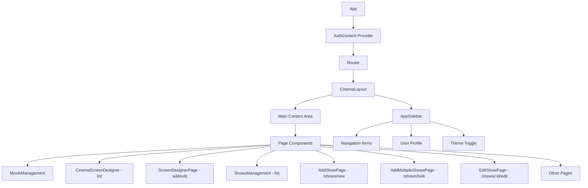

---

## Authentication System

### Authentication Flow

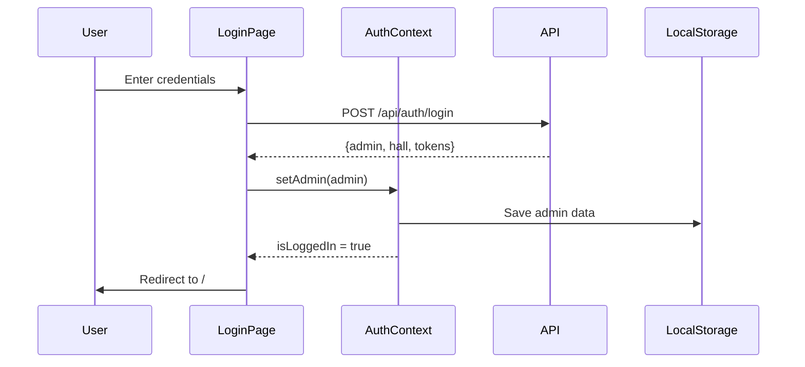

### AuthContext State Management

**Location**: `src/context/AuthContext.jsx`

**State Variables:**

```javascript
{
  admin: {
    id: "uuid",
    name: "John Doe",
    email: "admin@cinema.com",
    role: "admin" | "superadmin",
    phone: "+1234567890"
  },
  hall: {
    id: "uuid",
    name: "Grand Cinema",
    location: "Downtown Plaza",
    district: "Mumbai",
    state: "Maharashtra"
  },
  isLoggedIn: boolean,
  loading: boolean
}
```

**Key Functions:**

- `login(email, password)` - Authenticate admin
- `logout()` - Clear session and redirect
- `checkAuth()` - Verify token on mount
- `refreshToken()` - Auto-refresh access token

### Protected Routes

**ProtectedRoute** - Requires authentication

```jsx
<ProtectedRoute>
  <CinemaLayout />
</ProtectedRoute>
```

**AdminProtectedRoute** - Requires SuperAdmin role

```jsx
<AdminProtectedRoute>
  <MovieManagement />
</AdminProtectedRoute>
```

---

## Features Documentation

### 1. Ads Management (SuperAdmin Only)

**Route**: `/ads`
**Component**: `AdsManagement.jsx`
**Access**: SuperAdmin role required
**API**: `adsAPI` in `src/services/api.js`

#### Feature Overview

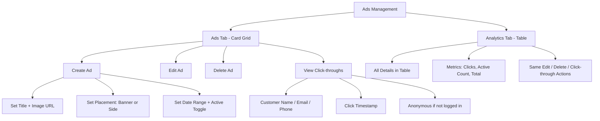

#### Tabs

The page is split into two tabs (shadcn/ui `Tabs` component):

| Tab | Icon | Content |
|-----|------|---------|
| **Ads** | `LayoutGrid` | Card grid view — same as before |
| **Analytics** | `TableProperties` | Full table view with all columns + metrics footer |

Both tabs share all modal state — edit, delete, and click-through modals work identically from either tab.

#### Ad Placements

| Placement | Where it renders | Component |
|-----------|-----------------|-----------|
| `banner`  | `/movies` page — full-width carousel | `AdBanner.jsx` |
| `side`    | `/movie/:id` page — sticky right sidebar (md+ screens) | `MovieInfoPage.jsx` |

#### Ads Tab (Card Grid)

Each ad card shows:
- Image thumbnail preview
- Title
- Placement badge (blue = Banner, purple = Side)
- Active / Inactive badge
- Date range
- Click-through URL (linked)
- Total click count (clickable — opens click details modal)
- Edit / Delete buttons

#### Analytics Tab (Table)

Full-width scrollable table with the following columns:

| Column | Description |
|--------|-------------|
| **Title** | Ad name with a small image thumbnail |
| **Image URL** | Full URL as a truncated external link |
| **Click-through URL** | Destination URL as a truncated external link, or `—` |
| **Placement** | Badge (Banner / Side) |
| **Status** | Badge (Active / Inactive) |
| **Start Date** | Formatted with `en-IN` locale |
| **End Date** | Formatted with `en-IN` locale |
| **Clicks** | Count; click to open the per-user click details modal |
| **Actions** | Edit and Delete buttons |

Table footer row displays summary metrics: total ads · active ads · total clicks across all ads.

#### Create/Edit Form Fields

| Field        | Type     | Required | Description                          |
| ------------ | -------- | -------- | ------------------------------------ |
| Title        | Text     | Yes      | Admin reference name                 |
| Image URL    | Text     | Yes      | URL of the ad image (live preview)   |
| Click URL    | Text     | No       | Opens in new tab when ad is clicked  |
| Placement    | Select   | Yes      | `Banner` or `Side`                   |
| Start Date   | Date     | Yes      | First day the ad is served           |
| End Date     | Date     | Yes      | Last day the ad is served            |
| Active       | Toggle   | No       | Manual on/off (default on)           |

#### Click-through Details Modal

Opened by clicking the **click count** in either the Ads card or the Analytics table row. Shows a table of all recorded clicks for the selected ad:

| Column      | Source                        |
| ----------- | ----------------------------- |
| Customer    | `customers.name` or Anonymous |
| Email       | `customers.email`             |
| Phone       | `customers.phone`             |
| Clicked At  | `ad_clicks.clicked_at`        |

---

### 2. Movie Management (SuperAdmin Only)

**Route**: `/movies`  
**Component**: `MovieManagement.jsx`  
**Access**: SuperAdmin role required

#### Feature Overview

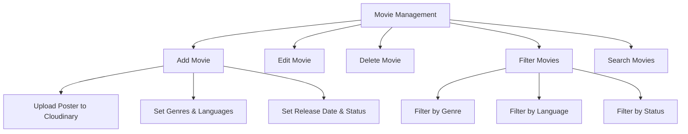

#### Movie Form Fields

| Field        | Type         | Required | Description                        |
| ------------ | ------------ | -------- | ---------------------------------- |
| Title        | Text         | Yes      | Movie title                        |
| Description  | Textarea     | Yes      | Movie synopsis                     |
| Poster URL   | File Upload  | Yes      | Uploaded to Cloudinary             |
| Trailer URL  | URL          | No       | YouTube/video link                 |
| Duration     | Number       | Yes      | Duration in minutes                |
| Genres       | Multi-select | Yes      | Array of genres                    |
| Languages    | Multi-select | Yes      | Array of languages                 |
| Release Date | Date         | Yes      | Release date                       |
| Status       | Select       | Yes      | `upcoming`, `now_showing`, `ended` |

#### Available Genres

Action, Comedy, Drama, Horror, Romance, Sci-Fi, Thriller, Animation, Adventure, Crime, Fantasy, Mystery, Musical, War, Western

#### Available Languages

English, Hindi, Tamil, Telugu, Malayalam, Kannada, Bengali, Marathi, Punjabi, Gujarati

#### Movie Card Display

Each movie card shows:

- Poster image (lazy loaded)
- Title
- Genres (with icons)
- Languages (with globe icon)
- Duration
- Release date
- Status badge (color-coded)
- Edit/Delete actions

#### Filtering System

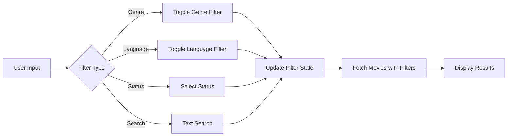

---

### 2. Screen Designer

| Route | Component | Purpose |
|---|---|---|
| `/screens` | `CinemaScreens.jsx` (`CinemaScreenDesigner`) | Screen list, delete, view preview |
| `/screens/new` | `ScreenDesignerPage.jsx` | Add new screen with layout designer |
| `/screens/:id/edit` | `ScreenDesignerPage.jsx` | Edit existing screen layout |

**Access**: Admin (any role)

#### Feature Overview

Interactive seat layout designer for creating and managing cinema screens with customizable seating arrangements. The list and designer views are now **separate routes** — navigating to add/edit changes the browser URL, enabling back-button support.

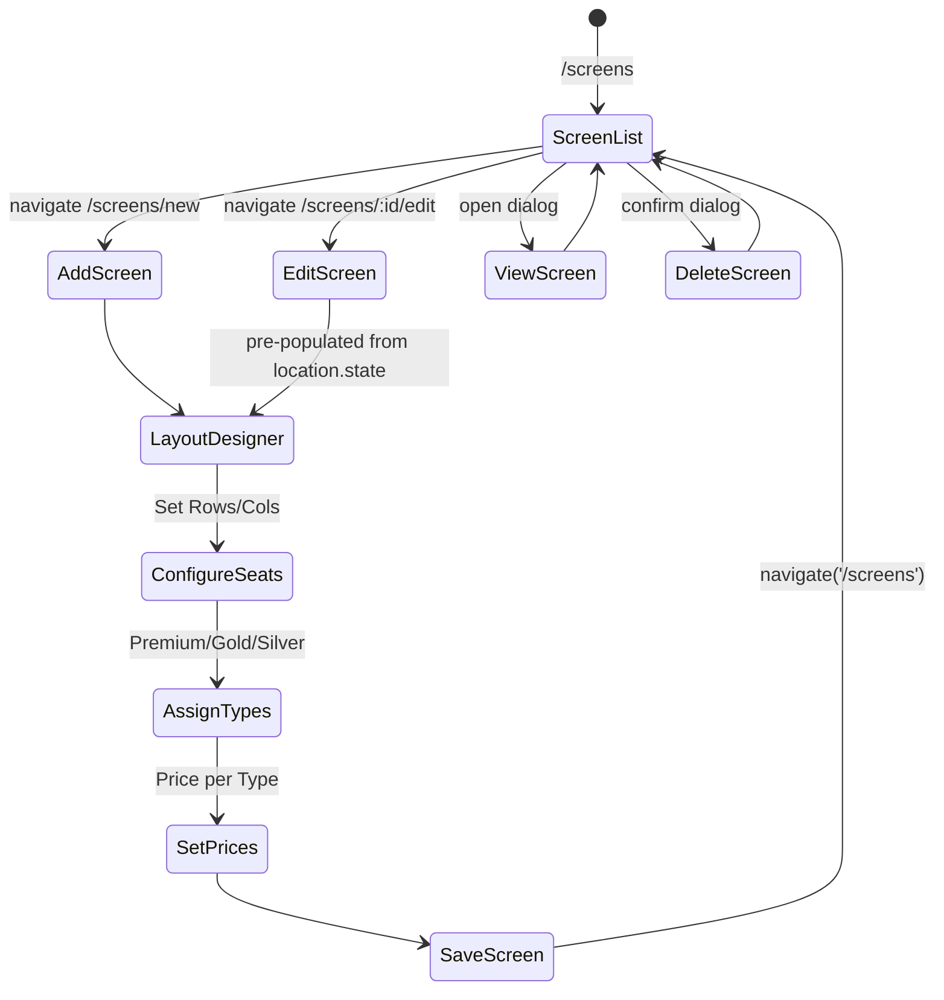

#### Navigation Pattern

**List → Add**: `navigate('/screens/new')`
**List → Edit**: `navigate('/screens/:id/edit', { state: { screen } })` — screen object passed via `location.state` to avoid a redundant API fetch
**Designer → Back/Cancel/Save**: `navigate('/screens')`
**Guard**: If `/screens/:id/edit` is accessed directly (no `location.state`), `ScreenDesignerPage` redirects to `/screens`

#### Screen Configuration

**Basic Settings:**

```javascript
{
  name: "IMAX Screen 1",
  rows: 12,
  columns: 16,
  screen_position: "top" | "bottom",
  total_seats: 192,
  premium_seats: 64,
  gold_seats: 64,
  silver_seats: 64,
  premium_price: 200,
  gold_price: 150,
  silver_price: 130,
  layout: { ... }  // Full layout JSONB (seats array + aisle config)
}
```

#### Seat Layout Structure

Each seat in the layout:

```javascript
{
  id: "2-5",             // "{rowIndex}-{colIndex}" (0-based)
  row: "C",              // Row letter (A, B, C...)
  column: 6,             // 1-based column number
  label: "C-6",          // Display label (row + column)
  type: "premium",       // "premium" | "gold" | "silver" | "entrance" | "door"
  price: 200,            // Derived from pricing config for this type
  isBlocked: false       // Admin-blocked seat
}
```

#### Aisle System

Aisles are **gaps** in the grid, not seats. Stored in the layout as:

```javascript
{
  aisleAfterColumns: [5, 11],  // vertical gap after column 5 and 11
  aisleAfterRows: ["D", "H"]   // horizontal gap after row D and H
}
```

- **Aisle tool** in designer: click a column number header to toggle a vertical aisle; click a row's `⬌` button to toggle a horizontal aisle
- Old screens saved with passage-type seats are **auto-migrated** on load via `migrateLayoutFromPassage()` in `ScreenDesignerPage.jsx`

#### Rows/Columns Resize Behaviour

- **Add mode**: changing rows or columns reinitializes the entire seat grid (all seats reset to `silver`).
- **Edit mode**: changing rows or columns **reconciles** — existing seat configurations are preserved; only new seats (for the expanded dimensions) are added as `silver`; seats for removed rows/columns are dropped.
- **Debounced input** (600 ms): the Rows and Columns inputs are controlled by separate `inputRows`/`inputColumns` state that updates immediately for a responsive feel. The actual layout update (and seat reconciliation) fires only after the user stops typing for 600 ms, preventing unnecessary re-renders on every keystroke.

#### Interactive Features

**Selection Modes:**

1. **Single** - Click a seat to apply the active tool immediately
2. **Multi** - `Ctrl+Click` to toggle individual seats, `Shift+Click` to range-select; apply tool to all selected at once
3. **Row Select** - Click row `⬌` button (non-aisle mode)
4. **Column Select** - Click column number header (non-aisle mode)

**Tools:**

| Tool | Action |
|---|---|
| Premium / Gold / Silver | Set seat type + price |
| Aisle | Toggle aisle gap after a column/row header |
| Entrance / Door | Mark seat as entrance or door (price = 0) |
| Block/Unblock | Toggle `isBlocked` on selected seats |

**Visual Indicators:**

- **Premium**: Yellow gradient
- **Gold**: Blue gradient
- **Silver**: Gray gradient
- **Entrance/Door**: Green/Orange gradient
- **Blocked**: Red background + ✕
- **Selected**: Blue border + ring

#### Layout Designer Workflow

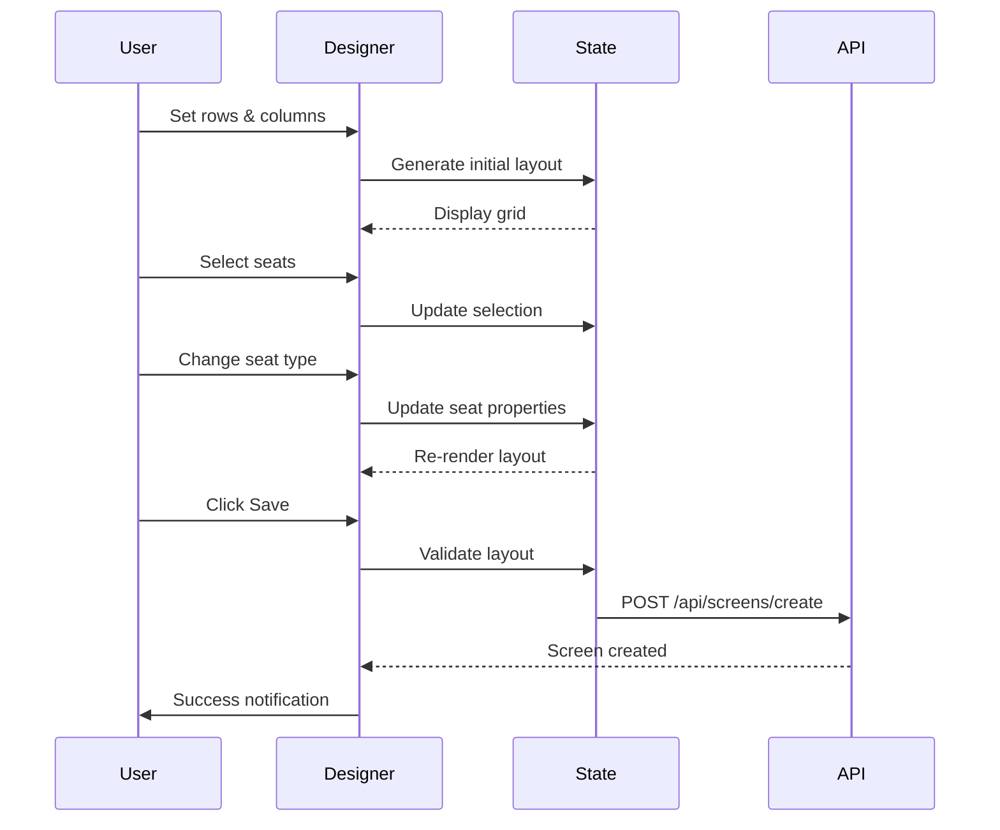

---

### 3. Shows Management

| Route | Component | Purpose |
|---|---|---|
| `/shows` | `ShowsManagement.jsx` | List shows by date, delete |
| `/shows/new` | `AddShowPage.jsx` | Create a single show |
| `/shows/bulk` | `AddMultipleShowsPage.jsx` | Create multiple time slots at once |
| `/shows/:id/edit` | `EditShowPage.jsx` | Edit an existing show |

**Access**: Admin (any role)

#### Feature Overview

Manage movie showtimes with date-based scheduling. Add/Edit are **separate routes** — navigating to them changes the URL, enabling back-button support. Deleting a show stays on the list page via `window.confirm`.

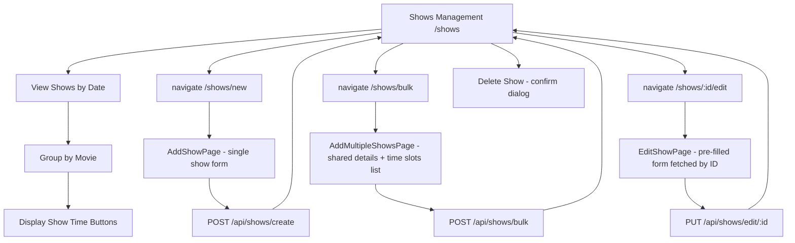

#### UI Layout — Shows List (`/shows`)

**Header row:** "Shows Management" title + description + `+ Add Multiple` (outline) + `+ Add Show` (primary) buttons (top-right)

**Date Selector shelf** (`bg-card border-b border-border`):
- **3-part vertical date buttons** (DOW / day number / month) — 7 days, `w-14` fixed width, hidden scrollbar
- Selected: `bg-primary text-primary-foreground`; others: `border border-border hover:border-primary`
- `selectedDate` stored as a `Date` object; formatted to `YYYY-MM-DD` string only when calling `showsAPI.getShowsByDate(dateStr)`

**Availability Legend:** `● AVAILABLE` (green) + `● FAST FILLING` (amber) aligned right

**Movie Cards** (`rounded-xl`, shadcn `Card`):
- Poster (`rounded-lg shadow-md`) + movie title + duration badge + genre/language pills (`rounded-full`)
- Show time buttons: **green-bordered outlined style** — screen info (MapPin icon + name + seat count) on line 1, time (bold) on line 2, language + price on line 3
- **Edit/Delete hover actions** — appear absolutely positioned at top-right of each button on `group-hover`
  - Edit → `navigate('/shows/:id/edit')`
  - Delete → `window.confirm` → `showsAPI.deleteShow(id)` → refresh

**Show list data flow:**
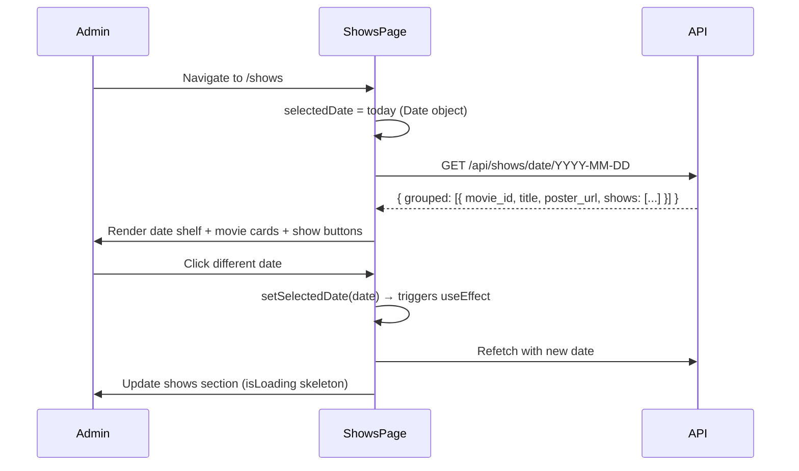

#### Add Show Page (`/shows/new`)

Full-page form. On success → navigates back to `/shows`.

**Auto-fill behaviour:**
- **Select movie** → `language_version` auto-filled smartly:
  - 1 language → auto-set, plain text input shown
  - Multiple languages → `language_version` cleared; a **Select dropdown** appears with each language as an option (admin must pick one)
- **Select screen** → `price_override.premium/gold/silver` auto-filled from `screen.premium_price / gold_price / silver_price`
- Price override can be manually overridden; language input (single-language case) can also be edited manually

**Form fields:**

```javascript
{
  movie_id: "uuid",              // MovieSearchDropdown — passes full movie object; language auto-filled
  screen_id: "uuid",             // Select from screensAPI.getMyScreens(); prices auto-filled
  show_date: "2024-02-15",       // ShadCN Popover + Calendar picker; stored as YYYY-MM-DD via dayjs
  start_time: "14:00",           // time input
  end_time: "16:30",             // time input
  language_version: "Tamil",     // auto-set (1 lang) or chosen from dropdown (multiple langs); editable when single
  price_override: {              // auto-filled from screen defaults; editable
    premium: 200,
    gold: 150,
    silver: 130
  }
}
```

Calls `showsAPI.createShow(formData)` → `POST /api/shows/create`.

#### Edit Show Page (`/shows/:id/edit`)

Fetches show by ID on mount (`showsAPI.getShowById(id)`), maps response to form fields:

| Response field | Form field |
|---|---|
| `movie.id` | `movie_id` |
| `screen.id` | `screen_id` |
| `show_details.show_date` | `show_date` |
| `show_details.start_time` | `start_time` |
| `show_details.end_time` | `end_time` |
| `show_details.language_version` | `language_version` |
| `show_details.price_override` | `price_override` |

Loading skeleton shown while fetching. On success → `navigate('/shows')`.
Calls `showsAPI.editShow(id, formData)` → `PUT /api/shows/edit/:id`.

#### Add Multiple Shows Page (`/shows/bulk`)

Same auto-fill behaviour as AddShowPage (language dropdown for multi-language movies, auto-set for single). Instead of a single start/end time, there is a **dynamic time slots list**:
- Minimum 1 slot; "+ Add Slot" button appends a new row
- Each row: `Slot N — Start` (time) + `End` (time) + trash icon (disabled when only 1 slot)
- Footer label: `N slot(s) → N show(s) will be created`
- Submit button label updates dynamically: `Create N Show(s)`

Payload sent:
```javascript
{
  movie_id: "uuid",
  screen_ids: ["uuid"],          // single screen wrapped in array
  dates: ["2024-02-15"],         // single date wrapped in array
  time_slots: [
    { start_time: "10:00", end_time: "12:30" },
    { start_time: "14:00", end_time: "16:30" },
    { start_time: "19:00", end_time: "21:30" }
  ],
  language_version: "Tamil",     // single language chosen from dropdown or auto-set
  price_override: { premium: 200, gold: 150, silver: 130 }
}
```

Calls `showsAPI.createMultipleShows(payload)` → `POST /api/shows/bulk`. Backend creates one show per `screen × date × time_slot` (cartesian product).

#### Movie Search Component

**`MovieSearchDropdown`** — Extracted to `src/components/MovieSearchDropdown.jsx`, shared across AddShowPage, EditShowPage, and AddMultipleShowsPage.

**Features:**
- Real-time debounced search (300ms) via `moviesAPI.getAllMovies({ search, limit: 10 })`
- Shows poster thumbnail, title, genres + duration in dropdown
- Pre-loads the selected movie on edit (fetches by `selectedMovieId` on mount via `moviesAPI.getMovieById`)
- Separate `isInitialLoading` state to prevent flicker when editing an existing show
- Calls `onMovieSelect(movie)` with the **full movie object** — callers extract `movie.id` and `movie.language`

---

### 4. Additional Features

#### HomePage

- Dashboard overview
- Quick stats (if implemented)
- Recent activity

#### Bookings

**Route**: `/bookings`
**Component**: `Bookings.jsx`

Displays all bookings for the admin's cinema hall in a paginated table.

**Features:**
- Table columns: Customer (avatar + name + email), Movie, Show date/time, Screen (pill badge with monitor icon), Seats (primary-tinted chips), Amount, Status badge, Booking ID (monospace code)
- Filters (4-column grid layout): show date (ShadCN Popover + Calendar picker), movie title search (debounced 400ms), screen dropdown (populated from `screensAPI.getMyScreens()`), booking status dropdown
  - Filter params: `date`, `search`, `screen_id`, `status` (all / confirmed / cancelled / completed)
  - Active filter count badge on the Filters header
  - "Clear all" button shown when any filter is active
- Status badges: custom glass-style pills — emerald (confirmed), red (cancelled), blue (completed)
- Customer column: coloured avatar circle with initials derived from name
- Screen column: rendered as a `<Monitor>` icon pill using `screensAPI.getMyScreens()` data loaded on mount
- Pagination: 50 bookings per page with Prev/Next controls and "Showing X of Y" count
- Loading skeleton, contextual empty state (with "Clear filters" CTA when filters active), and error state
- Calls `GET /api/booking/admin/all` with `{ date, search, status, screen_id, page }` query params on filter/page change

#### VerifyTicket

**Route**: `/verify-ticket`
**Component**: `VerifyTicket.jsx`

QR code ticket verification page for cinema entrance staff.

**Features:**
- **Camera scanner** — starts/stops the device camera via `html5-qrcode`'s `Html5Qrcode` class. Decodes QR code frames at 10fps with a 220×220 scanning box. On successful decode, validates the UUID format before calling the API
- **Manual entry** — `Input` + "Verify" button to paste or type a booking UUID. Also supports pressing Enter. Same UUID validation applied before the API call
- **Result card** (view-only) — shows customer name + email, movie title, show date/time, screen name, seat labels (as chips), total amount, booking status badge, full booking UUID
- **Error states** — "Invalid QR code" if scanned text is not a UUID, API error message if booking not found
- **Camera cleanup** — `useEffect` stops the scanner on component unmount to prevent camera from staying open when navigating away
- Calls `GET /api/booking/admin/verify/:booking_id`

**Layout:** Two columns on desktop (scanner + input left, result right), stacked vertically on mobile.

**Dependencies:**
- `html5-qrcode` — `Html5Qrcode` class for camera-based QR scanning
- `qrcode.react` — not used here (QR display is user-side only)

#### ProfilePage

- Admin profile information
- Edit profile details

#### SettingsPage

- Application settings
- Preferences

---

## API Service Layer

**Location**: `src/services/api.js`

### Service Modules

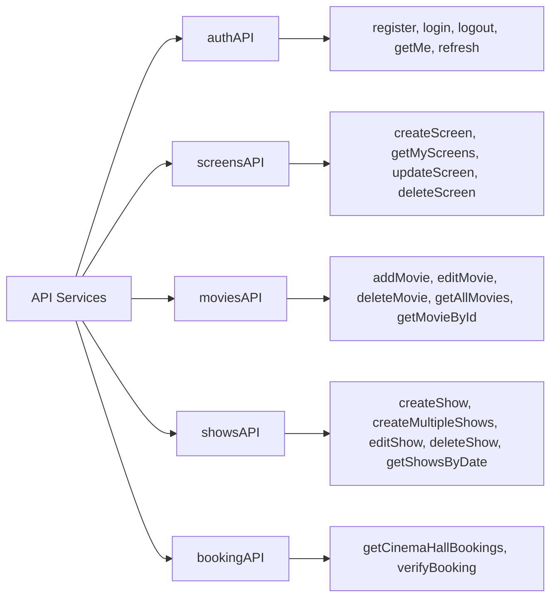

### API Configuration

```javascript
const API_BASE_URL =
  import.meta.env.VITE_API_BASE_URL || "http://localhost:5000";

// All requests include:
credentials: "include"; // Send cookies
```

### Error Handling

```javascript
try {
  const response = await fetch(url, options);
  if (!response.ok) {
    const errorData = await response.json();
    throw new Error(errorData.message || "Request failed");
  }
  return response.json();
} catch (error) {
  console.error("API Error:", error);
  throw error;
}
```

---

## UI Components

### shadcn/ui Components Used

| Component | Usage               |
| --------- | ------------------- |
| Button    | Actions, navigation |
| Card      | Content containers  |
| Dialog    | Modals for forms    |
| Input     | Text fields         |
| Select    | Dropdowns           |
| Badge     | Status indicators   |
| Separator | Visual dividers     |
| Skeleton  | Loading states      |
| Sonner    | Toast notifications |
| Calendar  | Date pickers        |
| Popover   | Contextual menus    |

### Custom Components

**AppSidebar** - Navigation sidebar

- Collapsible menu
- Active route highlighting
- User profile section
- Theme toggle

**Loader** - Loading spinner

- Full-screen overlay
- Animated spinner

**MovieSearchDropdown** (`src/components/MovieSearchDropdown.jsx`) - Shared movie selector used in show forms

- Debounced search (300ms), shows poster + genre + duration in results
- Pre-loads selected movie by ID on mount (for edit pages)
- Calls `onMovieSelect(movie)` with **full movie object** — callers extract `movie.id` and `movie.language`
- Used by: `AddShowPage`, `EditShowPage`, `AddMultipleShowsPage`

**SearchMovies** - Movie search component

- Debounced search
- Autocomplete dropdown

**CinemaLayout** - Main layout wrapper

- Sidebar + content area
- Responsive design

---

## State Management

### Context Providers

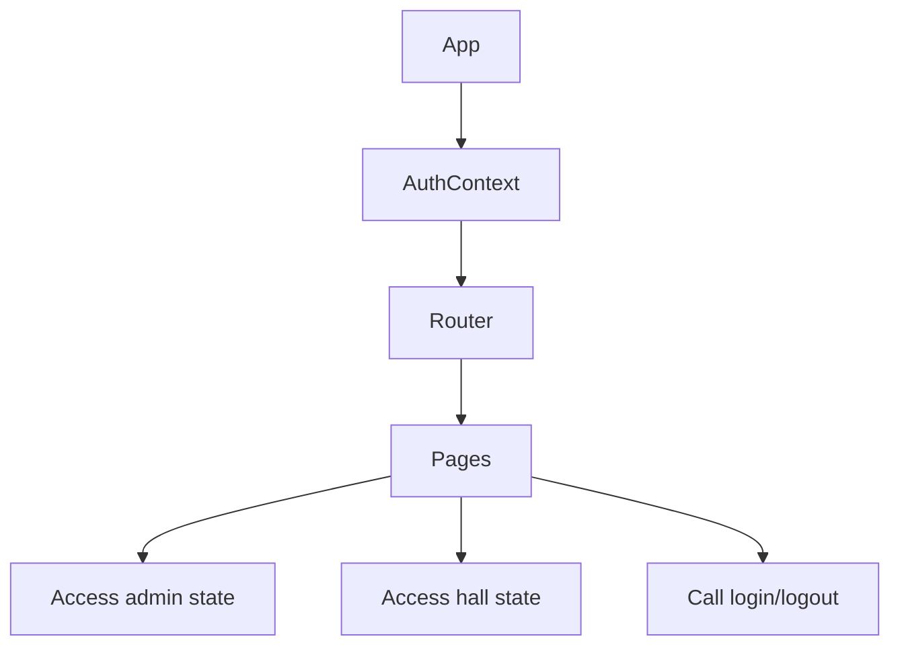

**AuthContext API:**

```javascript
const {
  admin, // Current admin object
  hall, // Admin's cinema hall
  isLoggedIn, // Boolean auth status
  loading, // Loading state
  login, // Login function
  logout, // Logout function
  checkAuth, // Verify auth on mount
  refreshToken, // Refresh access token
} = useAuth();
```

---

## Routing & Navigation

### Route Protection

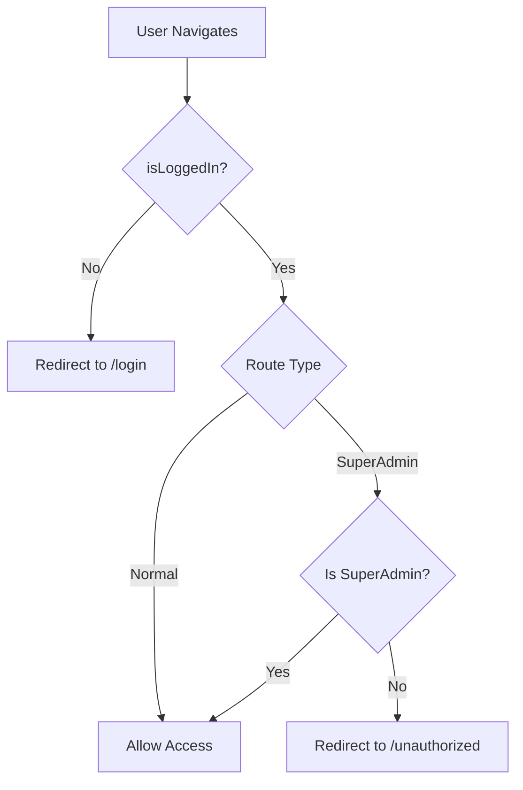

### Navigation Structure

**Sidebar Menu Items:**

1. Home
2. Movies (SuperAdmin only)
3. Screens
4. Shows
5. Bookings
6. Verify Ticket
7. Profile
8. Settings

---

## Image Upload

### Cloudinary Integration

**Service**: `src/services/cloudinary.js`

```javascript
export const uploadImageToCloudinary = async (file) => {
  const formData = new FormData();
  formData.append("file", file);
  formData.append("upload_preset", CLOUDINARY_UPLOAD_PRESET);

  const response = await fetch(
    `https://api.cloudinary.com/v1_1/${CLOUDINARY_CLOUD_NAME}/image/upload`,
    { method: "POST", body: formData },
  );

  const data = await response.json();
  return data.secure_url;
};
```

**Usage in MovieManagement:**

1. User selects image file
2. Upload to Cloudinary
3. Get secure URL
4. Save URL in movie record

---

## Styling & Theming

### Tailwind Configuration

**Custom Colors:**

- Primary: Cinema brand color
- Secondary: Accent color
- Background: Light/dark mode support
- Foreground: Text colors
- Muted: Subtle elements

### Dark Mode Support

Theme toggle available in sidebar:

- Light mode
- Dark mode
- System preference

---

## Performance Optimizations

### Lazy Loading

**Images:**

```jsx
import { LazyLoadImage } from "react-lazy-load-image-component";

<LazyLoadImage src={movie.poster_url} effect="blur" className="..." />;
```

**Routes:**
Code splitting with React.lazy() (if implemented)

### Debouncing

**Search Input:**

```javascript
const debounce = (func, wait) => {
  let timeout;
  return (...args) => {
    clearTimeout(timeout);
    timeout = setTimeout(() => func(...args), wait);
  };
};
```

---

## User Workflows

### Complete Show Creation Workflow

```mermaid
sequenceDiagram
    participant Admin
    participant ShowsPage
    participant AddShowPage
    participant API

    Admin->>ShowsPage: Click "+ Add Show"
    ShowsPage->>AddShowPage: navigate('/shows/new')

    Admin->>AddShowPage: Search + select movie
    Note over AddShowPage: 1 language → auto-set; multiple → language dropdown shown
    Admin->>AddShowPage: Select screen
    Note over AddShowPage: price_override auto-filled from screen.premium/gold/silver_price
    Admin->>AddShowPage: Set date, start/end time
    Admin->>AddShowPage: Pick language (if dropdown) / review prices
    Admin->>AddShowPage: Click "Add Show"

    AddShowPage->>API: POST /api/shows/create
    API-->>AddShowPage: Show created
    AddShowPage->>Admin: toast.success("Show added successfully!")
    AddShowPage->>ShowsPage: navigate('/shows')
```

### Add Multiple Shows Workflow

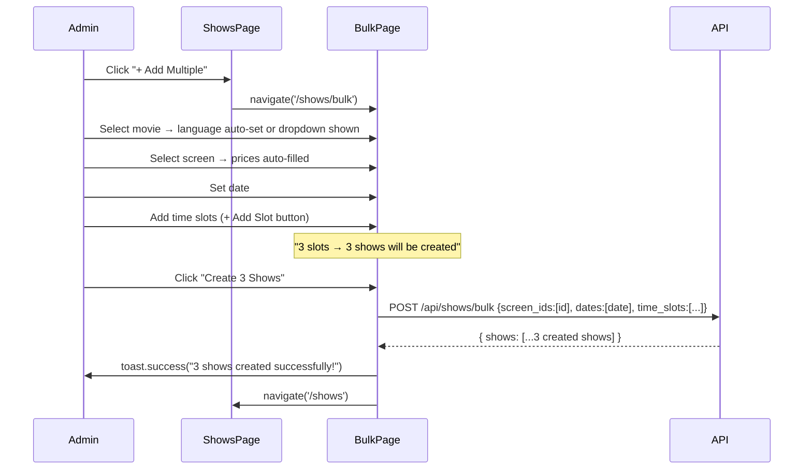

### Screen Designer Workflow

```mermaid
sequenceDiagram
    participant Admin
    participant ScreenList
    participant Designer
    participant API

    Admin->>ScreenList: Visit /screens
    ScreenList->>API: GET /api/screens
    API-->>ScreenList: screens[]
    ScreenList->>Admin: Display screen cards

    alt Add new screen
        Admin->>ScreenList: Click "Add Screen"
        ScreenList->>Designer: navigate('/screens/new')
        Designer->>Admin: Blank designer (10×15 silver defaults)
    else Edit existing screen
        Admin->>ScreenList: Click "Edit" on card
        ScreenList->>Designer: navigate('/screens/:id/edit', {state:{screen}})
        Designer->>Designer: Load screen from location.state + migrateLayoutFromPassage()
        Designer->>Admin: Pre-populated designer
    end

    Admin->>Designer: Configure rows, columns, pricing
    Designer->>Designer: Add mode — reinitialize all seats; Edit mode — reconcile (preserve existing, add new)
    Admin->>Designer: Paint seat types with tools
    Admin->>Designer: Toggle aisles on headers
    Admin->>Designer: Click Save

    Designer->>API: POST /api/screens/create OR PUT /api/screens/update/:id
    API-->>Designer: Success
    Designer->>Admin: Show success dialog → navigate('/screens')
```

---

## Environment Variables

```env
# API Configuration
VITE_API_BASE_URL=http://localhost:5000

# Cloudinary Configuration
VITE_CLOUDINARY_CLOUD_NAME=your-cloud-name
VITE_CLOUDINARY_UPLOAD_PRESET=your-preset
```

---

## Build & Deployment

### Development

```bash
npm run dev
# Runs on http://localhost:5173
```

### Production Build

```bash
npm run build
# Outputs to /dist
```

### Deployment

Configured for Vercel deployment:

- Automatic builds on push
- Environment variables via Vercel dashboard
- Custom domain support

---

## Recently Implemented

✅ **ShowPage — aisle gaps + screenPosition** (March 12, 2026):
- `renderSeatSection` now reads `aisleAfterColumns` and `aisleAfterRows` from `screen.layout` (same logic as user `SeatSelectionPage`)
  - `aisleAfterColumns: number[]` — inserts a `w-3` gap div after the matching column number in every row
  - `aisleAfterRows: string[]` — inserts a `h-3` gap div after the matching row letter
- `screenPosition` (`"top"` | `"bottom"`, default `"bottom"`) from `screen.layout` now controls whether "SCREEN THIS WAY" bar renders **above** or **below** the seat sections
- `React` import added (required for `React.Fragment` wrapper pattern)

✅ **Screen Designer — edit-mode resize fix + debounced inputs** (March 12, 2026):
- **Bug fix**: in edit mode, increasing rows/columns now generates proper seat objects for the new rows/columns. Previously they rendered as empty, non-clickable placeholders because the seat-initialization effect was guarded by `!isEditing`.
- **Seat reconciliation**: the effect now runs in both modes. Add mode fully reinitializes; edit mode preserves existing seat configs and only appends new seats for expanded dimensions (or drops out-of-bounds seats when dimensions shrink).
- **Debounced inputs**: `inputRows` / `inputColumns` state drives the inputs immediately; a 600 ms `setTimeout` (cleared on each keystroke) applies the change to `layout.rows` / `layout.columns`, preventing rapid seat-grid rebuilds while the user is still typing.

✅ **Screen Designer split into separate routes** (March 12, 2026):
- `/screens` now renders `CinemaScreens.jsx` (list only — ~260 lines)
- `/screens/new` and `/screens/:id/edit` render new `ScreenDesignerPage.jsx` (extracted designer)
- Edit navigation passes full screen object via `location.state` to avoid extra API fetch
- Page refresh / direct URL to edit route redirects safely to `/screens`
- Legacy `AddScreen.jsx` and `EditScreen.jsx` (localStorage-based) deleted
- Browser URL now reflects which mode (add vs edit) the user is in; back button works correctly

✅ **QR Ticket Verification** (March 8, 2026):
- New `VerifyTicket` page at `/verify-ticket` — camera QR scanner + manual booking UUID entry
- Shows full booking details (view-only) after scan/lookup
- `ScanLine` icon added to Operations sidebar
- `bookingAPI.verifyBooking(bookingId)` added to admin API service
- Calls `GET /api/booking/admin/verify/:booking_id` (scoped to admin's cinema hall)

✅ **Shows Management — separate routes + bulk create** (March 12, 2026):
- "Add Show" modal replaced by dedicated **`AddShowPage`** at `/shows/new`
- "Edit Show" modal replaced by dedicated **`EditShowPage`** at `/shows/:id/edit` — fetches show data via `showsAPI.getShowById(id)` on mount, pre-fills all fields
- New **`AddMultipleShowsPage`** at `/shows/bulk` — shared movie/screen/date/language/price section + dynamic time slots list (+ Add Slot / remove); calls `POST /api/shows/bulk`
- **`MovieSearchDropdown`** extracted from `ShowsManagement.jsx` into `src/components/MovieSearchDropdown.jsx` — now shared across all three pages
- **Auto-fill on screen select**: `price_override.premium/gold/silver` auto-populated from `screen.premium_price / gold_price / silver_price`
- **Auto-fill on movie select**: if movie has **1 language**, `language_version` is auto-set and shown as a plain text input; if movie has **multiple languages**, a Select dropdown appears so the admin picks exactly one — `language_version` is not pre-set until a choice is made
- `ShowsManagement.jsx` stripped to list-only (removed `ShowModal`, modal state, `screensAPI` call); Edit button navigates to `/shows/:id/edit`; header now has both `+ Add Multiple` and `+ Add Show` buttons

✅ **ShowsManagement UI redesign** (BookMyShow style):
- Replaced shadcn `Tabs` date selector with 3-part vertical buttons (DOW/day/month) — 7 days, same shelf style as user pages
- `selectedDate` changed from string to `Date` object; formatted to string only at API call
- Availability legend (● AVAILABLE green / ● FAST FILLING amber)
- Show time buttons redesigned: green-bordered outlined style with screen name + seat count / time / language + price in 3 lines
- Movie cards use `rounded-xl` + `rounded-full` genre/language pills
- Edit/Delete hover actions preserved on `group-hover`
- Removed unused `Tabs, TabsContent, TabsList, TabsTrigger` imports

✅ **ShadCN date pickers — AddShowPage, AddMultipleShowsPage, Bookings** (March 12, 2026):
- Replaced all `<input type="date">` fields with ShadCN **Popover + Calendar** date picker pattern
- `AddShowPage` (`show_date`), `AddMultipleShowsPage` (`show_date`), `Bookings` (Show Date filter)
- Trigger: outlined `Button` with `CalendarIcon`; displays `MMM D, YYYY` or "Pick a date" placeholder
- `onSelect` stores date as `YYYY-MM-DD` string via `dayjs`; `selected` prop converts string back to `Date` object
- `handleDateChange` in `Bookings.jsx` updated to accept a `Date` object directly (was `e.target.value` from input event)

✅ **Bookings page — Screen filter + visual redesign** (March 9, 2026):
- Added **Screen dropdown filter** — fetches screens via `screensAPI.getMyScreens()` on mount; passes `screen_id` UUID to `GET /api/booking/admin/all`
- Backend `getCinemaHallBookings` updated: added `$5::uuid IS NULL OR sc.id = $5` condition to both data and count queries (param index shift: limit → `$6`, offset → `$7`)
- `bookingAPI.getCinemaHallBookings` updated to forward `screen_id` query param
- Filters reorganised into a 4-column grid with a "Filters" header row, active filter count badge, and "Clear all" button
- Customer column: coloured avatar circle (initials, colour derived from name hash)
- Screen column: `<Monitor>` icon pill badge
- Seats: primary-tinted chips with subtle border
- Status indicators: custom glass-style pills (emerald / red / blue) replacing generic `<Badge>`
- Booking ID: monospace `<code>` element with muted background
- Empty state: icon-in-circle, descriptive sub-text, "Clear filters" CTA

---

**Last Updated**: March 12, 2026 (ShowPage — aisle gaps + screenPosition; ShadCN date pickers; Shows Management — separate routes, bulk create, auto-fill)

---

## Best Practices Implemented

✅ **Code Organization:**

- Feature-based folder structure
- Reusable components
- Centralized API services
- Context for global state

✅ **User Experience:**

- Loading states with skeletons
- Error handling with toast notifications
- Responsive design
- Keyboard navigation support

✅ **Performance:**

- Lazy loading images
- Debounced search
- Optimistic UI updates
- Efficient re-renders

✅ **Security:**

- Protected routes
- Role-based access control
- Secure cookie handling
- Input validation

---

## Future Enhancements

💡 **Potential Features:**

- Real-time booking updates (WebSockets)
- Analytics dashboard
- Revenue reports
- Email notifications
- Bulk operations
- Export data (CSV/PDF)
- Advanced filtering
- Seat availability heatmap

---

**Last Updated**: March 12, 2026 (ShowPage — aisle gaps + screenPosition; ShadCN date pickers; Shows Management — separate routes, bulk create, auto-fill)
