# Admin Panel Documentation

## Overview

The Cinema Hall Admin Panel is a **React-based web application** built for cinema administrators to manage their theaters. It provides comprehensive tools for movie management (SuperAdmin only), screen configuration with interactive seat layout design, show scheduling, and booking oversight.

**Tech Stack:**

- **Framework**: React 18 with Vite
- **Routing**: React Router v6
- **UI Library**: shadcn/ui (Radix UI primitives)
- **Styling**: Tailwind CSS
- **State Management**: React Context API
- **HTTP Client**: Fetch API
- **Image Upload**: Cloudinary
- **Authentication**: JWT with HttpOnly cookies

---

## Application Architecture

### Route Structure

```mermaid
graph TD
    A[App.jsx] --> B{User Logged In?}
    B -->|No| C[/login]
    B -->|Yes| D[CinemaLayout]

    D --> E[Protected Routes]
    E --> F[/ - HomePage]
    E --> G[/movie/:id - MoviePage]
    E --> H[/screens - CinemaScreens]
    E --> I[/shows - ShowsManagement]
    E --> J[/show/:id - ShowPage]
    E --> K[/bookings - Bookings]
    E --> L[/profile - ProfilePage]
    E --> M[/settings - SettingsPage]

    D --> N[SuperAdmin Routes]
    N --> O[/movies - MovieManagement]

    C --> P[/register - RegisterPage]
```

### Component Hierarchy

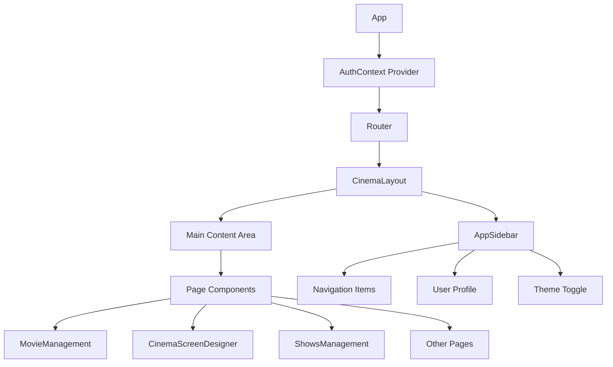

---

## Authentication System

### Authentication Flow

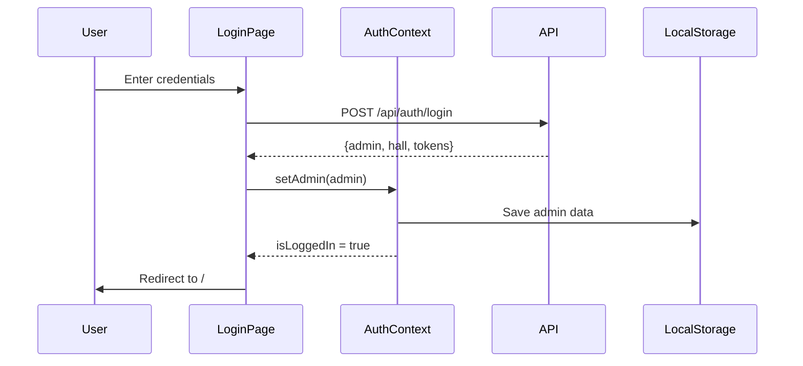

### AuthContext State Management

**Location**: `src/context/AuthContext.jsx`

**State Variables:**

```javascript
{
  admin: {
    id: "uuid",
    name: "John Doe",
    email: "admin@cinema.com",
    role: "admin" | "superadmin",
    phone: "+1234567890"
  },
  hall: {
    id: "uuid",
    name: "Grand Cinema",
    location: "Downtown Plaza",
    district: "Mumbai",
    state: "Maharashtra"
  },
  isLoggedIn: boolean,
  loading: boolean
}
```

**Key Functions:**

- `login(email, password)` - Authenticate admin
- `logout()` - Clear session and redirect
- `checkAuth()` - Verify token on mount
- `refreshToken()` - Auto-refresh access token

### Protected Routes

**ProtectedRoute** - Requires authentication

```jsx
<ProtectedRoute>
  <CinemaLayout />
</ProtectedRoute>
```

**AdminProtectedRoute** - Requires SuperAdmin role

```jsx
<AdminProtectedRoute>
  <MovieManagement />
</AdminProtectedRoute>
```

---

## Features Documentation

### 1. Movie Management (SuperAdmin Only)

**Route**: `/movies`  
**Component**: `MovieManagement.jsx`  
**Access**: SuperAdmin role required

#### Feature Overview

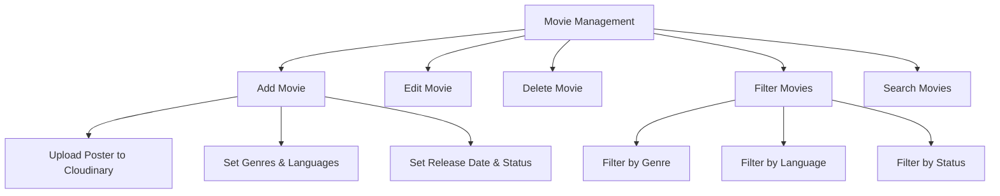

#### Movie Form Fields

| Field        | Type         | Required | Description                        |
| ------------ | ------------ | -------- | ---------------------------------- |
| Title        | Text         | Yes      | Movie title                        |
| Description  | Textarea     | Yes      | Movie synopsis                     |
| Poster URL   | File Upload  | Yes      | Uploaded to Cloudinary             |
| Trailer URL  | URL          | No       | YouTube/video link                 |
| Duration     | Number       | Yes      | Duration in minutes                |
| Genres       | Multi-select | Yes      | Array of genres                    |
| Languages    | Multi-select | Yes      | Array of languages                 |
| Release Date | Date         | Yes      | Release date                       |
| Status       | Select       | Yes      | `upcoming`, `now_showing`, `ended` |

#### Available Genres

Action, Comedy, Drama, Horror, Romance, Sci-Fi, Thriller, Animation, Adventure, Crime, Fantasy, Mystery, Musical, War, Western

#### Available Languages

English, Hindi, Tamil, Telugu, Malayalam, Kannada, Bengali, Marathi, Punjabi, Gujarati

#### Movie Card Display

Each movie card shows:

- Poster image (lazy loaded)
- Title
- Genres (with icons)
- Languages (with globe icon)
- Duration
- Release date
- Status badge (color-coded)
- Edit/Delete actions

#### Filtering System

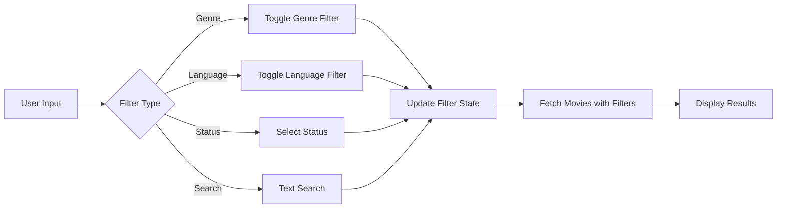

---

### 2. Screen Designer

**Route**: `/screens`  
**Component**: `CinemaScreenDesigner.jsx`  
**Access**: Admin (any role)

#### Feature Overview

Interactive seat layout designer for creating and managing cinema screens with customizable seating arrangements.

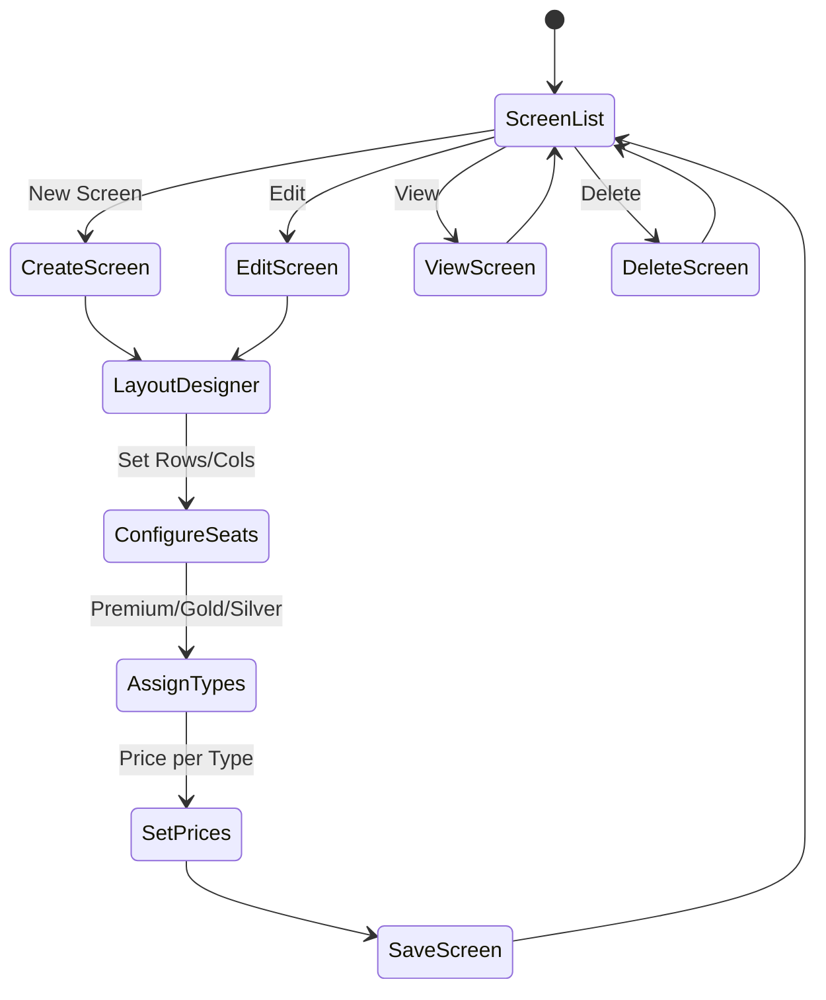

#### Screen Configuration

**Basic Settings:**

```javascript
{
  name: "Screen 1",
  rows: 10,
  columns: 12,
  screen_position: "top" | "bottom" | "left" | "right",
  total_seats: 120,
  premium_seats: 24,
  gold_seats: 48,
  silver_seats: 48,
  premium_price: 500,
  gold_price: 300,
  silver_price: 200
}
```

#### Seat Layout Structure

Each seat in the layout:

```javascript
{
  id: "A1",              // Unique seat ID
  row: 0,                // Row index
  col: 0,                // Column index
  type: "premium",       // "premium" | "gold" | "silver"
  label: "A1",           // Display label
  rowLabel: "A",         // Row letter
  isAisle: false,        // Aisle space
  isEmpty: false         // Empty space
}
```

#### Interactive Features

**Selection Modes:**

1. **Single Click** - Select individual seat
2. **Shift + Click** - Multi-select seats
3. **Row Select** - Select entire row
4. **Column Select** - Select entire column

**Seat Actions:**

- Change seat type (Premium/Gold/Silver)
- Mark as aisle
- Mark as empty space
- Delete seats

**Visual Indicators:**

- **Premium**: Purple background
- **Gold**: Yellow/amber background
- **Silver**: Gray background
- **Aisle**: Dotted border
- **Empty**: Transparent
- **Selected**: Blue border

#### Layout Designer Workflow

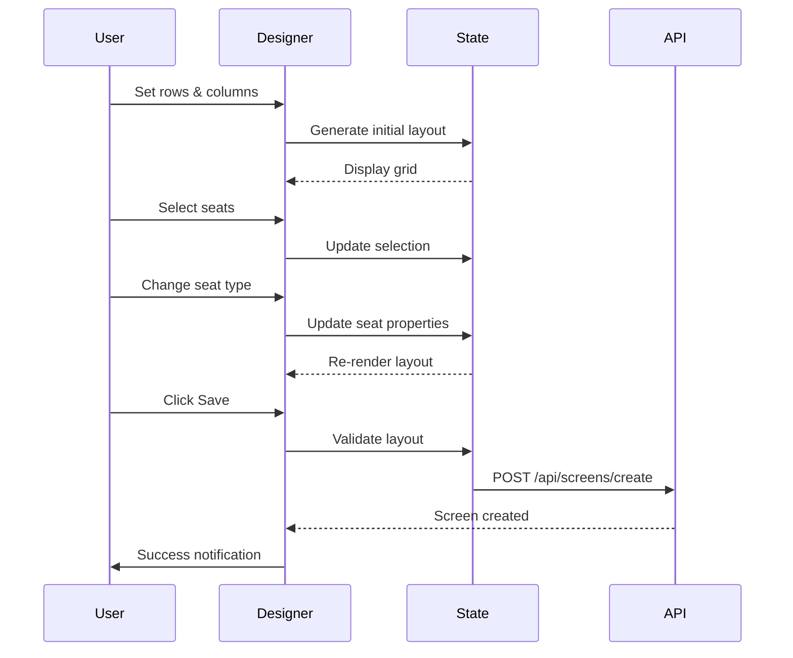

---

### 3. Shows Management

**Route**: `/shows`
**Component**: `ShowsManagement.jsx`
**Access**: Admin (any role)

#### Feature Overview

Manage movie showtimes with date-based scheduling and overlap prevention. Uses a **BookMyShow-style UI** consistent with the user-facing MovieDetailsPage and TheatresPage.

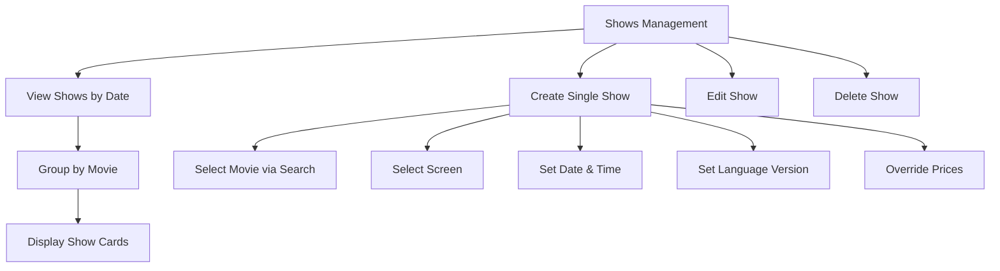

#### UI Layout

**Header row:** "Shows Management" title + description + `+ Add Show` button (top-right)

**Date Selector shelf** (`bg-card border-b border-border`):
- **3-part vertical date buttons** (DOW / day number / month) — 7 days, `w-14` fixed width, hidden scrollbar
- Selected: `bg-primary text-primary-foreground`; others: `border border-border hover:border-primary`
- `selectedDate` stored as a `Date` object; formatted to `YYYY-MM-DD` string only when calling `showsAPI.getShowsByDate(dateStr)`

**Availability Legend:** `● AVAILABLE` (green) + `● FAST FILLING` (amber) aligned right

**Movie Cards** (`rounded-xl`, shadcn `Card`):
- Poster (`rounded-lg shadow-md`) + movie title + duration badge + genre/language pills (`rounded-full`)
- Show time buttons: **green-bordered outlined style** — screen info (MapPin icon + name + seat count) on line 1, time (bold) on line 2, language + price on line 3
- **Edit/Delete hover actions** — appear absolutely positioned at top-right of each button on `group-hover` (shadcn `Button` size="sm")

**Show card data flow:**


#### Show Creation Form

**Fields:**

```javascript
{
  movie_id: "uuid",              // Selected via MovieSearchDropdown
  screen_id: "uuid",             // Selected from dropdown (fetched via screensAPI.getMyScreens)
  show_date: "2024-02-15",       // Date picker (dayjs IST-aware)
  start_time: "14:00:00",        // Time input
  end_time: "16:30:00",          // Time input
  language_version: "English",   // Text input (e.g. "Tamil", "English")
  price_override: {              // Optional — overrides screen default pricing
    premium: 600,
    gold: 350,
    silver: 250
  }
}
```

#### Movie Search Component

**MovieSearchDropdown** — Searchable movie selector with debouncing (300ms), used inside the Add/Edit modal.

**Features:**
- Real-time debounced search via `GET /api/movies?search=...&limit=10`
- Shows poster thumbnail, title, genres in dropdown
- Pre-loads the selected movie on edit (fetches by `selectedMovieId` on mount)
- Separate `isInitialLoading` state to prevent flicker when editing an existing show

#### Time Validation

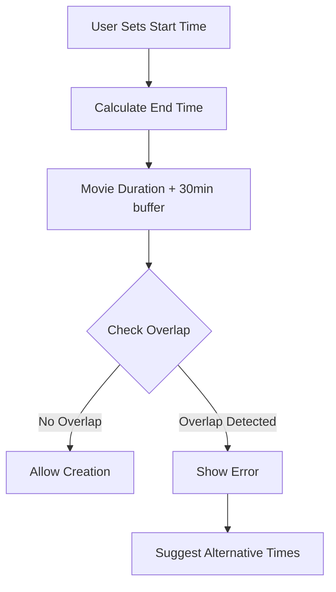

---

### 4. Additional Features

#### HomePage

- Dashboard overview
- Quick stats (if implemented)
- Recent activity

#### Bookings

**Route**: `/bookings`
**Component**: `Bookings.jsx`

Displays all bookings for the admin's cinema hall in a paginated table.

**Features:**
- Table columns: Customer (name + email), Movie, Show date/time, Screen, Seats, Amount, Status badge, Booking ID
- Filters: show date picker, movie title search (debounced), booking status dropdown (All / Confirmed / Cancelled / Completed)
- Pagination: 50 bookings per page with Prev/Next controls
- Loading skeleton, empty state, and error state
- Calls `GET /api/booking/admin/all` with query params on filter/page change

#### ProfilePage

- Admin profile information
- Edit profile details

#### SettingsPage

- Application settings
- Preferences

---

## API Service Layer

**Location**: `src/services/api.js`

### Service Modules

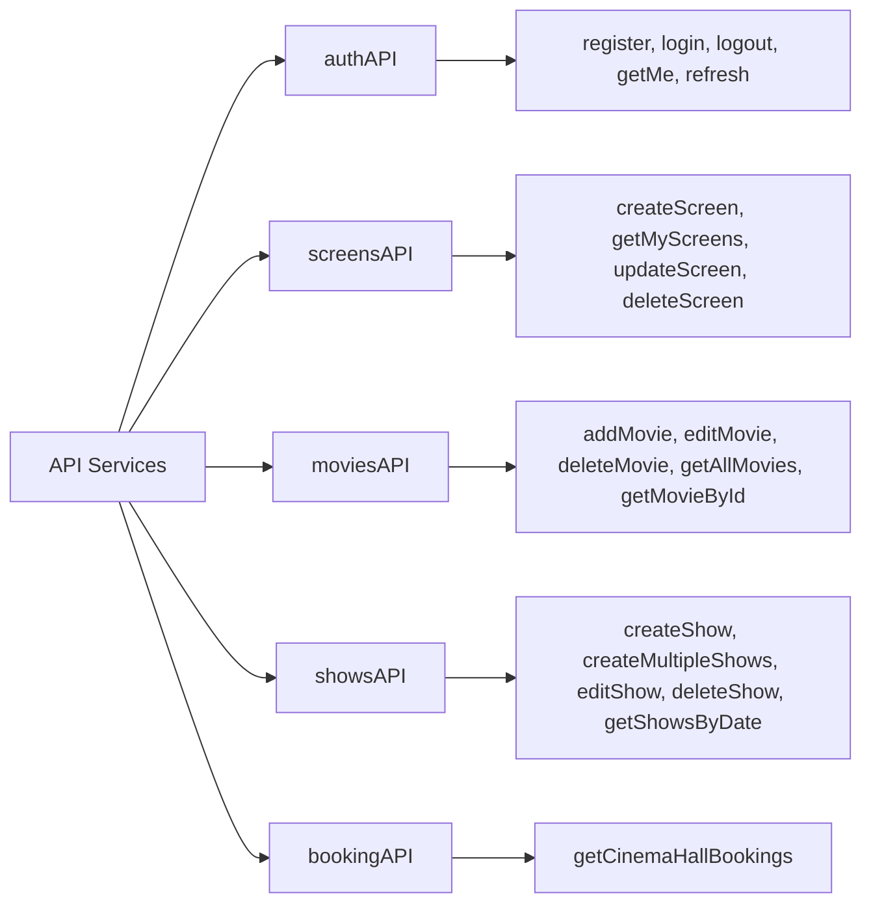

### API Configuration

```javascript
const API_BASE_URL =
  import.meta.env.VITE_API_BASE_URL || "http://localhost:5000";

// All requests include:
credentials: "include"; // Send cookies
```

### Error Handling

```javascript
try {
  const response = await fetch(url, options);
  if (!response.ok) {
    const errorData = await response.json();
    throw new Error(errorData.message || "Request failed");
  }
  return response.json();
} catch (error) {
  console.error("API Error:", error);
  throw error;
}
```

---

## UI Components

### shadcn/ui Components Used

| Component | Usage               |
| --------- | ------------------- |
| Button    | Actions, navigation |
| Card      | Content containers  |
| Dialog    | Modals for forms    |
| Input     | Text fields         |
| Select    | Dropdowns           |
| Badge     | Status indicators   |
| Separator | Visual dividers     |
| Skeleton  | Loading states      |
| Sonner    | Toast notifications |
| Calendar  | Date pickers        |
| Popover   | Contextual menus    |

### Custom Components

**AppSidebar** - Navigation sidebar

- Collapsible menu
- Active route highlighting
- User profile section
- Theme toggle

**Loader** - Loading spinner

- Full-screen overlay
- Animated spinner

**SearchMovies** - Movie search component

- Debounced search
- Autocomplete dropdown

**CinemaLayout** - Main layout wrapper

- Sidebar + content area
- Responsive design

---

## State Management

### Context Providers

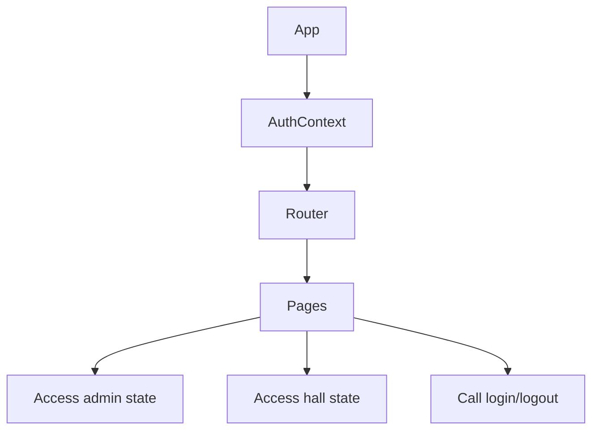

**AuthContext API:**

```javascript
const {
  admin, // Current admin object
  hall, // Admin's cinema hall
  isLoggedIn, // Boolean auth status
  loading, // Loading state
  login, // Login function
  logout, // Logout function
  checkAuth, // Verify auth on mount
  refreshToken, // Refresh access token
} = useAuth();
```

---

## Routing & Navigation

### Route Protection

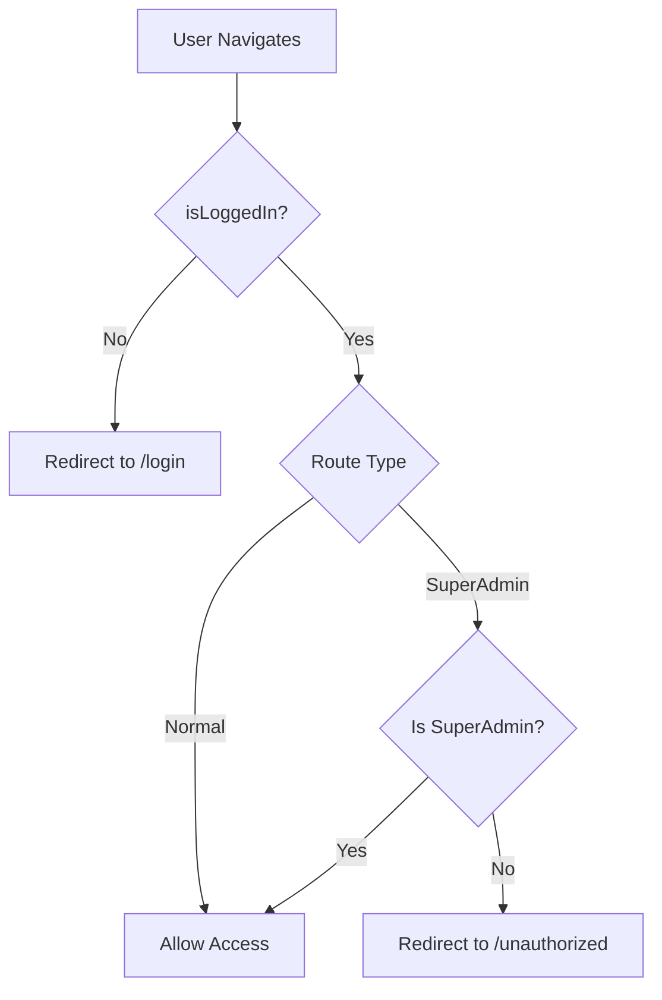

### Navigation Structure

**Sidebar Menu Items:**

1. Home
2. Movies (SuperAdmin only)
3. Screens
4. Shows
5. Bookings
6. Profile
7. Settings

---

## Image Upload

### Cloudinary Integration

**Service**: `src/services/cloudinary.js`

```javascript
export const uploadImageToCloudinary = async (file) => {
  const formData = new FormData();
  formData.append("file", file);
  formData.append("upload_preset", CLOUDINARY_UPLOAD_PRESET);

  const response = await fetch(
    `https://api.cloudinary.com/v1_1/${CLOUDINARY_CLOUD_NAME}/image/upload`,
    { method: "POST", body: formData },
  );

  const data = await response.json();
  return data.secure_url;
};
```

**Usage in MovieManagement:**

1. User selects image file
2. Upload to Cloudinary
3. Get secure URL
4. Save URL in movie record

---

## Styling & Theming

### Tailwind Configuration

**Custom Colors:**

- Primary: Cinema brand color
- Secondary: Accent color
- Background: Light/dark mode support
- Foreground: Text colors
- Muted: Subtle elements

### Dark Mode Support

Theme toggle available in sidebar:

- Light mode
- Dark mode
- System preference

---

## Performance Optimizations

### Lazy Loading

**Images:**

```jsx
import { LazyLoadImage } from "react-lazy-load-image-component";

<LazyLoadImage src={movie.poster_url} effect="blur" className="..." />;
```

**Routes:**
Code splitting with React.lazy() (if implemented)

### Debouncing

**Search Input:**

```javascript
const debounce = (func, wait) => {
  let timeout;
  return (...args) => {
    clearTimeout(timeout);
    timeout = setTimeout(() => func(...args), wait);
  };
};
```

---

## User Workflows

### Complete Show Creation Workflow

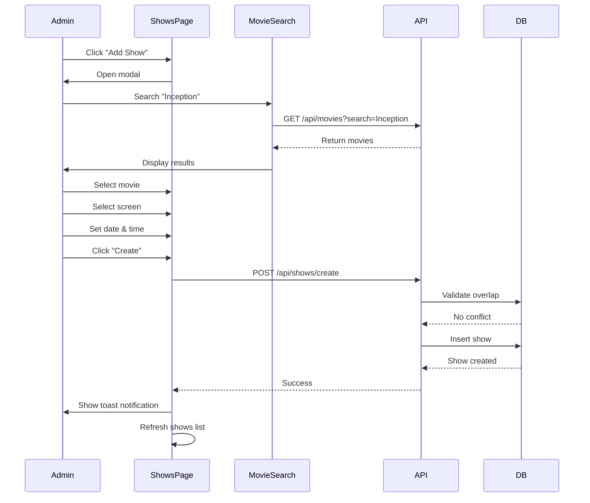

### Screen Designer Workflow

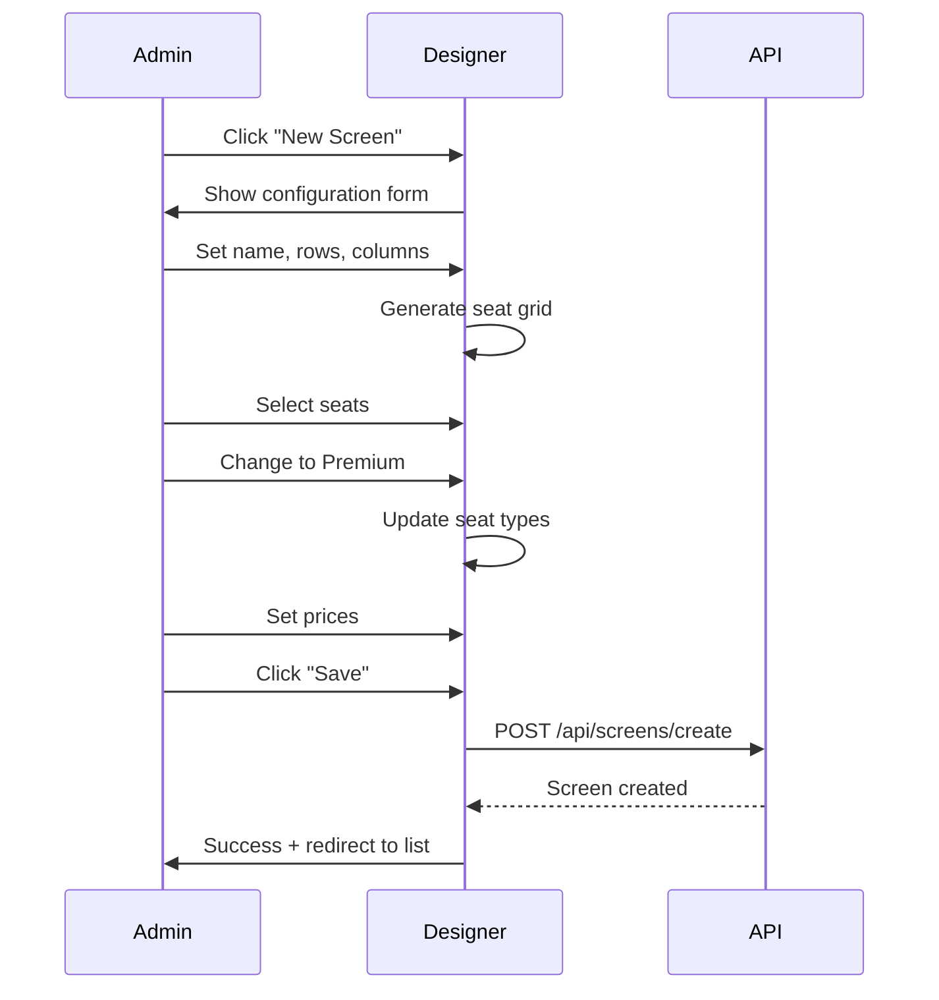

---

## Environment Variables

```env
# API Configuration
VITE_API_BASE_URL=http://localhost:5000

# Cloudinary Configuration
VITE_CLOUDINARY_CLOUD_NAME=your-cloud-name
VITE_CLOUDINARY_UPLOAD_PRESET=your-preset
```

---

## Build & Deployment

### Development

```bash
npm run dev
# Runs on http://localhost:5173
```

### Production Build

```bash
npm run build
# Outputs to /dist
```

### Deployment

Configured for Vercel deployment:

- Automatic builds on push
- Environment variables via Vercel dashboard
- Custom domain support

---

## Recently Implemented

✅ **ShowsManagement UI redesign** (BookMyShow style):
- Replaced shadcn `Tabs` date selector with 3-part vertical buttons (DOW/day/month) — 7 days, same shelf style as user pages
- `selectedDate` changed from string to `Date` object; formatted to string only at API call
- Availability legend (● AVAILABLE green / ● FAST FILLING amber)
- Show time buttons redesigned: green-bordered outlined style with screen name + seat count / time / language + price in 3 lines
- Movie cards use `rounded-xl` + `rounded-full` genre/language pills
- Edit/Delete hover actions preserved on `group-hover`
- Removed unused `Tabs, TabsContent, TabsList, TabsTrigger` imports

---

**Last Updated**: March 8, 2026 (ShowsManagement BookMyShow-style UI redesign)

---

## Best Practices Implemented

✅ **Code Organization:**

- Feature-based folder structure
- Reusable components
- Centralized API services
- Context for global state

✅ **User Experience:**

- Loading states with skeletons
- Error handling with toast notifications
- Responsive design
- Keyboard navigation support

✅ **Performance:**

- Lazy loading images
- Debounced search
- Optimistic UI updates
- Efficient re-renders

✅ **Security:**

- Protected routes
- Role-based access control
- Secure cookie handling
- Input validation

---

## Future Enhancements

💡 **Potential Features:**

- Real-time booking updates (WebSockets)
- Analytics dashboard
- Revenue reports
- Email notifications
- Bulk operations
- Export data (CSV/PDF)
- Advanced filtering
- Seat availability heatmap

---

**Last Updated**: March 7, 2026
