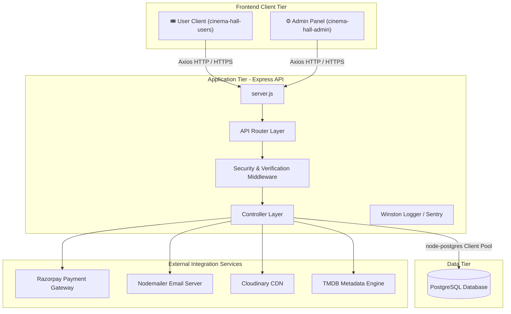
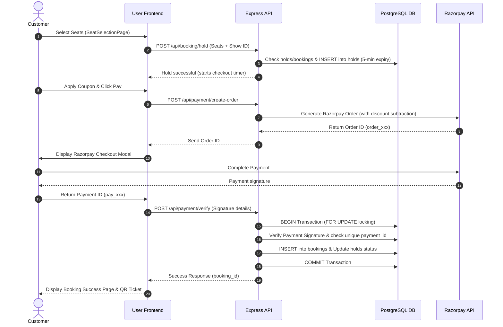

# Documentation Index

Quick reference for all documentation files in this folder.

| File                                                                                | Description                            | Key Topics                                                                                          |
| ----------------------------------------------------------------------------------- | -------------------------------------- | --------------------------------------------------------------------------------------------------- |
| [README.md](./README.md)                                                               | Project overview and navigation guide  | Tech stack, quick start, doc structure                                                              |
| [backend.md](./backend.md)                                                             | Backend API reference                  | All endpoints, DB schema, auth, middleware, payment integration, Sentry monitoring, Winston logging |
| [users.md](./users.md)                                                                 | User frontend documentation            | Pages, components, auth flow, booking + payment flow                                                |
| [admin.md](./admin.md)                                                                 | Admin panel documentation              | Movie management, screen designer, show scheduling, bookings overview                               |
| [payment and booking implementation.md](./payment%20and%20booking%20implementation.md) | Deep dive into seat booking + Razorpay | Hold mechanism, concurrency, payment verify, booking success page, idempotency walkthrough          |
| [db_setup.sql](./db_setup.sql)                                                         | One-shot idempotent DB setup script    | Full schema for both local PostgreSQL and Neon; run to create or update any DB                      |

---

## 🏗️ System Architecture Overview

This section details the actual architecture, module dependencies, and data flows discovered during the static analysis and Graphify knowledge mapping of the Cinema Hall Ticket Booking codebase.

### 1. System Architecture

The application is structured as a **decoupled multi-package monorepo** consisting of three primary operational tiers:



- **Frontend Client Tier**: Twin React 18 SPAs compiled via Vite and styled with Tailwind CSS + shadcn/ui.
  - *User App* (Port 5173): Enables customer movie exploration, location-based cinema navigation, interactive seat selection, and order processing.
  - *Admin App* (Port 5174): Exposes analytics dashboard, movie database CRUD, bulk show scheduling, ads manager, and interactive drag-and-drop screen layout designer.
- **Application Tier**: Express.js REST API server. Handles route routing, validation rules, authentication enforcement, Sentry logging, and external HTTP integrations.
- **Data Tier**: Relational PostgreSQL database (Neon serverless in production, local PostgreSQL for development). Features transactional isolation, triggers (e.g. show overlap validation), and relational indexes.
- **External Integration Services**:
  - *Razorpay*: Handles payment creation, signature verification, and automated/manual refunds.
  - *Nodemailer*: Delivers transactional OTP codes and security warnings.
  - *Cloudinary*: Manages image uploads for movie posters and advertisement assets.
  - *TMDB API*: Synchronizes popular, upcoming, and detailed movie profiles.

---

### 2. Module Dependency Structure

Graphify analysis grouped the system into distinct functional communities based on symbol calling patterns:

| Community / Module Group | Core Files | Architectural Role | Dependencies |
| :--- | :--- | :--- | :--- |
| **Database Core** | `db.js`, `server.js` | Connection pool registry for PostgreSQL. | None (Base layer) |
| **Booking & Payment core** | `booking.Controller.js`, `payment.Controller.js`, `refund.Controller.js` | Manages seat holdings, tickets, webhook verification, and refund logging. | `db.js`, `booking.Controller.js` (cross-references holds) |
| **Authentication & Security** | `auth.Controller.js`, `customerAuth.Controller.js`, `otp.Controller.js` | Enforces lockout rules, email verification tokens, and OTP generation. | `db.js`, `generatetokenandsetcookie.js`, `mail/emails.js` |
| **Catalog & Scheduling** | `movies.Controller.js`, `shows.Controller.js`, `userMovies.Controller.js` | Movie lists, screen layouts, active offers validation, and showtime listings. | `db.js`, `tmdb.Controller.js` |
| **Admin Client Interface** | `src/context/HallContext.jsx`, `src/services/api.js` | Multi-hall active switching context and Admin API client layer. | `axios` |
| **User Client Interface** | `src/hooks/useRazorpayPayment.js`, `src/services/api.js` | Handles local client states, checkout hooks, and user API services. | `axios` |

---

### 3. Frontend/Backend Communication Flow

Communication between the React frontends and Express API is strictly stateless and flows through a custom API service layer:

```
[React Views (JSX)]
       │ (calls hooks/handlers)
       ▼
[src/services/api.js] (Axios Instances)
       │ (sends HTTP Requests with Cookies/Tokens)
       ▼
[server.js (Express Core)]
       │ (checks CORS & runs Parser middlewares)
       ▼
[routes/*.routes.js]
       │ (attaches verify middlewares)
       ▼
[middleware/verifyCinemaAdmin.js / verifyCustomer.js]
       │ (extracts JWT, checks session validity)
       ▼
[controllers/*.Controller.js] (Runs business logic, queries DB)
```

- **Authentication Tokens**: Access tokens are carried as bearer parameters/cookies, while refresh tokens are stored in secure `httpOnly` cookies and checked against database-stored session revocation hashes (`admin_sessions` and `customer_sessions` tables).
- **Unified Base Route**: Admin API requests are mapped to `/api/dashboard`, `/api/halls`, `/api/screens`, `/api/shows`, while Customer requests hit `/api/user/movies`, `/api/booking`, `/api/payment`, and `/api/offers`.

---

### 4. Shared Components

To ensure compatibility, consistency, and avoid duplicate implementations, key components are shared or replicated with identical validation schemas across packages:

- **Password Policy Engine** (`passwordPolicy.js`):
  - Backend validation (`cinema-hall-api/utils/passwordPolicy.js`) enforces standard password metrics (8+ chars, uppercase, lowercase, digit, special char).
  - Frontend checklist (`cinema-hall-admin/src/utils/passwordPolicy.js` and `cinema-hall-users/src/utils/passwordPolicy.js`) renders a live status checklist on signup/reset forms.
- **Movie Search Autocomplete Dropdown** (`MovieSearchDropdown.jsx`):
  - Used in admin scheduling pages (`AddShowPage.jsx`, `EditShowPage.jsx`, `AddMultipleShowsPage.jsx`) to fetch matching TMDB movies, auto-populating metadata and screen pricing fields.
- **Leaflet Mapping Interface** (Leaflet Maps Integration):
  - Used in admin onboarding (`OnboardingPage.jsx`) and admin profiles (`ProfilePage.jsx`) to pin geolocation coordinates, which are then queried by the customer app to list theatres near them.

---

### 5. Authentication Flows

The project separates Admin and Customer auth flows, with a strong focus on security (lockouts, OTP, session verification):

```
CUSTOMER SIGNUP/LOGIN FLOW:
Customer Request OTP ──> Generate OTP (SHA-256) ──> Send Email ──> Customer Submits Code
                                                                          │
Customer Locked Out <── Failed (>5 Attempts) <── Verify Hash <────────────┘
                                                   │
  Customer Profile <── Generate JWT Token (30d) <──┘
```

- **Customer Auth**:
  - OTP verification uses temporary SHA-256 hashes (`otp_verifications` table). Codes expire quickly and are limited to 3 sends per 10 minutes.
  - Locking mechanisms track failed attempts. When an account is locked, logins return a specific unlock timer and a warning banner.
- **Admin Auth**:
  - Requires email verification via custom tokens (`admin_verification_tokens`). Unverified admins are blocked from accessing hall-related routes by `HallGuard.jsx`.
  - Admin login supports brute-force protection with lockouts scaling up (15 mins -> 60 mins -> 24 hours).

---

### 6. Data Flows

#### A. Concurrency-Safe Seat Hold and Ticket Booking

To prevent double-booking, the booking process implements a two-stage transaction flow using seat holds and database table-level checks:



#### B. Show Cancellation and Refund Flow
- Admin cancels a show (`ShowsManagement.jsx` -> `POST /api/shows/cancel/:id`).
- Backend queries the show's database record to fetch booking counts, convenience fees, and total revenue.
- Transaction initiates refunds for all linked customer payments via the Razorpay Refund API.
- Logs a refund record in the `refunds` table, indicating "refund_initiated" or "refund_failed" status.
- A Webhook listener (`POST /api/payment/verify`) updates the refund status to "refund_processed" on transaction settlement.

---

## Key API Endpoints Quick Reference

| Method | Endpoint                               | Description                                                                                                                         |
| ------ | -------------------------------------- | ----------------------------------------------------------------------------------------------------------------------------------- |
| POST   | `/api/auth/register`                 | Register admin (sends verification email)                                                                                           |
| GET    | `/api/auth/verify-email?token=`      | Verify email from link                                                                                                              |
| POST   | `/api/auth/resend-verification`      | Resend verification email                                                                                                           |
| POST   | `/api/auth/login`                    | Admin login (blocked if unverified/locked)                                                                                          |
| POST   | `/api/auth/logout`                   | Logout + revoke session                                                                                                             |
| POST   | `/api/auth/logout-all`               | Revoke ALL sessions                                                                                                                 |
| POST   | `/api/auth/forgot-password`          | Send reset link                                                                                                                     |
| POST   | `/api/auth/reset-password`           | Set new password via token                                                                                                          |
| POST   | `/api/auth/change-password`          | Change password while logged in                                                                                                     |
| GET    | `/api/auth/security`                 | Security info: sessions, logs, lockout                                                                                              |
| POST   | `/api/customer/signup`               | Register customer (bcrypt 12, password policy enforced)                                                                             |
| POST   | `/api/customer/login`                | Customer login (lockout enforced; hint on near-threshold failures)                                                                  |
| POST   | `/api/customer/logout`               | Clear customer cookies + revoke DB session                                                                                          |
| GET    | `/api/customer/me`                   | Get logged-in customer info                                                                                                         |
| PUT    | `/api/customer/update`               | Update customer profile                                                                                                             |
| POST   | `/api/customer/refresh`              | Refresh customer access token (revocation-checked)                                                                                  |
| POST   | `/api/customer/forgot-password`      | Send password-reset OTP (generic response)                                                                                          |
| POST   | `/api/customer/reset-password`       | Verify OTP + set new password (revokes ALL sessions)                                                                                |
| POST   | `/api/customer/change-password`      | Change password while logged in (revokes other sessions)                                                                            |
| POST   | `/api/otp/send`                      | Send OTP (type: signup \| password\_reset); SHA-256 hashed; rate-limited 3/10min                                                    |
| POST   | `/api/otp/verify`                    | Verify OTP; max 5 wrong attempts                                                                                                    |
| POST   | `/api/booking/hold`                  | Hold seats (5-min lock)                                                                                                             |
| POST   | `/api/payment/create-order`          | Create Razorpay order                                                                                                               |
| POST   | `/api/payment/verify`                | Verify signature + confirm booking                                                                                                  |
| GET    | `/api/booking/by-payment/:id`        | Fetch booking by payment_id (success page)                                                                                          |
| GET    | `/api/booking/my-bookings`           | List all bookings for logged-in customer (includes refund status via LEFT JOIN)                                                     |
| GET    | `/api/booking/admin/all`             | List all bookings for admin's cinema hall (with filters)                                                                            |
| GET    | `/api/booking/admin/verify/:id`      | Verify a booking by UUID — admin QR scan; includes refund fields                                                                   |
| GET    | `/api/shows/booking-count/:id`       | Confirmed booking count + total refund amount for a show (used by cancel dialog)                                                    |
| GET    | `/api/refunds`                       | List all refunds for admin's cinema hall (filterable by status, paginated)                                                          |
| GET    | `/api/refunds/booking/:booking_id`   | Get refund record for a specific booking                                                                                            |
| POST   | `/api/refunds/:refund_id/settle`     | Manually mark a refund as settled                                                                                                   |
| GET    | `/api/ads/active?placement=`         | Fetch currently active ads by placement (`banner` or `side`) — public                                                          |
| POST   | `/api/ads/click/:id`                 | Record a click-through on an ad (optional customer auth)                                                                            |
| GET    | `/api/ads`                           | List all ads with click counts — SuperAdmin only                                                                                   |
| GET    | `/api/ads/:id/clicks`                | List click-through details (customer name/email/phone, timestamp) — SuperAdmin only                                                |
| GET    | `/api/offers/active`                 | List active, eligible, non-expired offers for the logged-in customer                                                                |
| POST   | `/api/offers/validate`               | Validate a coupon code + calculate discount preview (customer auth)                                                                 |
| GET    | `/api/offers`                        | List all offers with filters — SuperAdmin only                                                                                     |
| GET    | `/api/offers/:id`                    | Fetch single offer by ID — SuperAdmin only (used by edit page)                                                                     |
| POST   | `/api/offers/create`                 | Create a new offer — SuperAdmin only                                                                                               |
| PUT    | `/api/offers/update/:id`             | Update an offer — SuperAdmin only                                                                                                  |
| DELETE | `/api/offers/delete/:id`             | Delete an offer — SuperAdmin only                                                                                                  |
| GET    | `/api/payment/admin/orders`          | List all payment orders for admin's cinema hall (with filters)                                                                      |
| POST   | `/api/shows/bulk`                    | Create multiple shows (same movie+screen+date) in one request                                                                       |
| DELETE | `/api/shows/bulk`                    | Delete multiple shows by IDs                                                                                                        |
| PUT    | `/api/shows/cancel/:id`              | Cancel a show (initiates refunds for all confirmed bookings)                                                                        |
| PUT    | `/api/shows/bulk-cancel`             | Cancel multiple shows; triggers refunds in bulk                                                                                     |
| PUT    | `/api/shows/bulk-booking-open`       | Open booking for multiple shows at once                                                                                             |
| PUT    | `/api/shows/bulk-restore`            | Restore multiple cancelled shows back to `scheduled`                                                                                |
| GET    | `/api/shows/get/:id`                 | Get show with seat layout                                                                                                           |
| GET    | `/api/user/movies/location/theatres` | Cinema halls with movies + shows for a date (TheatresPage)                                                                          |
| GET    | `/api/customers`                     | List all platform customers with search + pagination — SuperAdmin only                                                             |
| GET    | `/api/auth/admins`                   | List all cinema hall admins with their hall info — SuperAdmin only                                                                 |
| GET    | `/api/auth/admins/:id/logs`          | List security audit logs for a specific admin — SuperAdmin only                                                                    |
| GET    | `/api/dashboard/stats`               | All dashboard metrics in one call (today stats, 7-day trend, recent bookings, today's shows) — Admin + Cinema Hall required        |
| GET    | `/api/cron/jobs`                     | Vercel Cron endpoint — runs `cleanupExpiredHolds` + `updateShowStatuses`; protected by `Authorization: Bearer <CRON_SECRET>` |
| PATCH  | `/api/auth/hall`                     | Update cinema hall name, address, state, district, latitude, longitude — Admin auth required                                       |
| GET    | `/api/halls`                         | Get all cinema halls owned by the logged-in admin                                                                                   |
| POST   | `/api/halls`                         | Create a new cinema hall                                                                                                            |
| PUT    | `/api/halls/:id`                     | Update an existing cinema hall (must own the hall)                                                                                  |
| DELETE | `/api/halls/:id`                     | Delete a cinema hall (cascades to screens/shows/bookings)                                                                           |
| POST   | `/api/shows/bulk`                    | Create multiple shows (same movie + screen + date) in one request                                                                   |
| DELETE | `/api/shows/bulk`                    | Delete multiple shows by IDs                                                                                                        |
| PUT    | `/api/shows/cancel/:id`              | Cancel a show and initiate refunds for all confirmed bookings                                                                       |
| PUT    | `/api/shows/bulk-cancel`             | Cancel multiple shows and trigger bulk refunds                                                                                      |
| PUT    | `/api/shows/bulk-booking-open`       | Open booking status for multiple shows at once                                                                                      |
| PUT    | `/api/shows/bulk-restore`            | Restore multiple cancelled shows back to `scheduled`                                                                                |
| POST   | `/api/payment/webhook`               | Razorpay webhook — HMAC-SHA256 verified; confirms booking on `payment.captured`; no customer auth required                         |
| GET    | `/api/offers/cinema-halls`           | List all cinema halls (for offer scope selector) — SuperAdmin only                                                                  |

---

## Booking Flow Summary

```
Select Seats (/show/:showId)
  → Hold seats (POST /api/booking/hold)
  → Navigate to /order-summary (location.state with seat + show info)
Order Summary (/order-summary)
  → Show price breakdown (tickets + ₹15/ticket convenience fee + GST)
  → [Optional] Enter coupon code → POST /api/offers/validate → discount applied
  → Pay button → Razorpay Checkout modal (offer_code passed to createOrder)
  → Verify payment (POST /api/payment/verify) → offer redemption recorded
  → Navigate to /booking/success?payment_id=pay_xxx
BookingSuccessPage
  → GET /api/booking/by-payment/:id
  → Display movie, show time, seat labels, amount, QR code
```

---

## Critical Files

| Area                                             | File                                                         |
| ------------------------------------------------ | ------------------------------------------------------------ |
| Booking controller                               | `cinema-hall-api/controllers/booking.Controller.js`        |
| Payment controller                               | `cinema-hall-api/controllers/payment.Controller.js`        |
| Booking routes                                   | `cinema-hall-api/routes/booking.routes.js`                 |
| User frontend API service                        | `cinema-hall-users/src/services/api.js`                    |
| Admin frontend API service                       | `cinema-hall-admin/src/services/api.js`                    |
| Payment hook                                     | `cinema-hall-users/src/hooks/useRazorpayPayment.js`        |
| Success page                                     | `cinema-hall-users/src/pages/BookingSuccessPage.jsx`       |
| User bookings page                               | `cinema-hall-users/src/pages/Bookings.jsx`                 |
| Admin bookings page                              | `cinema-hall-admin/src/pages/Bookings.jsx`                 |
| Admin booking detail page                        | `cinema-hall-admin/src/pages/BookingDetailPage.jsx`        |
| Admin refunds page                               | `cinema-hall-admin/src/pages/RefundsPage.jsx`              |
| Admin payment orders page                        | `cinema-hall-admin/src/pages/PaymentOrders.jsx`            |
| Admin verify ticket page                         | `cinema-hall-admin/src/pages/VerifyTicket.jsx`             |
| Refund controller                                | `cinema-hall-api/controllers/refund.Controller.js`         |
| Refund routes                                    | `cinema-hall-api/routes/refund.routes.js`                  |
| Refund migration                                 | `cinema-hall-api/migrations/migration_refunds.sql`         |
| Seat selection                                   | `cinema-hall-users/src/pages/SeatSelectionPage.jsx`        |
| Order summary (pre-payment)                      | `cinema-hall-users/src/pages/OrderSummaryPage.jsx`         |
| Theatres page                                    | `cinema-hall-users/src/pages/TheatresPage.jsx`             |
| Movie info page                                  | `cinema-hall-users/src/pages/MovieInfoPage.jsx`            |
| Ad banner (carousel)                             | `cinema-hall-users/src/components/AdBanner.jsx`            |
| Ads controller                                   | `cinema-hall-api/controllers/ads.Controller.js`            |
| Ads routes                                       | `cinema-hall-api/routes/ads.routes.js`                     |
| Admin Ads management page                        | `cinema-hall-admin/src/pages/AdsManagement.jsx`            |
| Ads DB migration                                 | `cinema-hall-api/migration_ads.sql`                        |
| Offers controller                                | `cinema-hall-api/controllers/offers.Controller.js`         |
| Offers routes                                    | `cinema-hall-api/routes/offers.routes.js`                  |
| Offers DB migration                              | `cinema-hall-api/migrations/migration_offers.sql`          |
| Admin Offers management page                     | `cinema-hall-admin/src/pages/OffersManagement.jsx`         |
| Admin Offer create/edit page                     | `cinema-hall-admin/src/pages/OfferFormPage.jsx`            |
| Admin Customers list page                        | `cinema-hall-admin/src/pages/UsersPage.jsx`                |
| Admin Cinema Hall Admins list page               | `cinema-hall-admin/src/pages/AdminsPage.jsx`               |
| Admin registration page (simplified credentials) | `cinema-hall-admin/src/pages/RegisterPage.jsx`             |
| Admin first-time onboarding page                 | `cinema-hall-admin/src/pages/OnboardingPage.jsx`           |
| Admin halls management page                      | `cinema-hall-admin/src/pages/HallManagement.jsx`           |
| Admin hall switcher component                    | `cinema-hall-admin/src/components/HallSwitcher.jsx`        |
| Admin hall routing guard                         | `cinema-hall-admin/src/routes/HallGuard.jsx`               |
| Admin hall context provider                      | `cinema-hall-admin/src/context/HallContext.jsx`            |
| Admin profile + hall edit page                   | `cinema-hall-admin/src/pages/ProfilePage.jsx`              |
| Auth controller (register, login, updateHall)    | `cinema-hall-api/controllers/auth.Controller.js`           |
| Cinema halls controller                          | `cinema-hall-api/controllers/halls.Controller.js`          |
| Cinema halls routes                              | `cinema-hall-api/routes/halls.routes.js`                   |
| Customers controller                             | `cinema-hall-api/controllers/customers.Controller.js`      |
| Customers routes                                 | `cinema-hall-api/routes/customers.routes.js`               |
| Admin dashboard page                             | `cinema-hall-admin/src/pages/HomePage.jsx`                 |
| Dashboard controller                             | `cinema-hall-api/controllers/dashboard.Controller.js`      |
| Dashboard routes                                 | `cinema-hall-api/routes/dashboard.routes.js`               |
| User Offers browse page                          | `cinema-hall-users/src/pages/OffersPage.jsx`               |
| Movie shows page                                 | `cinema-hall-users/src/pages/MovieDetailsPage.jsx`         |
| User movies controller                           | `cinema-hall-api/controllers/userMovies.Controller.js`     |
| User movies routes                               | `cinema-hall-api/routes/userMovies.routes.js`              |
| Admin shows management (list)                    | `cinema-hall-admin/src/pages/ShowsManagement.jsx`          |
| Admin add show                                   | `cinema-hall-admin/src/pages/AddShowPage.jsx`              |
| Admin edit show                                  | `cinema-hall-admin/src/pages/EditShowPage.jsx`             |
| Admin bulk add shows                             | `cinema-hall-admin/src/pages/AddMultipleShowsPage.jsx`     |
| Movie search dropdown (shared)                   | `cinema-hall-admin/src/components/MovieSearchDropdown.jsx` |
| Admin screen list                                | `cinema-hall-admin/src/pages/CinemaScreens.jsx`            |
| Admin screen designer (add/edit)                 | `cinema-hall-admin/src/pages/ScreenDesignerPage.jsx`       |

---

*June 2026 — Customer Auth Security Upgrade: Production-grade security parity for the customer (users) side. New DB columns on `customers`: `failed_login_attempts`, `account_locked_until`, `last_login_at`, `password_changed_at`. New `customer_sessions` table for DB-backed refresh token storage (SHA-256 hashed, `ip_address`, `user_agent`, `is_revoked`). `otp_verifications` upgraded: added `type` (`signup` | `password_reset`), `otp_attempts` (max 5 wrong guesses), OTP now stored as SHA-256 hash; `UNIQUE(email, type)` constraint replacing old `UNIQUE(email)`. OTP rate-limited to 3 sends per 10 minutes per `(email, type)`. New backend routes: `POST /api/customer/forgot-password`, `POST /api/customer/reset-password`, `POST /api/customer/change-password`. `cusRefreshToken` expiry extended to 30 days; stored as hash in `customer_sessions` and revocation-checked on every refresh. Brute-force lockout (same tiers: 5→15min, 10→60min, 15→24h); lockout email sent; `hint` field returned for near-threshold attempts. Password policy (8+ chars, uppercase, lowercase, digit, special char) enforced on signup, reset, and change. New/updated frontend: `ForgotPasswordPage` (3-step OTP reset flow at `/forgot-password`), `ProfilePage` rewritten with full Change Password section + live policy checklist, `LoginModal` rewritten with lockout banner, attempt hint, show/hide toggles, forgot-password link, and `PasswordPolicyChecklist` on signup. `utils/passwordPolicy.js` added to both API and users frontend. 3 new cinema dark-theme email templates: customer OTP, account locked, password changed.*

*May 31, 2026 — Admin Auth Security Upgrade: Complete production-grade auth overhaul. New DB tables: `admin_verification_tokens`, `admin_password_reset_tokens`, `admin_sessions` (refresh token hashes for server-side revocation), `admin_security_logs`. New columns on `cinema_admin_user`: `email_verified`, `email_verified_at`, `failed_login_attempts`, `account_locked_until`, `password_changed_at`, `last_login_at`. New backend routes: `GET /api/auth/verify-email`, `POST /resend-verification`, `POST /forgot-password`, `POST /reset-password`, `POST /change-password`, `POST /logout-all`, `GET /security`. Brute-force lockout thresholds (5→15min, 10→60min, 15→24hr). Password policy: 8+ chars, uppercase, lowercase, digit, special char. Refresh tokens stored as SHA-256 hashes; revocation checked on every refresh. New frontend pages: `VerifyEmailPage`, `ForgotPasswordPage`, `ResetPasswordPage`. Updated: `LoginPage` (forgot-password link, lockout/unverified error handling), `RegisterPage` (password policy checklist, redirects to /verify-email), `ProfilePage` (Security section: email badge, change password, logout all devices, security timestamps). `ProtectedRoute` now redirects unverified users to `/verify-email`. Vite port locked: admin=5174 (`strictPort: true`), users=5173 (`strictPort: true`). `ADMIN_FRONTEND_URL` and `USER_FRONTEND_URL` added to `.env`. `nodemailer` added to `cinema-hall-api` dependencies.*

*May 24, 2026 — Multi-Hall Support and Onboarding Flow: Refactored database schema and API handlers to support multiple cinema halls per admin. Simplified registration flow to admin credentials only. Added a dedicated onboarding flow (`OnboardingPage.jsx`) at `/onboarding` for first-time hall creation with Leaflet maps integration for coordinate pinning. Implemented `HallGuard` to protect hall-dependent routes while keeping profile, settings, and halls management exempt. Added a `HallSwitcher` dropdown in the sidebar header to toggle active halls, and created a full `HallsManagement` panel at `/halls` for CRUD operations on an admin's halls list.*

*March 20, 2026 — Admin Dashboard (`HomePage.jsx` at `/`): full rewrite from placeholder to analytics dashboard. New `GET /api/dashboard/stats` endpoint (`dashboard.Controller.js` + `dashboard.routes.js`) returns all metrics in a single parallel DB call: today's revenue/bookings/fees, all-time totals, total customers, active offers count, screens count, last 7-day revenue trend, recent 5 bookings, today's shows with seat occupancy. Frontend: 4 KPI cards, recharts `BarChart` for revenue trend (7 days), today's shows list (occupancy color-coded green/amber/red), recent bookings list with status badges. `recharts` + `react-is` packages added to `cinema-hall-admin`. `dashboardAPI.getStats()` added to `cinema-hall-admin/src/services/api.js`.*

*March 25, 2026 — Screen Designer full UI redesign (`ScreenDesignerPage.jsx`): replaced 2-column layout with a 3-column layout (left settings panel | center canvas | right inspector). New sticky top navbar with screen name badge and action buttons (Clear Selection, Reset Grid, Preview, Save Screen). Left panel now shows live Seat Summary counts (Total/Premium/Gold/Silver/Blocked/Selected) and a Row selection mode. Center panel has a zoom toolbar (−/+/Fit, 20–200% range via CSS transform) plus Undo/Redo buttons (50-step snapshot stack, Ctrl+Z/Ctrl+Shift+Z). Right panel adds: Selected Seat inspector, Quick Apply buttons (Fill Row / Apply All / Clear), History log (50-entry with colored dots + timestamps), and Keyboard Shortcuts reference. New Preview dialog shows the layout read-only at 70% scale. Select All added (Ctrl+A). Gold seat color changed from blue → violet gradient.*

*Last Updated: March 9, 2026 — Admin Bookings page: added Screen filter dropdown (fetches from `screensAPI.getMyScreens()`, passes `screen_id` to `GET /api/booking/admin/all`); backend query updated with `$5::uuid` screen filter; full visual redesign (avatar initials, glass-style status pills, screen pill badge, primary-tinted seat chips, 4-column filter grid).*

*May 31, 2026 — Post-migration bug fixes for admin auth system: (1) `migration_auth_security.sql` now includes an `UPDATE cinema_admin_user SET email_verified = TRUE` statement after the `ALTER TABLE` to auto-verify pre-existing admin rows on fresh installs. (2) `verifyAdminEmail`, `resetPassword`, and `changePassword` in `auth.Controller.js` now use `pool.connect()` + checked-out client for `BEGIN/COMMIT/ROLLBACK` transactions (previously used `pool.query()` which can route each statement to a different connection, breaking atomicity). (3) `VerifyEmailPage.jsx` — React 18 StrictMode double-invocation bug fixed using a module-level `Set` to deduplicate the verify API call.*

*March 9, 2026 — Movie detail route split into two pages: `/movie/:movieId` → `MovieInfoPage` (poster, metadata, Book Tickets CTA, About, YouTube trailer embed) and `/movie/shows/:movieId` → `MovieDetailsPage` (date selector + cinema halls + showtimes). Trailer overlay button on poster scrolls to inline YouTube embed.*

*March 9, 2026 — Screen Layout Designer overhaul: replaced passage-type seats with a professional aisle gap system. Aisles are now stored as `aisleAfterColumns: number[]` and `aisleAfterRows: string[]` in the layout JSON (no seat positions consumed). New `Aisle` tool in admin designer — click column headers to add vertical aisles, click row `⬌` buttons to add horizontal aisles. Auto-migration on load: old screens with all-passage columns/rows are automatically converted to the new format (seats renumbered, passage seats removed). Each seat object now includes a `label` field (e.g. `"B-13"`). User-facing `SeatSelectionPage` updated to render matching aisle gaps using layout data. No backend/schema changes required — `layout` JSONB stores new fields additively.*

*March 12, 2026 — Screen Designer split into separate routes: `/screens` (list, `CinemaScreens.jsx`), `/screens/new` (add, `ScreenDesignerPage.jsx`), `/screens/:id/edit` (edit, `ScreenDesignerPage.jsx`). Screen object passed via `location.state` on edit navigation. Redirect guard added for direct URL access. Legacy `AddScreen.jsx` and `EditScreen.jsx` deleted.*

*March 12, 2026 — Shows Management split into separate routes: Add Show modal → `AddShowPage` at `/shows/new`; Edit Show modal → `EditShowPage` at `/shows/:id/edit` (fetches show by ID, pre-fills form); new `AddMultipleShowsPage` at `/shows/bulk` (same movie+screen+date, dynamic time slots list → `POST /api/shows/bulk`). `MovieSearchDropdown` extracted to `src/components/MovieSearchDropdown.jsx` (shared). Auto-fill: selecting a screen populates `price_override` from `screen.premium/gold/silver_price`; selecting a movie populates `language_version` from `movie.language`.*

*March 12, 2026 — Shows Management date selector redesigned: added left/right chevron arrow buttons for week-by-week navigation. New `weekOffset` state shifts the visible 7-day window by ±7 days per click. Past dates are accessible. A week range label (e.g. "March 12 – 18, 2026") is shown above the pills. Pills remain fixed-width (`w-14`), left-aligned with consistent `gap-2` spacing. Navigating weeks auto-selects the first day of the new week. (`ShowsManagement.jsx`)*

*March 12, 2026 — Replaced plain `<input type="date">` with ShadCN Popover + Calendar date picker in `AddShowPage.jsx`, `AddMultipleShowsPage.jsx`, and the Show Date filter in `Bookings.jsx`. All three use `Popover` + `PopoverTrigger` (outlined Button with `CalendarIcon`) + `Calendar mode="single"`. Selected date stored as `YYYY-MM-DD` string via `dayjs`; trigger displays `MMM D, YYYY` or "Pick a date" placeholder.*

*March 12, 2026 — Added Payment Orders page to admin panel. New backend endpoint `GET /api/payment/admin/orders` (auth: `verifyCinemaAdminAccessToken` + `verifyCinemaHall`) returns paginated `payment_orders` with JOINed customer/movie/show/screen data and derived seat labels from screen layout JSONB. Filters: order date, status (created/paid/failed/expired), customer name/email search, movie title search. Frontend: `PaymentOrders.jsx` at `/payment-orders` follows same pattern as `Bookings.jsx` (4-column filter card, shadcn Table, skeleton loading, empty/error states, pagination). Sidebar nav link added under Operations between Bookings and Verify Ticket. `paymentAPI.getOrders()` added to `cinema-hall-admin/src/services/api.js`.*

*March 12, 2026 — Added Refresh button to admin `Bookings.jsx` and `PaymentOrders.jsx`. Button sits in the page header alongside the total count badge; clicking re-fetches with current active filters and page. Icon spins (`animate-spin`) and button is disabled while loading.*

*March 17, 2026 — OffersManagement refactored: Create/Edit Dialog replaced with route-based pages (`/offers/new`, `/offers/:id/edit`) rendered by new `OfferFormPage.jsx`. `OffersManagement.jsx` is now list-only (no form state). `GET /api/offers/:id` endpoint added (backend + `offersAPI.getById`). Date pickers use standard `Popover + Calendar` (no `createPortal` needed outside a Dialog).*

*March 20, 2026 — Added Customers list and Cinema Hall Admins list pages (SuperAdmin only). New `GET /api/customers` endpoint returns all platform customers with pagination, debounced search (name/email/phone), total count, and stats (total + verified). New `GET /api/auth/admins` endpoint returns all non-superAdmin cinema hall admins joined with their hall info, with pagination and search (name/email/hall name). Both endpoints protected by `verifySuperAdmin`. Admin panel: `UsersPage.jsx` at `/customers` (stats cards for total/verified, avatar initials, table with name/email/phone/location/verified badge/booking count); `AdminsPage.jsx` at `/admins` (table with admin name/email/phone/hall name/location/joined date). Both pages moved to `AdminProtectedRoute`. Sidebar: Customers and Hall Admins nav items restricted to `roles: ["superAdmin"]`. `customersAPI` and `adminsAPI` added to `cinema-hall-admin/src/services/api.js`.*

*March 20, 2026 — Admin Bookings: added 4 filter-aware stats cards (Total Bookings, Total Revenue, Convenience Fees Collected, GST Collected) above the filters section. Backend `getCinemaHallBookings` returns a `stats` aggregate using the same WHERE clause as the data query. New `convenience_fee` and `gst_amount` columns added to `bookings` and `payment_orders` tables (`migration_fee_columns.sql`); stored at booking time via `createOrder` → `payment_orders` → `verifyPayment` → `bookings`. New `BookingDetailPage` at `/bookings/:id`: full detail view with Show Details, Customer, Payment, Price Breakdown (computed seat subtotal + fee line-items), and Offer Applied card (only when offer was used). Bookings list rows are now clickable. Reuses `GET /api/booking/admin/verify/:booking_id` — no new backend endpoint needed. `bookingAPI.getBookingById` added to `api.js`.*

*March 20, 2026 — OffersPage: redeemed offers now shown as disabled cards instead of being hidden. `getActiveOffers` backend returns all eligible active/non-expired offers with `is_redeemed: true` flag for redeemed ones (sorted available-first). Frontend renders redeemed cards at `opacity-60` with gray top band, green "Applied" badge, muted discount text, strikethrough code, and "Already used" label (copy button hidden).*

*April 19, 2026 — Cinema Hall Map Coordinates + RegisterPage redesign. DB: `ALTER TABLE cinema_hall ADD COLUMN latitude NUMERIC(10,7), longitude NUMERIC(10,7)` (nullable, idempotent; added to `db_setup.sql`). Backend: `registerCinemaAdmin` now accepts + stores `latitude`/`longitude`; `loginCinemaAdmin` + `getCinemaAdminMe` return them in the `hall` object; new `updateCinemaHall` handler for `PATCH /api/auth/hall` (admin auth, updates name/location/district/state/coordinates). `getTheatresWithShows` (userMovies controller) now returns `latitude`/`longitude` per hall. `getMyBookings` + `getBookingById` (booking controller) now return `cinema_hall_location`, `cinema_hall_latitude`, `cinema_hall_longitude`. Admin frontend: `leaflet` + `react-leaflet` added to `cinema-hall-admin` (`--legacy-peer-deps`). `RegisterPage` fully redesigned — dark full-viewport background (gradient + dot grid + glow orbs), 3-step wizard (Step 1: Personal Info → Step 2: Hall Details → Step 3: Map Location via Leaflet + Nominatim search). `ProfilePage` expanded into a real page: read-only admin profile card + editable cinema hall section with State/District dropdowns + Leaflet map picker + `PATCH /api/auth/hall` save. `authAPI.updateHall()` added to `cinema-hall-admin/src/services/api.js`; `updateHall()` added to `AuthContext`. User frontend: **Directions** button added to `TheatresPage` (per hall), `Bookings` list cards, and `BookingDetailPage` (alongside Download Ticket). Opens `google.com/maps/dir/?api=1&destination={lat},{lng}` in a new tab when coordinates are set, otherwise falls back to `google.com/maps/search/` with hall name + address.*

*March 17, 2026 — Offers/coupon system: `offers` + `offer_redemptions` DB tables (`migration_offers.sql`); `ALTER TABLE bookings/payment_orders` adds `offer_code` + `discount_amount` columns. New `GET+POST /api/offers/*` routes (SuperAdmin CRUD + customer validate/active). `createOrder` applies offer discount server-side; `verifyPayment` records redemption atomically. Admin: `OffersManagement.jsx` at `/offers` (SuperAdmin); Offers nav item in AppSidebar. User: `OffersPage.jsx` at `/offers` (card grid + copy-code); coupon input + apply/remove UI in `OrderSummaryPage`; discount line in price breakdown; `offer_code` flows through `useRazorpayPayment` → `paymentAPI.createOrder`.*

*March 16, 2026 — TopBar + TopNavbar UI/UX redesign: mobile search expands inline (no alert), location pill shows full text on desktop, MapPin dot indicator on mobile, numeric notification badge replaces pulsing dot, Sign In always visible (removed from hamburger), user dropdown gains "My Bookings" + avatar header, hamburger simplified to theme/location/bookings. TopNavbar: `-mb-px border-b-2` active indicator, right nav visible at `sm+`, height `h-11`. MoviesPage location strip: "Showing results near" hidden on mobile.*

*March 16, 2026 — SeatSelectionPage BMS-style redesign + new OrderSummaryPage. SeatSelectionPage: dark-themed seat grid (`bg-gray-50 dark:bg-zinc-950`), small 28px square seat buttons with zero-padded 2-digit column numbers, theme-adaptive available/sold/selected colors, row labels on both sides, mobile-responsive horizontal scroll (`overflow-x-auto` + `w-max mx-auto`). "Proceed to Payment" now holds seats then navigates to `/order-summary` with `location.state` (removed inline payment bar). New `OrderSummaryPage` at `/order-summary`: two-column layout (Razorpay panel left, order summary right), countdown timer, ₹15/ticket convenience fee, Pay triggers Razorpay, Cancel releases seats. Route added to `App.jsx`.*

*March 14, 2026 — Added Ads Management system (SuperAdmin only). New `ads` and `ad_clicks` tables (`migration_ads.sql`). Backend: `ads.Controller.js` + `ads.routes.js` registered at `/api/ads`. Public routes: `GET /active?placement=` (serves active ads by date range), `POST /click/:id` (records click with optional customer auth via cookie). SuperAdmin routes: full CRUD + `GET /:id/clicks` (returns customer name/email/phone per click). Admin panel: `AdsManagement.jsx` at `/ads` (SuperAdmin route) — card grid with image preview, placement badge, date range, active toggle, click count, edit/delete/view-clicks actions; create/edit modal with image URL preview, placement selector (Banner/Side), date range, active toggle. User frontend: `AdBanner.jsx` now fetches `placement=banner` ads dynamically (hides if no active ads, clicking records click + opens URL); `MovieInfoPage.jsx` fetches `placement=side` ads and renders a sticky right sidebar on md+ screens. `adsAPI` added to both `cinema-hall-admin/src/services/api.js` and `cinema-hall-users/src/services/api.js`.*

*May 9, 2026 — Idempotency & Race Condition Hardening: full security audit and re-engineering of the booking + payment flow. Database schema updated with `UNIQUE(payment_id)` on `bookings` and a new `webhook_events` table for event deduplication. Backend: `createOrder` now dedups active orders within a 10-min window; `verifyPayment` uses `ON CONFLICT` and pre-checks; `handleWebhook` uses `express.raw()` for byte-perfect HMAC verification and `SELECT FOR UPDATE` to serialize concurrent deliveries. Frontend: `useRazorpayPayment` hook gained a `useRef` synchronous in-flight guard to block double-clicks. Implementation walkthrough added to `payment and booking implementation.md`.*

*May 31, 2026 — RegisterPage & OnboardingPage UI overhaul + scrolling fix: Both auth pages redesigned with a deeper `backdrop-blur-xl` card, gradient accent top bar, glowing logo icon, uppercase tracking label text, and primary-button glow shadows. Background decorations moved from `absolute` to `fixed` with `-z-10`, and `overflow-hidden` removed from the page wrapper. Scrolling is now enabled via a two-layer pattern: `h-full overflow-y-auto` (outer scroll container) → `min-h-full flex items-center justify-center` (inner centering) so content is reachable by scrolling when zoomed or on small screens. OnboardingPage Sign Out button moved to `fixed top-4 left-4` so it stays pinned regardless of scroll position. Step connector line now animates (fills left-to-right on step completion). Password policy checklist on RegisterPage wrapped in a styled container box. `OnboardingPageSkeleton` updated to match the new card structure.*
