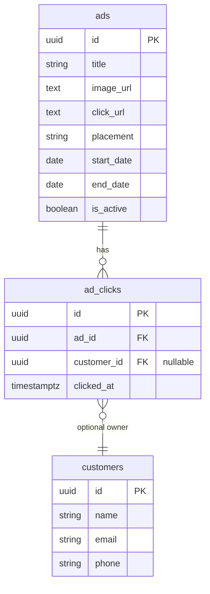

# Ads Management - Database

## Table: `ads`

| Column | Type | Constraints | Description |
|--------|------|-------------|-------------|
| id | UUID | PK DEFAULT gen_random_uuid() | Primary identifier |
| title | VARCHAR(255) | NOT NULL | Ad title/headline |
| image_url | TEXT | NOT NULL | Ad creative/image URL |
| click_url | TEXT | nullable | Destination URL on click |
| placement | VARCHAR(50) | NOT NULL | Placement slot (`banner`, `sidebar`, `popup`) |
| start_date | DATE | NOT NULL | Campaign start date |
| end_date | DATE | NOT NULL | Campaign end date |
| is_active | BOOLEAN | DEFAULT true | Manual toggle to enable/disable |
| created_at | TIMESTAMPTZ | DEFAULT now() | |
| updated_at | TIMESTAMPTZ | DEFAULT now() | |

**Indexes**: `id PK`

## Table: `ad_clicks`

| Column | Type | Constraints | Description |
|--------|------|-------------|-------------|
| id | UUID | PK DEFAULT gen_random_uuid() | Primary identifier |
| ad_id | UUID | FK → ads(id) ON DELETE CASCADE | Referenced ad |
| customer_id | UUID | FK → customers(id), nullable | Identified customer (null for anonymous) |
| clicked_at | TIMESTAMPTZ | DEFAULT now() | Timestamp of click |

**Indexes**: `id PK`, `ad_id` (FK), `customer_id` (FK, nullable)

## Entity Relationships



## Key Queries

### Get all ads with click count
```sql
SELECT a.*, COUNT(ac.id)::int AS click_count
FROM ads a
LEFT JOIN ad_clicks ac ON ac.ad_id = a.id
GROUP BY a.id
ORDER BY a.created_at DESC
```

### Get active ads for a placement
```sql
SELECT id, title, image_url, click_url, placement
FROM ads
WHERE is_active = true
  AND placement = $1
  AND start_date <= CURRENT_DATE
  AND end_date >= CURRENT_DATE
ORDER BY created_at DESC
```

### Get clicks for an ad with customer details
```sql
SELECT ac.id, ac.clicked_at,
       c.name  AS customer_name,
       c.email AS customer_email,
       c.phone AS customer_phone
FROM ad_clicks ac
LEFT JOIN customers c ON c.id = ac.customer_id
WHERE ac.ad_id = $1
ORDER BY ac.clicked_at DESC
```

### Record a click (anonymous or attributed)
```sql
INSERT INTO ad_clicks (ad_id, customer_id) VALUES ($1, $2)
```

## Placement Values
- `banner` - Hero carousel on movies/home page
- `sidebar` - Sidebar widget on detail pages
- `popup` - Modal/overlay advertisement (custom)
