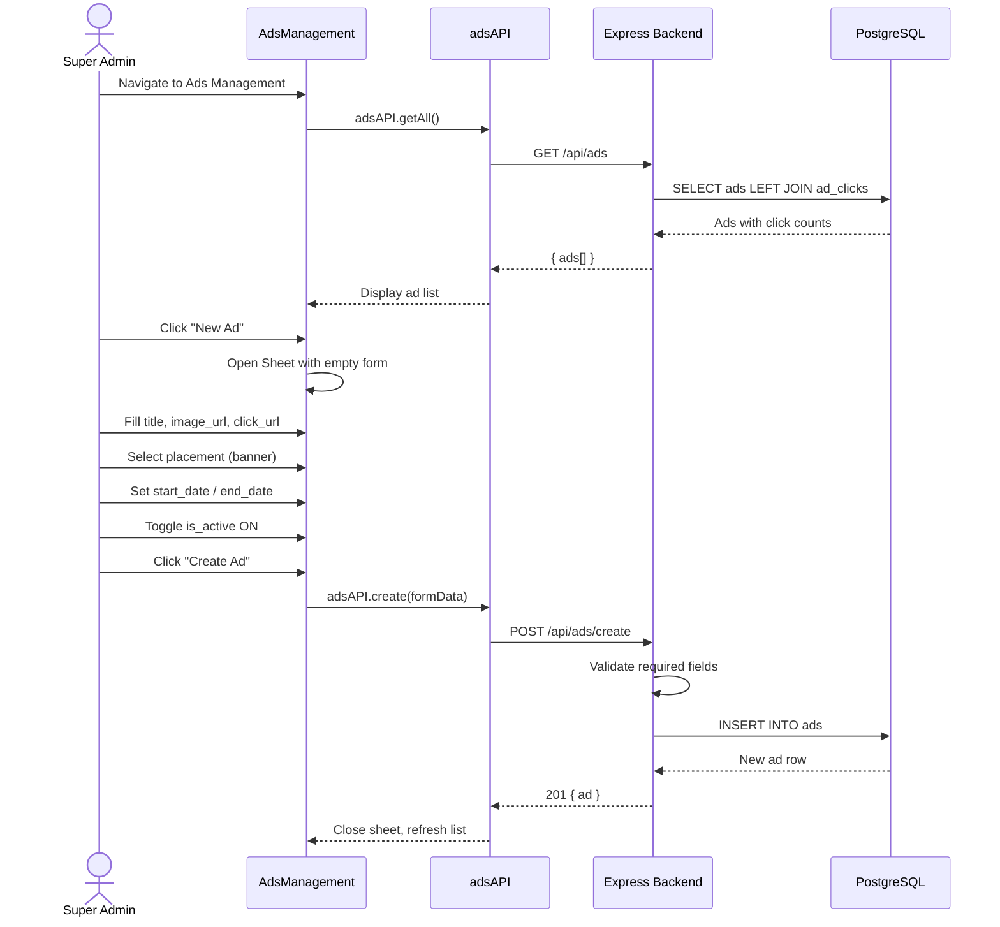
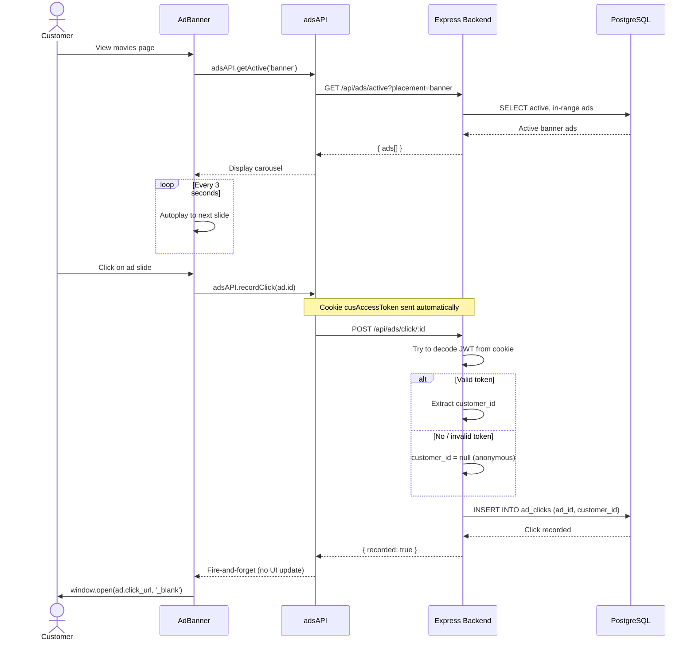
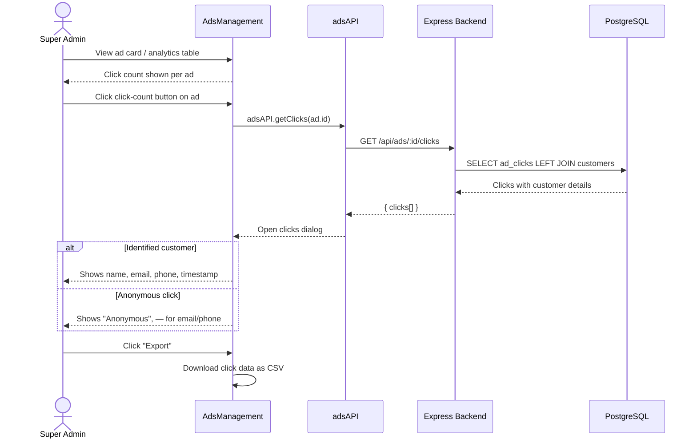

# Ads Management - Workflows

## 1. Create and Publish an Ad

```mermaid
sequenceDiagram
    actor A as Super Admin
    participant AD as AdsManagement
    participant API as adsAPI
    participant BE as Express Backend
    participant DB as PostgreSQL

    A->>AD: Navigate to Ads Management
    AD->>API: adsAPI.getAll()
    API->>BE: GET /api/ads
    BE->>DB: SELECT ads LEFT JOIN ad_clicks
    DB-->>BE: Ads with click counts
    BE-->>API: { ads[] }
    API-->>AD: Display ad list

    A->>AD: Click "New Ad"
    AD->>AD: Open Sheet with empty form

    A->>AD: Fill title, image_url, click_url
    A->>AD: Select placement (banner)
    A->>AD: Set start_date / end_date
    A->>AD: Toggle is_active ON
    A->>AD: Click "Create Ad"
    AD->>API: adsAPI.create(formData)
    API->>BE: POST /api/ads/create
    BE->>BE: Validate required fields
    BE->>DB: INSERT INTO ads
    DB-->>BE: New ad row
    BE-->>API: 201 { ad }
    API-->>AD: Close sheet, refresh list
```

## 2. Ad Click Tracking (Customer Facing)

```mermaid
sequenceDiagram
    actor U as Customer
    participant AB as AdBanner
    participant API as adsAPI
    participant BE as Express Backend
    participant DB as PostgreSQL

    U->>AB: View movies page
    AB->>API: adsAPI.getActive('banner')
    API->>BE: GET /api/ads/active?placement=banner
    BE->>DB: SELECT active, in-range ads
    DB-->>BE: Active banner ads
    BE-->>API: { ads[] }
    API-->>AB: Display carousel

    loop Every 3 seconds
        AB->>AB: Autoplay to next slide
    end

    U->>AB: Click on ad slide
    AB->>API: adsAPI.recordClick(ad.id)
    Note over API,BE: Cookie cusAccessToken sent automatically
    API->>BE: POST /api/ads/click/:id
    BE->>BE: Try to decode JWT from cookie
    alt Valid token
        BE->>BE: Extract customer_id
    else No / invalid token
        BE->>BE: customer_id = null (anonymous)
    end
    BE->>DB: INSERT INTO ad_clicks (ad_id, customer_id)
    DB-->>BE: Click recorded
    BE-->>API: { recorded: true }
    API-->>AB: Fire-and-forget (no UI update)
    AB->>U: window.open(ad.click_url, '_blank')
```

## 3. View Click Analytics

```mermaid
sequenceDiagram
    actor A as Super Admin
    participant AD as AdsManagement
    participant API as adsAPI
    participant BE as Express Backend
    participant DB as PostgreSQL

    A->>AD: View ad card / analytics table
    AD-->>A: Click count shown per ad

    A->>AD: Click click-count button on ad
    AD->>API: adsAPI.getClicks(ad.id)
    API->>BE: GET /api/ads/:id/clicks
    BE->>DB: SELECT ad_clicks LEFT JOIN customers
    DB-->>BE: Clicks with customer details
    BE-->>API: { clicks[] }
    API-->>AD: Open clicks dialog

    alt Identified customer
        AD-->>A: Shows name, email, phone, timestamp
    else Anonymous click
        AD-->>A: Shows "Anonymous", — for email/phone
    end

    A->>AD: Click "Export"
    AD->>AD: Download click data as CSV
```
