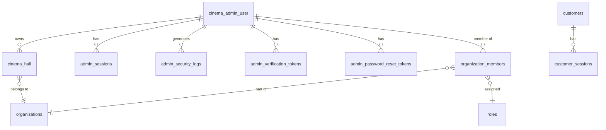

# Authentication - Database

## Collections/Tables

### `cinema_admin_user`
Stores cinema admin user accounts.

| Column | Type | Constraints | Description |
|--------|------|-------------|-------------|
| id | UUID | PK | Primary identifier |
| name | VARCHAR(255) | NOT NULL | Admin display name |
| email | VARCHAR(255) | UNIQUE, NOT NULL | Login email (lowercase) |
| password | VARCHAR(255) | nullable | bcrypt hashed password (null for OAuth-only) |
| phone | VARCHAR(50) | nullable | Contact phone |
| role | VARCHAR(50) | DEFAULT 'admin' | `admin` or `superAdmin` |
| email_verified | BOOLEAN | DEFAULT FALSE | Email verification status |
| email_verified_at | TIMESTAMPTZ | nullable | When email was verified |
| password_changed_at | TIMESTAMPTZ | nullable | Last password change |
| failed_login_attempts | INTEGER | DEFAULT 0 | Consecutive failed login count |
| account_locked_until | TIMESTAMPTZ | nullable | Lockout expiration |
| last_login_at | TIMESTAMPTZ | nullable | Last successful login |
| auth_providers | TEXT[] | DEFAULT '{local}' | Linked auth providers |
| provider_ids | JSONB | nullable | `{google: "id", github: "id"}` |
| avatar | TEXT | nullable | Profile picture URL |
| created_at | TIMESTAMPTZ | DEFAULT now() | Account creation time |
| updated_at | TIMESTAMPTZ | DEFAULT now() | Last update |

**Indexes**: `UNIQUE (email)`, `id PK`

### `cinema_hall`
Stores cinema hall information for each admin.

| Column | Type | Constraints | Description |
|--------|------|-------------|-------------|
| id | UUID | PK | Primary identifier |
| admin_id | UUID | FK → cinema_admin_user.id | Owner admin |
| org_id | UUID | FK → organizations.id | Organization |
| name | VARCHAR(255) | NOT NULL | Hall name |
| location | TEXT | nullable | Address |
| district | VARCHAR(255) | nullable | District/area |
| state | VARCHAR(255) | nullable | State |
| latitude | DECIMAL | nullable | Map coordinates |
| longitude | DECIMAL | nullable | Map coordinates |
| phone | VARCHAR(50) | nullable | Contact phone |
| description | TEXT | nullable | Hall description |
| is_active | BOOLEAN | DEFAULT TRUE | Active status |
| created_at | TIMESTAMPTZ | DEFAULT now() | Creation time |

**Indexes**: `FK (admin_id)`, `FK (org_id)`

### `admin_sessions`
Tracks active admin sessions for revocation support.

| Column | Type | Constraints | Description |
|--------|------|-------------|-------------|
| id | UUID | PK | Primary identifier |
| admin_id | UUID | FK → cinema_admin_user.id | Session owner |
| refresh_token_hash | VARCHAR(255) | NOT NULL | SHA-256 of refresh token |
| ip_address | VARCHAR(45) | nullable | Client IP |
| user_agent | TEXT | nullable | Browser/device info |
| is_revoked | BOOLEAN | DEFAULT FALSE | Session revoked (password change, logout) |
| created_at | TIMESTAMPTZ | DEFAULT now() | Created |
| last_used_at | TIMESTAMPTZ | DEFAULT now() | Last token refresh |

**Indexes**: `UNIQUE (refresh_token_hash)`, `FK (admin_id)`

### `admin_verification_tokens`
Email verification tokens for admins.

| Column | Type | Constraints | Description |
|--------|------|-------------|-------------|
| id | UUID | PK | Primary identifier |
| admin_id | UUID | FK → cinema_admin_user.id | Token owner |
| token_hash | VARCHAR(255) | NOT NULL | SHA-256 of raw token |
| expires_at | TIMESTAMPTZ | NOT NULL | 24h from creation |
| created_at | TIMESTAMPTZ | DEFAULT now() | |

### `admin_password_reset_tokens`
Password reset tokens for admins.

| Column | Type | Constraints | Description |
|--------|------|-------------|-------------|
| id | UUID | PK | |
| admin_id | UUID | FK → cinema_admin_user.id | |
| token_hash | VARCHAR(255) | NOT NULL | |
| expires_at | TIMESTAMPTZ | NOT NULL | 15 min from creation |
| used | BOOLEAN | DEFAULT FALSE | Prevents reuse |
| created_at | TIMESTAMPTZ | DEFAULT now() | |

### `admin_security_logs`
Audit trail for auth-related events.

| Column | Type | Constraints | Description |
|--------|------|-------------|-------------|
| id | UUID | PK | |
| admin_id | UUID | FK → cinema_admin_user.id | Nullable for failed attempts |
| action | VARCHAR(100) | NOT NULL | Event type (LOGIN_SUCCESS, LOGIN_FAILED, etc.) |
| ip_address | VARCHAR(45) | nullable | |
| user_agent | TEXT | nullable | |
| metadata | JSONB | nullable | Extra context |
| created_at | TIMESTAMPTZ | DEFAULT now() | |

**Indexes**: `FK (admin_id)`, `(admin_id, created_at DESC)`

### `customers`
End customer accounts.

| Column | Type | Constraints | Description |
|--------|------|-------------|-------------|
| id | UUID | PK | |
| name | VARCHAR(255) | NOT NULL | |
| email | VARCHAR(255) | UNIQUE, NOT NULL | |
| password | VARCHAR(255) | nullable | Hashed (null for OAuth-only) |
| phone | VARCHAR(50) | nullable | |
| district | VARCHAR(255) | DEFAULT '' | Geographic location |
| state | VARCHAR(255) | DEFAULT '' | |
| is_verified | BOOLEAN | DEFAULT FALSE | |
| auth_providers | TEXT[] | DEFAULT '{local}' | |
| provider_ids | JSONB | nullable | |
| avatar | TEXT | nullable | |
| failed_login_attempts | INTEGER | DEFAULT 0 | |
| account_locked_until | TIMESTAMPTZ | nullable | |
| password_changed_at | TIMESTAMPTZ | nullable | |
| last_login_at | TIMESTAMPTZ | nullable | |
| created_at | TIMESTAMPTZ | DEFAULT now() | |
| updated_at | TIMESTAMPTZ | DEFAULT now() | |

**Indexes**: `UNIQUE (email)`

### `customer_sessions`
Active customer sessions.

| Column | Type | Constraints | Description |
|--------|------|-------------|-------------|
| id | UUID | PK | |
| customer_id | UUID | FK → customers.id | |
| refresh_token_hash | VARCHAR(255) | NOT NULL | |
| ip_address | VARCHAR(45) | nullable | |
| user_agent | TEXT | nullable | |
| is_revoked | BOOLEAN | DEFAULT FALSE | |
| created_at | TIMESTAMPTZ | DEFAULT now() | |
| last_used_at | TIMESTAMPTZ | DEFAULT now() | |

---

## Entity Relationships

## Lockout Thresholds

| Failed Attempts | Lock Duration |
|----------------|---------------|
| 5+ | 15 minutes |
| 10+ | 60 minutes |
| 15+ | 24 hours |

## Password Policy
- Minimum length: 8 characters
- Requires uppercase letter
- Requires lowercase letter
- Requires digit
- Requires special character
- Must differ from current password
- Password change revokes all other sessions
