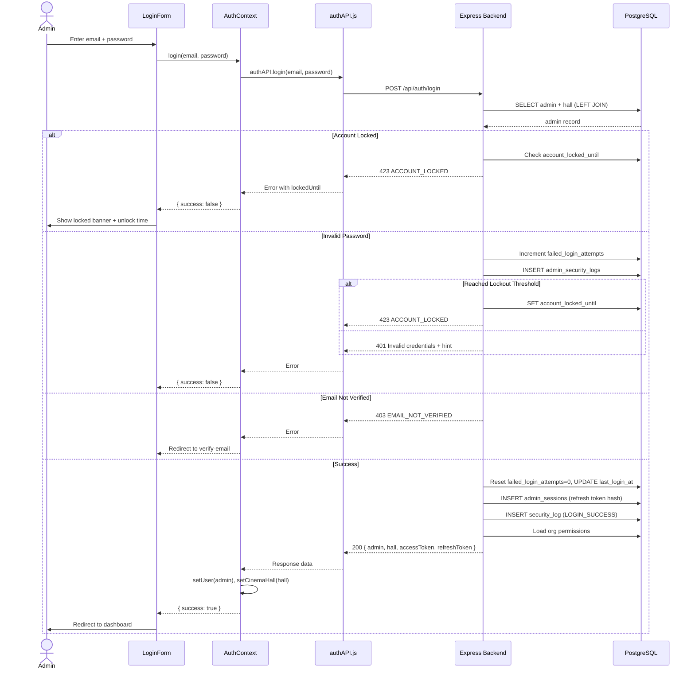
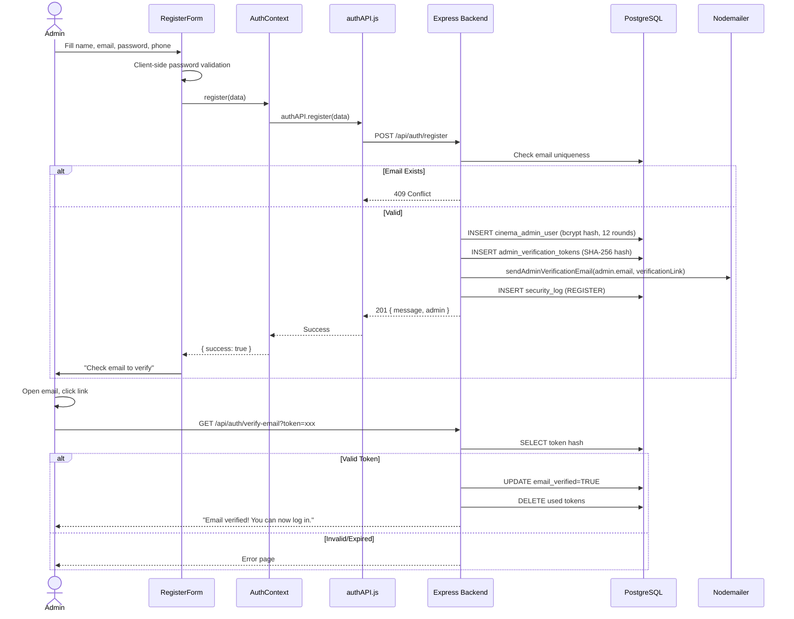
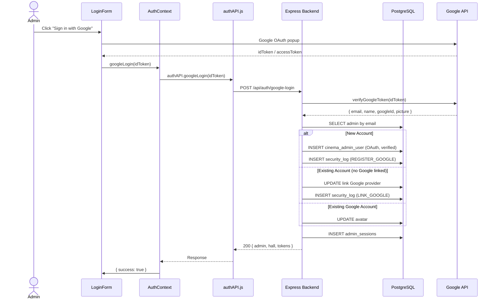
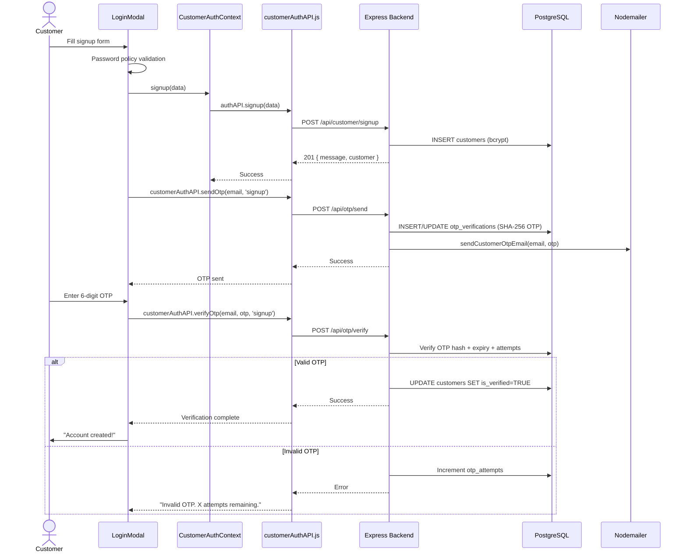
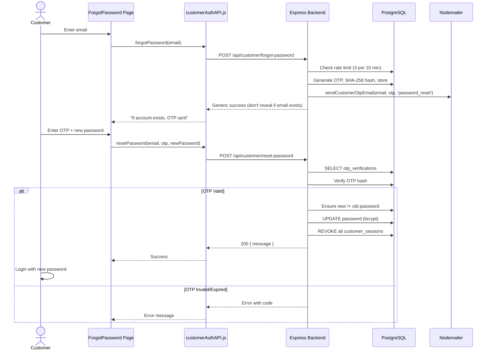
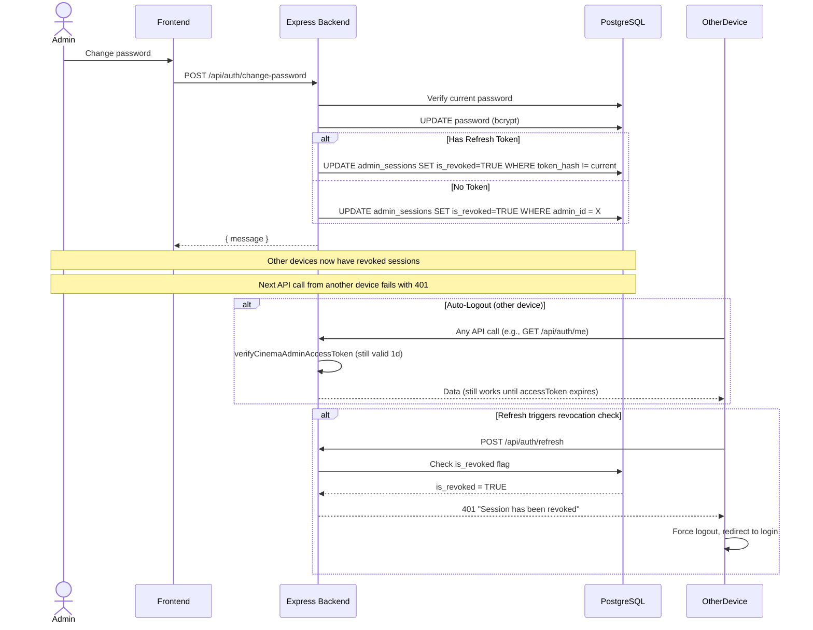

# Authentication - Workflows

## 1. Admin Login Flow

## 2. Admin Registration Flow

## 3. Admin OAuth Login Flow (Google)

## 4. Customer Signup with OTP Flow

## 5. Password Reset Flow (Customer)

## 6. Session Revocation Flow

