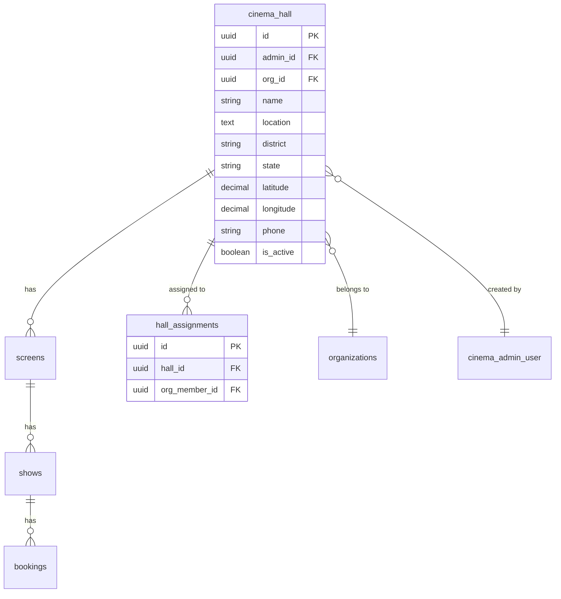

# Hall Management - Database

## Table: `cinema_hall`

| Column | Type | Constraints | Description |
|--------|------|-------------|-------------|
| id | UUID | PK DEFAULT gen_random_uuid() | Primary identifier |
| admin_id | UUID | FK → cinema_admin_user(id) | Creator/owner of the hall |
| org_id | UUID | FK → organizations(id) | Organization the hall belongs to |
| name | VARCHAR(255) | NOT NULL | Cinema hall name |
| location | TEXT | NOT NULL | Street address / location description |
| district | VARCHAR(255) | NOT NULL | District/city |
| state | VARCHAR(255) | NOT NULL | State |
| latitude | DECIMAL(10,7) | nullable | Latitude coordinate |
| longitude | DECIMAL(10,7) | nullable | Longitude coordinate |
| phone | VARCHAR(20) | nullable | Contact phone number |
| description | TEXT | nullable | Optional description |
| is_active | BOOLEAN | DEFAULT TRUE | Soft-delete / visibility toggle |
| created_at | TIMESTAMPTZ | DEFAULT now() | Creation timestamp |

**Indexes**: `id PK`, `org_id` (used in queries), `admin_id`

## Table: `hall_assignments`

| Column | Type | Constraints | Description |
|--------|------|-------------|-------------|
| id | UUID | PK | Primary identifier |
| hall_id | UUID | FK → cinema_hall(id) | Assigned hall |
| org_member_id | UUID | FK → organization_members(id) | Organization member |

**Purpose**: Grants non-owner/non-admin roles (e.g., staff) access to specific halls. The `getMyHalls` controller JOINs this table when the admin's role is not `owner` or `admin`.

## Entity Relationships



## Key Queries

### Role-based hall retrieval
```sql
-- Owner/Admin: all halls in org
SELECT id, name, location, district, state, latitude, longitude,
       phone, description, is_active, created_at, org_id
FROM cinema_hall
WHERE org_id = $1 AND is_active = TRUE
ORDER BY created_at ASC;

-- Staff/other: halls via assignments
SELECT ch.id, ch.name, ch.location, ch.district, ch.state, ch.latitude, ch.longitude,
       ch.phone, ch.description, ch.is_active, ch.created_at, ch.org_id
FROM cinema_hall ch
JOIN hall_assignments ha ON ha.hall_id = ch.id
JOIN organization_members om ON om.id = ha.org_member_id
WHERE om.admin_id = $1 AND ch.is_active = TRUE
ORDER BY ch.created_at ASC;
```

### Access check for update/delete
```sql
SELECT org_id, admin_id FROM cinema_hall WHERE id = $1;
```
Then checked against the admin's organization membership and role.

### Insert new hall
```sql
INSERT INTO cinema_hall
  (admin_id, org_id, name, location, district, state, latitude, longitude, phone, description)
VALUES ($1, $2, $3, $4, $5, $6, $7, $8, $9, $10)
RETURNING id, name, location, district, state, latitude, longitude,
          phone, description, is_active, created_at, org_id;
```

## CASCADE Delete Behavior
When a hall is deleted, the following foreign key constraints cascade:
- `screens.cinema_hall_id` → `cinema_hall.id` → screens deleted
- `shows.screen_id` → `screens.id` → shows deleted
- `bookings.show_id` → `shows.id` → bookings deleted
