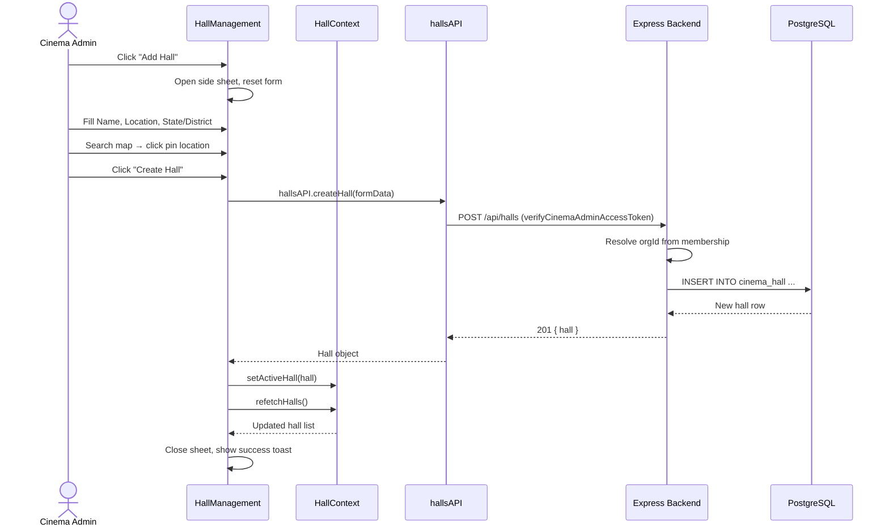
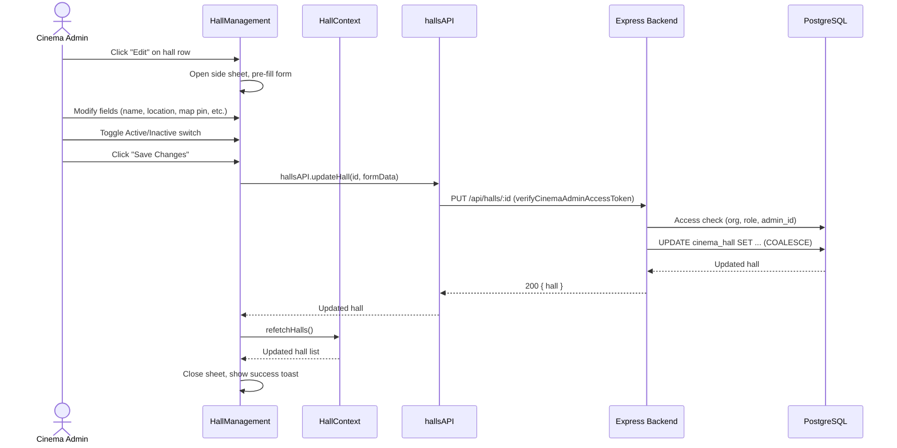
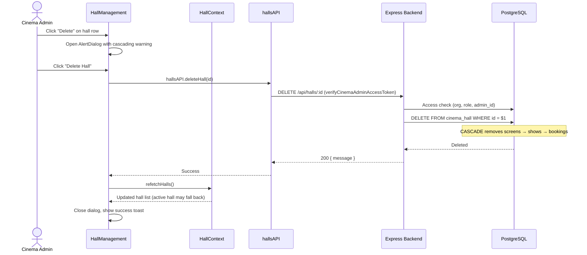
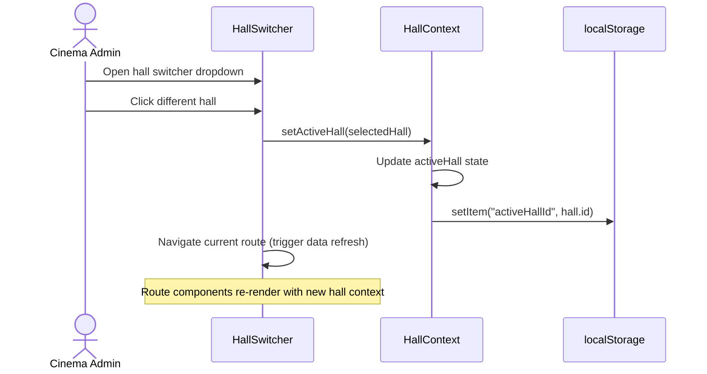
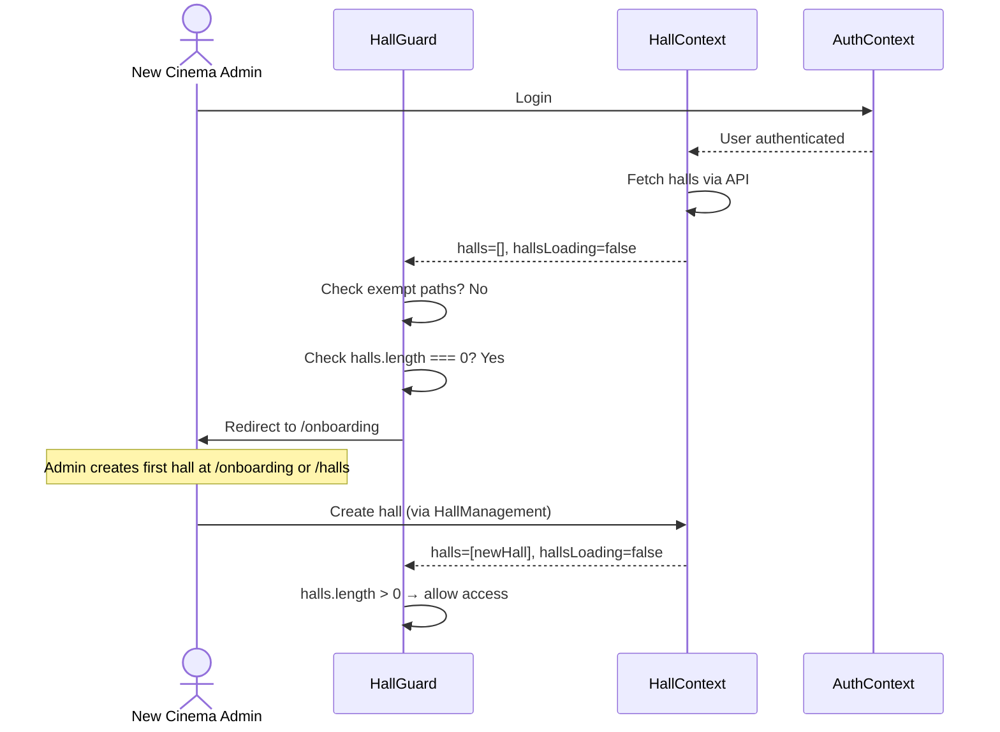

# Hall Management - Workflows

## 1. Create Hall

```mermaid
sequenceDiagram
    actor A as Cinema Admin
    participant H as HallManagement
    participant C as HallContext
    participant API as hallsAPI
    participant BE as Express Backend
    participant DB as PostgreSQL

    A->>H: Click "Add Hall"
    H->>H: Open side sheet, reset form
    A->>H: Fill Name, Location, State/District
    A->>H: Search map → click pin location
    A->>H: Click "Create Hall"
    H->>API: hallsAPI.createHall(formData)
    API->>BE: POST /api/halls (verifyCinemaAdminAccessToken)
    BE->>BE: Resolve orgId from membership
    BE->>DB: INSERT INTO cinema_hall ...
    DB-->>BE: New hall row
    BE-->>API: 201 { hall }
    API-->>H: Hall object
    H->>C: setActiveHall(hall)
    H->>C: refetchHalls()
    C-->>H: Updated hall list
    H->>H: Close sheet, show success toast
```

## 2. Edit Hall

```mermaid
sequenceDiagram
    actor A as Cinema Admin
    participant H as HallManagement
    participant C as HallContext
    participant API as hallsAPI
    participant BE as Express Backend
    participant DB as PostgreSQL

    A->>H: Click "Edit" on hall row
    H->>H: Open side sheet, pre-fill form
    A->>H: Modify fields (name, location, map pin, etc.)
    A->>H: Toggle Active/Inactive switch
    A->>H: Click "Save Changes"
    H->>API: hallsAPI.updateHall(id, formData)
    API->>BE: PUT /api/halls/:id (verifyCinemaAdminAccessToken)
    BE->>DB: Access check (org, role, admin_id)
    BE->>DB: UPDATE cinema_hall SET ... (COALESCE)
    DB-->>BE: Updated hall
    BE-->>API: 200 { hall }
    API-->>H: Updated hall
    H->>C: refetchHalls()
    C-->>H: Updated hall list
    H->>H: Close sheet, show success toast
```

## 3. Delete Hall (Cascading)

```mermaid
sequenceDiagram
    actor A as Cinema Admin
    participant H as HallManagement
    participant C as HallContext
    participant API as hallsAPI
    participant BE as Express Backend
    participant DB as PostgreSQL

    A->>H: Click "Delete" on hall row
    H->>H: Open AlertDialog with cascading warning
    A->>H: Click "Delete Hall"
    H->>API: hallsAPI.deleteHall(id)
    API->>BE: DELETE /api/halls/:id (verifyCinemaAdminAccessToken)
    BE->>DB: Access check (org, role, admin_id)
    BE->>DB: DELETE FROM cinema_hall WHERE id = $1
    Note over DB: CASCADE removes screens → shows → bookings
    DB-->>BE: Deleted
    BE-->>API: 200 { message }
    API-->>H: Success
    H->>C: refetchHalls()
    C-->>H: Updated hall list (active hall may fall back)
    H->>H: Close dialog, show success toast
```

## 4. Switch Active Hall

```mermaid
sequenceDiagram
    actor A as Cinema Admin
    participant S as HallSwitcher
    participant C as HallContext
    participant LS as localStorage

    A->>S: Open hall switcher dropdown
    A->>S: Click different hall
    S->>C: setActiveHall(selectedHall)
    C->>C: Update activeHall state
    C->>LS: setItem("activeHallId", hall.id)
    S->>S: Navigate current route (trigger data refresh)
    Note over S: Route components re-render with new hall context
```

## 5. First-Time Onboarding Flow

```mermaid
sequenceDiagram
    actor A as New Cinema Admin
    participant G as HallGuard
    participant C as HallContext
    participant AUTH as AuthContext

    A->>AUTH: Login
    AUTH-->>C: User authenticated
    C->>C: Fetch halls via API
    C-->>G: halls=[], hallsLoading=false
    G->>G: Check exempt paths? No
    G->>G: Check halls.length === 0? Yes
    G->>A: Redirect to /onboarding

    Note over A: Admin creates first hall at /onboarding or /halls

    A->>C: Create hall (via HallManagement)
    C-->>G: halls=[newHall], hallsLoading=false
    G->>G: halls.length > 0 → allow access
```
