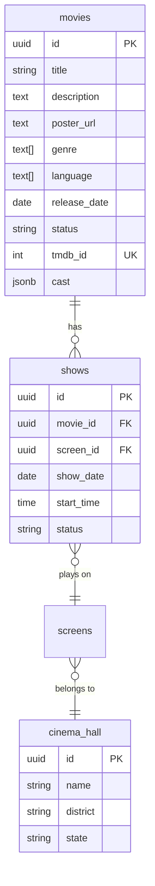

# Movie Management - Database

## Table: `movies`

| Column | Type | Constraints | Description |
|--------|------|-------------|-------------|
| id | UUID | PK DEFAULT gen_random_uuid() | Primary identifier |
| title | VARCHAR(255) | NOT NULL | Movie title |
| description | TEXT | nullable | Plot synopsis |
| poster_url | TEXT | nullable | Cloudinary/TMDB poster URL |
| trailer_url | TEXT | nullable | YouTube trailer URL |
| duration_mins | INTEGER | nullable | Runtime in minutes |
| genre | TEXT[] | DEFAULT '{}' | Array of genres (Action, Comedy, etc.) |
| language | TEXT[] | DEFAULT '{}' | Array of languages (English, Tamil, etc.) |
| release_date | DATE | nullable | Theatrical release date |
| status | VARCHAR(50) | DEFAULT 'upcoming' | `now_showing`, `upcoming`, `expired` |
| tmdb_id | INTEGER | nullable, UNIQUE | TMDB movie ID for sync |
| cast | JSONB | DEFAULT '[]' | Array of `{name, character, profile_path}` |
| vote_average | DECIMAL | nullable | TMDB rating (0-10) |
| vote_count | INTEGER | nullable | TMDB vote count |
| backdrop_path | TEXT | nullable | TMDB backdrop image URL |
| created_at | TIMESTAMPTZ | DEFAULT now() | |
| updated_at | TIMESTAMPTZ | DEFAULT now() | |

**Indexes**: `UNIQUE (tmdb_id)`, `id PK`

## Entity Relationships



## Key Queries

### Location-based movie lookup
```sql
SELECT DISTINCT m.*
FROM movies m
INNER JOIN shows sh ON m.id = sh.movie_id
INNER JOIN screens sc ON sh.screen_id = sc.id
INNER JOIN cinema_hall ch ON sc.cinema_hall_id = ch.id
WHERE ch.district = $1 AND ch.state = $2
  AND sh.status = 'booking_started'
  AND sh.show_date >= CURRENT_DATE
  AND m.status = 'now_showing'
```

### Genre/language array overlap filtering
```sql
-- Genre filter (movies matching ANY of the selected genres)
WHERE genre && $1::text[]
-- Language filter
WHERE language && $2::text[]
```

## Movie Status Values
- `now_showing` - Currently in theatres, active shows
- `upcoming` - Future release, scheduled
- `expired` - No longer showing
