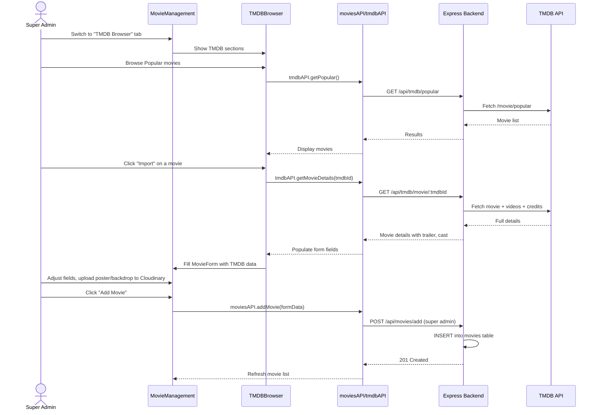
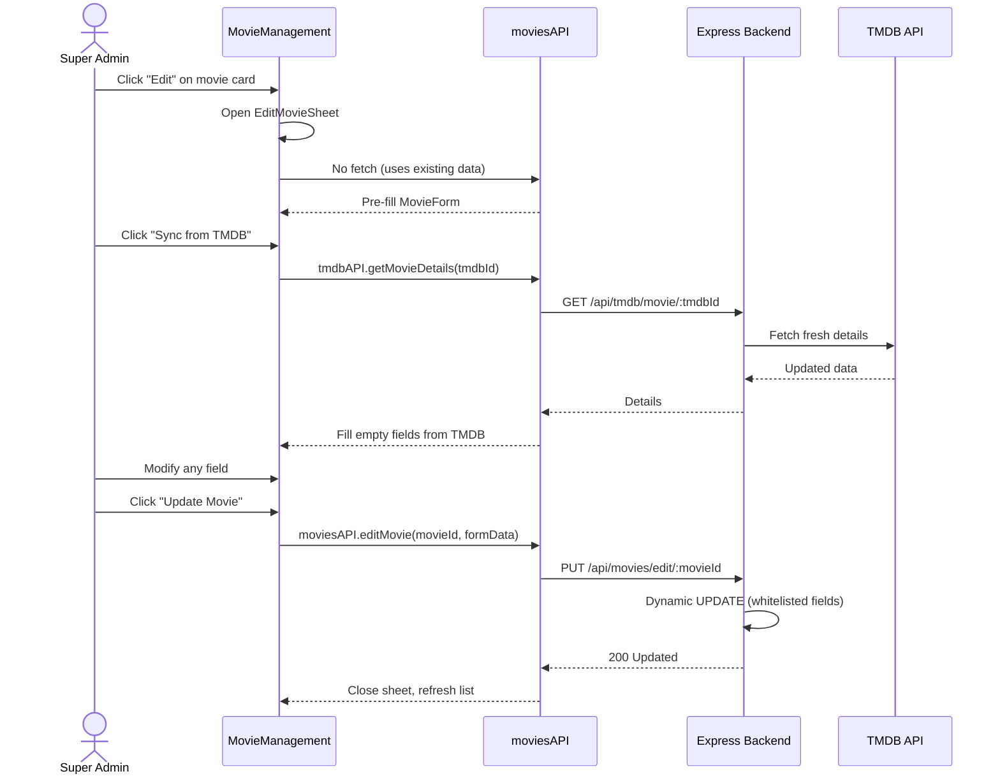
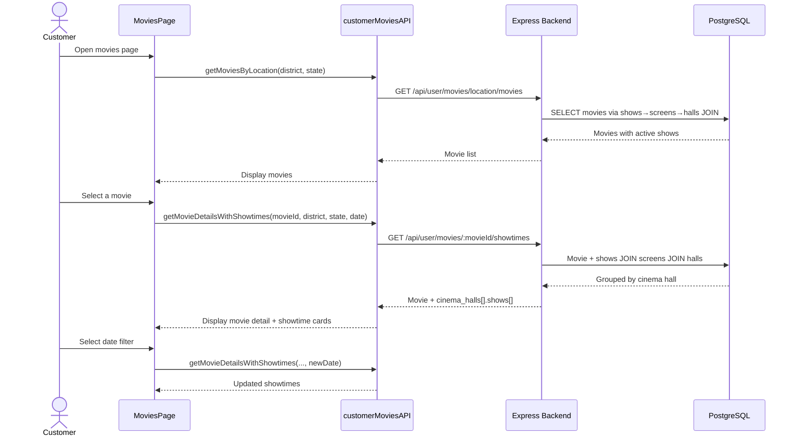

# Movie Management - Workflows

## 1. Add Movie via TMDB Import

```mermaid
sequenceDiagram
    actor A as Super Admin
    participant M as MovieManagement
    participant TB as TMDBBrowser
    participant API as moviesAPI/tmdbAPI
    participant BE as Express Backend
    participant TMDB as TMDB API
    
    A->>M: Switch to "TMDB Browser" tab
    M->>TB: Show TMDB sections
    A->>TB: Browse Popular movies
    TB->>API: tmdbAPI.getPopular()
    API->>BE: GET /api/tmdb/popular
    BE->>TMDB: Fetch /movie/popular
    TMDB-->>BE: Movie list
    BE-->>API: Results
    API-->>TB: Display movies
    
    A->>TB: Click "Import" on a movie
    TB->>API: tmdbAPI.getMovieDetails(tmdbId)
    API->>BE: GET /api/tmdb/movie/:tmdbId
    BE->>TMDB: Fetch movie + videos + credits
    TMDB-->>BE: Full details
    BE-->>API: Movie details with trailer, cast
    API-->>TB: Populate form fields
    
    TB->>M: Fill MovieForm with TMDB data
    A->>M: Adjust fields, upload poster/backdrop to Cloudinary
    A->>M: Click "Add Movie"
    M->>API: moviesAPI.addMovie(formData)
    API->>BE: POST /api/movies/add (super admin)
    BE->>BE: INSERT into movies table
    BE-->>API: 201 Created
    API-->>M: Refresh movie list
```

## 2. Edit Movie with TMDB Sync

```mermaid
sequenceDiagram
    actor A as Super Admin
    participant M as MovieManagement
    participant API as moviesAPI
    participant BE as Express Backend
    participant TMDB as TMDB API
    
    A->>M: Click "Edit" on movie card
    M->>M: Open EditMovieSheet
    M->>API: No fetch (uses existing data)
    API-->>M: Pre-fill MovieForm
    
    A->>M: Click "Sync from TMDB"
    M->>API: tmdbAPI.getMovieDetails(tmdbId)
    API->>BE: GET /api/tmdb/movie/:tmdbId
    BE->>TMDB: Fetch fresh details
    TMDB-->>BE: Updated data
    BE-->>API: Details
    API-->>M: Fill empty fields from TMDB
    
    A->>M: Modify any field
    A->>M: Click "Update Movie"
    M->>API: moviesAPI.editMovie(movieId, formData)
    API->>BE: PUT /api/movies/edit/:movieId
    BE->>BE: Dynamic UPDATE (whitelisted fields)
    BE-->>API: 200 Updated
    API-->>M: Close sheet, refresh list
```

## 3. Customer Browsing Flow

```mermaid
sequenceDiagram
    actor U as Customer
    participant MP as MoviesPage
    participant API as customerMoviesAPI
    participant BE as Express Backend
    participant DB as PostgreSQL
    
    U->>MP: Open movies page
    MP->>API: getMoviesByLocation(district, state)
    API->>BE: GET /api/user/movies/location/movies
    BE->>DB: SELECT movies via shows→screens→halls JOIN
    DB-->>BE: Movies with active shows
    BE-->>API: Movie list
    API-->>MP: Display movies
    
    U->>MP: Select a movie
    MP->>API: getMovieDetailsWithShowtimes(movieId, district, state, date)
    API->>BE: GET /api/user/movies/:movieId/showtimes
    BE->>DB: Movie + shows JOIN screens JOIN halls
    DB-->>BE: Grouped by cinema hall
    BE-->>API: Movie + cinema_halls[].shows[]
    API-->>MP: Display movie detail + showtime cards
    
    U->>MP: Select date filter
    MP->>API: getMovieDetailsWithShowtimes(..., newDate)
    API-->>MP: Updated showtimes
```
