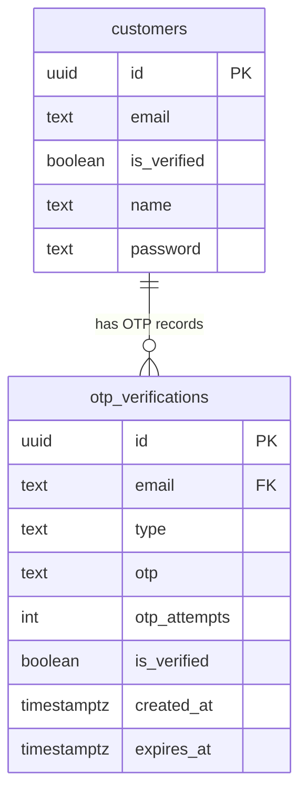

# Notifications & OTP - Database

## Table: `otp_verifications`

| Column | Type | Constraints | Description |
|--------|------|-------------|-------------|
| id | UUID | PK DEFAULT gen_random_uuid() | Primary identifier |
| email | TEXT | NOT NULL, FK → customers(email) ON DELETE CASCADE | Customer email |
| type | TEXT | NOT NULL DEFAULT 'signup' | OTP purpose: `'signup'` or `'password_reset'` |
| otp | TEXT | NOT NULL | SHA-256 hash of the OTP (never stores plaintext) |
| otp_attempts | INT | NOT NULL DEFAULT 0 | Incremented on each wrong guess; max 5 |
| is_verified | BOOLEAN | NOT NULL DEFAULT FALSE | Set to true on successful verification |
| created_at | TIMESTAMPTZ | DEFAULT now() | Record creation timestamp |
| expires_at | TIMESTAMPTZ | NOT NULL | OTP expiration (5 min after creation) |

**Constraints**:
- `UNIQUE (email, type)` — ensures only one active OTP per (email, type) pair; sendOtp uses `ON CONFLICT DO UPDATE` to replace
- `fk_customer_email` — cascades delete when customer is removed

**Indexes**: `id PK`, implicit unique index on `(email, type)`

## Related Tables

### `customers`
Used in OTP flow for email validation and account activation:
- `email` — referenced by `otp_verifications.email` FK
- `is_verified` — set to `true` when OTP verification succeeds for `signup` type

### `user_settings`
Admin notification preferences stored per admin:
- Section: `'notifications'`
- Value (JSONB):
  ```json
  {
    "email_toggle": true,
    "sms_toggle": false,
    "push_toggle": false,
    "events": {
      "booking_confirmed": ["email"],
      "booking_cancelled": ["email"],
      "daily_report": ["email"]
    }
  }
  ```

## Entity Relationships



## Key Queries

### Look up customer for OTP send
```sql
SELECT id, name, email FROM customers WHERE email = $1;
```

### Rate limit check (count recent OTPs)
```sql
SELECT COUNT(*) FROM otp_verifications
WHERE email = $1 AND type = $2 AND created_at > $3;
```

### Upsert OTP record
```sql
INSERT INTO otp_verifications (email, type, otp, is_verified, otp_attempts, created_at, expires_at)
VALUES ($1, $2, $3, false, 0, now(), $4)
ON CONFLICT (email, type) DO UPDATE
SET otp          = EXCLUDED.otp,
    is_verified  = false,
    otp_attempts = 0,
    created_at   = now(),
    expires_at   = EXCLUDED.expires_at;
```

### Fetch OTP record for verification
```sql
SELECT * FROM otp_verifications WHERE email = $1 AND type = $2;
```

### Increment wrong attempt counter
```sql
UPDATE otp_verifications SET otp_attempts = otp_attempts + 1 WHERE id = $1;
```

### Mark OTP as verified
```sql
UPDATE otp_verifications SET is_verified = true WHERE id = $1;
```

### Activate customer account (signup flow)
```sql
UPDATE customers SET is_verified = true WHERE email = $1;
```
