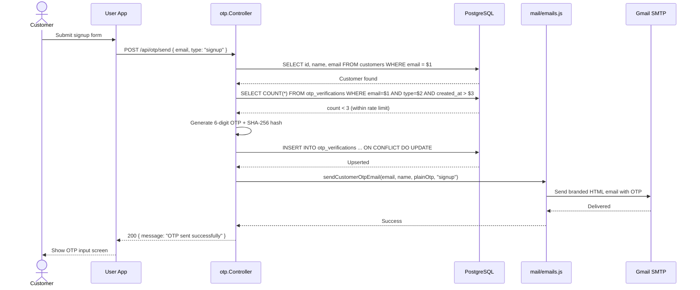
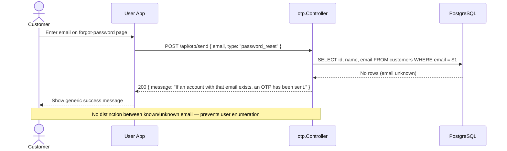
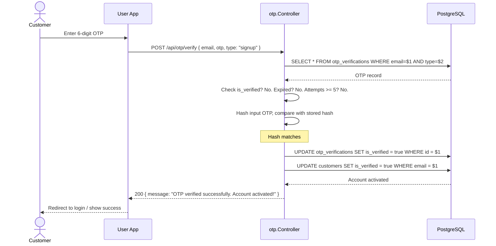
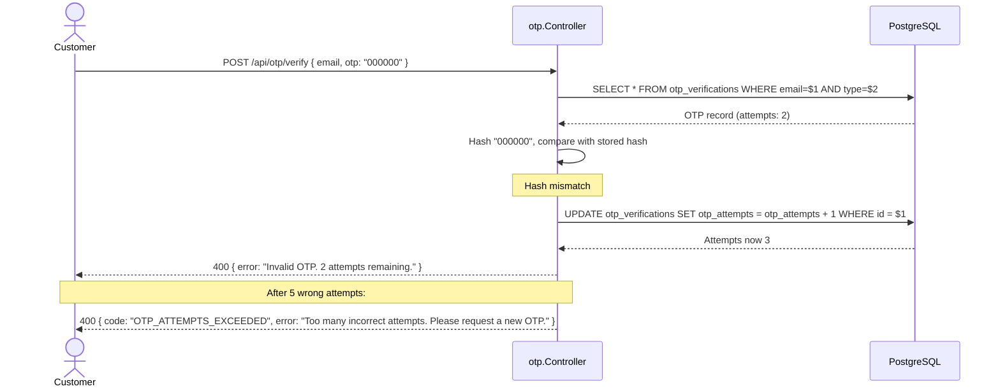
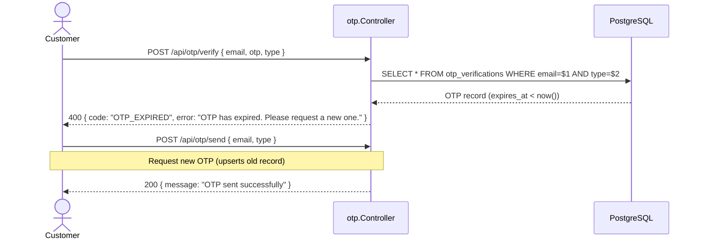
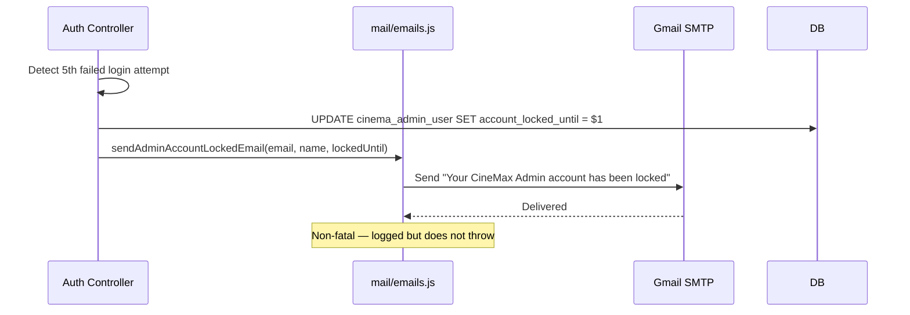
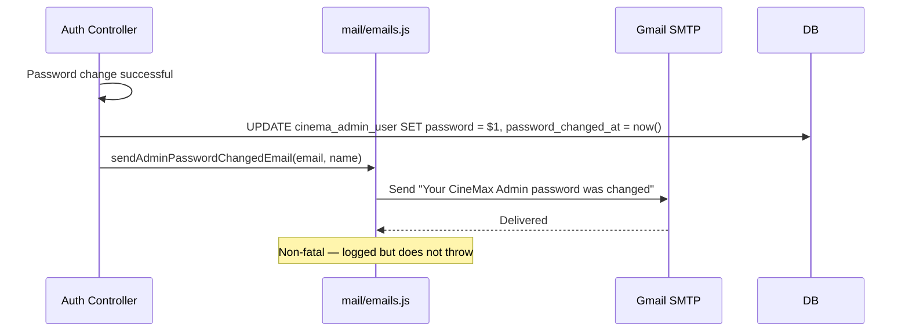

# Notifications & OTP - Workflows

## 1. Send OTP (Signup)

## 2. Send OTP (Password Reset — Enumeration Protection)

## 3. Verify OTP (Signup — Account Activation)

## 4. Verify OTP — Wrong Attempts

## 5. OTP Expired Flow

## 6. Admin Account Locked Email

## 7. Admin Password Changed Notification

