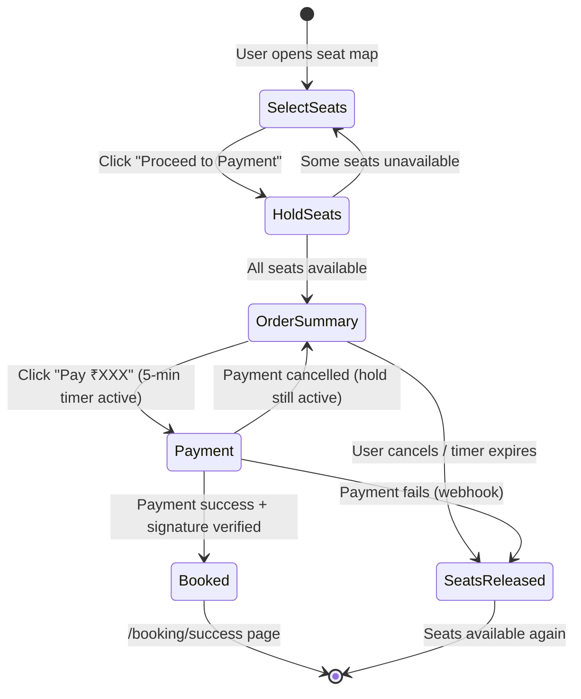
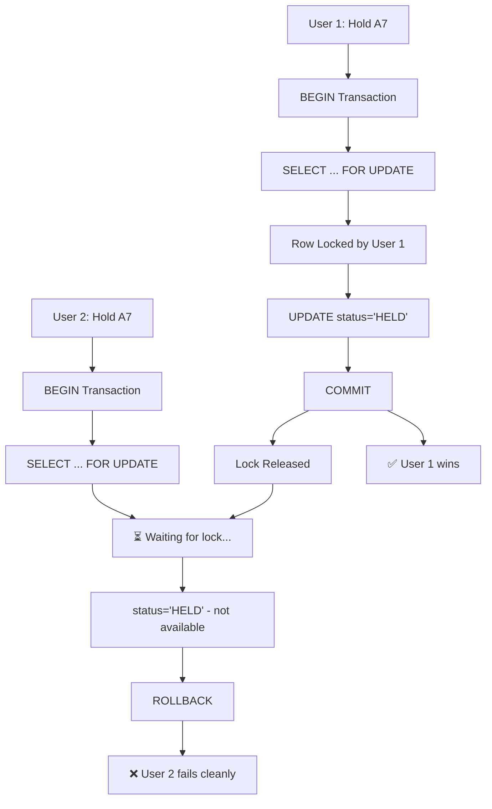
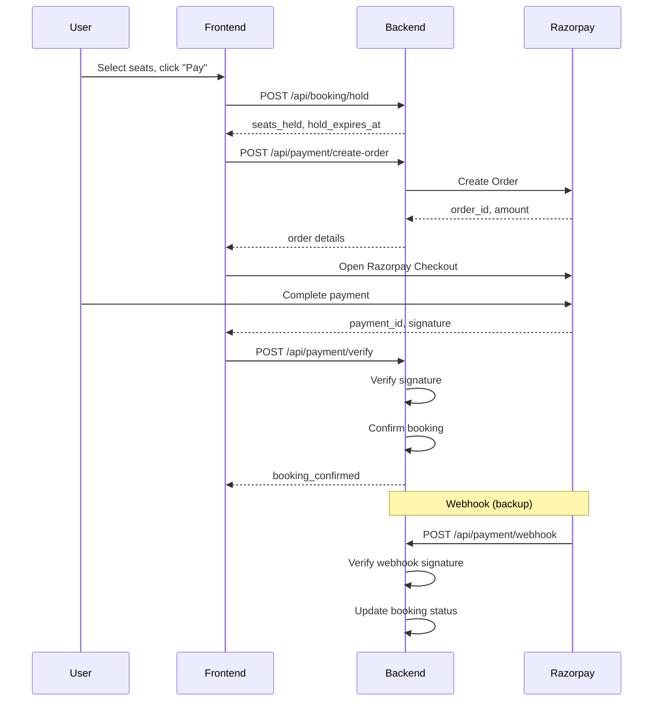
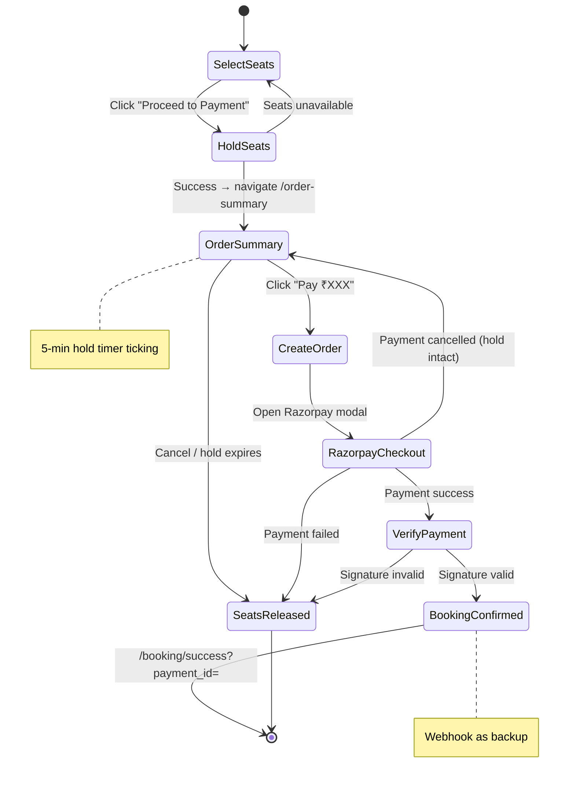
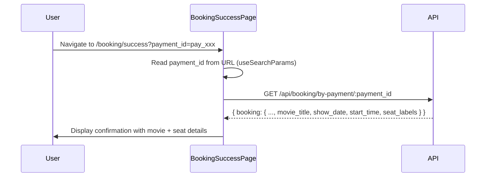

# Concurrency-Safe Seat Booking - Implementation Plan

## Problem Statement

The current `bookShow` function uses `INSERT...ON CONFLICT DO NOTHING` which is **not concurrency-safe**:

```javascript
// ❌ Current approach - RACE CONDITION EXISTS
const query = `INSERT INTO show_booked_seats (...) 
  ON CONFLICT (show_id, seat_id) DO NOTHING RETURNING *;`;
```

**Why this fails:** Two users can simultaneously check availability, both see `AVAILABLE`, both attempt insert, and due to timing, one might succeed inconsistently or both might fail unpredictably.

---

## Solution Architecture

```mermaid
sequenceDiagram
    participant User1
    participant User2
    participant API
    participant PostgreSQL

    User1->>API: Hold seat A7
    User2->>API: Hold seat A7

    API->>PostgreSQL: BEGIN; SELECT ... FOR UPDATE
    Note over PostgreSQL: Row locked by User1

    API->>PostgreSQL: UPDATE status='HELD' (User1)
    PostgreSQL-->>API: Success
    API->>API: COMMIT
    API-->>User1: ✅ Seat A7 held

    Note over PostgreSQL: User2's query now executes
    API->>PostgreSQL: SELECT ... FOR UPDATE (User2)
    PostgreSQL-->>API: status='HELD' (not AVAILABLE)
    API-->>User2: ❌ Seat A7 unavailable
```

---

## Core Principle

> **The database is the single source of truth and the arbiter of truth.**  
> The first request that acquires the row lock wins.

---

## Proposed Changes

### 1. Database Schema Changes

#### [MODIFY] [psql.sql](file:///d:/Users/Duraimurugan%20H/Git%20Cloned/My%20Projects/cinema-hall/cinema-hall-api/psql.sql)

**Current `show_booked_seats` table:**

```sql
status TEXT NOT NULL DEFAULT 'in_booking'
  CHECK (status IN ('in_booking', 'booked', 'reserved'))
```

**New schema:**

```sql
-- Drop and recreate show_booked_seats with proper schema
DROP TABLE IF EXISTS show_booked_seats;

CREATE TABLE show_booked_seats (
  id UUID PRIMARY KEY DEFAULT gen_random_uuid(),
  show_id UUID NOT NULL REFERENCES shows(id) ON DELETE CASCADE,
  seat_id TEXT NOT NULL,
  seat_label TEXT NOT NULL,
  row_label TEXT NOT NULL,
  column_number INT NOT NULL,

  -- ✅ Proper status lifecycle
  status TEXT NOT NULL DEFAULT 'AVAILABLE'
    CHECK (status IN ('AVAILABLE', 'HELD', 'BOOKED')),

  -- ✅ Track who holds the seat
  held_by UUID REFERENCES customers(id) ON DELETE SET NULL,

  -- ✅ Hold expiration
  hold_expires_at TIMESTAMPTZ,

  -- ✅ Booking timestamp
  booked_at TIMESTAMPTZ,

  created_at TIMESTAMPTZ DEFAULT now(),

  -- ✅ One seat per show
  UNIQUE (show_id, seat_id)
);

-- Index for fast expired hold queries
CREATE INDEX idx_show_booked_seats_expires
  ON show_booked_seats(status, hold_expires_at)
  WHERE status = 'HELD';
```

#### Migration SQL (for existing data)

```sql
-- Run this in production to migrate safely
ALTER TABLE show_booked_seats
  ADD COLUMN IF NOT EXISTS held_by UUID REFERENCES customers(id) ON DELETE SET NULL;

-- Update status enum (requires recreating constraint)
ALTER TABLE show_booked_seats DROP CONSTRAINT IF EXISTS show_booked_seats_status_check;
ALTER TABLE show_booked_seats
  ADD CONSTRAINT show_booked_seats_status_check
  CHECK (status IN ('AVAILABLE', 'HELD', 'BOOKED'));

-- Update existing data
UPDATE show_booked_seats
  SET status = 'BOOKED'
  WHERE status = 'booked';
UPDATE show_booked_seats
  SET status = 'HELD'
  WHERE status = 'in_booking';

-- Create index
CREATE INDEX IF NOT EXISTS idx_show_booked_seats_expires
  ON show_booked_seats(status, hold_expires_at)
  WHERE status = 'HELD';
```

---

### 2. Backend: New Booking Controller

#### [NEW] [booking.Controller.js](file:///d:/Users/Duraimurugan%20H/Git%20Cloned/My%20Projects/cinema-hall/cinema-hall-api/controllers/booking.Controller.js)

```javascript
import db from "../db.js";

const HOLD_DURATION_MINUTES = 5;

/**
 * ✅ HOLD SEATS - Atomic with row-level locking
 *
 * POST /api/booking/hold
 * Body: { show_id, seats: ["A1", "A2", "A3"] }
 * Auth: Customer required
 */
export const holdSeats = async (req, res) => {
  const { show_id, seats } = req.body;
  const customer_id = req.customer.id;

  if (!show_id || !seats?.length) {
    return res.status(400).json({ error: "show_id and seats are required" });
  }

  const client = await db.connect();

  try {
    await client.query("BEGIN");

    const holdExpiry = new Date(Date.now() + HOLD_DURATION_MINUTES * 60 * 1000);
    const results = [];

    for (const seat_id of seats) {
      // Step 1: Lock the row with FOR UPDATE
      const lockQuery = `
        SELECT status, held_by, hold_expires_at 
        FROM show_booked_seats 
        WHERE show_id = $1 AND seat_id = $2
        FOR UPDATE;
      `;
      const lockResult = await client.query(lockQuery, [show_id, seat_id]);

      if (lockResult.rowCount === 0) {
        // Seat doesn't exist in table yet - available
        // Insert as HELD
        const insertQuery = `
          INSERT INTO show_booked_seats 
            (show_id, seat_id, seat_label, row_label, column_number, status, held_by, hold_expires_at)
          VALUES ($1, $2, $2, '', 0, 'HELD', $3, $4)
          RETURNING *;
        `;
        await client.query(insertQuery, [
          show_id,
          seat_id,
          customer_id,
          holdExpiry,
        ]);
        results.push({ seat_id, status: "held", expires_at: holdExpiry });
      } else {
        const row = lockResult.rows[0];
        const now = new Date();

        // Check if seat is available
        const isAvailable =
          row.status === "AVAILABLE" ||
          (row.status === "HELD" && row.hold_expires_at < now);

        if (isAvailable) {
          // Update to HELD
          await client.query(
            `
            UPDATE show_booked_seats 
            SET status = 'HELD', held_by = $3, hold_expires_at = $4
            WHERE show_id = $1 AND seat_id = $2;
          `,
            [show_id, seat_id, customer_id, holdExpiry],
          );

          results.push({ seat_id, status: "held", expires_at: holdExpiry });
        } else {
          // Seat is taken
          results.push({
            seat_id,
            status: "unavailable",
            held_by: row.held_by,
          });
        }
      }
    }

    // If ANY seat failed, rollback everything
    const failedSeats = results.filter((r) => r.status === "unavailable");
    if (failedSeats.length > 0) {
      await client.query("ROLLBACK");
      return res.status(409).json({
        success: false,
        message: `${failedSeats.length} seat(s) are unavailable`,
        results,
      });
    }

    await client.query("COMMIT");

    return res.status(200).json({
      success: true,
      message: `${seats.length} seat(s) held successfully`,
      hold_expires_at: holdExpiry,
      results,
    });
  } catch (error) {
    await client.query("ROLLBACK");
    console.error("❌ Hold seats error:", error);
    return res.status(500).json({ error: "Failed to hold seats" });
  } finally {
    client.release();
  }
};

/**
 * ✅ CONFIRM BOOKING - Convert HELD to BOOKED
 *
 * POST /api/booking/confirm
 * Body: { show_id, seats: ["A1", "A2"], payment_info: {...} }
 * Auth: Customer required
 */
export const confirmBooking = async (req, res) => {
  const { show_id, seats, total_amount } = req.body;
  const customer_id = req.customer.id;
  const customer_email = req.customer.email;

  if (!show_id || !seats?.length) {
    return res.status(400).json({ error: "show_id and seats are required" });
  }

  const client = await db.connect();

  try {
    await client.query("BEGIN");

    const now = new Date();

    // Verify all seats are HELD by this customer and not expired
    for (const seat_id of seats) {
      const checkQuery = `
        SELECT status, held_by, hold_expires_at 
        FROM show_booked_seats 
        WHERE show_id = $1 AND seat_id = $2
        FOR UPDATE;
      `;
      const result = await client.query(checkQuery, [show_id, seat_id]);

      if (result.rowCount === 0) {
        throw new Error(`Seat ${seat_id} not found`);
      }

      const seat = result.rows[0];

      if (seat.status !== "HELD") {
        throw new Error(`Seat ${seat_id} is not held`);
      }

      if (seat.held_by !== customer_id) {
        throw new Error(`Seat ${seat_id} is held by another user`);
      }

      if (seat.hold_expires_at < now) {
        throw new Error(`Hold for seat ${seat_id} has expired`);
      }
    }

    // All validations passed - update to BOOKED
    await client.query(
      `
      UPDATE show_booked_seats 
      SET status = 'BOOKED', 
          booked_at = NOW(),
          hold_expires_at = NULL
      WHERE show_id = $1 AND seat_id = ANY($2::text[]) AND held_by = $3;
    `,
      [show_id, seats, customer_id],
    );

    // Create booking record
    const bookingResult = await client.query(
      `
      INSERT INTO bookings (show_id, user_email, seats, total_amount, status)
      VALUES ($1, $2, $3, $4, 'booked')
      RETURNING *;
    `,
      [show_id, customer_email, JSON.stringify(seats), total_amount || 0],
    );

    await client.query("COMMIT");

    return res.status(200).json({
      success: true,
      message: "Booking confirmed!",
      booking: bookingResult.rows[0],
    });
  } catch (error) {
    await client.query("ROLLBACK");
    console.error("❌ Confirm booking error:", error.message);
    return res.status(400).json({
      success: false,
      error: error.message,
    });
  } finally {
    client.release();
  }
};

/**
 * ✅ RELEASE SEATS - Customer voluntarily releases held seats
 *
 * POST /api/booking/release
 * Body: { show_id, seats: ["A1", "A2"] }
 * Auth: Customer required
 */
export const releaseSeats = async (req, res) => {
  const { show_id, seats } = req.body;
  const customer_id = req.customer.id;

  try {
    const result = await db.query(
      `
      DELETE FROM show_booked_seats 
      WHERE show_id = $1 
        AND seat_id = ANY($2::text[]) 
        AND held_by = $3 
        AND status = 'HELD'
      RETURNING seat_id;
    `,
      [show_id, seats, customer_id],
    );

    return res.status(200).json({
      success: true,
      released: result.rows.map((r) => r.seat_id),
    });
  } catch (error) {
    console.error("❌ Release seats error:", error);
    return res.status(500).json({ error: "Failed to release seats" });
  }
};

/**
 * ✅ CLEANUP EXPIRED HOLDS - Called by background job
 *
 * This should be called every 30-60 seconds
 */
export const cleanupExpiredHolds = async () => {
  try {
    const result = await db.query(`
      DELETE FROM show_booked_seats 
      WHERE status = 'HELD' 
        AND hold_expires_at < NOW()
      RETURNING show_id, seat_id;
    `);

    if (result.rowCount > 0) {
      console.log(`🧹 Cleaned up ${result.rowCount} expired holds`);
    }

    return result.rowCount;
  } catch (error) {
    console.error("❌ Cleanup error:", error);
    return 0;
  }
};
```

---

### 3. Backend: Booking Routes

#### [NEW] [booking.routes.js](file:///d:/Users/Duraimurugan%20H/Git%20Cloned/My%20Projects/cinema-hall/cinema-hall-api/routes/booking.routes.js)

```javascript
import express from "express";
import {
  holdSeats,
  confirmBooking,
  releaseSeats,
  getBookingByPaymentId,
} from "../controllers/booking.Controller.js";
import { verifyCustomer } from "../middleware/verifyCinemaAdmin.js";

const router = express.Router();

// All routes require customer authentication
router.post("/hold", verifyCustomer, holdSeats);
router.post("/confirm", verifyCustomer, confirmBooking);
router.post("/release", verifyCustomer, releaseSeats);
router.get("/by-payment/:payment_id", verifyCustomer, getBookingByPaymentId);

export default router;
```

---

### 4. Backend: Register Routes

#### [MODIFY] [server.js](file:///d:/Users/Duraimurugan%20H/Git%20Cloned/My%20Projects/cinema-hall/cinema-hall-api/server.js)

Add new booking routes:

```javascript
import bookingRoutes from "./routes/booking.routes.js";

// Add with other routes
app.use("/api/booking", bookingRoutes);
```

---

### 5. Backend: Background Cleanup Job

#### [MODIFY] [server.js](file:///d:/Users/Duraimurugan%20H/Git%20Cloned/My%20Projects/cinema-hall/cinema-hall-api/server.js)

Add cleanup scheduler:

```javascript
import { cleanupExpiredHolds } from "./controllers/booking.Controller.js";

// Run cleanup every 30 seconds
setInterval(async () => {
  await cleanupExpiredHolds();
}, 30000);
```

---

### 6. Frontend: API Service

#### [MODIFY] [api.js](file:///d:/Users/Duraimurugan%20H/Git%20Cloned/My%20Projects/cinema-hall/cinema-hall-users/src/services/api.js)

Add booking API:

```javascript
export const bookingAPI = {
  // Hold seats (start booking process)
  holdSeats: async (show_id, seats) => {
    const response = await fetch(`${API_BASE_URL}/api/booking/hold`, {
      method: "POST",
      headers: { "Content-Type": "application/json" },
      credentials: "include",
      body: JSON.stringify({ show_id, seats }),
    });
    if (!response.ok) throw await response.json();
    return response.json();
  },

  // Confirm booking (after payment)
  confirmBooking: async (show_id, seats, total_amount) => {
    const response = await fetch(`${API_BASE_URL}/api/booking/confirm`, {
      method: "POST",
      headers: { "Content-Type": "application/json" },
      credentials: "include",
      body: JSON.stringify({ show_id, seats, total_amount }),
    });
    if (!response.ok) throw await response.json();
    return response.json();
  },

  // Release seats (cancel)
  releaseSeats: async (show_id, seats) => {
    const response = await fetch(`${API_BASE_URL}/api/booking/release`, {
      method: "POST",
      headers: { "Content-Type": "application/json" },
      credentials: "include",
      body: JSON.stringify({ show_id, seats }),
    });
    if (!response.ok) throw await response.json();
    return response.json();
  },

  // Fetch booking by Razorpay payment_id (used by BookingSuccessPage)
  getBookingByPaymentId: async (paymentId) => {
    const response = await fetch(
      `${API_BASE_URL}/api/booking/by-payment/${paymentId}`,
      { credentials: "include" }
    );
    if (!response.ok) throw await response.json();
    return response.json();
  },
};
```

---

## User Flow Diagram



---

## Concurrency Handling



---

## Why This Works

| Strategy            | Purpose                    |
| ------------------- | -------------------------- |
| `FOR UPDATE`        | Pessimistic row-level lock |
| Transaction         | Atomic all-or-nothing      |
| `HELD` status       | Fairness + UX (5-min hold) |
| Background cleanup  | Releases stuck seats       |
| Customer validation | Only holder can confirm    |

---

## Verification Plan

### Automated Testing

**Concurrency Test Script:**

```bash
# Simulate 100 users trying to book same seat
for i in {1..100}; do
  curl -X POST http://localhost:5000/api/booking/hold \
    -H "Content-Type: application/json" \
    -d '{"show_id":"uuid","seats":["A7"]}' &
done
wait
# Only 1 should succeed, 99 should fail cleanly
```

### Manual Verification

1. Open two browser tabs
2. Select same seat in both
3. Click "Proceed" simultaneously
4. Verify only one succeeds
5. Verify other shows clear error

---

## Implementation Order

1. **Database migration** (schema changes)
2. **Booking controller** (holdSeats, confirmBooking, releaseSeats)
3. **Routes registration** (booking.routes.js + server.js)
4. **Background cleanup job** (setInterval in server.js)
5. **Frontend API service** (bookingAPI in api.js)
6. **Seat selection UI** (show timer, handle errors)
7. **Concurrency testing**

---

> [!IMPORTANT]
> The current `bookShow` function in `shows.Controller.js` should be **deprecated** or removed after implementing this system.

---

## Razorpay Payment Integration (Test Mode)

### Overview

Razorpay integration follows this flow:



---

### Environment Variables

```env
# Razorpay Test Mode Keys
RAZORPAY_KEY_ID=rzp_test_xxxxxxxxxx
RAZORPAY_KEY_SECRET=xxxxxxxxxxxxxxxxxx
RAZORPAY_WEBHOOK_SECRET=xxxxxxxxxxxxxxxxxx
```

> [!NOTE]
> Get test keys from: https://dashboard.razorpay.com/app/keys

---

### 7. Backend: Payment Controller

#### [NEW] [payment.Controller.js](file:///d:/Users/Duraimurugan%20H/Git%20Cloned/My%20Projects/cinema-hall/cinema-hall-api/controllers/payment.Controller.js)

```javascript
import Razorpay from "razorpay";
import crypto from "crypto";
import db from "../db.js";

const razorpay = new Razorpay({
  key_id: process.env.RAZORPAY_KEY_ID,
  key_secret: process.env.RAZORPAY_KEY_SECRET,
});

/**
 * ✅ CREATE ORDER - Generate Razorpay order before payment
 *
 * POST /api/payment/create-order
 * Body: { show_id, seats: ["A1", "A2"], amount }
 * Auth: Customer required
 */
export const createOrder = async (req, res) => {
  const { show_id, seats, amount } = req.body;
  const customer_id = req.customer.id;

  try {
    // Verify seats are still held by this customer
    const holdCheck = await db.query(
      `
      SELECT seat_id FROM show_booked_seats 
      WHERE show_id = $1 
        AND seat_id = ANY($2::text[]) 
        AND held_by = $3 
        AND status = 'HELD'
        AND hold_expires_at > NOW()
    `,
      [show_id, seats, customer_id],
    );

    if (holdCheck.rowCount !== seats.length) {
      return res.status(400).json({
        error: "Some seats are no longer held. Please select again.",
      });
    }

    // Create Razorpay order
    const order = await razorpay.orders.create({
      amount: amount * 100, // Razorpay expects paise
      currency: "INR",
      receipt: `booking_${show_id}_${Date.now()}`,
      notes: {
        show_id,
        customer_id,
        seats: seats.join(","),
      },
    });

    // Store order in DB for tracking
    await db.query(
      `
      INSERT INTO payment_orders 
        (order_id, show_id, customer_id, seats, amount, status)
      VALUES ($1, $2, $3, $4, $5, 'created')
    `,
      [order.id, show_id, customer_id, JSON.stringify(seats), amount],
    );

    return res.status(200).json({
      order_id: order.id,
      amount: order.amount,
      currency: order.currency,
      key_id: process.env.RAZORPAY_KEY_ID,
    });
  } catch (error) {
    console.error("❌ Create order error:", error);
    return res.status(500).json({ error: "Failed to create order" });
  }
};

/**
 * ✅ VERIFY PAYMENT - Called after Razorpay checkout success
 *
 * POST /api/payment/verify
 * Body: { razorpay_order_id, razorpay_payment_id, razorpay_signature }
 * Auth: Customer required
 */
export const verifyPayment = async (req, res) => {
  const { razorpay_order_id, razorpay_payment_id, razorpay_signature } =
    req.body;
  const customer_id = req.customer.id;

  try {
    // Step 1: Verify signature
    const body = razorpay_order_id + "|" + razorpay_payment_id;
    const expectedSignature = crypto
      .createHmac("sha256", process.env.RAZORPAY_KEY_SECRET)
      .update(body)
      .digest("hex");

    if (expectedSignature !== razorpay_signature) {
      return res.status(400).json({ error: "Invalid payment signature" });
    }

    // Step 2: Get order details from DB
    const orderResult = await db.query(
      `
      SELECT * FROM payment_orders WHERE order_id = $1
    `,
      [razorpay_order_id],
    );

    if (orderResult.rowCount === 0) {
      return res.status(404).json({ error: "Order not found" });
    }

    const order = orderResult.rows[0];
    const seats = JSON.parse(order.seats);

    // Step 3: Confirm booking (atomic)
    const client = await db.connect();
    try {
      await client.query("BEGIN");

      // Update seats to BOOKED
      await client.query(
        `
        UPDATE show_booked_seats 
        SET status = 'BOOKED', booked_at = NOW(), hold_expires_at = NULL
        WHERE show_id = $1 AND seat_id = ANY($2::text[]) AND held_by = $3
      `,
        [order.show_id, seats, customer_id],
      );

      // Create booking record
      const bookingResult = await client.query(
        `
        INSERT INTO bookings 
          (show_id, user_email, seats, total_amount, status, payment_id)
        VALUES ($1, $2, $3, $4, 'booked', $5)
        RETURNING *
      `,
        [
          order.show_id,
          req.customer.email,
          order.seats,
          order.amount,
          razorpay_payment_id,
        ],
      );

      // Update payment order status
      await client.query(
        `
        UPDATE payment_orders 
        SET status = 'paid', payment_id = $2, updated_at = NOW()
        WHERE order_id = $1
      `,
        [razorpay_order_id, razorpay_payment_id],
      );

      await client.query("COMMIT");

      return res.status(200).json({
        success: true,
        message: "Payment verified and booking confirmed!",
        booking: bookingResult.rows[0],
      });
    } catch (error) {
      await client.query("ROLLBACK");
      throw error;
    } finally {
      client.release();
    }
  } catch (error) {
    console.error("❌ Verify payment error:", error);
    return res.status(500).json({ error: "Payment verification failed" });
  }
};

/**
 * ✅ WEBHOOK HANDLER - Razorpay sends events here
 *
 * POST /api/payment/webhook
 * No auth - verified by signature
 */
export const handleWebhook = async (req, res) => {
  const webhookSecret = process.env.RAZORPAY_WEBHOOK_SECRET;
  const signature = req.headers["x-razorpay-signature"];

  // Step 1: Verify webhook signature
  const expectedSignature = crypto
    .createHmac("sha256", webhookSecret)
    .update(JSON.stringify(req.body))
    .digest("hex");

  if (expectedSignature !== signature) {
    console.error("❌ Invalid webhook signature");
    return res.status(400).json({ error: "Invalid signature" });
  }

  const event = req.body.event;
  const payload = req.body.payload;

  console.log(`📥 Webhook received: ${event}`);

  try {
    switch (event) {
      case "payment.captured":
        await handlePaymentCaptured(payload.payment.entity);
        break;

      case "payment.failed":
        await handlePaymentFailed(payload.payment.entity);
        break;

      case "order.paid":
        // Order fully paid - backup confirmation
        await handleOrderPaid(payload.order.entity);
        break;

      default:
        console.log(`Unhandled event: ${event}`);
    }

    return res.status(200).json({ received: true });
  } catch (error) {
    console.error("❌ Webhook processing error:", error);
    return res.status(500).json({ error: "Webhook processing failed" });
  }
};

// Helper: Handle successful payment
async function handlePaymentCaptured(payment) {
  const orderId = payment.order_id;

  // Check if already processed
  const existing = await db.query(
    `
    SELECT status FROM payment_orders WHERE order_id = $1
  `,
    [orderId],
  );

  if (existing.rows[0]?.status === "paid") {
    console.log(`Order ${orderId} already processed`);
    return;
  }

  // Get order and confirm booking
  const orderResult = await db.query(
    `
    SELECT * FROM payment_orders WHERE order_id = $1
  `,
    [orderId],
  );

  if (orderResult.rowCount === 0) return;

  const order = orderResult.rows[0];
  const seats = JSON.parse(order.seats);

  const client = await db.connect();
  try {
    await client.query("BEGIN");

    await client.query(
      `
      UPDATE show_booked_seats 
      SET status = 'BOOKED', booked_at = NOW(), hold_expires_at = NULL
      WHERE show_id = $1 AND seat_id = ANY($2::text[])
    `,
      [order.show_id, seats],
    );

    await client.query(
      `
      UPDATE payment_orders 
      SET status = 'paid', payment_id = $2, updated_at = NOW()
      WHERE order_id = $1
    `,
      [orderId, payment.id],
    );

    await client.query("COMMIT");
    console.log(`✅ Webhook: Order ${orderId} confirmed via webhook`);
  } catch (error) {
    await client.query("ROLLBACK");
    throw error;
  } finally {
    client.release();
  }
}

// Helper: Handle failed payment
async function handlePaymentFailed(payment) {
  const orderId = payment.order_id;

  await db.query(
    `
    UPDATE payment_orders 
    SET status = 'failed', updated_at = NOW()
    WHERE order_id = $1
  `,
    [orderId],
  );

  // Release held seats
  const orderResult = await db.query(
    `
    SELECT show_id, seats FROM payment_orders WHERE order_id = $1
  `,
    [orderId],
  );

  if (orderResult.rowCount > 0) {
    const order = orderResult.rows[0];
    const seats = JSON.parse(order.seats);

    await db.query(
      `
      DELETE FROM show_booked_seats 
      WHERE show_id = $1 AND seat_id = ANY($2::text[]) AND status = 'HELD'
    `,
      [order.show_id, seats],
    );

    console.log(`🔓 Webhook: Released seats for failed order ${orderId}`);
  }
}

// Helper: Handle order paid (backup)
async function handleOrderPaid(order) {
  // Same as handlePaymentCaptured - acts as backup
  console.log(`📦 Order ${order.id} marked as paid`);
}
```

---

### 8. Database: Payment Orders Table

#### [NEW] Migration SQL

```sql
-- Payment orders tracking table
CREATE TABLE payment_orders (
  id UUID PRIMARY KEY DEFAULT gen_random_uuid(),
  order_id TEXT UNIQUE NOT NULL,  -- Razorpay order_id
  show_id UUID REFERENCES shows(id) ON DELETE CASCADE,
  customer_id UUID REFERENCES customers(id) ON DELETE CASCADE,
  seats JSONB NOT NULL,
  amount NUMERIC(10, 2) NOT NULL,
  status TEXT NOT NULL DEFAULT 'created'
    CHECK (status IN ('created', 'paid', 'failed', 'refunded')),
  payment_id TEXT,  -- Razorpay payment_id (after success)
  created_at TIMESTAMPTZ DEFAULT now(),
  updated_at TIMESTAMPTZ DEFAULT now()
);

-- Add payment_id to bookings table
ALTER TABLE bookings ADD COLUMN IF NOT EXISTS payment_id TEXT;

-- Index for order lookup
CREATE INDEX idx_payment_orders_order_id ON payment_orders(order_id);
```

---

### 9. Backend: Payment Routes

#### [NEW] [payment.routes.js](file:///d:/Users/Duraimurugan%20H/Git%20Cloned/My%20Projects/cinema-hall/cinema-hall-api/routes/payment.routes.js)

```javascript
import express from "express";
import {
  createOrder,
  verifyPayment,
  handleWebhook,
} from "../controllers/payment.Controller.js";
import { verifyCustomer } from "../middleware/verifyCustomer.js";

const router = express.Router();

// Customer routes (auth required)
router.post("/create-order", verifyCustomer, createOrder);
router.post("/verify", verifyCustomer, verifyPayment);

// Webhook route (no auth - verified by signature)
// IMPORTANT: Use raw body parser for webhooks
router.post(
  "/webhook",
  express.raw({ type: "application/json" }),
  handleWebhook,
);

export default router;
```

---

### 10. Backend: Register Payment Routes

#### [MODIFY] [server.js](file:///d:/Users/Duraimurugan%20H/Git%20Cloned/My%20Projects/cinema-hall/cinema-hall-api/server.js)

```javascript
import paymentRoutes from "./routes/payment.routes.js";

// IMPORTANT: Webhook needs raw body, register BEFORE json parser
app.use("/api/payment/webhook", express.raw({ type: "application/json" }));

// Other routes with JSON parser
app.use("/api/payment", paymentRoutes);
```

---

### 11. Frontend: Razorpay Checkout Integration

#### [MODIFY] [api.js](file:///d:/Users/Duraimurugan%20H/Git%20Cloned/My%20Projects/cinema-hall/cinema-hall-users/src/services/api.js)

```javascript
export const paymentAPI = {
  // Create Razorpay order
  createOrder: async (show_id, seats, amount) => {
    const response = await fetch(`${API_BASE_URL}/api/payment/create-order`, {
      method: "POST",
      headers: { "Content-Type": "application/json" },
      credentials: "include",
      body: JSON.stringify({ show_id, seats, amount }),
    });
    if (!response.ok) throw await response.json();
    return response.json();
  },

  // Verify payment after Razorpay checkout
  verifyPayment: async (paymentData) => {
    const response = await fetch(`${API_BASE_URL}/api/payment/verify`, {
      method: "POST",
      headers: { "Content-Type": "application/json" },
      credentials: "include",
      body: JSON.stringify(paymentData),
    });
    if (!response.ok) throw await response.json();
    return response.json();
  },
};
```

---

### 12. Frontend: Payment Component

#### [NEW] Payment Hook Usage

```jsx
// useRazorpayPayment.jsx
import { paymentAPI } from "../services/api";

export const useRazorpayPayment = () => {
  const initiatePayment = async ({ show_id, seats, amount, customer }) => {
    // 1. Create order on backend
    const order = await paymentAPI.createOrder(show_id, seats, amount);

    // 2. Open Razorpay checkout
    return new Promise((resolve, reject) => {
      const options = {
        key: order.key_id,
        amount: order.amount,
        currency: order.currency,
        order_id: order.order_id,
        name: "Cinema Hall",
        description: `Booking for ${seats.length} seat(s)`,
        prefill: {
          name: customer.name,
          email: customer.email,
          contact: customer.phone,
        },
        theme: {
          color: "#6366f1",
        },
        handler: async (response) => {
          try {
            // 3. Verify payment on backend
            const result = await paymentAPI.verifyPayment({
              razorpay_order_id: response.razorpay_order_id,
              razorpay_payment_id: response.razorpay_payment_id,
              razorpay_signature: response.razorpay_signature,
            });
            // Navigate with only payment_id — BookingSuccessPage fetches details via API
            navigate(
              `/booking/success?payment_id=${result.booking.payment_id}`
            );
            resolve(result);
          } catch (error) {
            reject(error);
          }
        },
        modal: {
          ondismiss: () => reject(new Error("Payment cancelled")),
        },
      };

      const rzp = new window.Razorpay(options);
      rzp.open();
    });
  };

  return { initiatePayment };
};
```

---

### 13. Frontend: Add Razorpay Script

#### [MODIFY] index.html

```html
<!-- Add in <head> -->
<script src="https://checkout.razorpay.com/v1/checkout.js"></script>
```

---

## Complete Payment Flow



---

## Webhook Configuration

### Razorpay Dashboard Setup

1. Go to **Settings → Webhooks**
2. Add new webhook URL: `https://your-domain.com/api/payment/webhook`
3. Select events:
   - `payment.captured`
   - `payment.failed`
   - `order.paid`
4. Copy webhook secret to `.env`

### Testing Webhooks Locally

Use ngrok to expose localhost:

```bash
ngrok http 5000
# Use ngrok URL in Razorpay dashboard
```

---

## Test Cards (Razorpay Test Mode)

| Card Number           | Result  |
| --------------------- | ------- |
| `4111 1111 1111 1111` | Success |
| `5267 3181 8797 5449` | Success |
| `4000 0000 0000 0002` | Failure |

**CVV**: Any 3 digits  
**Expiry**: Any future date  
**OTP**: Use "1234" for testing

Test UPI (Optional)

UPI ID: success@razorpay → Success
UPI ID: failure@razorpay → Failure

---

## Updated Implementation Order

1. **Database migration** (schema + payment_orders table)
2. **Install Razorpay** (`npm install razorpay`)
3. **Payment controller** (createOrder, verifyPayment, handleWebhook)
4. **Payment routes** (with raw body parser for webhook)
5. **Update server.js** (register routes, cleanup job)
6. **Frontend API** (paymentAPI service)
7. **Razorpay checkout** (useRazorpayPayment hook)
8. **Seat selection UI** (timer, payment button)
9. **Configure webhook** in Razorpay dashboard
10. **Test with Razorpay test cards**

---

## Booking Success Page

After payment, the user is navigated to `/booking/success?payment_id=pay_xxx`.

### Flow



### Why query param instead of location.state?

| Approach | Pros | Cons |
|----------|------|------|
| `location.state` (old) | Simple | Lost on page refresh, not shareable |
| `?payment_id=` (new) | Survives refresh, shareable URL | Requires API call |

### Data displayed

- Movie title and show date/time
- Booking ID (first 8 chars of UUID)
- Booking status badge
- Seat labels (e.g. "A1", "B2") derived from `screens.layout`
- Total amount
- Payment ID
- **QR code** — `QRCodeSVG` (120×120) encoding the full booking UUID, rendered inside the ticket card (`ticketRef`). Wrapped in `bg-white p-2 rounded` for dark mode compatibility. Included in the downloaded JPEG since it sits inside `ticketRef`

### Download Ticket

The "Download Ticket" button captures `ticketRef` (the entire booking card including the QR code) as a JPEG via `html-to-image`. The dark class is temporarily removed during capture to ensure correct light-mode colors. Downloads as `ticket-<id8>.jpg`.

### Seat Label Derivation

Seat labels are **not** stored in the bookings table — they are computed at query time from the screen layout:

```sql
ARRAY(
  SELECT (seat_data->>'row') || (seat_data->>'column')
  FROM jsonb_array_elements(sc.layout->'seats') AS seat_data
  WHERE seat_data->>'id' = ANY(b.seats)
) AS seat_labels
```

---

## Security Checklist

✅ **Signature Verification** - All payments verified with HMAC-SHA256  
✅ **Webhook Signature** - Separate webhook secret verification  
✅ **Atomic Transactions** - Booking only after payment verified  
✅ **Hold Validation** - Check seats still held before creating order  
✅ **Idempotency** - Webhook won't double-process  
✅ **Raw Body Parser** - Required for webhook signature verification
