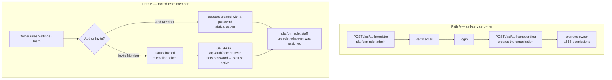
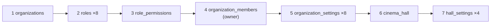
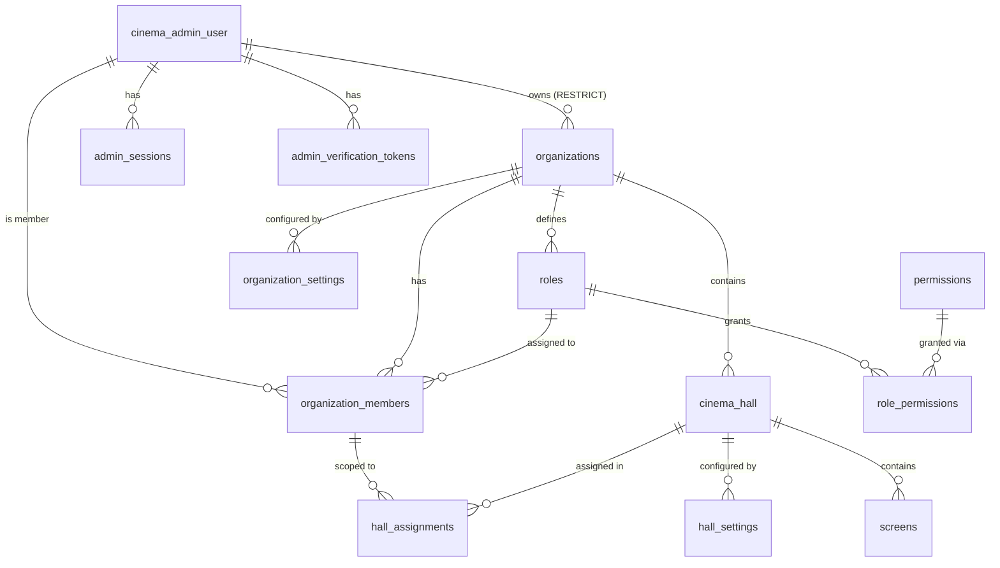

# Registration, Onboarding & Tenancy — Complete Flow

How an account comes into existence, how it acquires an organization, and how every table
involved relates to the others.

**Scope:** `cinema_admin_user`, `organizations`, `roles`, `permissions`, `role_permissions`,
`organization_members`, `hall_assignments`, `cinema_hall`, `organization_settings`,
`hall_settings`, `admin_verification_tokens`, `admin_sessions`.

Customer-side tables (`customers`, `bookings`, `customer_sessions`) are a separate flow and
are not covered here.

---

## 1. The single most important distinction

There are **two independent role systems**. Confusing them is the source of most bugs in
this area.

| | Platform role | Organization role |
|---|---|---|
| Column | `cinema_admin_user.role` | `roles.key`, via `organization_members.role_id` |
| Values | `superAdmin`, `admin`, `staff` | `owner`, `admin`, `manager`, `sales`, `finance`, `marketing`, `ticket_operator`, `auditor`, + custom |
| Scope | Global to the whole platform | Scoped to one organization |
| Grants permissions? | **No** — except `superAdmin`, which bypasses every check | **Yes** — this is what `requirePermission` reads |
| In the JWT as | `role` | `roleKey` |

A user can be platform `staff` and organization `owner` at the same time — those describe
different things. The one rule that ties them together:

> **Only `admin` and `superAdmin` accounts own organizations. `staff` accounts exist purely
> as members of someone else's organization.**

Enforced in `completeOnboarding` (rejects platform `staff`) and in the `db_setup.sql`
backfill. Audit it any time with `cinema-hall-api/database/audit_org_ownership.sql`.

---

## 2. Two ways an account is born



Path B accounts **never** call onboarding — they join an organization that already exists.
They never own one.

---

## 3. Path A — self-service registration

### 3.1 Register — `POST /api/auth/register`

`registerCinemaAdmin` in `controllers/auth.Controller.js`.

| Step | Table | What is written |
|---|---|---|
| 1 | — | Validates name/email/password/phone; password policy via `utils/passwordPolicy.js` |
| 2 | `cinema_admin_user` | Rejects duplicate email with `409` |
| 3 | `cinema_admin_user` | `INSERT` with `email_verified = FALSE`, bcrypt password, platform role defaulting to `admin` |
| 4 | `admin_verification_tokens` | `INSERT` the **SHA-256 hash** of the token, 24h expiry |
| 5 | — | Emails the raw token as a link |

The raw token is never stored. `verifyAdminEmail` hashes the incoming token and looks up the
hash — a database leak cannot yield a usable verification link.

At this point the account has **no organization**. Login is blocked until the email is verified.

### 3.2 Verify email — `GET /api/auth/verify-email?token=…`

Single transaction: `UPDATE cinema_admin_user SET email_verified = TRUE, email_verified_at = now()`,
then `DELETE FROM admin_verification_tokens WHERE admin_id = $1` — tokens are single-use.

Distinct error codes so the UI can offer a resend: `INVALID_TOKEN`, `TOKEN_EXPIRED`.

### 3.3 Login — `POST /api/auth/login`

`loginCinemaAdmin` →

1. Password check, lockout counters (`failed_login_attempts`, `account_locked_until`).
2. `resolveOrgContext(adminId)` — resolves `{ orgId, roleKey, permissionsVersion }` (§6).
3. `resolveLoginPermissions(adminId, orgId)` — the flat permission-key array for the client.
4. `resolveDefaultHall(adminId, orgId)` — a hall the user can actually reach (§6.2).
5. `generateTokenAndSetCookie` — signs the JWT, sets HttpOnly cookies, and writes a row to
   `admin_sessions` holding the **hash** of the refresh token so sessions can be revoked.

JWT payload:

```js
{ id, email, name, role, orgId, roleKey, permissionsVersion }
```

Access token 1 day, refresh token 30 days. **Permissions are not in the token** — they are
loaded server-side per request and sent to the client separately in the response body.

A freshly registered user logs in successfully but with `orgId: null`, and the frontend
routes them to `/onboarding`.

---

## 4. Onboarding — `POST /api/auth/onboarding`

`completeOnboarding`. **One transaction**: it either all lands or none of it does.

### 4.1 Guards (before the transaction opens)

| Condition | Response |
|---|---|
| Missing `orgName`, or hall name/location/district/state | `400` |
| `req.admin.role === 'staff'` | `403` — staff never create organizations |
| Already an active member of an org someone else owns | `403` — you already belong somewhere |
| Already owns an active org | Falls through and **reuses** it, so re-running is idempotent |

### 4.2 What gets written, in order



| # | Table | Detail |
|---|---|---|
| 1 | `organizations` | Slug = slugified name + first 8 chars of the admin id. `owner_id` = the caller |
| 2 | `roles` | All 8 system roles, `is_system = TRUE`, `ON CONFLICT (org_id, key) DO NOTHING` |
| 3 | `role_permissions` | Per-role grants from the global `permissions` catalog (§5.2) |
| 4 | `organization_members` | The caller, `role_id` = `owner`, `status = 'active'` |
| 5 | `organization_settings` | 8 rows: `general`, `payment`, `tickets`, `security`, `notifications`, `branding`, `integrations`, `advanced` |
| 6 | `cinema_hall` | The first hall, carrying both `org_id` and `admin_id` |
| 7 | `hall_settings` | 4 rows: `cinema_profile`, `showtimes`, `booking`, `offers` |

Every insert is `ON CONFLICT … DO NOTHING`, so a retry after a partial failure is safe.

> **⚠ The `ON CONFLICT` trap at step 4.** Phase 4 dropped the plain `UNIQUE (org_id, admin_id)`
> constraint and replaced it with the *partial* index `uniq_active_org_member … WHERE status <> 'removed'`.
> Postgres will not match a bare `ON CONFLICT (org_id, admin_id)` against a partial index —
> it raises *"there is no unique or exclusion constraint matching the ON CONFLICT
> specification"*, rolling back the whole transaction and returning `500`. The conflict target
> **must** repeat the predicate:
>
> ```sql
> ON CONFLICT (org_id, admin_id) WHERE status <> 'removed' DO NOTHING
> ```
>
> This silently broke every new signup between the phase-4 migration and the fix.

---

## 5. Path B — team members

Owner works in **Settings › Team**; everything below lives in `services/team.service.js`
behind `requirePermission('team.manage')`.

### 5.1 Two sub-paths

| | `createMember` ("Add Member") | `inviteMember` ("Invite Member") |
|---|---|---|
| `cinema_admin_user` | Created with a password, `role = 'staff'`, `email_verified = TRUE` | Created without a password, `role = 'staff'`, `email_verified = FALSE` |
| `organization_members` | `status = 'active'`, `joined_at = now()` | `status = 'invited'`, `invited_at = now()` |
| `admin_verification_tokens` | — | Hashed token, `purpose = 'team_invite'`, 7-day expiry |
| `hall_assignments` | Optional, per selected hall | Optional, per selected hall |
| User action needed | None — can log in immediately | Must accept the invite |

`inviteMember` **revives** a soft-removed membership: if a row exists with
`status = 'removed'`, it is `UPDATE`d back to `invited` rather than inserted, which is why
the partial unique index excludes removed rows.

### 5.2 Accepting — `POST /api/auth/accept-invite`

`UPDATE cinema_admin_user SET password, email_verified = TRUE`, then
`UPDATE organization_members SET status = 'active', joined_at = now()`, then delete the
`team_invite` tokens.

### 5.3 Removal is soft

`removeMember` sets `status = 'removed'` and stamps `removed_at`. The row is retained for
audit, and `assertNotOrgOwner` prevents removing the organization owner.

---

## 6. How a session resolves its tenant

### 6.1 Which organization?

One resolver backs **login, token refresh and `/me`** —
`resolveOrgContext` in `utils/generateTokenAndSetCookie.js`, mirrored by `resolveOrgId` in
`middleware/requirePermission.js`. Membership is the source of truth; owners are members too.

```sql
WHERE om.admin_id = $1 AND om.status = 'active' AND o.is_active = TRUE
ORDER BY EXISTS (SELECT 1 FROM cinema_hall ch WHERE ch.org_id = o.id) DESC,  -- 1
         (o.owner_id = $1) DESC,                                             -- 2
         om.created_at ASC                                                   -- 3
LIMIT 1
```

1. **An org with halls beats an empty one.** Older backfills gave members a hall-less shell
   org they owned; with ownership ranked first, that shell hijacked sign-in and the user
   became Owner of an empty tenant with every permission.
2. Ownership decides between two real orgs.
3. Oldest membership breaks remaining ties.

All three call sites must keep the same ordering, or `/me` and the token will disagree about
who the caller is.

### 6.2 Which hall?

`resolveDefaultHall` uses the same rule as `requireActiveHall`: a hall the user **owns**
(`cinema_hall.admin_id`), one **assigned** via `hall_assignments`, or — for org-wide roles
(`owner`, `admin`) — any hall in the org.

Resolving by ownership alone returns `null` for every invited member, which is what made the
UI tell people with two halls to "set up your first cinema hall".

The client stores the active hall in `localStorage.activeHallId` and sends it as `X-Hall-Id`
on every scoped request; `activeOrgId` becomes `X-Org-Id`.

### 6.3 Permission enforcement chain

```
verifyCinemaAdminAccessToken   →  req.admin from the JWT cookie
requireActiveHall / requireActiveOrg → req.currentHallId, req.orgId, req.hallScope
requirePermission('shows.create')
      ├─ superAdmin?                        → allow
      ├─ permissionsVersion stale?          → 401 { code: 'TOKEN_STALE' }
      ├─ permission held? (5-min cache)     → else 403 { required: 'shows.create' }
      └─ hallScope === 'read_only' + write? → 403
```

`permissions_version` on `roles` is bumped whenever a role's permission set changes. Existing
tokens then fail once with `TOKEN_STALE`; the client silently refreshes and picks up the new
set without a logout. The 5-minute permission cache is keyed `adminId:orgId` and cleared
org-wide on any role write.

---

## 7. Table map



### Key columns

| Table | Notes |
|---|---|
| `cinema_admin_user` | `role` = platform role. `email_verified` gates login |
| `organizations` | `slug` UNIQUE; `owner_id` **`ON DELETE RESTRICT`** — transfer ownership before deleting a user |
| `roles` | `UNIQUE (org_id, key)`; `is_system`; `permissions_version` drives token staleness |
| `permissions` | Global catalog, `key` UNIQUE — **55 rows**, not per-org |
| `role_permissions` | Composite PK `(role_id, permission_id)` |
| `organization_members` | `status`: `invited`/`active`/`suspended`/`removed`. Composite FK `(role_id, org_id) → roles(id, org_id)` makes a cross-org role assignment impossible |
| `hall_assignments` | `scope`: `full`/`read_only`/`limited` |
| `cinema_hall` | Carries **both** `org_id` (tenant) and `admin_id` (creator) — they are different things |
| `organization_settings` / `hall_settings` | `(org_id\|hall_id, section)` unique, `value JSONB` |

### Delete rules — read before removing anything

| Child | Parent | On delete |
|---|---|---|
| `cinema_hall.org_id` | `organizations` | **CASCADE** |
| `roles.org_id` | `organizations` | CASCADE |
| `organization_settings.org_id` | `organizations` | CASCADE |
| `organization_members.org_id` | `organizations` | CASCADE |
| `role_permissions.role_id` | `roles` | CASCADE |
| `hall_assignments.org_member_id` | `organization_members` | CASCADE |
| `screens.cinema_hall_id` | `cinema_hall` | CASCADE |
| `organizations.owner_id` | `cinema_admin_user` | **RESTRICT** |
| `organization_members.role_id` | `roles` | **RESTRICT** |
| `cinema_hall.admin_id` | `cinema_admin_user` | SET NULL |

> **⚠ `DELETE FROM organizations` destroys its halls, and therefore its screens, shows and
> bookings.** Never delete an organization without first confirming it has no halls. The
> guarded script `database/migration_phase6_remove_phantom_orgs.sql` refuses on exactly that
> condition.

---

## 8. Invariants worth asserting

Run `database/audit_org_ownership.sql` against any database to check all four:

1. No platform `staff` owns an organization.
2. No platform `admin`/`superAdmin` is a member of an organization they do not own.
3. Hall-less organizations owned by an `admin` are legitimate — a tenant mid-onboarding —
   and are reported, never auto-deleted.
4. No organization has a `NULL` owner.

## 9. Where the code lives

| Concern | File |
|---|---|
| Register, verify, login, refresh, `/me`, onboarding | `cinema-hall-api/controllers/auth.Controller.js` |
| Token minting + org resolution | `cinema-hall-api/utils/generateTokenAndSetCookie.js` |
| Permission checks, cache, org resolution | `cinema-hall-api/middleware/requirePermission.js` |
| Auth / tenancy middleware | `cinema-hall-api/middleware/verifyCinemaAdmin.js` |
| Team members and invites | `cinema-hall-api/services/team.service.js` |
| Roles and the permission catalog | `cinema-hall-api/controllers/roles.Controller.js` |
| RBAC schema + seed | `cinema-hall-api/database/migration_phase2_rbac.sql` |
| Tenant integrity constraints | `cinema-hall-api/database/migration_phase4_tenant_integrity.sql` |
| Page permissions (`halls.*`) | `cinema-hall-api/database/migration_phase5_page_permissions.sql` |
| Phantom-org cleanup + audit | `cinema-hall-api/database/migration_phase6_remove_phantom_orgs.sql`, `audit_org_ownership.sql` |
| Fresh-install schema | `docs/db_setup.sql` |
| Client session state | `cinema-hall-admin/src/context/AuthContext.jsx`, `HallContext.jsx`, `PermissionContext.jsx` |
| Page → permission catalog | `cinema-hall-admin/src/config/pagePermissions.js` |

## 10. Related documents

- [`modules/roles-permissions-team/README.md`](modules/roles-permissions-team/README.md) — RBAC module detail
- [`tenant-integrity-and-auth-wiring.md`](tenant-integrity-and-auth-wiring.md) — tenancy constraints
- [`teams_implementation.md`](teams_implementation.md) — team feature build notes
- [`settings-module-architecture.md`](settings-module-architecture.md) — how the settings sections are consumed
