# User Application Documentation

## Overview

The Cinema Hall User Application is a **React-based web application** designed for movie enthusiasts to discover and book cinema tickets. It features location-based movie browsing, OTP-verified authentication, and a modern, responsive interface.

**Tech Stack:**

- **Framework**: React 18 with Vite
- **Routing**: React Router v6
- **UI Library**: shadcn/ui (Radix UI primitives)
- **Styling**: Tailwind CSS
- **State Management**: React Context API
- **HTTP Client**: Fetch API
- **Authentication**: JWT with HttpOnly cookies + OTP verification

---

## Application Architecture

### Route Structure

```mermaid
graph TD
    A[App.jsx] --> B[CinemaLayout]
    B --> C[Public Routes]
    B --> P[Protected Routes - ProtectedRoute]

    C --> D[/movies - MoviesPage]
    C --> E[/movie/:movieId - MovieDetailsPage]
    C --> F[/show/:showId - SeatSelectionPage]
    C --> G[/booking/success - BookingSuccessPage]
    C --> H[/theatres - TheatresPage]

    P --> I[/bookings - Bookings]
    P --> J[/profile - ProfilePage]
    P --> K[/settings - SettingsPage]

    P --> L{Authenticated?}
    L -->|No| M[Redirect /movies + open login modal]
    L -->|Yes| N[Render page]
```

### Component Hierarchy

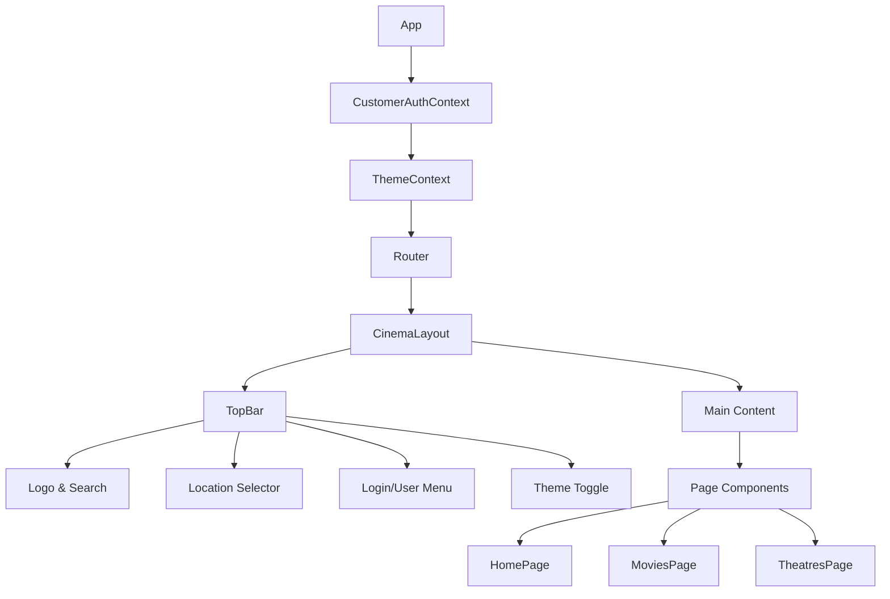

---

## Authentication System

### Customer Authentication Flow

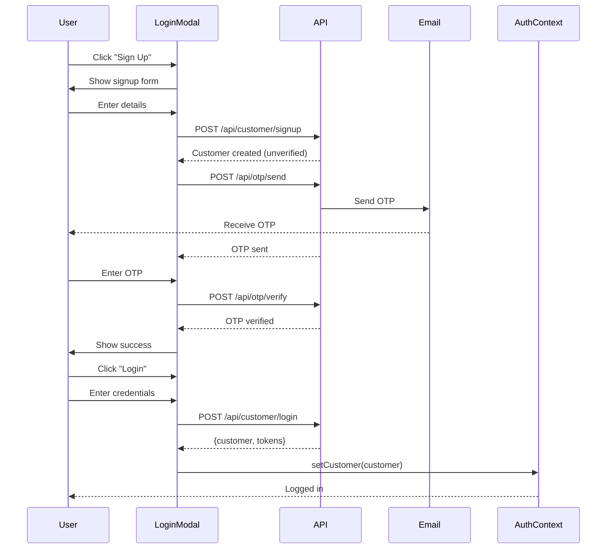

### OTP Verification Process

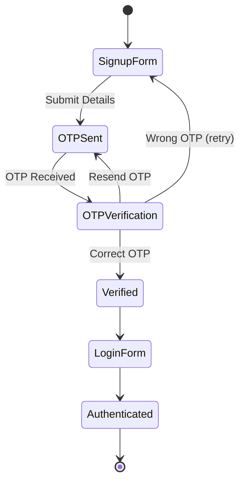

### CustomerAuthContext State

**Location**: `src/context/CustomerAuthContext.jsx`

**State Variables:**

```javascript
{
  customer: {
    id: "uuid",
    name: "Jane Smith",
    email: "jane@example.com",
    phone: "+9876543210",
    district: "Pune",
    state: "Maharashtra",
    is_verified: true
  },
  isLoggedIn: boolean,
  loading: boolean
}
```

**Key Functions:**

- `login(email, password)` - Authenticate customer
- `logout()` - Clear session
- `updateProfile(data)` - Update customer details
- `checkAuth()` - Verify token on mount
- `refreshToken()` - Auto-refresh access token

---

## Features Documentation

### 1. Movie Browsing

**Route**: `/movies`  
**Component**: `MoviesPage.jsx`

#### Feature Overview

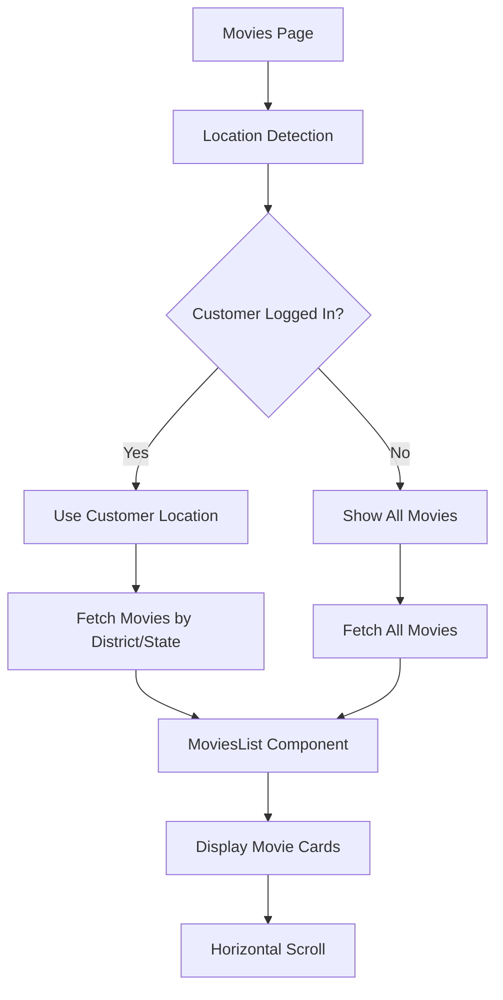

#### MoviesList Component

**Props:**

```javascript
{
  title: "Now Showing",           // Section title
  movies: [],                     // Custom movies array (optional)
  district: "Mumbai",             // Filter by district
  state: "Maharashtra",           // Filter by state
  filters: {                      // Additional filters
    status: "now_showing",
    limit: 20,
    genre: ["Action"],
    language: ["English"]
  }
}
```

#### Movie Card Display

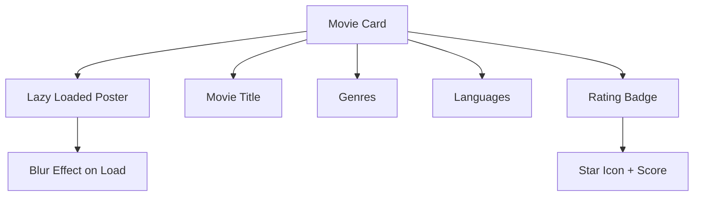

**Card Information:**

- Poster image (lazy loaded with blur effect)
- Movie title
- Genres (formatted as "Action/Sci-Fi/Thriller")
- Languages (formatted as "English, Hindi")
- Rating (if available)
- Hover effect with scale animation

#### Location-Based Filtering

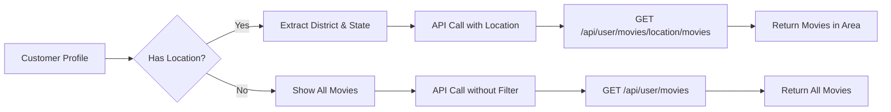

---

### 2. Authentication Modal

**Component**: `LoginModal.jsx`

#### Modal States

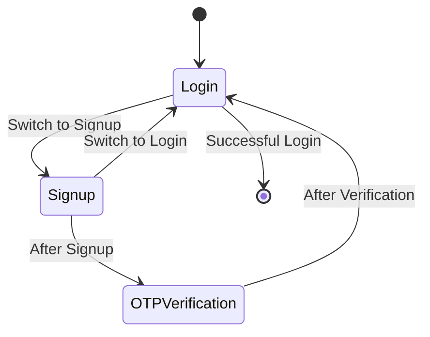

#### Login Form

**Fields:**

- Email (required)
- Password (required)

**Actions:**

- Submit login
- Switch to signup
- Forgot password (if implemented)

#### Signup Form

**Fields:**

```javascript
{
  name: "Jane Smith",
  email: "jane@example.com",
  password: "password123",
  phone: "+9876543210",
  district: "Pune",
  state: "Maharashtra"
}
```

**Validation:**

- All fields required except phone
- Email format validation
- Password strength check
- District and state for location-based features

#### OTP Verification

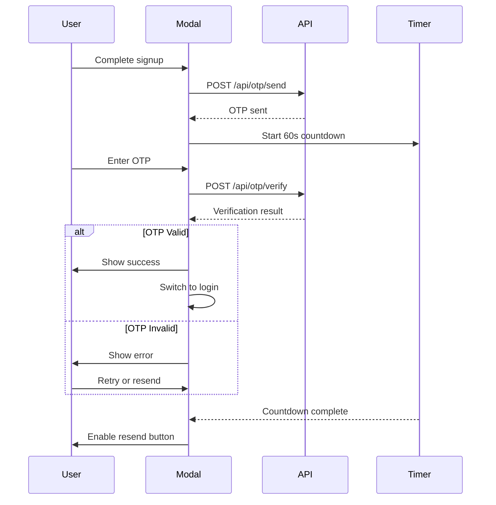

**OTP Features:**

- 6-digit OTP input
- 60-second resend timer
- Auto-focus on input
- Error handling for invalid OTP
- Success notification

---

### 3. Top Navigation Bar

**Component**: `TopBar.jsx`

#### Navigation Structure

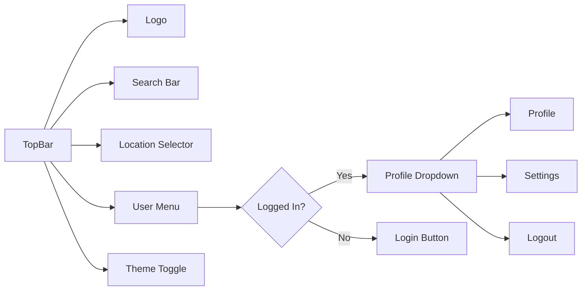

#### Auto-Open Login Modal (Protected Route Redirect)

When a user is redirected from a protected route (e.g. `/bookings` while logged out), `TopBar` automatically opens the login modal:

1. `ProtectedRoute` navigates to `/movies` with `state: { openLogin: true }`
2. `TopBar` detects `location.state?.openLogin` via a `useEffect`
3. `LoginModal` is opened and the router state is cleared (so refresh doesn't re-trigger it)

#### Search Functionality

**Features:**

- Real-time search input
- Search icon
- Placeholder text
- Submit on Enter key
- Responsive width

#### Location Selector

**Features:**

- Display current location (district, state)
- Opens `LocationModal` on click
- Auto-opens on first load if no location is cached

#### User Menu

**Logged Out State:**

- "Sign in" button — opens `LoginModal`

**Logged In State:**

- User avatar with initials
- Dropdown menu:
  - Profile
  - Settings
  - Logout

#### Theme Toggle

**Options:**

- Light mode (Sun icon)
- Dark mode (Moon icon)
- Toggle between themes
- Persisted in localStorage

---

### 3b. Secondary Navigation Bar

**Component**: `TopNavbar.jsx`

#### Navigation Items

| Position | Item | Auth Required | Route |
|----------|------|---------------|-------|
| Left | Movies | No | `/movies` |
| Left | Theatres | No | `/theatres` |
| Right | My Bookings | **Yes** | `/bookings` |
| Right | Offers | No | `/offers` |
| Right | Gift Cards | No | `/gift-cards` |

**"My Bookings"** is conditionally rendered — it only appears in the navbar when the customer is logged in (`customer` truthy from `useCustomerAuth()`). It is completely hidden for logged-out users.

---

### 4. Additional Pages

#### HomePage

**Route**: `/`  
**Component**: `HomePage.jsx`

Simple welcome page with:

- Welcome message
- Navigation to other sections
- Featured content (if implemented)

#### TheatresPage

**Route**: `/theatres`  
**Component**: `TheatresPage.jsx`

Browse cinema halls by location:

- List of theatres
- Filter by district/state
- Theatre details
- Available screens

#### HallManagement

**Component**: `HallManagement.jsx`

**Features:**

- Split-panel layout (resizable)
- Hall list on left
- Hall details on right
- Seating layout visualization
- Hall information display

**Layout:**

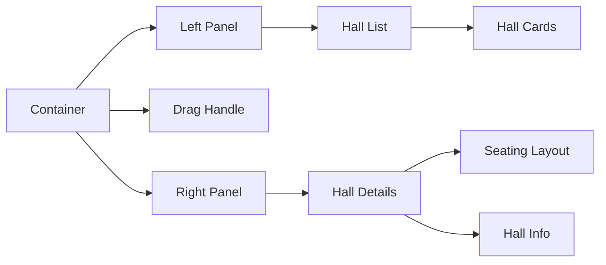

#### Bookings

**Route**: `/bookings`
**Component**: `Bookings.jsx`

Displays all bookings for the logged-in customer, split into two tabs.

**Features:**
- **Upcoming tab** — shows with `show_date >= today`, sorted by date ascending
- **Past tab** — shows with `show_date < today`
- Each booking card shows: movie title, show date/time, cinema hall name, screen name, seat chips (e.g. "A1"), total amount, booking status badge (capitalized), booking ID (first 8 chars)
- **Clickable cards** — clicking any booking card navigates to `/booking/success?payment_id=xxx` to view full details
- Loading skeleton and empty state per tab
- Calls `GET /api/booking/my-bookings` on mount

#### BookingSuccessPage

**Route**: `/booking/success?payment_id=pay_xxx`
**Component**: `BookingSuccessPage.jsx`

Displayed after successful Razorpay payment, and also accessible by clicking a booking card from the My Bookings page.

**Features:**
- Reads `payment_id` from URL (`useSearchParams`) — survives page refresh
- Shows loading spinner while fetching
- Shows error state with "View My Bookings" fallback if fetch fails
- Displays: movie title, show date/time, booking ID, booking status (capitalized), seat labels (e.g. "A1"), total amount, payment ID
- Navigates to `/` if no `payment_id` in URL
- **Download Ticket** button — captures the booking details card as a JPEG using `html-to-image`, temporarily switches to light mode during capture for correct colors, downloads as `ticket-<id>.jpg`

**Dependencies:**
- `html-to-image` — DOM-to-image capture (supports Tailwind v4 `oklch` colors)

#### ProfilePage

**Route**: `/profile`  
**Component**: `ProfilePage.jsx`

Customer profile management:

- View profile details
- Edit information
- Update location
- Change password

#### SettingsPage

**Route**: `/settings`  
**Component**: `SettingsPage.jsx`

Application settings:

- Theme preferences
- Notification settings
- Language preferences

---

## API Service Layer

**Location**: `src/services/api.js`

### Service Modules

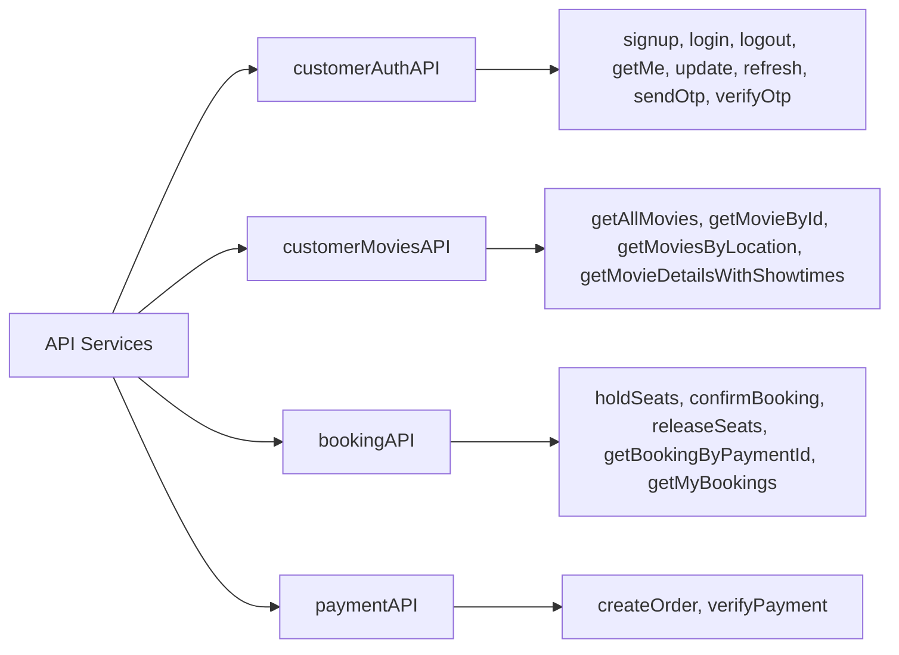

### customerAuthAPI

**Endpoints:**

```javascript
{
  (signup(data), // Register new customer
    login(email, password), // Login customer
    logout(), // Clear session
    update(data), // Update profile
    getMe(), // Get current customer
    refresh(), // Refresh access token
    sendOtp(email), // Send OTP to email
    verifyOtp(email, otp)); // Verify OTP
}
```

### customerMoviesAPI

**Endpoints:**

```javascript
{
  getAllMovies(params),                        // Get all movies with filters
  getMovieById(movieId),                       // Get single movie
  getMoviesByLocation(district, state),        // Movies in location
  getMoviesByState(state),                     // Movies in state
  getMovieDetailsWithShowtimes(movieId, ...),  // Movie + showtimes
  getDistrictsInState(state),                  // Available districts
  getCinemaHallsByLocation(district, state)    // Cinema halls in area
}
```

### API Request Flow

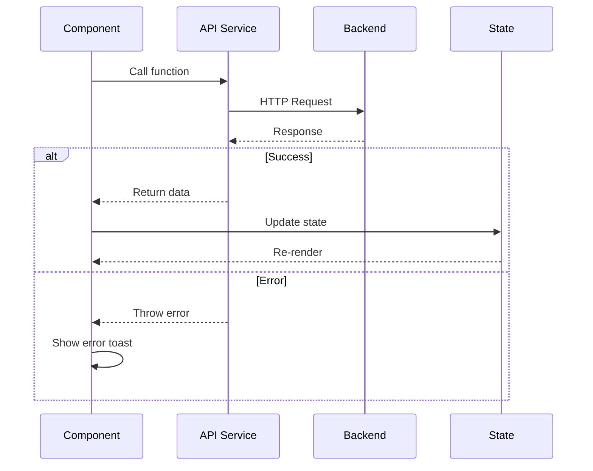

---

## UI Components

### shadcn/ui Components Used

| Component    | Usage               |
| ------------ | ------------------- |
| Button       | Actions, navigation |
| Card         | Content containers  |
| Dialog       | Login modal         |
| Input        | Form fields         |
| Avatar       | User profile        |
| DropdownMenu | User menu           |
| Skeleton     | Loading states      |
| Sonner       | Toast notifications |
| Badge        | Status indicators   |

### Custom Components

**TopBar** - Main navigation

- Search functionality
- Location display
- User authentication
- Theme toggle

**TopNavbar** - Secondary navigation

- Category links (Movies, Theatres — always visible)
- "My Bookings" link — visible only when logged in
- Offers, Gift Cards — always visible

**AdBanner** - Advertisement banner

- Promotional content
- Responsive design

**MoviesList** - Movie grid display

- Horizontal scrolling
- Lazy loading
- Filter support

**CinemaLayout** - Page wrapper

- Consistent layout
- Header + content area

**LoginModal** - Authentication modal

- Login/signup forms
- OTP verification
- Form validation

---

## State Management

### Context Providers

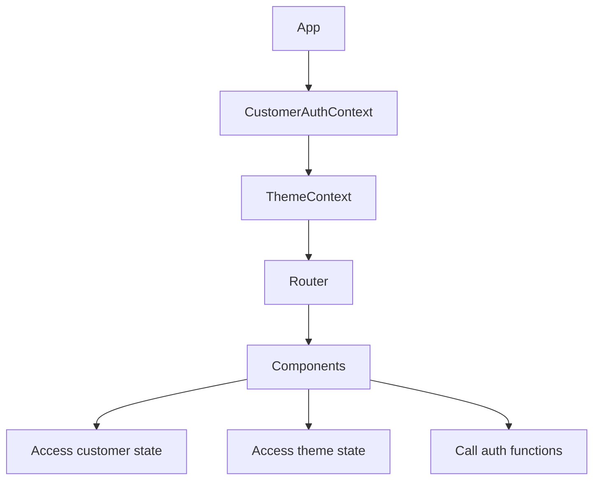

**CustomerAuthContext API:**

```javascript
const {
  customer, // Current customer object
  isLoggedIn, // Boolean auth status
  loading, // Loading state
  login, // Login function
  logout, // Logout function
  updateProfile, // Update customer
  checkAuth, // Verify auth on mount
  refreshToken, // Refresh access token
} = useCustomerAuth();
```

**ThemeContext API:**

```javascript
const {
  theme, // "light" | "dark"
  setTheme, // Change theme
  toggleTheme, // Toggle between themes
} = useTheme();
```

---

## User Workflows

### Complete Signup & Login Flow

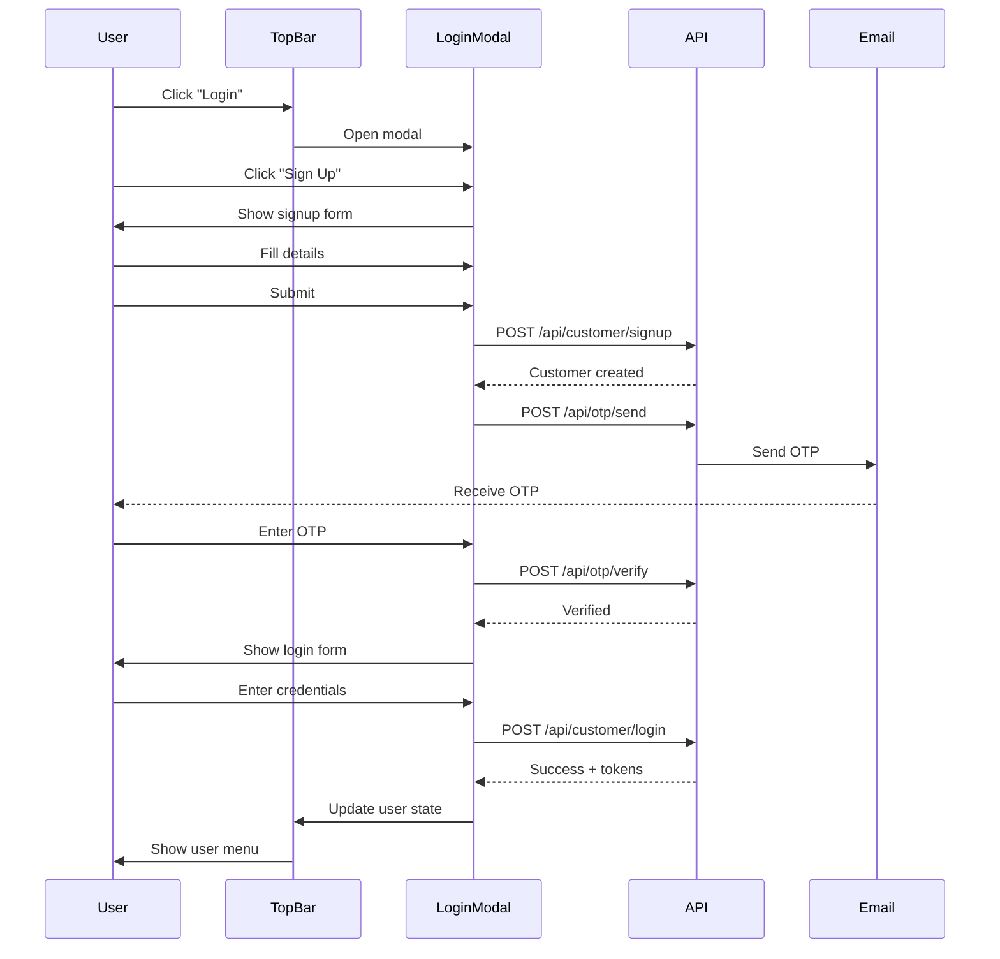

### Movie Discovery Flow

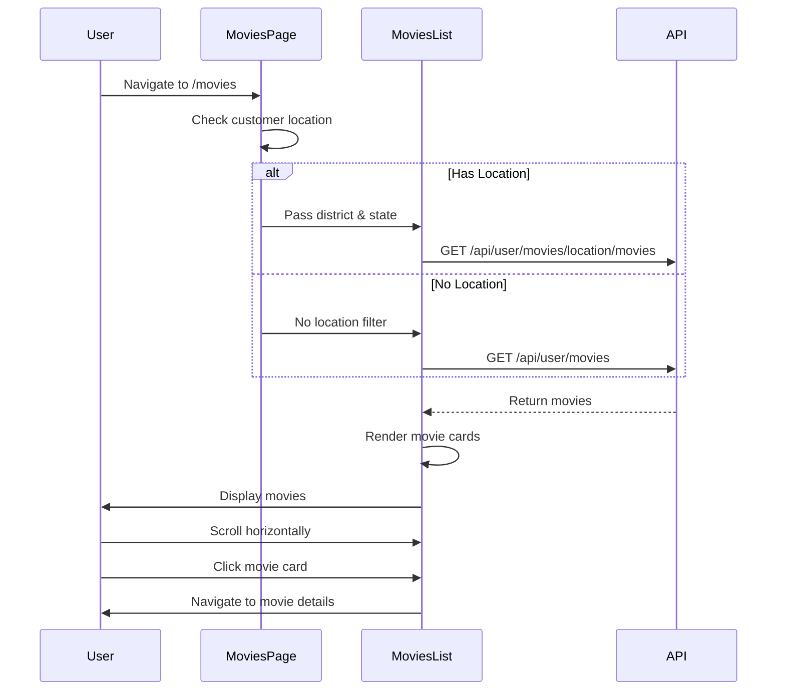

---

## Styling & Theming

### Tailwind Configuration

**Custom Utilities:**

- `.scrollbar-hide` - Hide scrollbars
- `.glass-effect` - Glassmorphism effect
- `.hover-lift` - Lift on hover
- `.hover-glow` - Glow effect

### Responsive Design

**Breakpoints:**

- `sm`: 640px
- `md`: 768px
- `lg`: 1024px
- `xl`: 1280px

**Mobile-First Approach:**

- Base styles for mobile
- Progressive enhancement for larger screens

### Dark Mode

**Implementation:**

```javascript
// ThemeContext manages theme state
const [theme, setTheme] = useState(localStorage.getItem("theme") || "light");

// Apply to document
document.documentElement.classList.toggle("dark", theme === "dark");
```

---

## Performance Optimizations

### Lazy Loading Images

```jsx
import { LazyLoadImage } from "react-lazy-load-image-component";

<LazyLoadImage
  src={movie.poster_url}
  alt={movie.title}
  effect="blur"
  className="w-full h-auto aspect-[2/3] object-cover"
/>;
```

**Benefits:**

- Reduced initial load time
- Better Core Web Vitals
- Smooth blur-in effect

### Horizontal Scrolling

**Optimized Scrolling:**

```css
.scrollbar-hide::-webkit-scrollbar {
  display: none;
}
.scrollbar-hide {
  -ms-overflow-style: none;
  scrollbar-width: none;
}
```

### Memoization

**useMemo for Filters:**

```javascript
const filtersKey = useMemo(() => JSON.stringify(filters), [filters]);
```

---

## Error Handling

### API Error Handling

```javascript
try {
  const response = await customerMoviesAPI.getAllMovies(params);
  setMovies(response.movies);
} catch (err) {
  console.error("Error fetching movies:", err);
  setError(err.message);
  toast.error("Failed to load movies");
}
```

### Loading States

**Skeleton Loaders:**

```jsx
{
  loading ? <MovieCardSkeleton /> : <MovieCard movie={movie} />;
}
```

### Empty States

**No Movies Found:**

```jsx
{
  movies.length === 0 && (
    <div className="text-center p-8">
      <p>No movies available at the moment.</p>
    </div>
  );
}
```

---

## Environment Variables

```env
# API Configuration
VITE_API_BASE_URL=http://localhost:5000

# Feature Flags (if any)
VITE_ENABLE_BOOKINGS=true
```

---

## Build & Deployment

### Development

```bash
npm run dev
# Runs on http://localhost:5174
```

### Production Build

```bash
npm run build
# Outputs to /dist
```

### Deployment

- Vercel deployment
- Automatic builds
- Environment variables via dashboard

---

## Accessibility

### Implemented Features

✅ **Keyboard Navigation:**

- Tab through interactive elements
- Enter to submit forms
- Escape to close modals

✅ **ARIA Labels:**

- Buttons have descriptive labels
- Form inputs have labels
- Icons have aria-labels

✅ **Semantic HTML:**

- Proper heading hierarchy
- Semantic elements (nav, main, section)
- Form structure

✅ **Color Contrast:**

- WCAG AA compliant
- Dark mode support

---

## Best Practices Implemented

✅ **Code Organization:**

- Feature-based structure
- Reusable components
- Centralized API services
- Context for global state

✅ **User Experience:**

- Loading states
- Error handling
- Toast notifications
- Responsive design
- Smooth animations

✅ **Performance:**

- Lazy loading
- Image optimization
- Efficient re-renders
- Memoization

✅ **Security:**

- HttpOnly cookies
- OTP verification
- Input validation
- XSS prevention

---

## Future Enhancements

✅ **Recently Implemented:**

- Interactive seat selection with 5-minute hold mechanism
- Razorpay payment integration
- Booking confirmation page (fetches from API, survives page refresh)
- Clickable booking cards navigating to booking detail page
- Download ticket as JPEG from booking success page
- Auth-gated navigation: "My Bookings" hidden when logged out; `/bookings`, `/profile`, `/settings` protected — redirect to `/movies` with auto-opened login modal

💡 **Potential Features:**

- Booking confirmation emails
- Push notifications
- Social sharing
- Reviews and ratings
- Watchlist/favorites
- Movie recommendations
- Advanced search filters
- Multi-language support
- Booking cancellation with refund

---

**Last Updated**: March 8, 2026 (auth-gated navigation + protected routes)
