# User Application Documentation

## Overview

The Cinema Hall User Application is a **React-based web application** designed for movie enthusiasts to discover and book cinema tickets. It features location-based movie browsing, OTP-verified authentication, and a modern, responsive interface.

**Tech Stack:**

- **Framework**: React 18 with Vite
- **Routing**: React Router v6
- **UI Library**: shadcn/ui (Radix UI primitives)
- **Styling**: Tailwind CSS
- **State Management**: React Context API
- **HTTP Client**: Fetch API
- **Authentication**: JWT with HttpOnly cookies + OTP verification

---

## Application Architecture

### Route Structure

```mermaid
graph TD
    A[App.jsx] --> B[CinemaLayout]
    B --> C[Public Routes]
    B --> P[Protected Routes - ProtectedRoute]

    C --> D[/movies - MoviesPage]
    C --> E1[/movie/:movieId - MovieInfoPage]
    C --> E2[/movie/shows/:movieId - MovieDetailsPage]
    C --> F[/show/:showId - SeatSelectionPage]
    C --> F2[/order-summary - OrderSummaryPage]
    C --> G[/booking/success - BookingSuccessPage]
    C --> H[/theatres - TheatresPage]

    P --> I[/bookings - Bookings]
    P --> J[/profile - ProfilePage]
    P --> K[/settings - SettingsPage]

    P --> L{Authenticated?}
    L -->|No| M[Redirect /movies + open login modal]
    L -->|Yes| N[Render page]
```

### Component Hierarchy

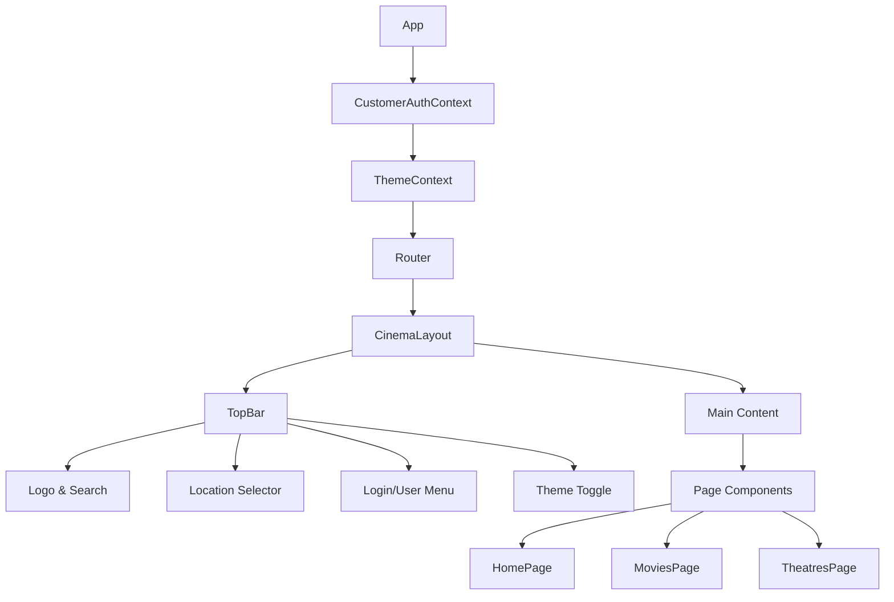
```mermaid
graph TD
    A[App] --> B[CustomerAuthContext]
    B --> C[ThemeContext]
    C --> D[Router]
    D --> E[CinemaLayout]

    E --> F[TopBar]
    E --> G[Main Content]

    F --> H[Logo & Search]
    F --> I[Location Selector]
    F --> J[Login/User Menu]
    F --> K[Theme Toggle]

    G --> L[Page Components]
    L --> M[HomePage]
    L --> N[MoviesPage]
    L --> O[TheatresPage]
```

---

## Authentication System

### Customer Authentication Flow

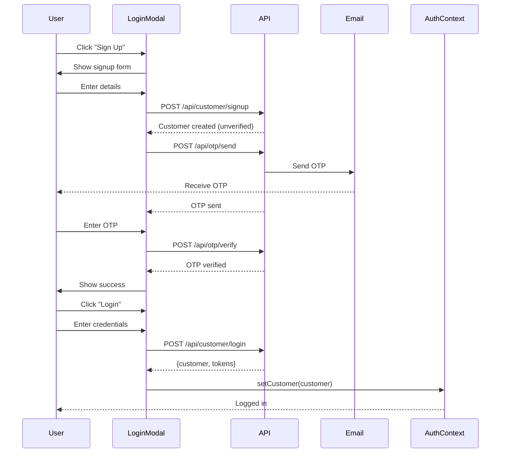
```mermaid
sequenceDiagram
    participant User
    participant LoginModal
    participant API
    participant Email
    participant AuthContext

    User->>LoginModal: Click "Sign Up"
    LoginModal->>User: Show signup form

    User->>LoginModal: Enter details
    LoginModal->>API: POST /api/customer/signup
    API-->>LoginModal: Customer created (unverified)

    LoginModal->>API: POST /api/otp/send
    API->>Email: Send OTP
    Email-->>User: Receive OTP
    API-->>LoginModal: OTP sent

    User->>LoginModal: Enter OTP
    LoginModal->>API: POST /api/otp/verify
    API-->>LoginModal: OTP verified
    LoginModal->>User: Show success

    User->>LoginModal: Click "Login"
    User->>LoginModal: Enter credentials
    LoginModal->>API: POST /api/customer/login
    API-->>LoginModal: {customer, tokens}
    LoginModal->>AuthContext: setCustomer(customer)
    AuthContext-->>User: Logged in
```

### OTP Verification Process

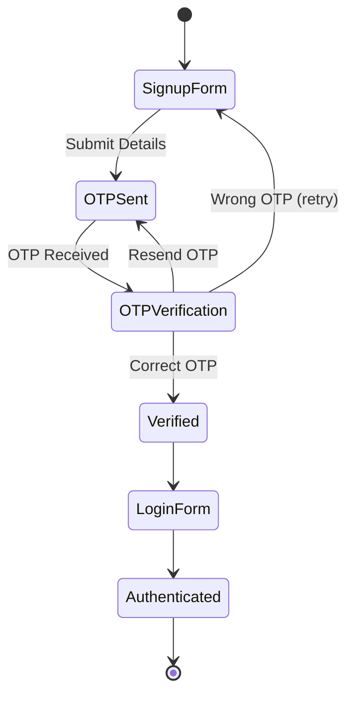
```mermaid
stateDiagram-v2
    [*] --> SignupForm
    SignupForm --> OTPSent: Submit Details
    OTPSent --> OTPVerification: OTP Received
    OTPVerification --> Verified: Correct OTP
    OTPVerification --> OTPSent: Resend OTP
    OTPVerification --> SignupForm: Wrong OTP (retry)
    Verified --> LoginForm
    LoginForm --> Authenticated
    Authenticated --> [*]
```

### CustomerAuthContext State

**Location**: `src/context/CustomerAuthContext.jsx`

**State Variables:**

```javascript
{
  customer: {
    id: "uuid",
    name: "Jane Smith",
    email: "jane@example.com",
    phone: "+9876543210",
    district: "Pune",
    state: "Maharashtra",
    is_verified: true
  },
  isLoggedIn: boolean,
  loading: boolean
}
```

**Key Functions:**

- `login(email, password)` - Authenticate customer
- `logout()` - Clear session
- `updateProfile(data)` - Update customer details
- `checkAuth()` - Verify token on mount
- `refreshToken()` - Auto-refresh access token

---

## Features Documentation

### 1. Movie Browsing

**Route**: `/movies`  
**Component**: `MoviesPage.jsx`

#### Feature Overview

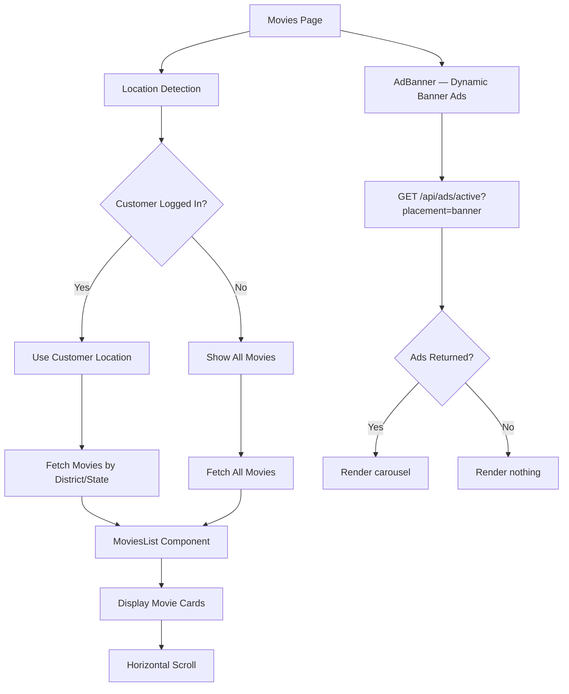
```mermaid
flowchart TD
    A[Movies Page] --> B[Location Detection]
    B --> C{Customer Logged In?}
    C -->|Yes| D[Use Customer Location]
    C -->|No| E[Show All Movies]

    D --> F[Fetch Movies by District/State]
    E --> G[Fetch All Movies]

    F --> H[MoviesList Component]
    G --> H

    H --> I[Display Movie Cards]
    I --> J[Horizontal Scroll]

    A --> K[AdBanner — Dynamic Banner Ads]
    K --> L[GET /api/ads/active?placement=banner]
    L --> M{Ads Returned?}
    M -->|Yes| N[Render carousel]
    M -->|No| O[Render nothing]
```

#### Location Context Strip

A slim strip rendered at the top of `MoviesPage` when the customer has a saved location.

- **Desktop (`sm+`):** Shows `📍 Showing results near Tirunelveli, Tamil Nadu`
- **Mobile:** Shows only `📍 Tirunelveli, Tamil Nadu` — the "Showing results near" label is hidden (`hidden sm:inline`) to save space
- The district and state are inline within a single `<span>` (not separate flex items) so text wraps naturally on very small screens

---

#### AdBanner Component

**Component**: `AdBanner.jsx`

Fetches active `banner` placement ads from the API on mount. Renders a full-width Embla carousel; hidden entirely if no ads are currently active.

**Behaviour:**
- Fetches `GET /api/ads/active?placement=banner`
- Each slide is a clickable image — clicking records a click (`POST /api/ads/click/:id`) and opens `click_url` in a new tab
- Dot indicators shown only when there are 2+ slides
- Falls back to rendering nothing if no ads or fetch fails

#### MoviesList Component

**Props:**

```javascript
{
  title: "Now Showing",           // Section title
  movies: [],                     // Custom movies array (optional)
  district: "Mumbai",             // Filter by district
  state: "Maharashtra",           // Filter by state
  filters: {                      // Additional filters
    status: "now_showing",
    limit: 20,
    genre: ["Action"],
    language: ["English"]
  }
}
```

#### Movie Card Display

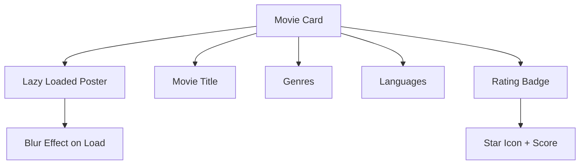
```mermaid
graph TD
    A[Movie Card] --> B[Lazy Loaded Poster]
    A --> C[Movie Title]
    A --> D[Genres]
    A --> E[Languages]
    A --> F[Rating Badge]

    B --> G[Blur Effect on Load]
    F --> H[Star Icon + Score]
```

**Card Information:**

- Poster image (lazy loaded with blur effect)
- Movie title
- Genres (formatted as "Action/Sci-Fi/Thriller")
- Languages (formatted as "English, Hindi")
- Rating (if available)
- Hover effect with scale animation

#### Location-Based Filtering

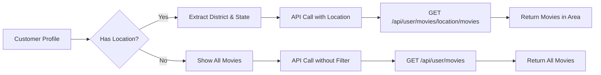
```mermaid
flowchart LR
    A[Customer Profile] --> B{Has Location?}
    B -->|Yes| C[Extract District & State]
    B -->|No| D[Show All Movies]

    C --> E[API Call with Location]
    E --> F[GET /api/user/movies/location/movies]
    F --> G[Return Movies in Area]

    D --> H[API Call without Filter]
    H --> I[GET /api/user/movies]
    I --> J[Return All Movies]
```

---

### 2. Authentication Modal

**Component**: `LoginModal.jsx`

#### Modal States

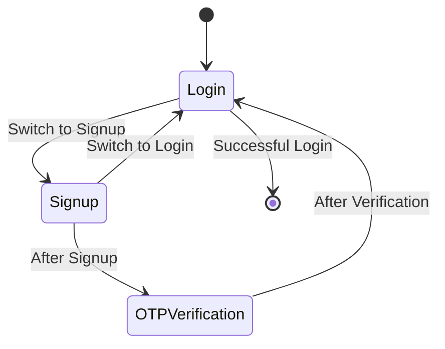
```mermaid
stateDiagram-v2
    [*] --> Login
    Login --> Signup: Switch to Signup
    Signup --> Login: Switch to Login
    Signup --> OTPVerification: After Signup
    OTPVerification --> Login: After Verification
    Login --> [*]: Successful Login
```

#### Login Form

**Fields:**

- Email (required)
- Password (required)

**Actions:**

- Submit login
- Switch to signup
- Forgot password (if implemented)

#### Signup Form

**Fields:**

```javascript
{
  name: "Jane Smith",
  email: "jane@example.com",
  password: "password123",
  phone: "+9876543210",
  district: "Pune",
  state: "Maharashtra"
}
```

**Validation:**

- All fields required except phone
- Email format validation
- Password strength check
- District and state for location-based features

#### OTP Verification

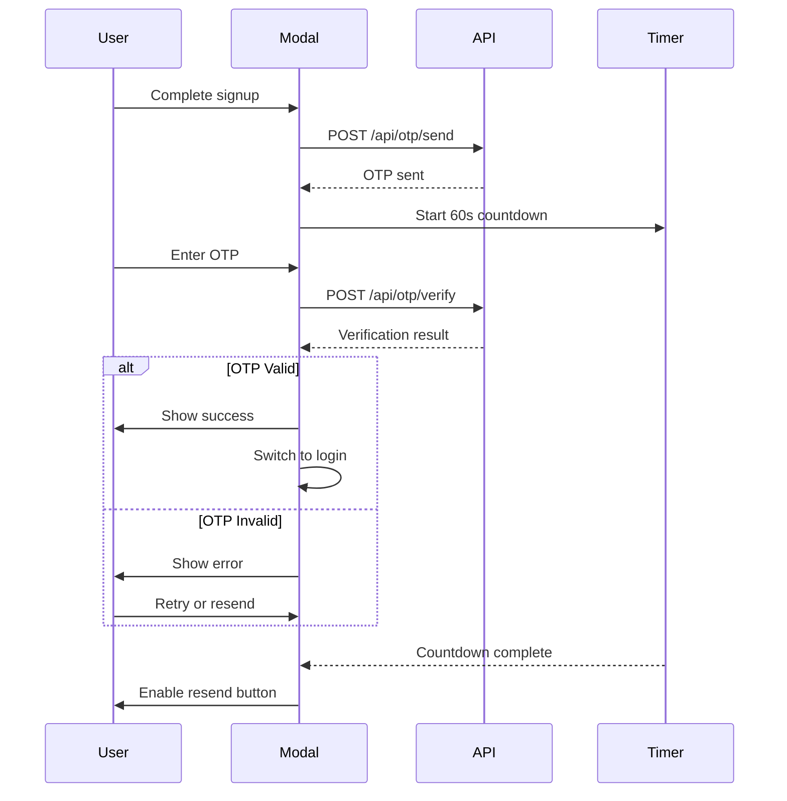
```mermaid
sequenceDiagram
    participant User
    participant Modal
    participant API
    participant Timer

    User->>Modal: Complete signup
    Modal->>API: POST /api/otp/send
    API-->>Modal: OTP sent
    Modal->>Timer: Start 60s countdown

    User->>Modal: Enter OTP
    Modal->>API: POST /api/otp/verify
    API-->>Modal: Verification result

    alt OTP Valid
        Modal->>User: Show success
        Modal->>Modal: Switch to login
    else OTP Invalid
        Modal->>User: Show error
        User->>Modal: Retry or resend
    end

    Timer-->>Modal: Countdown complete
    Modal->>User: Enable resend button
```

**OTP Features:**

- 6-digit OTP input
- 60-second resend timer
- Auto-focus on input
- Error handling for invalid OTP
- Success notification

---

### 3. Top Navigation Bar

**Component**: `TopBar.jsx`

#### Navigation Structure

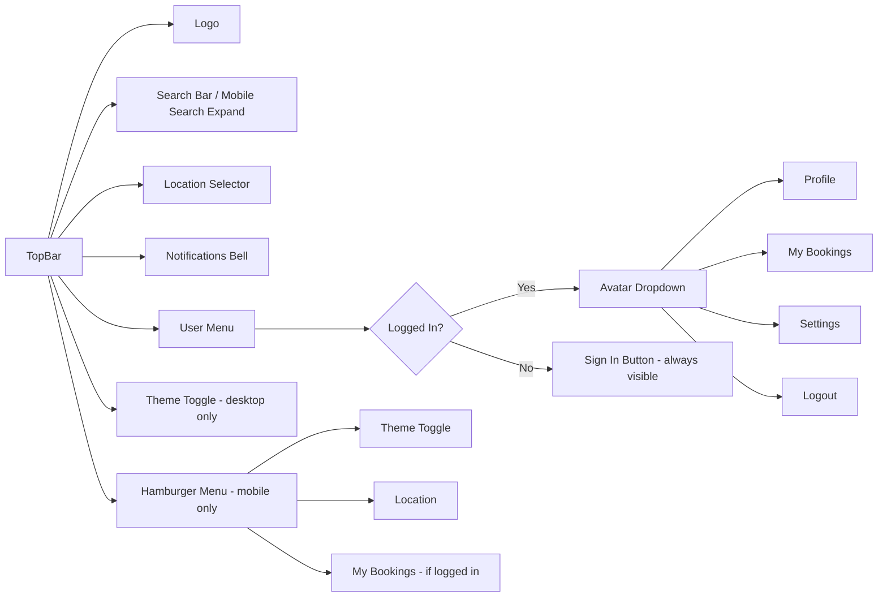
```mermaid
graph LR
    A[TopBar] --> B[Logo]
    A --> C[Search Bar / Mobile Search Expand]
    A --> D[Location Selector]
    A --> E[Notifications Bell]
    A --> F[User Menu]
    A --> G[Theme Toggle - desktop only]
    A --> H[Hamburger Menu - mobile only]

    F --> I{Logged In?}
    I -->|Yes| J[Avatar Dropdown]
    I -->|No| K[Sign In Button - always visible]

    J --> L[Profile]
    J --> M[My Bookings]
    J --> N[Settings]
    J --> O[Logout]

    H --> P[Theme Toggle]
    H --> Q[Location]
    H --> R[My Bookings - if logged in]
```

#### Auto-Open Login Modal (Protected Route Redirect)

When a user is redirected from a protected route (e.g. `/bookings` while logged out), `TopBar` automatically opens the login modal:

1. `ProtectedRoute` navigates to `/movies` with `state: { openLogin: true }`
2. `TopBar` detects `location.state?.openLogin` via a `useEffect`
3. `LoginModal` is opened and the router state is cleared (so refresh doesn't re-trigger it)

#### Search Functionality

**Desktop (`sm+`):** Full-width pill-shaped input bar (max `xl`) centered in the header. Submits via Enter and navigates to `/search?q=<term>`.

**Mobile:** A `Search` icon button is always visible. Tapping it replaces the entire TopBar content with an inline search input + `X` cancel button (full-width). Cancelling clears the query and restores the normal bar. No alert — fully functional.

#### Location Selector

**Desktop (`sm+`):** Pill-shaped button showing `<MapPin icon> District · State`. State abbreviation is only shown on `lg+` screens. No `max-width` or `truncate` — the full location name is always displayed. Clicking opens `LocationModal`.

**Mobile:** Shows only a `MapPin` icon button. A small primary-coloured dot appears in the corner when a location is set (visual indicator). Full location label is accessible via the hamburger menu.

**Auto-open:** If no location is cached on first load (`!district && !state`), `LocationModal` opens automatically.

#### Notifications

A `Bell` icon button is always visible. When there are unread notifications, a **numeric badge** (e.g. `2`) appears at the top-right of the bell instead of a pulsing dot — more informative and less distracting.

The dropdown (`w-80`) shows:
- Header: "Notifications" label + unread count
- Each notification: coloured dot (primary = unread, transparent = read) + title + timestamp
- "View all notifications" footer link → `/notifications`

#### User Menu

**Logged Out State:**

- "Sign in" pill button — always visible in the bar on all screen sizes (not hidden in the hamburger menu), opens `LoginModal`

**Logged In State:**

- Avatar button (initials, gradient background, `border-2 border-primary/30`)
- Dropdown header shows avatar + full name + email side-by-side
- Dropdown menu:
  - Profile → `/profile`
  - My Bookings → `/bookings`
  - Settings → `/settings`
  - Logout (destructive style)

#### Theme Toggle

**Options:**

- Light mode (Sun icon)
- Dark mode (Moon icon)
- Toggle between themes
- Persisted in localStorage
- **Desktop only** — visible as a standalone icon button; on mobile it lives in the hamburger menu

#### Mobile Dropdown Menu

On small screens (`sm:hidden`), a hamburger menu (`Menu` icon) contains only:
- Theme toggle (Light / Dark Mode)
- Location item — shows full `District, State` label; clicking opens `LocationModal` (deferred)
- **My Bookings** link (shown only when customer is logged in)

> **Sign In is no longer in the hamburger menu** — it is always directly visible in the bar as a pill button.

**Known Fix — Radix UI DropdownMenu + Dialog conflict:**

Opening a Radix `Dialog` (modal) directly from a `DropdownMenuItem` click causes a race condition where both components fight over:
- `aria-hidden` on the portal root
- `pointer-events` on `document.body`
- Focus trap ownership

This results in the Dialog visually closing but leaving the page frozen (no clicks register) because the dropdown's `pointer-events: none` lock is never cleaned up.

**Fixes applied:**

1. **Removed `asChild` from the mobile `DropdownMenuTrigger`** — using `asChild` with a `<Button>` child created a button-in-button nesting issue that compounded the modal conflict.

2. **Deferred modal `open` calls with `setTimeout(..., 0)`** — all `DropdownMenuItem` handlers that open a Dialog now defer the state update to the next event-loop tick, giving Radix time to fully unmount the dropdown and release its overlay/focus-trap state before the Dialog mounts.

```jsx
// Before (causes freeze)
<DropdownMenuItem onClick={() => setLocationOpen(true)}>

// After (deferred — dropdown unmounts cleanly first)
<DropdownMenuItem onClick={() => setTimeout(() => setLocationOpen(true), 0)}>
```

---

### 3b. Secondary Navigation Bar

**Component**: `TopNavbar.jsx`

#### Navigation Items

| Position | Item | Auth Required | Visible |
|----------|------|---------------|---------|
| Left | Movies | No | Always |
| Left | Theatres | No | Always |
| Right | My Bookings | **Yes** | `sm+`, logged in only |
| Right | Offers | No | `sm+` |
| Right | Gift Cards | No | `sm+` |

**Active indicator:** Each link uses `border-b-2 -mb-px` — the active link's `border-primary` bottom border visually bleeds into the container's `border-b` for a seamless tab underline. Inactive links show `border-transparent` by default and `border-border` on hover as a subtle preview.

**"My Bookings"** is conditionally rendered — only appears when the customer is logged in. Right nav items are hidden below `sm` breakpoint (was `lg` previously).

**Height & padding:** `h-11` with `px-3 sm:px-6 lg:px-8` — matching TopBar's spacing system.

---

### 4. Additional Pages

#### HomePage

**Route**: `/`  
**Component**: `HomePage.jsx`

Simple welcome page with:

- Welcome message
- Navigation to other sections
- Featured content (if implemented)

#### TheatresPage

**Route**: `/theatres`
**Component**: `TheatresPage.jsx`

Browse cinema halls by location with their movies and showtimes. Uses a **BookMyShow-style UI**.

**Features:**
- **3-part vertical date buttons** (DOW / day number / month) — 7 days shown, inside a `bg-card border-b` shelf; selected date highlighted in cinema red (`bg-primary`)
- **Availability legend** — `● AVAILABLE` (green) + `● FAST FILLING` (amber) aligned right below the date shelf
- Fetches `GET /api/user/movies/location/theatres` with `district`, `state`, `date` from user's profile
- **Cinema hall cards** (`rounded-xl`): building icon + hall name + location + heart icon (visual)
- Each hall shows its movies with:
  - Clickable poster thumbnail (navigates to `/movie/:movieId`)
  - Clickable title (same navigation)
  - Duration badge (`2h 13m` format via `formatDuration`) + genre pills
  - Shows **grouped by screen** with screen name as a left-aligned label
  - **Green-bordered outlined show time buttons** — time on line 1, language version on line 2; sorted by time; hover changes to primary color
  - "Non-cancellable" label below each movie's shows
- Skeleton loader covers the cinema halls section (date selector stays visible during refetch)
- Empty state with cinema icon when no shows are scheduled for the selected date
- "Set Your Location" state when user has no location set

**Helper functions:**
- `formatDuration(mins)` — converts `144` → `"2h 24m"`
- `formatDateParts(date)` — returns `{ dow, day, month }` for 3-part date buttons

**Data flow:**

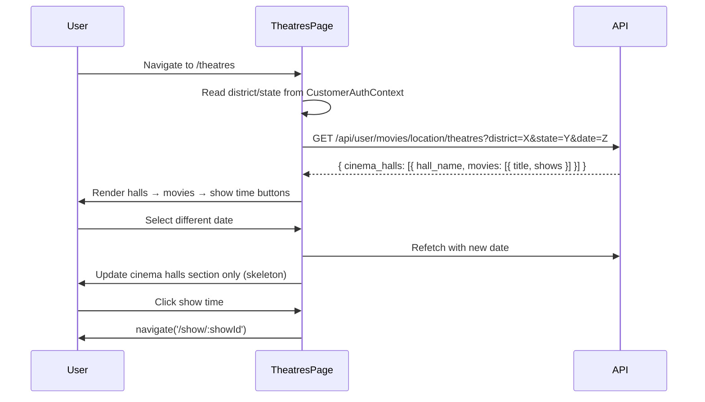
```mermaid
sequenceDiagram
    participant User
    participant TheatresPage
    participant API

    User->>TheatresPage: Navigate to /theatres
    TheatresPage->>TheatresPage: Read district/state from CustomerAuthContext
    TheatresPage->>API: GET /api/user/movies/location/theatres?district=X&state=Y&date=Z
    API-->>TheatresPage: { cinema_halls: [{ hall_name, movies: [{ title, shows }] }] }
    TheatresPage->>User: Render halls → movies → show time buttons

    User->>TheatresPage: Select different date
    TheatresPage->>API: Refetch with new date
    TheatresPage->>User: Update cinema halls section only (skeleton)

    User->>TheatresPage: Click show time
    TheatresPage->>User: navigate('/show/:showId')
```

#### HallManagement

**Component**: `HallManagement.jsx`

**Features:**

- Split-panel layout (resizable)
- Hall list on left
- Hall details on right
- Seating layout visualization
- Hall information display

**Layout:**

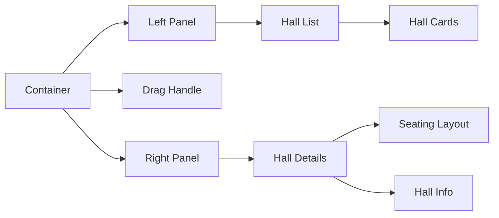
```mermaid
graph LR
    A[Container] --> B[Left Panel]
    A --> C[Drag Handle]
    A --> D[Right Panel]

    B --> E[Hall List]
    E --> F[Hall Cards]

    D --> G[Hall Details]
    G --> H[Seating Layout]
    G --> I[Hall Info]
```

#### Bookings

**Route**: `/bookings`
**Component**: `Bookings.jsx`

Displays all bookings for the logged-in customer, split into two tabs.

**Features:**
- **Upcoming tab** — shows with `show_date >= today`, sorted by date ascending
- **Past tab** — shows with `show_date < today`
- Each booking card shows: movie title, show date/time, cinema hall name, screen name, seat chips (e.g. "A1"), total amount, booking status badge (capitalized), booking ID (first 8 chars)
- **Clickable cards** — clicking any booking card navigates to `/booking/success?payment_id=xxx` to view full details
- **Show QR button** — each card has a "Show QR" button that opens a `Dialog` containing a `QRCodeSVG` (180×180) encoding the full booking UUID, movie title, and show date. Uses `e.stopPropagation()` to prevent card navigation
- Loading skeleton and empty state per tab
- Calls `GET /api/booking/my-bookings` on mount

**Dependencies:**
- `qrcode.react` — `QRCodeSVG` component for QR generation
- `@/components/ui/dialog` — shadcn Dialog for the QR modal

#### OrderSummaryPage

**Route**: `/order-summary`
**Component**: `OrderSummaryPage.jsx`

Intermediate page between seat selection and Razorpay payment. Reached after seats are successfully held (5-min hold). Receives all booking context via `location.state`; redirects to `/movies` if accessed directly with no state.

**Layout (two-column on desktop, stacked on mobile):**
- **Left panel** — Razorpay payment section: lock icon + "Secure Payment via Razorpay" branding, amount summary badge, "Pay ₹XXX" button (disabled until settings load)
- **Right panel (sticky)** — Order summary card: movie title + ticket count, show date/time/language/format, seat labels, cinema name, price breakdown (ticket price + convenience fee + GST on convenience fee + amount payable), "Cancel and release seats" link

**Pricing (dynamic — fetched from API):**
- On mount, fetches `GET /api/settings` to get `convenience_fee_per_ticket` and `gst_percentage`
- Calculates:
  - `convenienceTotal = numSeats × convenience_fee_per_ticket`
  - `gstAmount = convenienceTotal × (gst_percentage / 100)` (GST only on convenience fee)
  - `grandTotal = seatTotal + convenienceTotal + gstAmount`
- Price breakdown shows three line items: Ticket(s) price, Convenience fees (₹X/ticket), GST (Y% on conv. fee)
- Displays `...` while settings are loading; Pay button disabled until loaded

**Countdown timer:**
- Reads `holdExpiry` from `location.state`, ticks down MM:SS in the header
- On expiry: shows toast error, releases seats, navigates back to `/show/:showId`

**Pay button:**
- Calls `useRazorpayPayment.initiatePayment()` with `show_id`, `seats`, `customer` — **no amount sent** (backend calculates it)
- On success: navigates to `/booking/success?payment_id=xxx`
- On cancel: shows info toast (no seat release — hold is still active)

**Cancel/Back button:**
- Calls `bookingAPI.releaseSeats()` then navigates back to `/show/:showId`

**State passed from SeatSelectionPage:**

```js
{
  showId, selectedSeats, seatLabels,
  holdExpiry, totalAmount,
  movieTitle, language, showDate, startTime,
  screenName, screenType, cinemaName
}
```

---

#### BookingSuccessPage

**Route**: `/booking/success?payment_id=pay_xxx`
**Component**: `BookingSuccessPage.jsx`

Displayed after successful Razorpay payment, and also accessible by clicking a booking card from the My Bookings page.

**Features:**
- Reads `payment_id` from URL (`useSearchParams`) — survives page refresh
- Shows loading spinner while fetching
- Shows error state with "View My Bookings" fallback if fetch fails
- Navigates to `/` if no `payment_id` in URL
- **Download Ticket** button — captures the entire ticket card as a JPEG using `html-to-image` at 3× pixel ratio, temporarily strips dark mode during capture for correct colors, downloads as `ticket-<id>.jpg`

**UI Design (redesigned — premium cinema ticket style):**

**Success header:**
- Pulsing green ring animation (`animate-ping`) behind a `CheckCircle` icon for a dynamic confirmation feel
- Bold heading + subtitle copy

**Ticket card** (`ticketRef` — this is what gets captured as JPEG):
- **Header banner** — deep red gradient (`#e11d48 → #9f1239`) with CineMax logo pill, movie title in large white bold type, date & time with `CalendarDays` / `Clock` icons
- **Perforated divider** — dashed border with half-circle notches cut into both sides (`-left-3` / `-right-3` absolutely positioned circles) — classic physical ticket aesthetic
- **Body section:**
  - Booking ID in monospace font with `Hash` icon label; green live-dot status badge with ring border
  - Seat labels as pill tags with zinc ring border
  - Total amount right-aligned in `text-3xl font-extrabold`; payment ID below in muted text
- **QR stub** — `QRCodeSVG` (90×90, level `M`) in a white padded `rounded-xl` card with drop shadow; "scan to verify" instructions beside it

**Info banner:** Blue-tinted email confirmation notice below the ticket

**Action buttons:** 3-column grid — pink primary "My Bookings", dark "Download Ticket" with Download icon, muted "Book More"

**Dependencies:**
- `html-to-image` — DOM-to-image capture (supports Tailwind v4 `oklch` colors)
- `qrcode.react` — `QRCodeSVG` component (SVG-based, serializes correctly with `html-to-image`)
- `lucide-react` — `CheckCircle`, `CalendarDays`, `Clock`, `Hash`, `Ticket`, `Download`, `Loader2`

#### ProfilePage

**Route**: `/profile`  
**Component**: `ProfilePage.jsx`

Customer profile management:

- View profile details
- Edit information
- Update location
- Change password

#### SettingsPage

**Route**: `/settings`  
**Component**: `SettingsPage.jsx`

Application settings:

- Theme preferences
- Notification settings
- Language preferences

---

## API Service Layer

**Location**: `src/services/api.js`

### Service Modules

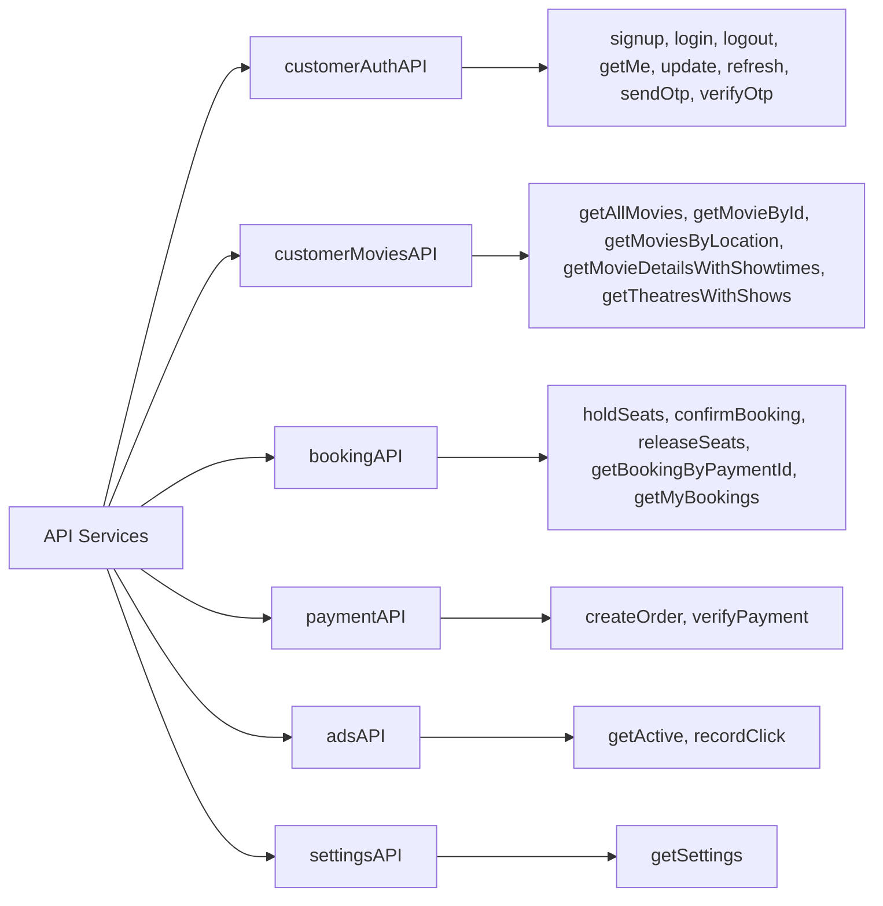
```mermaid
graph LR
    A[API Services] --> B[customerAuthAPI]
    A --> C[customerMoviesAPI]
    A --> D[bookingAPI]
    A --> E[paymentAPI]
    A --> F2[adsAPI]
    A --> G2[settingsAPI]

    B --> F[signup, login, logout, getMe, update, refresh, sendOtp, verifyOtp]
    C --> G[getAllMovies, getMovieById, getMoviesByLocation, getMovieDetailsWithShowtimes, getTheatresWithShows]
    D --> H[holdSeats, confirmBooking, releaseSeats, getBookingByPaymentId, getMyBookings]
    E --> I[createOrder, verifyPayment]
    F2 --> J[getActive, recordClick]
    G2 --> K[getSettings]
```

### customerAuthAPI

**Endpoints:**

```javascript
{
  (signup(data), // Register new customer
    login(email, password), // Login customer
    logout(), // Clear session
    update(data), // Update profile
    getMe(), // Get current customer
    refresh(), // Refresh access token
    sendOtp(email), // Send OTP to email
    verifyOtp(email, otp)); // Verify OTP
}
```

### customerMoviesAPI

**Endpoints:**

```javascript
{
  getAllMovies(params),                           // Get all movies with filters
  getMovieById(movieId),                          // Get single movie
  getMoviesByLocation(district, state),           // Movies in location
  getMoviesByState(state),                        // Movies in state
  getMovieDetailsWithShowtimes(movieId, ...),     // Movie + cinema halls + showtimes
  getDistrictsInState(state),                     // Available districts
  getCinemaHallsByLocation(district, state),      // Cinema halls in area (basic, no shows)
  getTheatresWithShows(district, state, date)     // Cinema halls with movies + shows for a date
}
```

### adsAPI

**Endpoints:**

```javascript
{
  getActive(placement),  // GET /api/ads/active?placement={placement} — public
  recordClick(adId),     // POST /api/ads/click/{adId} — optional customer auth
}
```

Used by `AdBanner.jsx` (placement `'banner'`) and `MovieInfoPage.jsx` (placement `'side'`). `recordClick` is fire-and-forget — errors are silently caught.

### settingsAPI

**Endpoints:**

```javascript
{
  getSettings(),  // GET /api/settings — public, no auth required
}
```

Returns `{ convenience_fee_per_ticket: number, gst_percentage: number }`. Called by `OrderSummaryPage` on mount to dynamically calculate the booking fee breakdown.

### API Request Flow

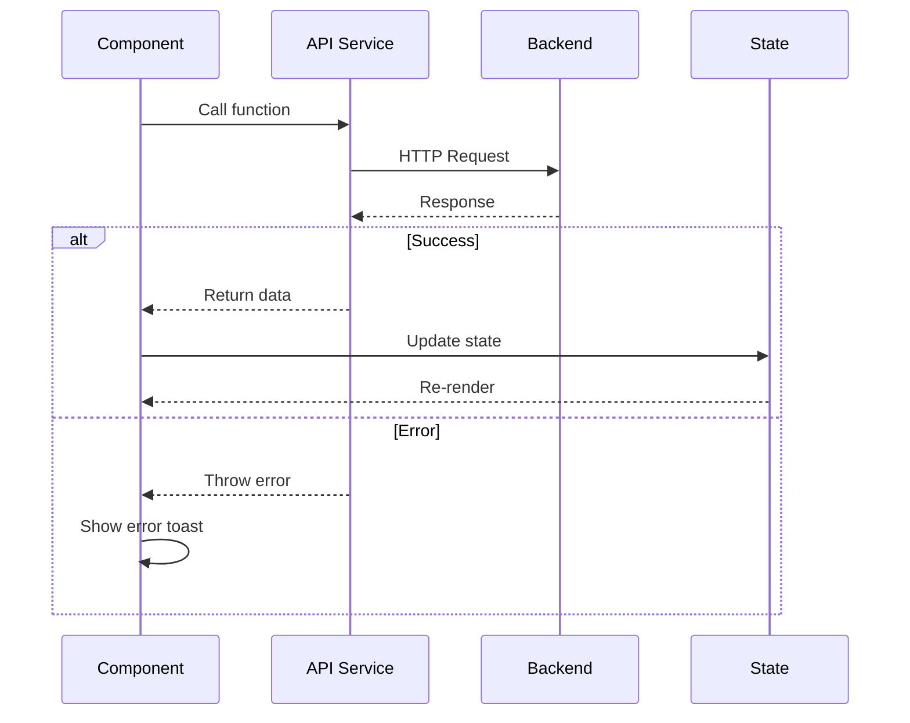
```mermaid
sequenceDiagram
    participant Component
    participant API Service
    participant Backend
    participant State

    Component->>API Service: Call function
    API Service->>Backend: HTTP Request
    Backend-->>API Service: Response

    alt Success
        API Service-->>Component: Return data
        Component->>State: Update state
        State-->>Component: Re-render
    else Error
        API Service-->>Component: Throw error
        Component->>Component: Show error toast
    end
```

---

## UI Components

### shadcn/ui Components Used

| Component    | Usage               |
| ------------ | ------------------- |
| Button       | Actions, navigation |
| Card         | Content containers  |
| Dialog       | Login modal         |
| Input        | Form fields         |
| Avatar       | User profile        |
| DropdownMenu | User menu           |
| Skeleton     | Loading states      |
| Sonner       | Toast notifications |
| Badge        | Status indicators   |

### Custom Components

**TopBar** - Main navigation

- Search functionality
- Location display
- User authentication
- Theme toggle

**TopNavbar** - Secondary navigation

- Category links (Movies, Theatres — always visible)
- "My Bookings" link — visible only when logged in
- Offers, Gift Cards — always visible

**AdBanner** - Advertisement banner

- Promotional content
- Responsive design

**MoviesList** - Movie grid display

- Horizontal scrolling
- Lazy loading
- Filter support

**CinemaLayout** - Page wrapper

- Consistent layout
- Header + content area

**LoginModal** - Authentication modal

- Login/signup forms
- OTP verification
- Form validation

---

## State Management

### Context Providers

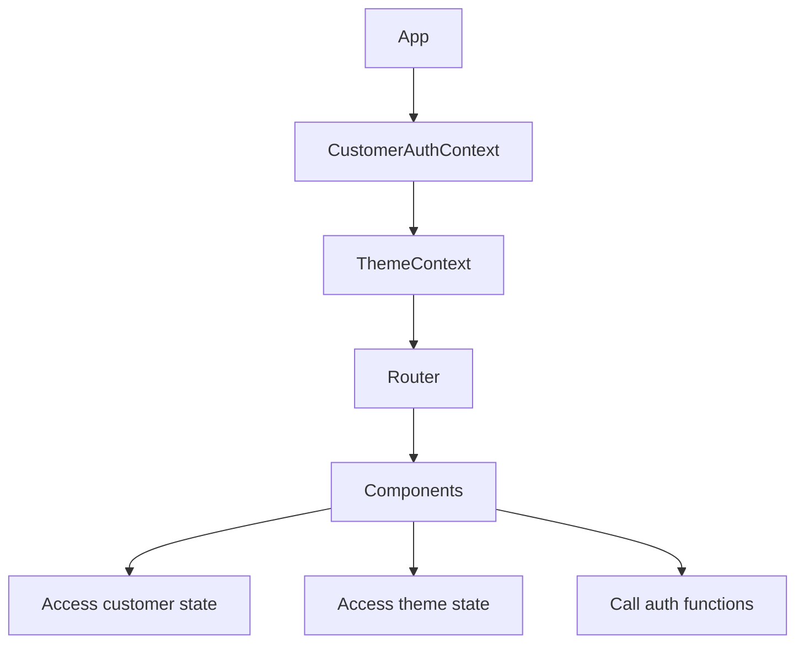
```mermaid
graph TD
    A[App] --> B[CustomerAuthContext]
    B --> C[ThemeContext]
    C --> D[Router]
    D --> E[Components]

    E --> F[Access customer state]
    E --> G[Access theme state]
    E --> H[Call auth functions]
```

**CustomerAuthContext API:**

```javascript
const {
  customer, // Current customer object
  isLoggedIn, // Boolean auth status
  loading, // Loading state
  login, // Login function
  logout, // Logout function
  updateProfile, // Update customer
  checkAuth, // Verify auth on mount
  refreshToken, // Refresh access token
} = useCustomerAuth();
```

**ThemeContext API:**

```javascript
const {
  theme, // "light" | "dark"
  setTheme, // Change theme
  toggleTheme, // Toggle between themes
} = useTheme();
```

---

## User Workflows

### Complete Signup & Login Flow

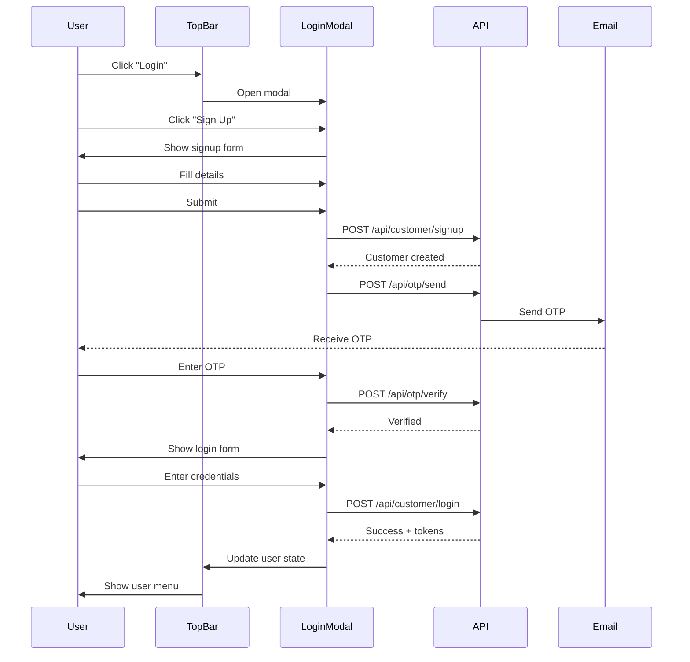
```mermaid
sequenceDiagram
    participant User
    participant TopBar
    participant LoginModal
    participant API
    participant Email

    User->>TopBar: Click "Login"
    TopBar->>LoginModal: Open modal

    User->>LoginModal: Click "Sign Up"
    LoginModal->>User: Show signup form

    User->>LoginModal: Fill details
    User->>LoginModal: Submit
    LoginModal->>API: POST /api/customer/signup
    API-->>LoginModal: Customer created

    LoginModal->>API: POST /api/otp/send
    API->>Email: Send OTP
    Email-->>User: Receive OTP

    User->>LoginModal: Enter OTP
    LoginModal->>API: POST /api/otp/verify
    API-->>LoginModal: Verified

    LoginModal->>User: Show login form
    User->>LoginModal: Enter credentials
    LoginModal->>API: POST /api/customer/login
    API-->>LoginModal: Success + tokens

    LoginModal->>TopBar: Update user state
    TopBar->>User: Show user menu
```

### Movie Discovery Flow

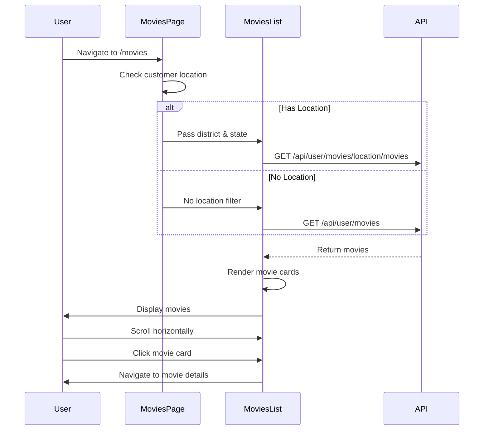
```mermaid
sequenceDiagram
    participant User
    participant MoviesPage
    participant MoviesList
    participant API

    User->>MoviesPage: Navigate to /movies
    MoviesPage->>MoviesPage: Check customer location

    alt Has Location
        MoviesPage->>MoviesList: Pass district & state
        MoviesList->>API: GET /api/user/movies/location/movies
    else No Location
        MoviesPage->>MoviesList: No location filter
        MoviesList->>API: GET /api/user/movies
    end

    API-->>MoviesList: Return movies
    MoviesList->>MoviesList: Render movie cards
    MoviesList->>User: Display movies

    User->>MoviesList: Scroll horizontally
    User->>MoviesList: Click movie card
    MoviesList->>User: Navigate to movie details
```

---

### 2. Movie Info Page

**Route**: `/movie/:movieId`
**Component**: `MovieInfoPage.jsx`

Dedicated movie detail page — BookMyShow style — showing movie metadata, a prominent "Book Tickets" CTA, full description, and a YouTube trailer embed. This is the landing page when a movie card is clicked.

**Sections:**

**Hero Banner:**
- Full-width blurred `poster_url` background (`blur-md opacity-40`) with dark gradient overlay
- Back button (top-left, frosted glass) → `/movies`
- Large poster left (`w-40 sm:w-52 md:w-60`, `aspect-[2/3]`, `rounded-2xl`) with **Trailer overlay button** at the bottom (shown only when `trailer_url` exists) — clicking scrolls to the Trailer section
- Movie metadata right: title (`text-3xl sm:text-5xl font-bold`), duration + genres + release date in a meta row, format (`2D`) + language badges, **Book Tickets** primary button → `/movie/shows/:movieId`

**About the movie:**
- Full description text, separated by `border-b`

**Trailer section** (only rendered when `trailer_url` is set):
- Responsive `aspect-video` iframe (`rounded-xl overflow-hidden shadow-2xl`, `max-w-3xl`)
- YouTube URL is normalized via `getYouTubeEmbedUrl()` helper — supports `watch?v=`, `youtu.be/`, and already-embedded URLs
- `ref={trailerRef}` — scrolled to via `scrollIntoView({ behavior: 'smooth' })` when the poster overlay button is clicked

**Side Ad Sidebar** (md+ screens only):
- Fetches `placement=side` active ads from `GET /api/ads/active?placement=side` on mount
- If ads exist, the About + Trailer area becomes a two-column layout: `flex-1` main content + `w-44 lg:w-48` sticky sidebar (`top-24`)
- Each ad is a rounded image card; clicking records the click and opens `click_url` in a new tab
- Sidebar hidden on mobile (`hidden md:flex`) and completely absent if no side ads are active

**Data flow:**

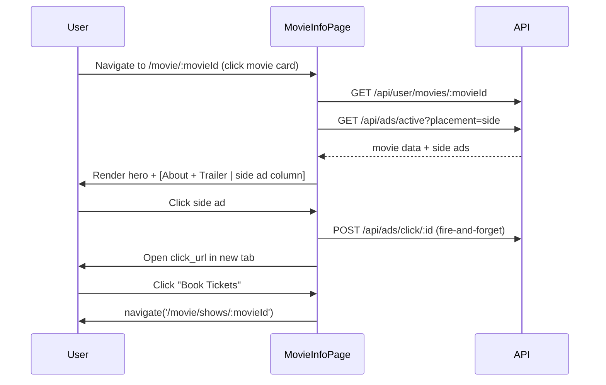
```mermaid
sequenceDiagram
    participant User
    participant MovieInfoPage
    participant API

    User->>MovieInfoPage: Navigate to /movie/:movieId (click movie card)
    MovieInfoPage->>API: GET /api/user/movies/:movieId
    MovieInfoPage->>API: GET /api/ads/active?placement=side
    API-->>MovieInfoPage: movie data + side ads

    MovieInfoPage->>User: Render hero + [About + Trailer | side ad column]

    User->>MovieInfoPage: Click side ad
    MovieInfoPage->>API: POST /api/ads/click/:id (fire-and-forget)
    MovieInfoPage->>User: Open click_url in new tab

    User->>MovieInfoPage: Click "Book Tickets"
    MovieInfoPage->>User: navigate('/movie/shows/:movieId')
```

**State:**

| State | Type | Description |
|-------|------|-------------|
| `movie` | object \| null | Movie data from `GET /api/user/movies/:movieId` |
| `loading` | boolean | Full-page skeleton on initial load |
| `error` | string \| null | Error message if fetch fails |
| `sideAds` | array | Active `side` placement ads (empty array if none) |

**Helper functions:**
- `formatDuration(mins)` — converts `144` → `"2h 24m"`
- `formatReleaseDate(dateStr)` — formats to `"27 Feb 2026"` (en-IN locale)
- `getYouTubeEmbedUrl(url)` — converts any YouTube URL format to `https://www.youtube.com/embed/VIDEO_ID`

---

### 3. Movie Shows Page

**Route**: `/movie/shows/:movieId`
**Component**: `MovieDetailsPage.jsx`

Displays a date selector and the list of cinema halls + showtimes for the selected date. Reached by clicking "Book Tickets" on the Movie Info Page. Uses a **BookMyShow-style UI**.

**Features:**

**Cinematic Banner Header:**
- Full-width blurred `poster_url` as background (`blur-md opacity-40 pointer-events-none`) with dark gradient overlay
- Back button (top-left, frosted glass) → `/movie/:movieId` (explicitly navigates, does not use browser history)
- Poster thumbnail (left, `hidden sm:block`, `w-36 md:w-44`, `aspect-[2/3]`) + movie info (right)
- Movie info: title (`text-3xl md:text-4xl`), tag pills (runtime, genres, languages as rounded pills), expandable description with "Read more / Show less" toggle

**Date Selector shelf** (`bg-card border-b border-border`):
- **3-part vertical date buttons** (DOW / day number / month) — 7 days, `w-14` fixed width, hidden scrollbar
- Selected: `bg-primary text-primary-foreground`; others: `border border-border hover:border-primary`
- Language chip on the right showing `{language[0]} • 2D`

**Availability legend:** `● AVAILABLE` (green) + `● FAST FILLING` (amber) aligned right

**Cinema Hall Cards** (`rounded-xl p-5`):
- Building icon + hall name + location + heart icon (visual-only)
- Shows as a **flat sorted list** (all shows for the hall sorted by `start_time`)
- **Green-bordered outlined buttons** — time (bold) on line 1, screen name on line 2; hover changes to primary color
- "Non-cancellable" label below buttons

**Data flow:**

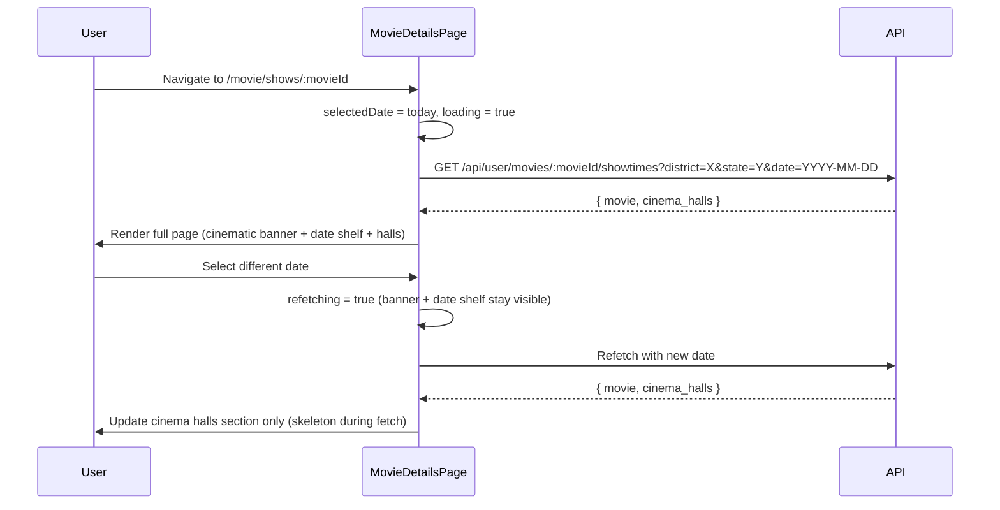
```mermaid
sequenceDiagram
    participant User
    participant MovieDetailsPage
    participant API

    User->>MovieDetailsPage: Navigate to /movie/shows/:movieId
    MovieDetailsPage->>MovieDetailsPage: selectedDate = today, loading = true
    MovieDetailsPage->>API: GET /api/user/movies/:movieId/showtimes?district=X&state=Y&date=YYYY-MM-DD
    API-->>MovieDetailsPage: { movie, cinema_halls }
    MovieDetailsPage->>User: Render full page (cinematic banner + date shelf + halls)

    User->>MovieDetailsPage: Select different date
    MovieDetailsPage->>MovieDetailsPage: refetching = true (banner + date shelf stay visible)
    MovieDetailsPage->>API: Refetch with new date
    API-->>MovieDetailsPage: { movie, cinema_halls }
    MovieDetailsPage->>User: Update cinema halls section only (skeleton during fetch)
```

**State:**

| State | Type | Description |
|-------|------|-------------|
| `movie` | object | Movie details from API |
| `cinemaHalls` | array | Cinema halls with shows for the selected date |
| `loading` | boolean | `true` on initial load — shows full-page skeleton |
| `refetching` | boolean | `true` when date changes — shows section skeleton only |
| `selectedDate` | Date | Currently selected date (defaults to today) |
| `descExpanded` | boolean | Controls description expand/collapse |

**Helper functions:**
- `formatDuration(mins)` — converts `144` → `"2h 24m"`
- `formatDateParts(date)` — returns `{ dow, day, month }` for 3-part date buttons

---

## Styling & Theming

### Tailwind Configuration

**Custom Utilities:**

- `.scrollbar-hide` - Hide scrollbars
- `.glass-effect` - Glassmorphism effect
- `.hover-lift` - Lift on hover
- `.hover-glow` - Glow effect

### Responsive Design

**Breakpoints:**

- `sm`: 640px
- `md`: 768px
- `lg`: 1024px
- `xl`: 1280px

**Mobile-First Approach:**

- Base styles for mobile
- Progressive enhancement for larger screens

### Dark Mode

**Implementation:**

```javascript
// ThemeContext manages theme state
const [theme, setTheme] = useState(localStorage.getItem("theme") || "light");

// Apply to document
document.documentElement.classList.toggle("dark", theme === "dark");
```

---

## Performance Optimizations

### Lazy Loading Images

```jsx
import { LazyLoadImage } from "react-lazy-load-image-component";

<LazyLoadImage
  src={movie.poster_url}
  alt={movie.title}
  effect="blur"
  className="w-full h-auto aspect-[2/3] object-cover"
/>;
```

**Benefits:**

- Reduced initial load time
- Better Core Web Vitals
- Smooth blur-in effect

### Horizontal Scrolling

**Optimized Scrolling:**

```css
.scrollbar-hide::-webkit-scrollbar {
  display: none;
}
.scrollbar-hide {
  -ms-overflow-style: none;
  scrollbar-width: none;
}
```

### Memoization

**useMemo for Filters:**

```javascript
const filtersKey = useMemo(() => JSON.stringify(filters), [filters]);
```

---

## Error Handling

### API Error Handling

```javascript
try {
  const response = await customerMoviesAPI.getAllMovies(params);
  setMovies(response.movies);
} catch (err) {
  console.error("Error fetching movies:", err);
  setError(err.message);
  toast.error("Failed to load movies");
}
```

### Loading States

**Skeleton Loaders:**

```jsx
{
  loading ? <MovieCardSkeleton /> : <MovieCard movie={movie} />;
}
```

### Empty States

**No Movies Found:**

```jsx
{
  movies.length === 0 && (
    <div className="text-center p-8">
      <p>No movies available at the moment.</p>
    </div>
  );
}
```

---

## Environment Variables

```env
# API Configuration
VITE_API_BASE_URL=http://localhost:5000

# Feature Flags (if any)
VITE_ENABLE_BOOKINGS=true
```

---

## Build & Deployment

### Development

```bash
npm run dev
# Runs on http://localhost:5174
```

### Production Build

```bash
npm run build
# Outputs to /dist
```

### Deployment

- Vercel deployment
- Automatic builds
- Environment variables via dashboard

---

## Accessibility

### Implemented Features

✅ **Keyboard Navigation:**

- Tab through interactive elements
- Enter to submit forms
- Escape to close modals

✅ **ARIA Labels:**

- Buttons have descriptive labels
- Form inputs have labels
- Icons have aria-labels

✅ **Semantic HTML:**

- Proper heading hierarchy
- Semantic elements (nav, main, section)
- Form structure

✅ **Color Contrast:**

- WCAG AA compliant
- Dark mode support

---

## Best Practices Implemented

✅ **Code Organization:**

- Feature-based structure
- Reusable components
- Centralized API services
- Context for global state

✅ **User Experience:**

- Loading states
- Error handling
- Toast notifications
- Responsive design
- Smooth animations

✅ **Performance:**

- Lazy loading
- Image optimization
- Efficient re-renders
- Memoization

✅ **Security:**

- HttpOnly cookies
- OTP verification
- Input validation
- XSS prevention

---

## Future Enhancements

✅ **Recently Implemented:**

- **SeatSelectionPage + OrderSummaryPage — BMS-style redesign** (March 16, 2026):
  - `SeatSelectionPage` fully redesigned: dark seat grid (`bg-gray-50 dark:bg-zinc-950`), small square buttons with zero-padded 2-digit column numbers (`01`, `02`…), theme-adaptive colors for available/sold/selected states, row labels on both sides, "Proceed to Payment" holds seats then navigates to `/order-summary` via `location.state`
  - Mobile-responsive seat grid: `overflow-x-auto` container + `w-max mx-auto` inner div prevents squishing on small screens; compact header on mobile
  - `screenPosition` from `screen.layout` still controls "All Eyes This Way" bar placement (`top` | `bottom`)
  - **New `OrderSummaryPage`** at `/order-summary` — receives booking state, shows Razorpay payment panel (left) + order summary card (right), includes countdown timer, price breakdown with dynamic convenience fee + GST, Pay button triggers Razorpay, Cancel releases seats and navigates back
- **Dynamic Convenience Fee + GST** (March 16, 2026): `OrderSummaryPage` now fetches fee settings from `GET /api/settings` — convenience fee and GST percentage are configurable by Super Admin. GST is applied only on the convenience fee. Price breakdown shows three line items: Ticket(s) price, Convenience fees (₹X/ticket), GST (Y% on conv. fee). The Razorpay order amount is now calculated entirely server-side in `createOrder` — the frontend no longer sends an amount, preventing price tampering.
- Interactive seat selection with 5-minute hold mechanism
- Razorpay payment integration
- Booking confirmation page (fetches from API, survives page refresh)
- Clickable booking cards navigating to booking detail page
- Download ticket as JPEG from booking success page
- **QR code on BookingSuccessPage** — embedded in ticket stub section, included in downloaded JPEG (90×90, level M)
- **BookingSuccessPage UI redesign** — premium cinema ticket design: red gradient banner header, perforated tear-edge divider with half-circle notches, monospace Booking ID, live-dot status badge, zinc pill seat tags, 3× pixel-ratio JPEG download
- **QR code on My Bookings page** — "Show QR" button per booking opens a dialog with the QR code
- Auth-gated navigation: "My Bookings" hidden when logged out; `/bookings`, `/profile`, `/settings` protected — redirect to `/movies` with auto-opened login modal
- **TheatresPage**: fully implemented — date-filtered cinema hall list with movies and show time buttons (`GET /api/user/movies/location/theatres`)
- **MovieDetailsPage bug fix**: cinema hall name now correctly displays (fixed field name mismatch `hall_name` → `cinema_hall_name`, `location` → `cinema_hall_location`)
- **MovieDetailsPage date filtering**: date selector connected end-to-end — changing date refetches shows filtered to that date (`GET /api/user/movies/:movieId/showtimes?date=YYYY-MM-DD`)
- **MovieDetailsPage section loading**: date change triggers skeleton only on the Cinema Halls section; movie info and date selector stay visible (`refetching` state separate from initial `loading`)
- **MovieDetailsPage UI redesign** (BookMyShow style): cinematic blurred-poster banner header, 3-part vertical date buttons (DOW/day/month), language chip, availability legend, green-bordered outlined show time buttons with screen name, expandable description, heart icon on hall cards
- **TheatresPage UI redesign** (BookMyShow style): same 3-part date buttons and availability legend, rounded-xl hall cards with heart icon, clickable movie poster + title, green-bordered show time buttons with language version, `formatDuration` helper, shows sorted by time per screen
- **MovieInfoPage** (new page, BookMyShow style): `/movie/:movieId` now shows a dedicated movie info page — large poster, title, duration/genres/release date, 2D + language badges, "Book Tickets" CTA → `/movie/shows/:movieId`, "About the movie" section, inline YouTube trailer embed with smooth-scroll from poster overlay button. Route `/movie/shows/:movieId` now serves the existing cinema-halls/showtimes page. Back button on shows page explicitly returns to `/movie/:movieId`.
- **Dynamic Ads** (March 14, 2026): `AdBanner.jsx` now fetches live banner ads from `GET /api/ads/active?placement=banner`; renders nothing if no active ads. Clicking an ad records the click-through and opens the destination URL. `MovieInfoPage.jsx` fetches `placement=side` ads and shows a sticky right-side column on `md+` screens when ads are available. `adsAPI` added to `cinema-hall-users/src/services/api.js`.
- **TopBar + TopNavbar UI/UX redesign** (March 16, 2026):
  - **TopBar — mobile search**: tapping the search icon now expands a full-width inline search input with an `X` cancel button; submitting navigates to `/search?q=<term>`. No more `alert()`.
  - **TopBar — location pill**: desktop pill no longer has `max-w-[180px]` or `truncate`; full district + state is always shown. Mobile shows a `MapPin` icon with a primary dot indicator when location is set.
  - **TopBar — notifications**: pulsing dot replaced with a numeric unread-count badge (e.g. `2`). Dropdown redesigned with per-item read/unread dot indicators.
  - **TopBar — user dropdown**: header now shows avatar + name/email side-by-side. Added "My Bookings" link. Sign In button is always visible in the bar (not hidden in hamburger menu).
  - **TopBar — hamburger menu**: simplified to theme toggle + location + "My Bookings" (if logged in). Sign In removed since it's always in the bar.
  - **TopNavbar**: active tab indicator changed from `pb-3 border-b-2` to clean `-mb-px border-b-2` (border bleeds into container edge). Hover shows `border-border` preview. Right nav items now visible at `sm+` (was `lg+`). Height `h-11`, padding matches TopBar.
  - **MoviesPage — location strip**: "Showing results near" label hidden on mobile (`hidden sm:inline`); district + state merged into one inline `<span>` to prevent awkward flex-wrap.

💡 **Potential Features:**

- Booking confirmation emails
- Push notifications
- Social sharing
- Reviews and ratings
- Watchlist/favorites
- Movie recommendations
- Advanced search filters
- Multi-language support
- Booking cancellation with refund

---

**Last Updated**: March 16, 2026 (TopBar + TopNavbar UI/UX redesign — responsive mobile search, full location pill, numeric notification badge, simplified hamburger menu; TopNavbar border-overlap active indicator; MoviesPage location strip mobile fix)
