# User Application Documentation

## Overview

The Cinema Hall User Application is a **React-based web application** designed for movie enthusiasts to discover and book cinema tickets. It features location-based movie browsing, OTP-verified authentication, and a modern, responsive interface.

**Tech Stack:**

- **Framework**: React 18 with Vite
- **Routing**: React Router v6
- **UI Library**: shadcn/ui (Radix UI primitives)
- **Styling**: Tailwind CSS 
- **State Management**: React Context API
- **HTTP Client**: Fetch API
- **Authentication**: JWT with HttpOnly cookies + OTP verification

---

## Application Architecture

### Route Structure

```mermaid
graph TD
    A[App.jsx] --> B[CinemaLayout]
    B --> C[Public Routes]
    B --> P[Protected Routes - ProtectedRoute]

    C --> D[/movies - MoviesPage]
    C --> E1[/movie/:movieId - MovieInfoPage]
    C --> E2[/movie/shows/:movieId - MovieDetailsPage]
    C --> F[/show/:showId - SeatSelectionPage]
    C --> F2[/order-summary - OrderSummaryPage]
    C --> G[/booking/success - BookingSuccessPage]
    C --> G2[/booking/failure - BookingFailurePage]
    C --> H[/theatres - TheatresPage]
    C --> H2[/offers - OffersPage]
    C --> H3[/forgot-password - ForgotPasswordPage]

    P --> I[/bookings - Bookings]
    P --> I2[/bookings/:id - BookingDetailPage]
    P --> J[/profile - ProfilePage]
    P --> K[/settings - SettingsPage]

    P --> L{Authenticated?}
    L -->|No| M[Redirect /movies + open login modal]
    L -->|Yes| N[Render page]
```

### Component Hierarchy

```mermaid
graph TD
    A[App] --> B[CustomerAuthContext]
    B --> C[ThemeContext]
    C --> D[Router]
    D --> E[CinemaLayout]

    E --> F[TopBar]
    E --> G[TopNavbar]
    E --> H[Main Content]

    F --> I[Logo & Search]
    F --> J[Location Selector]
    F --> K[Login/User Menu]
    F --> L[Theme Toggle]

    G --> M[NavLink (Movies, Theatres, Offers, Gift Cards, My Bookings)]

    H --> N[Page Components]
    N --> O[HomePage]
    N --> P[MoviesPage]
    N --> Q[TheatresPage]
```

### CinemaLayout — Layout Architecture

**Component**: `CinemaLayout.jsx`

The root layout wrapper for all pages. Renders `TopBar` + `TopNavbar` + scrollable `<main>` + footer.

**Layout structure:**
```
flex flex-col h-screen bg-background
├── TopBar             (sticky, z-50, backdrop-blur-xl)
├── TopNavbar          (border-b, backdrop-blur-sm)
└── main               (flex-1 overflow-y-auto scroll-smooth)
    └── min-h-full flex flex-col
        ├── flex-1
        │   └── mx-auto max-w-7xl px-4 sm:px-6 lg:px-8
        │       └── [page-enter animated Outlet]
        └── footer
            └── mx-auto max-w-7xl
```

**Key features:**
- **Page transitions**: The `<Outlet />` is wrapped in `<div key={pathname} className="page-enter">`. On each route change, the new page fades in with a 4px slide-up animation (300ms cubic-bezier). The `key={pathname}` ensures React unmounts/remounts the wrapper on every navigation.
- **Scroll-to-top**: `useEffect` on `pathname` scrolls the main container to top with `behavior: "smooth"` on every route change.
- **`scroll-smooth`**: Applied to the `<main>` element for smooth anchor scrolling.
- **Container system**: All content is constrained to `max-w-7xl` with responsive horizontal padding, matching `TopBar` and `TopNavbar` for visual consistency.
- **Accessibility**: `<main>` has `role="main"` and `aria-label="Main content"`. The footer uses semantic `<footer>` element.

---

## Authentication System

### Customer Authentication Flow

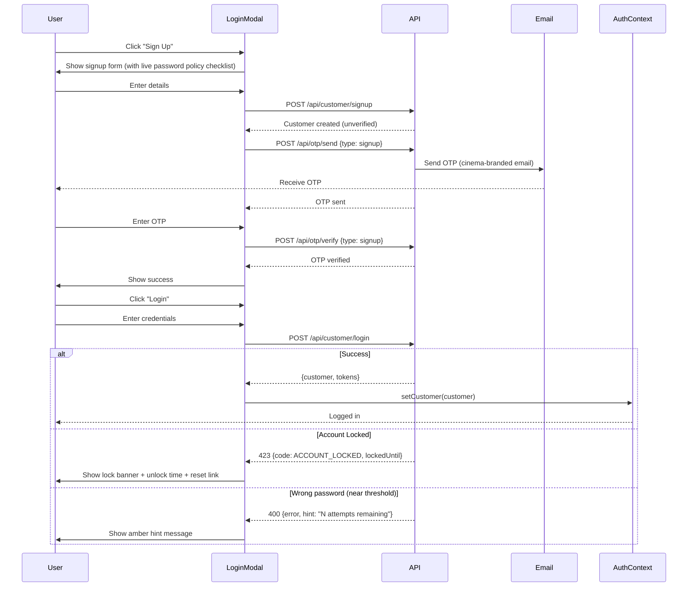
```mermaid
sequenceDiagram
    participant User
    participant LoginModal
    participant API
    participant Email
    participant AuthContext

    User->>LoginModal: Click "Sign Up"
    LoginModal->>User: Show signup form (with live password policy checklist)

    User->>LoginModal: Enter details
    LoginModal->>API: POST /api/customer/signup
    API-->>LoginModal: Customer created (unverified)

    LoginModal->>API: POST /api/otp/send {type: signup}
    API->>Email: Send OTP (cinema-branded email)
    Email-->>User: Receive OTP
    API-->>LoginModal: OTP sent

    User->>LoginModal: Enter OTP
    LoginModal->>API: POST /api/otp/verify {type: signup}
    API-->>LoginModal: OTP verified
    LoginModal->>User: Show success

    User->>LoginModal: Click "Login"
    User->>LoginModal: Enter credentials
    LoginModal->>API: POST /api/customer/login
    alt Success
        API-->>LoginModal: {customer, tokens}
        LoginModal->>AuthContext: setCustomer(customer)
        AuthContext-->>User: Logged in
    else Account Locked
        API-->>LoginModal: 423 {code: ACCOUNT_LOCKED, lockedUntil}
        LoginModal->>User: Show lock banner + unlock time + reset link
    else Wrong password (near threshold)
        API-->>LoginModal: 400 {error, hint: "N attempts remaining"}
        LoginModal->>User: Show amber hint message
    end
```

### Forgot Password Flow

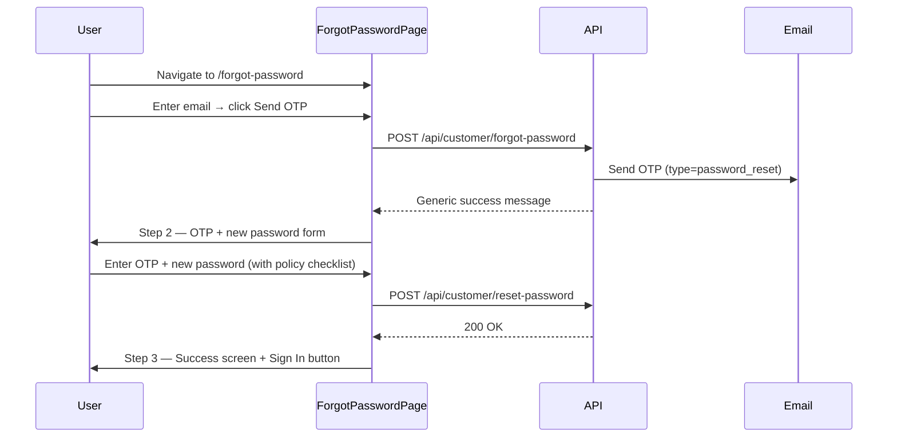
```mermaid
sequenceDiagram
    participant User
    participant ForgotPasswordPage
    participant API
    participant Email

    User->>ForgotPasswordPage: Navigate to /forgot-password
    User->>ForgotPasswordPage: Enter email → click Send OTP
    ForgotPasswordPage->>API: POST /api/customer/forgot-password
    API->>Email: Send OTP (type=password_reset)
    API-->>ForgotPasswordPage: Generic success message
    ForgotPasswordPage->>User: Step 2 — OTP + new password form

    User->>ForgotPasswordPage: Enter OTP + new password (with policy checklist)
    ForgotPasswordPage->>API: POST /api/customer/reset-password
    API-->>ForgotPasswordPage: 200 OK
    ForgotPasswordPage->>User: Step 3 — Success screen + Sign In button
```

### Google OAuth Flow

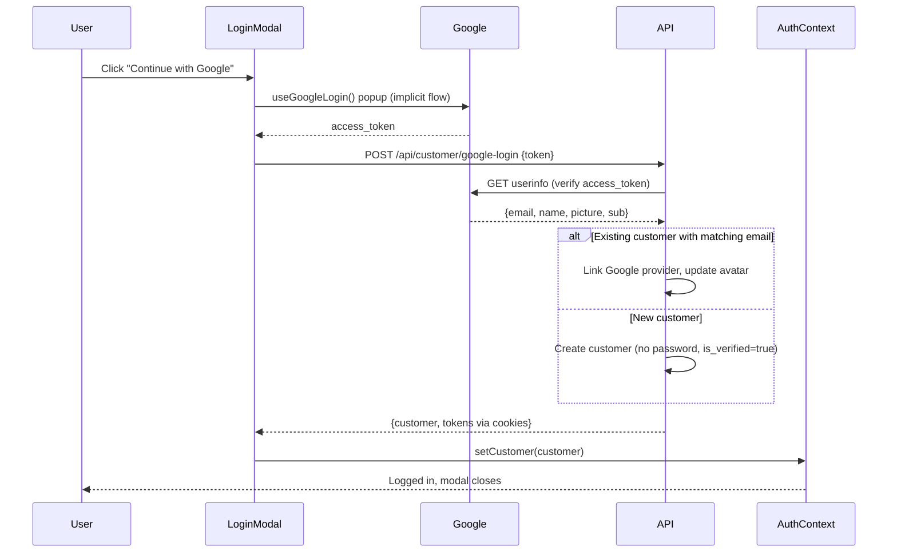
```mermaid
sequenceDiagram
    participant User
    participant LoginModal
    participant Google
    participant API
    participant AuthContext

    User->>LoginModal: Click "Continue with Google"
    LoginModal->>Google: useGoogleLogin() popup (implicit flow)
    Google-->>LoginModal: access_token
    LoginModal->>API: POST /api/customer/google-login {token}
    API->>Google: GET userinfo (verify access_token)
    Google-->>API: {email, name, picture, sub}
    alt Existing customer with matching email
        API->>API: Link Google provider, update avatar
    else New customer
        API->>API: Create customer (no password, is_verified=true)
    end
    API-->>LoginModal: {customer, tokens via cookies}
    LoginModal->>AuthContext: setCustomer(customer)
    AuthContext-->>User: Logged in, modal closes
```

The Google OAuth button appears in **both** the Login tab and the Signup tab of the LoginModal, separated by an "Or" divider. OAuth-created accounts have no password and `auth_providers: ['google']`.

### OTP Verification Process

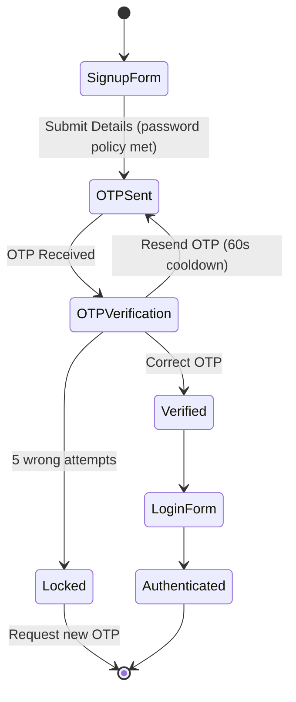
```mermaid
stateDiagram-v2
    [*] --> SignupForm
    SignupForm --> OTPSent: Submit Details (password policy met)
    OTPSent --> OTPVerification: OTP Received
    OTPVerification --> Verified: Correct OTP
    OTPVerification --> OTPSent: Resend OTP (60s cooldown)
    OTPVerification --> Locked: 5 wrong attempts
    Locked --> [*]: Request new OTP
    Verified --> LoginForm
    LoginForm --> Authenticated
    Authenticated --> [*]
```

### CustomerAuthContext State

**Location**: `src/context/CustomerAuthContext.jsx`

**State Variables:**

```javascript
{
  customer: {
    id: "uuid",
    name: "Jane Smith",
    email: "jane@example.com",
    phone: "+9876543210",
    district: "Pune",
    state: "Maharashtra",
    is_verified: true,
    auth_providers: ["local", "google"],
    avatar: "https://lh3.googleusercontent.com/...",
    has_password: true
  },
  isLoggedIn: boolean,
  loading: boolean
}
```

**Key Functions:**

- `login(email, password)` — Authenticate; returns `{ success, customer }` or `{ success: false, message, details }` (details contains `code` for ACCOUNT_LOCKED)
- `logout()` — Clear session + revoke DB session
- `signup(data)` — Register new customer
- `googleLogin(token)` — Authenticate via Google OAuth access token; returns `{ success, message }`
- `refreshCustomer()` — Re-fetches `/me` to update customer state (used after linking/unlinking providers)
- `update(data)` — Update profile (name, phone, location)
- `changePassword(currentPassword, newPassword)` — Change password (authenticated); revokes other sessions
- `fetchLocationDetails()` — Detect location via browser geolocation
- `setLocationManually(city, state)` — Set location from LocationModal
- `updateProfileWithLocation()` — Sync location to backend profile

---

## Features Documentation

### 1. Movie Browsing

**Route**: `/movies`  
**Component**: `MoviesPage.jsx`

#### Feature Overview

```mermaid
flowchart TD
    A[Movies Page] --> B[Location Detection]
    B --> C{Customer Logged In?}
    C -->|Yes| D[Use Customer Location]
    C -->|No| E[Show All Movies]

    D --> F[Fetch Movies by District/State]
    E --> G[Fetch All Movies]

    F --> H[AdBanner — Dynamic Banner Ads]
    G --> H
    H --> I[GET /api/ads/active?placement=banner]
    I --> J{Ads Returned?}
    J -->|Yes| K[Render carousel]
    J -->|No| L[Render nothing]

    A --> M[Category Tabs]
    M --> N[Now Showing | Coming Soon]
    N --> O[MoviesList Component - Single instance, keyed by tab]

    O --> P[Fetch Movies by status]
    P --> Q[Display Movie Cards in Horizontal Scroll Row]
    Q --> R[Scroll snap + keyboard arrows + chevron buttons]

    A --> S[HeroCarousel - top 5 rated movies]
    S --> T[Autoplay 5s, hover pause, dot nav]
    T --> U[Poster gradient overlays, metadata, dual CTAs]
```

#### Hero Carousel

A full-width auto-rotating carousel at the top of the page showcasing the top 5 highest-rated "Now Showing" movies.

**Behavior:**
- Fetches `GET /api/user/movies?status=now_showing&limit=8`, sorted by `vote_average` (parsed as float) descending, capped at 5
- Autoplay at 5-second intervals; pauses on `mouseEnter` / `focus`, resumes on `mouseLeave` / `blur`
- Fade crossfade between slides: `duration-400` with `opacity` + `scale` (only transform/opacity animated — no layout triggers)
- Dot indicators at the bottom center — active dot is wider pill (`w-7 sm:w-9 h-2`), inactive dots are `w-2 h-2` with `hover:scale-125`
- Backdrop image rendered via high-quality `backdrop_path` (with `poster_url` as a fallback) using `object-cover` and modern hero gradient overlays (`hero-gradient-t` + `hero-gradient-r`) using `--background` tokens
- **Cinematic vignette**: A `hero-vignette` radial gradient overlay (`radial-gradient(ellipse at center, transparent 50%, oklch(from var(--background) l c h / 0.4) 100%)`) applied on top of the hero backdrop for premium depth
- "Now Trending" badge: `bg-primary featured-glow` with animated pulse dot
- Book Now button uses `custom-hover` class: `hover:scale-[1.02] active:scale-[0.98]` with primary glow shadow
- Autoplay progress bar (commented out): thin `h-[3px]` bar animating via `@keyframes hero-progress` (5s linear) at the bottom of the carousel
- Dual CTAs: "Book Now" (navigates to `/movie/shows/:id`) and "View Details" (navigates to `/movie/:id` with chevron hover animation)
- Keyboard accessible: `role="region"`, `aria-roledescription="carousel"`, `inert` on inactive slides

---

#### Category Tabs

Pill-style toggle between "Now Showing" and "Coming Soon" rendered below the hero.

- Container: `glass-effect p-1 rounded-xl shadow-sm`
- Active tab: `bg-primary text-primary-foreground shadow-sm shadow-primary/20`
- Inactive tab: `text-muted-foreground hover:text-foreground hover:bg-background/50`
- `aria-pressed` on each tab button
- Single `MoviesList` instance rendered with `key={activeTab}` — remounts on tab switch, re-fetching with the corresponding `status` filter
- Location context (district/state) shown inline on desktop next to the tabs

---

#### AdBanner Component

**Component**: `AdBanner.jsx`

Fetches active `banner` placement ads from the API on mount. Renders a full-width Embla carousel; hidden entirely if no ads are currently active.

**Behaviour:**
- Fetches `GET /api/ads/active?placement=banner`
- Each slide is a clickable image — clicking records a click (`POST /api/ads/click/:id`) and opens `click_url` in a new tab
- Yellow "AD" badge (`bg-rating/80 text-rating-foreground`) overlaid on the top-left corner of each ad image
- Dot indicators shown only when there are 2+ slides
- Section has no x-axis padding (banner spans edge-to-edge within its container)

#### MoviesList Component

**Props:**

```javascript
{
  title: "Now Showing",           // Section title
  movies: [],                     // Custom movies array (optional)
  district: "Mumbai",             // Filter by district
  state: "Maharashtra",           // Filter by state
  filters: {                      // Additional filters
    status: "now_showing",        // "now_showing" | "upcoming" — also controls Book Now visibility
    limit: 20,
    genre: ["Action"],
    language: ["English"]
  }
}
```

**`showBookNow` logic:** Derived automatically from `filters.status`. When `status === 'upcoming'` the "Book Now" CTA is hidden on every card in that list; all other statuses show it.

#### Movie Card Display

```mermaid
graph TD
    A[Movie Card - role=button, tabIndex=0] --> B[Poster Container - rounded-2xl]
    A --> C[Title below poster]
    A --> D[Metadata row]

    B --> E[LazyLoadImage - blur effect]
    B --> F[Rating Badge - always visible, top-left]
    B --> G[Genre Tags - always visible, bottom-left]
    B --> H[Bottom gradient - black/60 to transparent]
    B --> I[Hover Overlay - Book Now CTA]

    F --> J[fill-rating text-rating - yellow star token]
    G --> K[bg-black/50 backdrop-blur-sm - always visible]
    I --> L[bg-black/20 - scale-90 to scale-100 on hover]

    C --> M[group-hover:text-primary - color transition]
    D --> N[Genres + Clock icon + Duration]
    N --> O[Separator | between items]
```

**Card Information:**

- **Poster**: `rounded-2xl` overflow-hidden container with `shadow-md` and `border border-border/40` base. Adds `card-glow-border` class — on hover, border transitions to `primary/25` with a `20px` primary glow shadow (`box-shadow: 0 0 20px oklch(from var(--primary) l c h / 0.12), var(--shadow-xl)`), 400ms cubic-bezier. `LazyLoadImage` with blur effect. `aspect-[2/3]` with `object-cover` and `group-hover:scale-105` (500ms transition)
- **Rating badge**: `bg-black/65 backdrop-blur-md shadow-lg shadow-black/20` pill at `top-3 left-3` with `pl-1.5 pr-2.5 py-1`. Uses `fill-rating text-rating` (golden `--rating` token) with `tabular-nums` font variant. Rating is derived from `movie.vote_average` (`parseFloat`, `.toFixed(1)`) and only shown when it's a finite number `> 0`
- **Genre tags**: Always visible at `bottom-3 left-3`. `bg-black/55 backdrop-blur-sm text-white/90` with `gap-1.5`. Max 2 genres shown. Constrained to `max-w-[70%]` of poster width
- **Bottom gradient**: `from-black/65 via-black/20 to-transparent h-28` (taller, with mid-stop) — ensures genre tags are readable. Present on all cards regardless of hover state
- **Hover**: `card-hover` class: 400ms cubic-bezier transition on `transform` and `box-shadow`. On hover: `translateY(-4px) scale(1.02)` + `shadow-xl`. A `bg-gradient-to-t from-black/40 via-black/10 to-transparent` overlay fades in with a "Book Now" button centered. Button uses `custom-hover` class with `hover:scale-105 active:scale-95` and larger padding (`py-2.5 px-5`). Button navigates to `/movie/shows/:id` with `e.stopPropagation()`
- **Title**: Font-semibold, `text-sm md:text-[15px]`, `line-clamp-1`. Color transitions to `text-primary` on group hover
- **Metadata row**: Genres (first 2, joined by ` / `) with `font-medium max-w-[55%]` + `|` separator (`text-border/60`) + Clock icon + formatted duration (`Xh Ym`). All `text-xs text-muted-foreground` with `mt-1.5`
- **Language**: `text-[11px] text-muted-foreground/60` below metadata, `line-clamp-1`
- **Keyboard accessibility**: `role="button"`, `tabIndex={0}`, `aria-label` = "movie title, rated X.X" (omitted when the derived rating is `null`), `onKeyDown` for Enter/Space. `focus-ring` class for visible focus outline

#### Scroll Navigation

Each `MoviesList` section uses a horizontal scroll container with the following features:

- **Scroll snap**: `scroll-snap-x` (`scroll-snap-type: x mandatory`) on the container, `scroll-snap-start` on each card
- **Keyboard arrows**: Scroll container has `tabIndex={0}` and `onKeyDown` handler for `ArrowLeft`/`ArrowRight`
- **Chevron buttons**: Left/right arrow buttons (desktop `sm+` only) in the section header. Uses `arrow-glass` class: `backdrop-filter: blur(8px)`, `background: oklch(from var(--card) l c h / 0.85)`, `border: 1px solid oklch(from var(--border) l c h / 0.4)`. On hover: `blur(12px)`, `background: oklch(from var(--card) l c h / 0.95)`, `border-color: primary/30`, primary glow shadow. Enabled/disabled reactively via `scroll` event + `ResizeObserver` (disabled opacity `25%`). Scrolls 75% of container width with `behavior: 'smooth'`
- **Scroll fade edge overlays**: The scroll row is wrapped in a `relative` div with absolutely-positioned `scroll-fade-left` and `scroll-fade-right` elements (48px wide, z-5). These render gradient blends from `--background` to transparent, providing a soft fade-in effect at the edges. Their `opacity` is `0` by default and transitions to `0.85` via `scroll-fade-visible` class when the corresponding scroll direction is available — preventing an abrupt hard edge on the first/last cards
- **Section header**: `text-xl md:text-2xl font-bold` title with `h-7` accent bar. "View All" button uses `group` with an `ArrowRight` icon that animates `hover:translate-x-0.5` on hover. Movie count badge (`hidden sm:inline text-xs text-muted-foreground`) showing `N movies`

#### Location-Based Filtering

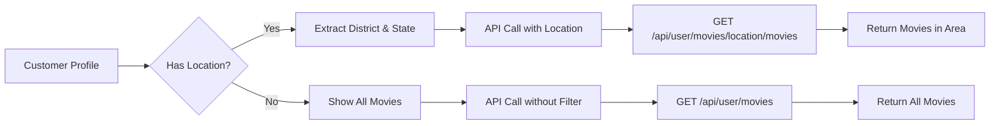
```mermaid
flowchart LR
    A[Customer Profile] --> B{Has Location?}
    B -->|Yes| C[Extract District & State]
    B -->|No| D[Show All Movies]

    C --> E[API Call with Location]
    E --> F[GET /api/user/movies/location/movies]
    F --> G[Return Movies in Area]

    D --> H[API Call without Filter]
    H --> I[GET /api/user/movies]
    I --> J[Return All Movies]
```

---

### 2. Authentication Modal

**Component**: `LoginModal.jsx`

#### Modal States

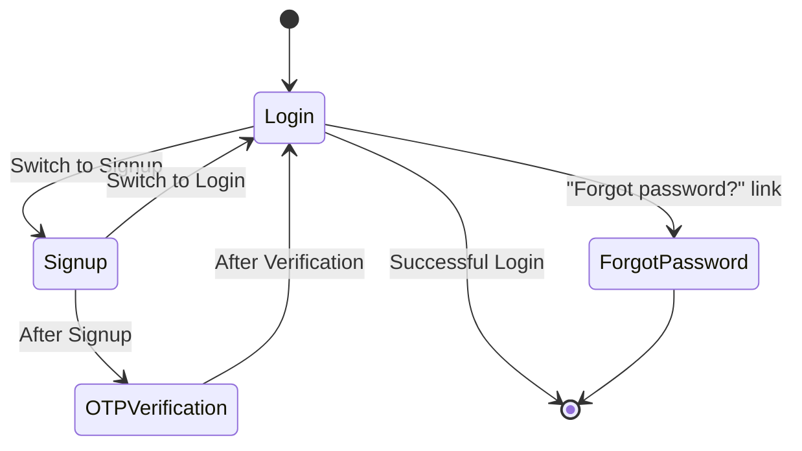
```mermaid
stateDiagram-v2
    [*] --> Login
    Login --> Signup: Switch to Signup
    Signup --> Login: Switch to Login
    Signup --> OTPVerification: After Signup
    OTPVerification --> Login: After Verification
    Login --> [*]: Successful Login
    Login --> ForgotPassword: "Forgot password?" link
    ForgotPassword --> [*]
```

#### Login Form

**Fields:**

- Email (required)
- Password (required, with show/hide toggle)

**OAuth Button:**
- **"Continue with Google"** — Below the login form, separated by an "Or" divider (`Separator` component). Uses `@react-oauth/google` `useGoogleLogin` hook (implicit flow). On success, calls `customerAuthContext.googleLogin(token)`. Shows a spinner while processing.

**Security Features:**

- **Account lockout banner**: If `code === 'ACCOUNT_LOCKED'` in the response, shows a `ShieldAlert` red banner with the unlock time (formatted via `lockedUntil`)
- **Attempt hint**: If the server returns a `hint` field (e.g. `"2 attempts remaining before 15-min lockout"`), shows an amber info banner below the password field
- **Forgot password link**: Navigates to `/forgot-password` and closes the modal

#### Signup Form

**Fields:**

```javascript
{
  name: "Jane Smith",
  email: "jane@example.com",
  password: "password123",
  phone: "+9876543210",
  district: "Pune",
  state: "Maharashtra"
}
```

**Password Policy Checklist:**

A live `PasswordPolicyChecklist` component renders below the password field showing 5 real-time checks (green check / amber pending):

1. At least 8 characters
2. One uppercase letter
3. One lowercase letter
4. One digit
5. One special character (`!@#$%^&*` etc.)

The signup submit button is disabled until all 5 checks pass.

**OAuth Button:**
- **"Continue with Google"** — Below the signup form (only shown before OTP stage), separated by an "Or" divider. Same `useGoogleLogin` implicit flow as Login tab. OAuth signup creates the account immediately (no OTP needed since Google email is pre-verified).

#### OTP Verification

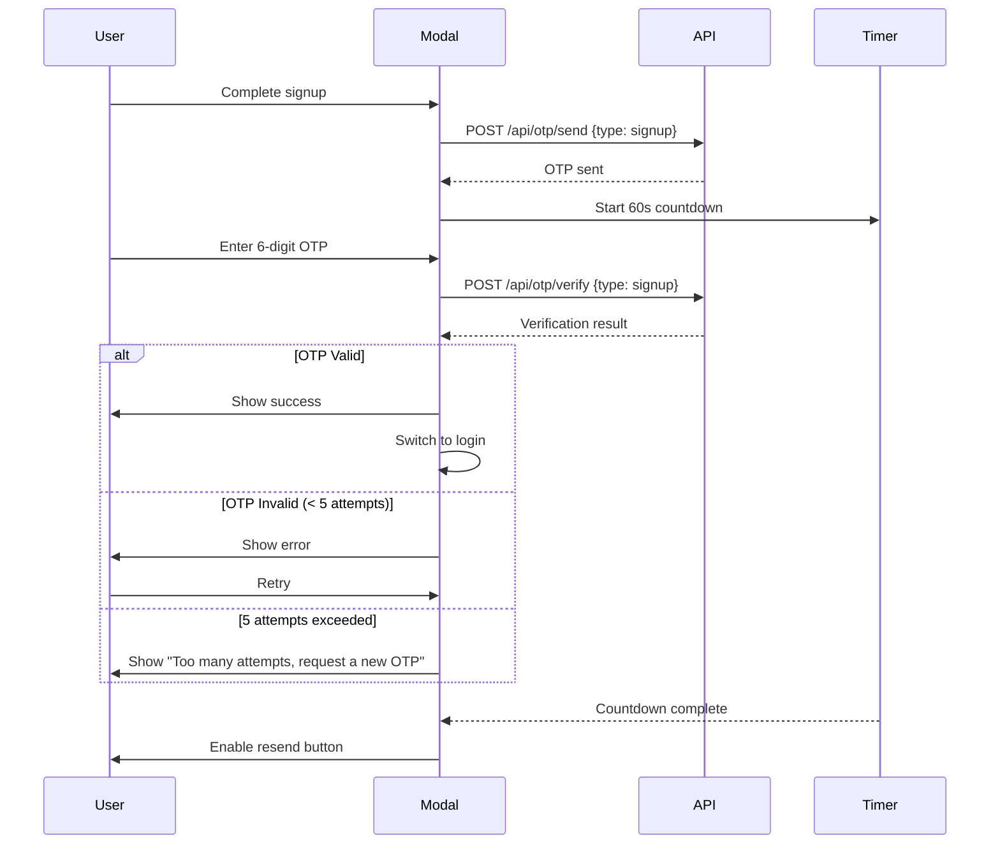
```mermaid
sequenceDiagram
    participant User
    participant Modal
    participant API
    participant Timer

    User->>Modal: Complete signup
    Modal->>API: POST /api/otp/send {type: signup}
    API-->>Modal: OTP sent
    Modal->>Timer: Start 60s countdown

    User->>Modal: Enter 6-digit OTP
    Modal->>API: POST /api/otp/verify {type: signup}
    API-->>Modal: Verification result

    alt OTP Valid
        Modal->>User: Show success
        Modal->>Modal: Switch to login
    else OTP Invalid (< 5 attempts)
        Modal->>User: Show error
        User->>Modal: Retry
    else 5 attempts exceeded
        Modal->>User: Show "Too many attempts, request a new OTP"
    end

    Timer-->>Modal: Countdown complete
    Modal->>User: Enable resend button
```

**OTP Features:**

- 6-digit OTP input (shadcn `InputOTP`)
- 60-second resend timer
- Max 5 wrong attempts before invalidation
- OTP hashed with SHA-256 server-side (never stored plain)
- Rate-limited: max 3 sends per 10 minutes per email/type pair

---

### 2a. Forgot Password Page

**Route**: `/forgot-password`
**Component**: `ForgotPasswordPage.jsx`
**Auth required**: No (public route)

3-step OTP-based password reset flow:

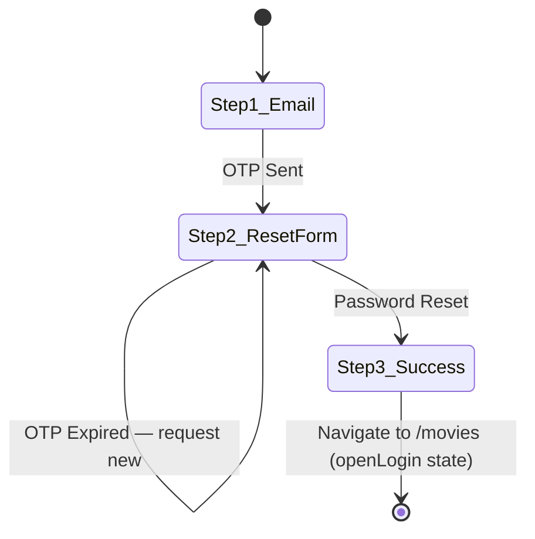
```mermaid
stateDiagram-v2
    [*] --> Step1_Email
    Step1_Email --> Step2_ResetForm: OTP Sent
    Step2_ResetForm --> Step2_ResetForm: Resend OTP (60s cooldown)
    Step2_ResetForm --> Step3_Success: Password Reset
    Step2_ResetForm --> Step2_ResetForm: OTP Expired — request new
    Step3_Success --> [*]: Navigate to /movies (openLogin state)
```

**Step 1 — Email:**
- Enter email address
- Calls `POST /api/customer/forgot-password`
- Always advances to Step 2 (generic response — no enumeration)

**Step 2 — OTP + New Password:**
- `InputOTP` 6-digit component
- New password field with live `PasswordPolicyChecklist`
- Confirm password field
- 60-second resend timer; "Resend OTP" enabled when timer expires
- Submit calls `POST /api/customer/reset-password`
- Error codes handled:
  - `OTP_EXPIRED` → shows "OTP expired, request a new one" + re-enables resend
  - `OTP_ATTEMPTS_EXCEEDED` → shows "Too many failed attempts" + re-enables resend

**Step 3 — Success:**
- `CheckCircle2` icon + success message
- "Sign In" button navigates to `/movies` with `state: { openLogin: true }` (auto-opens LoginModal)

---

### 3. Top Navigation Bar

**Component**: `TopBar.jsx`

#### Navigation Structure

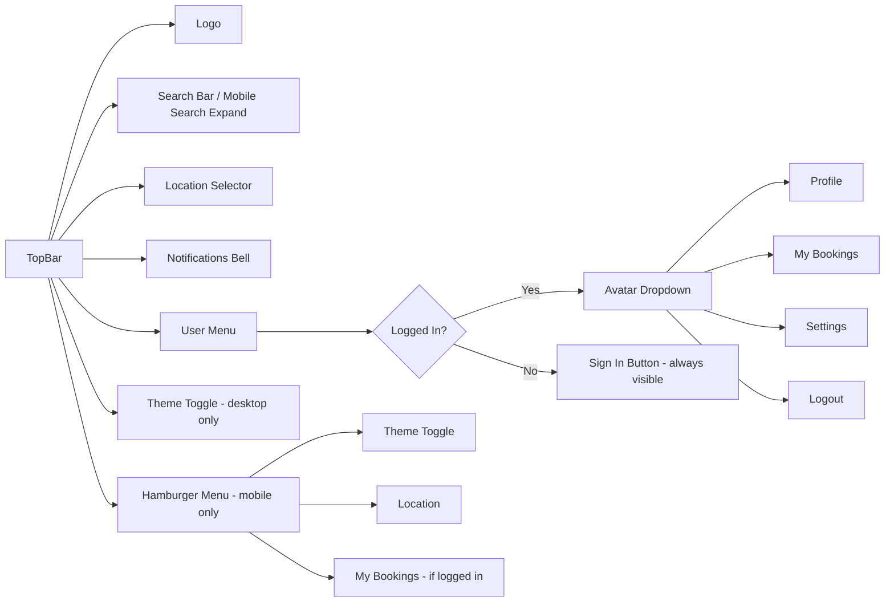
```mermaid
graph LR
    A[TopBar] --> B[Logo]
    A --> C[Search Bar / Mobile Search Expand]
    A --> D[Location Selector]
    A --> E[Notifications Bell]
    A --> F[User Menu]
    A --> G[Theme Toggle - desktop only]
    A --> H[Hamburger Menu - mobile only]

    F --> I{Logged In?}
    I -->|Yes| J[Avatar Dropdown]
    I -->|No| K[Sign In Button - always visible]

    J --> L[Profile]
    J --> M[My Bookings]
    J --> N[Settings]
    J --> O[Logout]

    H --> P[Theme Toggle]
    H --> Q[Location]
    H --> R[My Bookings - if logged in]
```

#### Auto-Open Login Modal (Protected Route Redirect)

When a user is redirected from a protected route (e.g. `/bookings` while logged out), `TopBar` automatically opens the login modal:

1. `ProtectedRoute` navigates to `/movies` with `state: { openLogin: true }`
2. `TopBar` detects `location.state?.openLogin` via a `useEffect`
3. `LoginModal` is opened and the router state is cleared (so refresh doesn't re-trigger it)

#### Search Functionality

**TopBar implementation:** `sticky top-0 z-50 w-full border-b border-border/40 bg-background/80 backdrop-blur-xl supports-[backdrop-filter]:bg-background/60 transition-all duration-300` with `role="banner"` landmark. Container uses `mx-auto max-w-7xl px-3 sm:px-6 lg:px-8` — consistent with other layout components. All icon-only buttons include `aria-label` attributes. Decorative indicators use `aria-hidden="true"`.

**Desktop (`sm+`):** Full-width pill-shaped input bar (max `xl`) centered in the header. Submits via Enter and navigates to `/search?q=<term>`.

**Mobile:** A `Search` icon button is always visible. Tapping it replaces the entire TopBar content with an inline search input + `X` cancel button (full-width). The overlay uses `animate-in slide-in-from-top-2 duration-200` for smooth entry. Cancelling clears the query and restores the normal bar. No alert — fully functional.

#### Location Selector

**Desktop (`sm+`):** Pill-shaped button showing `<MapPin icon> District · State`. State abbreviation is only shown on `lg+` screens. No `max-width` or `truncate` — the full location name is always displayed. Clicking opens `LocationModal`.

**Mobile:** Shows only a `MapPin` icon button. A small primary-coloured dot appears in the corner when a location is set (visual indicator). Full location label is accessible via the hamburger menu.

**Auto-open:** If no location is cached on first load (`!district && !state`), `LocationModal` opens automatically.

#### Notifications

A `Bell` icon button is always visible. When there are unread notifications, a **numeric badge** (e.g. `2`) appears at the top-right of the bell instead of a pulsing dot — more informative and less distracting.

The dropdown (`w-80`) shows:
- Header: "Notifications" label + unread count
- Each notification: coloured dot (primary = unread, transparent = read) + title + timestamp
- "View all notifications" footer link → `/notifications`

#### User Menu

**Logged Out State:**

- "Sign in" pill button — always visible in the bar on all screen sizes (not hidden in the hamburger menu), opens `LoginModal`

**Logged In State:**

- Avatar button (initials, gradient background, `border-2 border-primary/30`)
- Dropdown header shows avatar + full name + email side-by-side
- Dropdown menu:
  - Profile → `/profile`
  - My Bookings → `/bookings`
  - Settings → `/settings`
  - Logout (destructive style)

#### Theme Toggle

**Options:**

- Light mode (Sun icon)
- Dark mode (Moon icon)
- Toggle between themes
- Persisted in localStorage
- **Desktop only** — visible as a standalone icon button; on mobile it lives in the hamburger menu

#### Mobile Dropdown Menu

On small screens (`sm:hidden`), a hamburger menu (`Menu` icon) contains only:
- Theme toggle (Light / Dark Mode)
- Location item — shows full `District, State` label; clicking opens `LocationModal` (deferred)
- **My Bookings** link (shown only when customer is logged in)

> **Sign In is no longer in the hamburger menu** — it is always directly visible in the bar as a pill button.

**Known Fix — Radix UI DropdownMenu + Dialog conflict:**

Opening a Radix `Dialog` (modal) directly from a `DropdownMenuItem` click causes a race condition where both components fight over:
- `aria-hidden` on the portal root
- `pointer-events` on `document.body`
- Focus trap ownership

This results in the Dialog visually closing but leaving the page frozen (no clicks register) because the dropdown's `pointer-events: none` lock is never cleaned up.

**Fixes applied:**

1. **Removed `asChild` from the mobile `DropdownMenuTrigger`** — using `asChild` with a `<Button>` child created a button-in-button nesting issue that compounded the modal conflict.

2. **Deferred modal `open` calls with `setTimeout(..., 0)`** — all `DropdownMenuItem` handlers that open a Dialog now defer the state update to the next event-loop tick, giving Radix time to fully unmount the dropdown and release its overlay/focus-trap state before the Dialog mounts.

```jsx
// Before (causes freeze)
<DropdownMenuItem onClick={() => setLocationOpen(true)}>

// After (deferred — dropdown unmounts cleanly first)
<DropdownMenuItem onClick={() => setTimeout(() => setLocationOpen(true), 0)}>
```

---

### 3b. Secondary Navigation Bar

**Component**: `TopNavbar.jsx`

#### Component Architecture

Uses a `NavLink` helper component for consistent rendering across desktop (left/right split) and mobile (flat scrollable strip).

```jsx
function NavLink({ item, isActive }) {
  const Icon = item.icon
  return (
    <Link
      className={cn(
        "relative inline-flex items-center gap-1.5 px-3 sm:px-4 text-sm font-medium transition-all duration-200 whitespace-nowrap",
        "before:absolute before:inset-x-2 before:bottom-0 before:h-0.5 before:rounded-full before:transition-transform before:duration-200",
        isActive
          ? "text-primary before:bg-primary before:scale-x-100"
          : "text-muted-foreground hover:text-foreground before:bg-foreground/20 hover:before:scale-x-75"
      )}
      aria-current={isActive ? "page" : undefined}
    >
      <Icon className="h-3.5 w-3.5 shrink-0" />
      {item.name}
    </Link>
  )
}
```

#### Navigation Items

| Position | Item | Icon | Auth Required | Mobile | Desktop |
|----------|------|------|---------------|--------|---------|
| Left | Movies | `Film` | No | Scrollable | Always |
| Left | Theatres | `Building2` | No | Scrollable | Always |
| Right | My Bookings | `Ticket` | **Yes** | Scrollable | `sm+`, logged in |
| Right | Offers | `Tag` | No | Scrollable | `sm+` |
| Right | Gift Cards | `Gift` | No | Scrollable | `sm+` |

**Active indicator:** Animated underline via CSS `::before` pseudo-element. Uses `scaleX` transform for smooth animation:
- **Active**: `scaleX(1)` with `--primary` color
- **Hover (inactive)**: `scaleX(0.75)` with `foreground/20` color
- **Default**: `scaleX(0)` — hidden

**Mobile behavior:** All nav items render in a single horizontal scrollable strip (`overflow-x-auto no-scrollbar`). The `no-scrollbar` utility hides the scrollbar while preserving scroll functionality. Desktop retains left/right split layout.

**"My Bookings"** is conditionally rendered — only appears when the customer is logged in.

**Height & padding:** `h-11 sm:h-12` with `mx-auto max-w-7xl px-3 sm:px-6 lg:px-8` — matching TopBar's container system.

**Backdrop:** `bg-background/95 backdrop-blur-sm supports-[backdrop-filter]:bg-background/80` — subtle glassmorphism matching TopBar's aesthetic.

---

### 4. Additional Pages

#### HomePage

**Route**: `/`  
**Component**: `HomePage.jsx`

Simple welcome page with:

- Welcome message
- Navigation to other sections
- Featured content (if implemented)

#### TheatresPage

**Route**: `/theatres`
**Component**: `TheatresPage.jsx`

Browse cinema halls by location with their movies and showtimes. Uses a **BookMyShow-style UI**.

**Features:**
- **3-part vertical date buttons** (DOW / day number / month) — 7 days shown, inside a `bg-card border-b` shelf; selected date highlighted in cinema red (`bg-primary`)
- **Availability legend** — `● AVAILABLE` (green) + `● FAST FILLING` (amber) aligned right below the date shelf
- Fetches `GET /api/user/movies/location/theatres` with `district`, `state`, `date` from user's profile
- **Cinema hall cards** (`rounded-xl`): building icon + hall name + location + **Directions** button + heart icon (visual)
  - **Directions button** — opens Google Maps in a new tab:
    - If the hall has `latitude`/`longitude` → `google.com/maps/dir/?api=1&destination={lat},{lng}` (navigation mode)
    - Else fallback → `google.com/maps/search/?api=1&query={hall_name+location}` (search mode)
- Each hall shows its movies with:
  - Clickable poster thumbnail (navigates to `/movie/:movieId`)
  - Clickable title (same navigation)
  - Duration badge (`2h 13m` format via `formatDuration`) + genre pills
  - **Green-bordered outlined show time buttons** — time (bold) on line 1, `screen_name · language_version` on line 2; sorted by time; hover changes to primary color
  - "Non-cancellable" label below each movie's shows
- Skeleton loader covers the cinema halls section (date selector stays visible during refetch)
- Empty state with cinema icon when no shows are scheduled for the selected date
- **No-location state** — when `district`/`state` are not set, renders a full-page prompt with a location pin icon, "Set Your Location" heading, and a **Select City** button that opens `LocationModal`; after the user picks a city the `useEffect` dependency on `[district, state]` re-fires and fetches theatres automatically

**Helper functions:**
- `formatDuration(mins)` — converts `144` → `"2h 24m"`
- `formatDateParts(date)` — returns `{ dow, day, month }` for 3-part date buttons

**Data flow:**

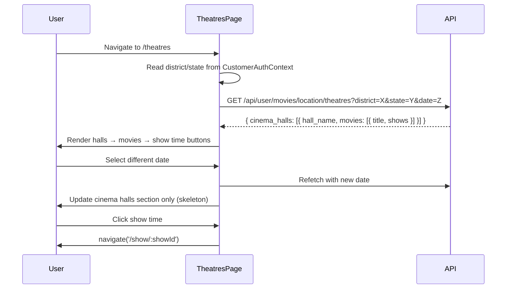
```mermaid
sequenceDiagram
    participant User
    participant TheatresPage
    participant API

    User->>TheatresPage: Navigate to /theatres
    TheatresPage->>TheatresPage: Read district/state from CustomerAuthContext
    TheatresPage->>API: GET /api/user/movies/location/theatres?district=X&state=Y&date=Z
    API-->>TheatresPage: { cinema_halls: [{ hall_name, movies: [{ title, shows }] }] }
    TheatresPage->>User: Render halls → movies → show time buttons

    User->>TheatresPage: Select different date
    TheatresPage->>API: Refetch with new date
    TheatresPage->>User: Update cinema halls section only (skeleton)

    User->>TheatresPage: Click show time
    TheatresPage->>User: navigate('/show/:showId')
```

#### SeatSelectionPage

**Route**: `/show/:showId`
**Component**: `SeatSelectionPage.jsx`

**Sticky header** — back button, movie poster thumbnail, title + language, show time badge, screen type badge (2D/3D/IMAX) styled with a frosted glassmorphic look. Stacks vertically and scales down vertical padding (`py-2.5`) on mobile devices to preserve screen height.
- **Seat Count Modal** — On first visit, a centered modal asks "How many seats?" (1–10). On mobile, the selector uses a **2-row by 5-column grid** to fit all counts on the screen at once without horizontal scrolling. On desktop, it renders as a single horizontal line of 10 buttons. It is styled with theme-adaptive classes (`bg-primary`, `text-primary-foreground`) replacing hardcoded styling. Includes an animated SVG vehicle illustration that changes per count (bicycle → scooter → auto → car → SUV → minivan → bus). Displays live seat category stats (Premium/Gold/Silver with price, availability, and FILLING FAST/SOLD OUT badges) using a fluid, responsive 3-column layout. User must choose a count before interacting with the seat grid. Modal cannot be dismissed without selecting on first visit, but is fully dismissible (via close button, backdrop click, or Escape) if a count was already set. Once confirmed, a badge appears in the legend toolbar showing the chosen count.
- **Legend + toolbar row** — Available / Sold / Selected color indicators styled like miniature physical cinema chairs on the left; seat count pill on the center (behaves as an Edit button to re-trigger the modal); **Select / Pan mode toggle** button on the right. Stacks vertically on mobile to maximize touch targets and extends horizontally on desktop.
- **Seat grid** — horizontally scrollable, zero-padded column numbers (`01`, `02`…), row labels on both sides. Sections separated by structured pricing pills centered between linear gradient divider lines. Screen indicator styled as a curved 3D cinema screen reflecting a soft radial projection beam. Individual seats are styled as physical 3D cinema chairs (rounded top, double bottom border cushion base, interactive scaling hover transitions).
- **Floating zoom controls** — `+` / `−` circular buttons on the bottom-right of the seat grid with a percentage readout.
- **Fixed minimap panel** — `"Layout Overview"` card fixed to the top-right of the viewport (below the sticky header); only shown on `sm+` screens when the layout overflows horizontally. Shows a high-contrast scrolled viewport indicator and dynamically renders a curved silver screen arc and projector cone gradient at either the top or bottom of the canvas to reflect the actual layout position.
- **Bottom payment bar** — floating glassmorphic checkout dock with backdrop blur filter, selected seat labels (truncated to `max-w-[120px]` on mobile to protect layout alignment), total price, and a glowing cinema red uppercase CTA button ("Proceed" on mobile, "Proceed to Payment" on desktop).

**Key Features:**

| Feature | Detail |
|---|---|
| **Seat Count Modal** | `SeatCountModal` — animated SVG vehicle illustration per count (bicycle/bus), 2-row by 5-column selector grid on mobile, fluid responsive pricing stats panel (Premium/Gold/Silver availability + price), backdrop-blur glass UI. Non-dismissible on first visit; fully dismissible once a seat count has been set. Re-opens via the toolbar's seat count pill edit button. Defaults to 2. Appears once per page visit via `showSeatCountModal` state. Receives `showData` + `getSeatPrice` props from parent. |
| **Smart Adjacent Selection** | After setting seat count, clicking any available seat auto-selects the nearest contiguous block in the same row. Uses `findBestAdjacentSeats()` — a sliding-window algorithm that scores blocks by proximity to clicked seat, right-bias, and contiguity. |
| **Best-Adjacent Algorithm** | `src/utils/seatSelection.js` — filters available seats in the same row, slides a window of size `seatCount`, scores by (1) contains clicked seat, (2) left extension, (3) distance. Returns seat IDs. |
| **Seat hold** | `POST /api/booking/hold` — 5-minute row-level lock; on success navigates to `/order-summary` with full state |
| **Hand / Pan tool** | Toggle between Select and Pan modes; in Pan mode dragging moves the seat grid instead of selecting seats. Cursor becomes `grab` / `grabbing`. Document-level `mousemove`+`mouseup` listeners attached while pan mode is active. |
| **Layout Minimap** | 300×200px canvas fixed at `top-right` of viewport. Draws all seats as colored rectangles (amber = premium, yellow = gold, gray = silver, zinc = sold, emerald = selected). Blue rectangle shows the current scroll viewport. Click or drag on the minimap to jump to that area. Draws curved screen indicators and projector cones at either the top or bottom matching `screenPosition`. Only visible when the grid overflows. |
| **Zoom** | CSS `zoom` property applied to the content div. Range 50%–150%, step 10%. Zoom buttons float on the right edge of the seat grid. Minimap viewport rectangle updates automatically on zoom. |
| **Aisle gaps** | `aisleAfterColumns` inserts horizontal gaps; `aisleAfterRows` inserts vertical gaps between rows |
| **Login gate** | If the user is not logged in and clicks "Proceed", a `LoginModal` opens instead of navigating |

**State:**

```js
selectedSeats        // string[] of seat IDs
seatCount            // number|null — chosen seat count (1–10), null before modal confirmed
showSeatCountModal   // bool — controls SeatCountModal visibility; true on first visit
isPanMode            // bool — whether drag pans instead of selects
isDraggingActive     // bool — for grabbing cursor re-render
isOverflowing        // bool — controls minimap visibility
zoom                 // number — 0.5 to 1.5, applied via CSS zoom
```

**Refs:**

```js
scrollContainerRef  // the overflow-x-auto scroll div
contentDivRef       // the w-max content div (zoom applied here)
minimapCanvasRef    // the minimap <canvas>
isDraggingRef       // tracks active pan drag (not state — avoids re-renders)
dragStartXRef       // clientX at pan drag start
dragStartScrollLeftRef // scrollLeft at pan drag start
isMinimapDraggingRef   // tracks minimap drag
```

**Minimap — position math:**
```
seatPositionMap: Map<seatId, {x, y}> built from layout data (mirrors renderSeatSection math)
scaleX = MINIMAP_W (300) / contentEl.scrollWidth
scaleY = MINIMAP_H (200) / contentEl.scrollHeight
viewportRect.left = scrollEl.scrollLeft * scaleX
viewportRect.width = scrollEl.clientWidth * scaleX
```
CSS `zoom` automatically adjusts `scrollWidth`, so the minimap viewport rectangle correctly shrinks/grows when zoomed.

**Data flow:**

```mermaid
sequenceDiagram
    participant User
    participant SeatSelectionPage
    participant API

    SeatSelectionPage->>API: GET /api/shows/:showId
    API-->>SeatSelectionPage: showData (seats with status, layout, pricing)

    SeatSelectionPage->>User: Show SeatCountModal (first visit)
    User->>SeatSelectionPage: Select seat count (1–10)
    SeatSelectionPage->>SeatSelectionPage: seatCount = N; close modal

    User->>SeatSelectionPage: Click available seat
    SeatSelectionPage->>SeatSelectionPage: findBestAdjacentSeats(clickedSeat, seatCount, seats)
    Note over SeatSelectionPage: Sliding-window over same-row available seats<br/>Score: contains clicked, right-bias, min distance
    alt Block found (exact count)
        SeatSelectionPage->>SeatSelectionPage: selectedSeats = block seat IDs
        SeatSelectionPage->>User: Highlight N seats; show "N/N selected"
    else Block not found
        SeatSelectionPage->>User: Toast: "Unable to find N adjacent seats"
    end

    User->>SeatSelectionPage: Click different seat
    SeatSelectionPage->>SeatSelectionPage: Re-run adjacency (selection replaced)

    User->>SeatSelectionPage: Toggle Pan mode
    SeatSelectionPage->>SeatSelectionPage: isPanMode = true; drag moves scrollLeft

    User->>SeatSelectionPage: Zoom in/out
    SeatSelectionPage->>SeatSelectionPage: zoom ±0.1; CSS zoom applied; minimap redraws

    User->>SeatSelectionPage: Click "Proceed to Payment"
    SeatSelectionPage->>API: POST /api/booking/hold { showId, seatIds }
    API-->>SeatSelectionPage: { success, hold_expires_at }
    SeatSelectionPage->>User: navigate('/order-summary', { state: bookingContext })
```

#### HallManagement

**Component**: `HallManagement.jsx`

**Features:**

- Split-panel layout (resizable)
- Hall list on left
- Hall details on right
- Seating layout visualization
- Hall information display

**Layout:**

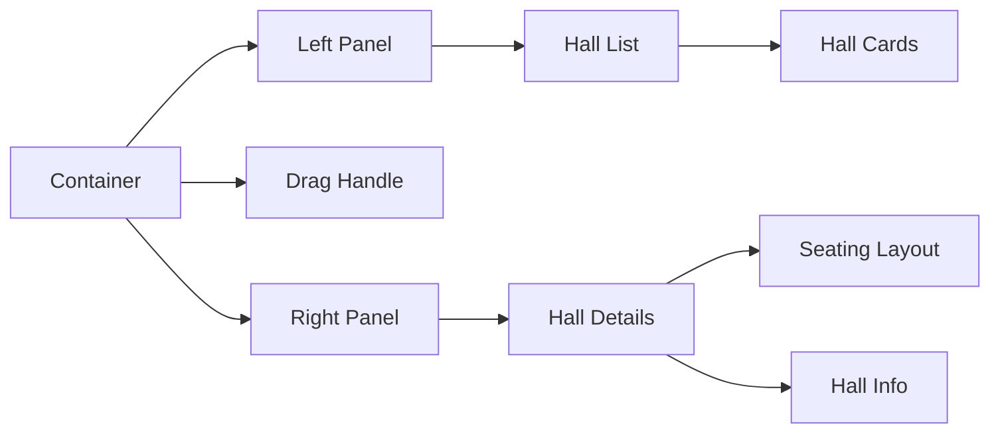
```mermaid
graph LR
    A[Container] --> B[Left Panel]
    A --> C[Drag Handle]
    A --> D[Right Panel]

    B --> E[Hall List]
    E --> F[Hall Cards]

    D --> G[Hall Details]
    G --> H[Seating Layout]
    G --> I[Hall Info]
```

#### Bookings

**Route**: `/bookings`
**Component**: `Bookings.jsx`

Displays all bookings for the logged-in customer, split into two tabs.

**Features:**
- **Upcoming tab** — shows with `show_date >= today`, sorted by date ascending
- **Past tab** — shows with `show_date < today`
- Each booking card shows: movie title, show date/time, cinema hall name, screen name, seat chips (e.g. "A1"), total amount, booking status badge (capitalized), booking ID (first 8 chars)
- **Refund status badge** — when `booking_status === 'cancelled'` and `refund_status` is present, the card shows **two** badges stacked: a `Cancelled` badge (red) and a coloured refund badge below it:

  | `refund_status` | Badge label | Badge colour |
  |-----------------|-------------|--------------|
  | `initiated` | Refund Initiated | Amber |
  | `settled` | Refund Settled | Green |
  | `failed` | Refund Failed | Red |

  When `refund_status` is absent (e.g. booking cancelled without a refund record), only the standard `Cancelled` badge is shown.
- **Clickable cards** — clicking any booking card navigates to `/bookings/:id` (the `BookingDetailPage`) for a full detail view
- **Directions button** — each card has a `MapPin` + "Directions" button that opens Google Maps in a new tab (coordinates if available, else hall name + address fallback). Uses `e.stopPropagation()`
- **Show QR button** — each card has a "Show QR" button that opens a `Dialog` containing a `QRCodeSVG` (180×180) encoding the full booking UUID, movie title, and show date. Uses `e.stopPropagation()` to prevent card navigation
- **View Ticket button** — each non-cancelled card has a "View Ticket" button (`ExternalLink` icon) that navigates to `/booking/success?payment_id=xxx` — opens the `BookingSuccessPage` (Booking Confirmed! screen) where the ticket can be downloaded. Uses `e.stopPropagation()`. Hidden for cancelled bookings
- Loading skeleton and empty state per tab
- Calls `GET /api/booking/my-bookings` on mount

**Dependencies:**
- `qrcode.react` — `QRCodeSVG` component for QR generation
- `@/components/ui/dialog` — shadcn Dialog for the QR modal

#### BookingDetailPage

**Route**: `/bookings/:id`  
**Component**: `BookingDetailPage.jsx`  
**Access**: Protected (requires login)

Full detail view for a single customer booking. Fetches from `/api/booking/:id` on mount using the UUID from the URL param — no dependency on navigation state, so direct URL access and page refresh both work.

**Sections:**

1. **Back button** — navigates to `/bookings`
2. **Hero ticket card** (`ticketRef` — captured for JPEG download):
   - Gradient header — deep red (`#e11d48 → #9f1239`) for active bookings; grey (`#374151 → #1f2937`) for cancelled
   - CineMax branding pill top-left
   - Movie title (large bold white), language · genre (comma-separated) · duration in muted white below
   - Show date, time, cinema hall, screen in icon rows
    - Movie poster thumbnail (`w-16 h-24`) on the right — only rendered when `poster_url` is present; uses `/api/movies/proxy-image` when source is TMDB, with `crossOrigin="anonymous"`
    - **Perforated divider** — dashed border with half-circle notches (same style as `BookingSuccessPage`)
    - Ticket body: Booking ID (first 8 chars, monospace) with copy button, `StatusBadge` component (confirmed/cancelled/completed), seat label chips, total amount `text-3xl`, QR code (`QRCodeSVG` 80×80, level M)
    - "Present this QR code at the cinema entrance" hint
 3. **Action buttons row** (two side-by-side):
    - **Get Directions** — opens Google Maps in a new tab (coordinates if available, else hall name + address fallback)
    - **Download Ticket** — captures `ticketRef` as JPEG using `html-to-image` at 3× pixel ratio (same logic as `BookingSuccessPage`); no longer falls back to navigation — logs error on failure. Hidden for cancelled bookings.
4. **Price Breakdown card** — Seats (calculated as `total − discount − convenience − gst`), Convenience Fee, GST, Offer Discount (green, shown only when `discount_amount > 0`), Total
5. **Refund Details card** — only rendered when `booking_status === 'cancelled'` AND `refund_status` is set:
   - Refund status badge (amber = initiated, green = settled, red = failed)
   - Refund amount, Razorpay Refund ID (with copy button), initiated/settled timestamps, failure reason
6. **Payment Info card** — Payment ID (with copy button), Booked At timestamp

**Copy buttons** — `Copy` / `Check` icon toggle with 2-second reset. Covers: Booking ID, Payment ID, Razorpay Refund ID.

**Genre display** — `genre` is a `TEXT[]` in PostgreSQL; rendered as `Array.join(', ')` (e.g. `Action, Drama, Thriller`). Has an `Array.isArray` guard for safety.

**Loading state** — Four skeleton boxes (back button, hero card, breakdown, payment).

**Error state** — Ticket icon + error message + "Back to Bookings" button.

**API**: `GET /api/booking/:booking_id` — customer-scoped, returns 404 for another user's booking or invalid UUID.

**Dependencies:**
- `html-to-image` — `toJpeg` for ticket download
- `qrcode.react` — `QRCodeSVG` for inline QR code
- `lucide-react` — `ArrowLeft`, `CalendarDays`, `Clock`, `MapPin`, `Monitor`, `Ticket`, `Hash`, `CreditCard`, `Tag`, `Percent`, `Download`, `IndianRupee`, `CheckCircle2`, `XCircle`, `Copy`, `Check`

---

#### OffersPage

**Route**: `/offers`
**Component**: `OffersPage.jsx`
**Access**: Requires login (shows "Please log in" prompt if not authenticated)

Displays all active, non-expired offers the logged-in user is eligible for — including already-redeemed offers shown as disabled. Reached from the "Offers" link in the top navigation bar.

**Layout:**
- Page header with Tag icon, title, and description
- Responsive card grid (1 / 2 / 3 columns)
- Available offers appear first; already-used offers are sorted to the bottom

**Each offer card shows:**
- Title + badge:
  - **Available**: "Ending soon" amber badge if expiry ≤ 3 days
  - **Redeemed**: green "Applied" badge (✓ Check icon)
- Discount value — violet text for available; muted text for redeemed
- Description (optional)
- Min. booking amount (if set)
- Valid until date
- Eligibility note (if `joined_after`)
- Hall restriction note (if `scope = "hall"`)
- **Available**: dashed violet code chip with "Copy" button — copies to clipboard + toast
- **Redeemed**: strikethrough offer code + "Already used" label; card is `opacity-60` with a gray top band and no copy button

**Filtering:** The backend:
- Filters out: expired offers (`valid_until ≤ NOW()`), inactive offers (`is_active = false`), offers the user is ineligible for (`joined_after` date check)
- Includes redeemed offers with `is_redeemed: true` (no longer filtered out — displayed as disabled cards)

**API used:** `GET /api/offers/active` (requires `cusAccessToken` cookie)

---

#### OrderSummaryPage

**Route**: `/order-summary`
**Component**: `OrderSummaryPage.jsx`

Intermediate page between seat selection and Razorpay payment. Reached after seats are successfully held (5-min hold). Receives all booking context via `location.state`; redirects to `/movies` if accessed directly with no state.

**Layout (two-column on desktop, stacked on mobile):**
- **Left column** (stacked cards):
  - **Available Offers card** — fetches `GET /api/offers/active` on mount; shows a scrollable list of offer cards (up to 3 by default, expandable); applicable vs. ineligible offers visually differentiated
   - **Secure Payment card** — Frosted glass panel (`bg-card/40 backdrop-blur-md`), "SECURE CHECKOUT" badge header with lock icon, Razorpay branding banner (gradient background, `Razorpay Secure` with `PCI-DSS` badge, 256-bit SSL note), payment method chips (Cards via `CreditCard`, UPI via `Smartphone`, Wallets, Net Banking, EMI), coupon/offer section with shadow inset styling, price summary, gradient Pay button, trust row with uppercase "100% SECURE CHECKOUT" badge
- **Right panel (sticky)** — Order summary card: poster thumbnail (`h-16 w-11`) + movie title + ticket count, show date/time/language/format, seat labels, cinema name, price breakdown (ticket price + convenience fee + GST on convenience fee + optional discount line + amount payable), "Cancel and release seats" link

**Sticky header:**
- Back button → poster thumbnail (`h-14 w-10`, shown when `posterUrl` available) → movie title + show meta + countdown timer

**Pricing (dynamic — fetched from API):**
- On mount, fetches `GET /api/settings` to get `convenience_fee_per_ticket` and `gst_percentage`
- Calculates:
  - `convenienceTotal = numSeats × convenience_fee_per_ticket`
  - `gstAmount = convenienceTotal × (gst_percentage / 100)` (GST only on convenience fee)
  - `subtotal = seatTotal + convenienceTotal + gstAmount`
  - `grandTotal = subtotal − discountAmount` (0 if no coupon)
- Price breakdown shows: Ticket(s) price, Convenience fees (₹X/ticket), GST (Y% on conv. fee), Discount (OFFERCODE) in green when applied, Amount Payable
- Displays `...` while settings are loading; Pay button disabled until loaded

**Available Offers panel:**
- On mount, fetches `GET /api/offers/active` (returns user-eligible, non-expired, non-redeemed offers)
- Offers sorted: applicable ones first (subtotal ≥ `min_booking_amount`), then locked
- Each **offer card** shows:
  - Coloured left accent bar (violet = applicable, grey = locked)
  - Discount badge: `₹X OFF` (fixed) or `X% OFF upto ₹Y` (percentage)
  - Offer code (monospace), title, description
  - Min booking amount + expiry date; `Hall Offer` badge for hall-scoped offers
  - `"Add ₹X more to unlock"` amber hint when not applicable due to amount
- Clicking an applicable card directly calls `applyOffer(code)` — no typing required
- Shows 3 offers by default; "N more offers" toggle to expand
- Skeleton placeholders shown while loading; hides the panel if no offers exist

**Coupon / Offer Code section:**
- Input field (uppercase monospace, percent icon prefix) + "Apply" button (violet) — manual code entry; `border-dashed` applied state with destructive hover on remove button
- On apply: calls `POST /api/offers/validate` with `{ offer_code, show_id, total_amount }`
- On success: shows green "applied" row with offer code, discount amount, and ✕ remove button (hover turns destructive red); applied offer card in the offers panel shows a green checkmark
- On error: shows red error message below input using `AlertCircle` icon
- Offer is re-validated server-side in `createOrder` — frontend discount preview is never trusted for the final charge

**Countdown timer:**
- Reads `holdExpiry` from `location.state`, ticks down MM:SS in the header
- On expiry: shows toast error, releases seats, navigates back to `/show/:showId`

**Pay button:**
- Gradient-styled button (`bg-gradient-to-br from-primary to-[oklch(from_var(--primary)_l_calc(c*0.75)_h)]`) with `custom-hover` class
- Spinner shows "Processing Payment..." while processing
- Calls `useRazorpayPayment.initiatePayment()` with `show_id`, `seats`, `customer` — **no amount sent** (backend calculates it)
- On success: navigates to `/booking/success?payment_id=xxx`
- On cancel or failure: navigates to `/booking/failure` with `reason` (`'cancelled'` or `'failed'`) + full booking state — seats remain held

**Cancel/Back button:**
- Calls `bookingAPI.releaseSeats()` then navigates back to `/show/:showId`

**State passed from SeatSelectionPage:**

```js
{
  showId, selectedSeats, seatLabels,
  holdExpiry, totalAmount,
  movieTitle, language, showDate, startTime,
  screenName, screenType, cinemaName,
  posterUrl   // movie poster URL for thumbnail display
}
```

---

#### BookingSuccessPage

**Route**: `/booking/success?payment_id=pay_xxx`
**Component**: `BookingSuccessPage.jsx`

Displayed after successful Razorpay payment, and also accessible by clicking a booking card from the My Bookings page.

**Features:**
- Reads `payment_id` from URL (`useSearchParams`) — survives page refresh
- Shows loading spinner while fetching
- Shows error state with "View My Bookings" fallback if fetch fails
- Navigates to `/` if no `payment_id` in URL
- **Download Ticket** button — captures the entire ticket card as a JPEG using `html-to-image` at 3× pixel ratio, temporarily strips dark mode during capture for correct colors, downloads as `ticket-<id>.jpg`

**UI Design (premium cinema ticket style):**

**Success header:**
- Pulsing green ring animation (`animate-ping`) behind a `CheckCircle` icon for a dynamic confirmation feel
- Bold heading + subtitle copy

**Ticket card** (`ticketRef` — this is what gets captured as JPEG):
- **Gradient header** — deep red gradient (`#e11d48 → #9f1239`) for active bookings; grey (`#374151 → #1f2937`) for cancelled. Includes:
  - CineMax branding pill top-left
  - Movie title in large white bold type with `language` · `genre` (comma-separated) · `duration_mins` metadata row below
  - Date (`CalendarDays`) / time (`Clock`), cinema hall name (`MapPin`) / screen name (`Monitor`) in icon rows
  - Movie poster thumbnail (`w-16 h-24`) on the right — uses TMDB proxy-image when source is `image.tmdb.org`, with `crossOrigin="anonymous"`
- **Perforated divider** — dashed border with half-circle notches cut into both sides (`-left-3` / `-right-3` absolutely positioned circles) — classic physical ticket aesthetic
- **Body section:**
  - Booking ID (first 8 chars, monospace) with copy-to-clipboard button (`Copy`/`Check` icon toggle, 2-second reset)
  - `StatusBadge` component — dynamic status display for `confirmed` (green), `cancelled` (red), and `completed` (blue) with dot indicator and ring border
  - Seat labels as pill tags with `bg-secondary text-secondary-foreground ring-1 ring-border`
  - Total amount right-aligned in `text-3xl font-extrabold` with `fmt()` helper for Indian locale (`en-IN`)
- **QR stub** — `QRCodeSVG` (80×80, level `M`) in a white padded `rounded-xl` card with drop shadow; "Present this QR code at the cinema entrance for entry" hint below
- `booking.poster_url` proxied through `/api/movies/proxy-image` when source is TMDB

**Info banner:** Blue-tinted email confirmation notice below the ticket

**Action buttons:** 3-column grid — pink primary "My Bookings", dark "Download Ticket" with Download icon, muted "Book More"

**Dependencies:**
- `html-to-image` — DOM-to-image capture (supports Tailwind v4 `oklch` colors)
- `qrcode.react` — `QRCodeSVG` component (SVG-based, serializes correctly with `html-to-image`)
- `lucide-react` — `CheckCircle`, `CheckCircle2`, `XCircle`, `CalendarDays`, `Clock`, `MapPin`, `Monitor`, `Hash`, `Ticket`, `Download`, `Loader2`, `Copy`, `Check`

#### BookingFailurePage

**Route**: `/booking/failure`
**Component**: `BookingFailurePage.jsx`

Shown when Razorpay payment fails or the user dismisses the Razorpay modal. Receives full booking context via `location.state`; redirects to `/movies` if accessed with no state.

**Reason variants:**
- `reason: 'cancelled'` — user dismissed the modal → amber icon, "Payment Cancelled" title
- `reason: 'failed'` — `verifyPayment` threw an error → red icon, "Payment Failed" title

**Countdown timer:** Same hold-expiry logic as `OrderSummaryPage` — ticks in the header and auto-navigates to `/show/:showId` when the hold expires.

**Actions:**
- **"Try Again"** (primary blue button) — navigates back to `/order-summary` with all original state; no new seat hold required (existing hold is still active)
- **"Release seats and go back"** (text link) — calls `bookingAPI.releaseSeats()`, then navigates to `/show/:showId`
- **Back arrow** in header — same as "Release seats and go back"

**State received from `OrderSummaryPage`:**

```js
{
  reason,          // 'cancelled' | 'failed'
  showId, selectedSeats, seatLabels,
  holdExpiry, totalAmount,
  movieTitle, language, showDate, startTime,
  screenType, cinemaName
}
```

---

#### ProfilePage

**Route**: `/profile`
**Component**: `ProfilePage.jsx`
**Auth required**: Yes (protected route)

Three-section layout:

**Profile Info Section:**
- Displays customer avatar (from OAuth provider if available, fallback to initials)
- Customer name, email (read-only), phone
- Location (district, state) shown as read-only badges

**Connected Login Methods Section:**
- Lists Google provider with connection status
- **Connected** — shows green "Connected" badge + **Disconnect** button
- **Not connected** — shows **Connect** button that triggers `useGoogleLogin` popup
- Connect calls `POST /api/customer/link-provider` then `refreshCustomer()`
- Disconnect calls `POST /api/customer/unlink-provider` then `refreshCustomer()`
- Disconnect blocked (with toast error) if it's the only login method and no password is set

**Change Password / Set Password Section:**
- If `customer.has_password === true`: Shows **Change Password** form:
  - Current password field (with show/hide toggle)
  - New password field + live `PasswordPolicyChecklist`
  - Confirm new password field (with show/hide toggle)
  - Calls `changePassword(currentPassword, newPassword)` from `CustomerAuthContext`
- If `customer.has_password === false` (OAuth-only account): Shows **Set Password** form:
  - New password field + live `PasswordPolicyChecklist`
  - Confirm new password field
  - Calls `POST /api/customer/set-password` then `refreshCustomer()`
- On success shows a `CheckCircle2` success state with "Password Changed/Set" message
- Password policy same as signup: 8+ chars, uppercase, lowercase, digit, special char

#### SettingsPage

**Route**: `/settings`  
**Component**: `SettingsPage.jsx`

Application settings:

- Theme preferences
- Notification settings
- Language preferences

---

## API Service Layer

**Location**: `src/services/api.js`

### Service Modules

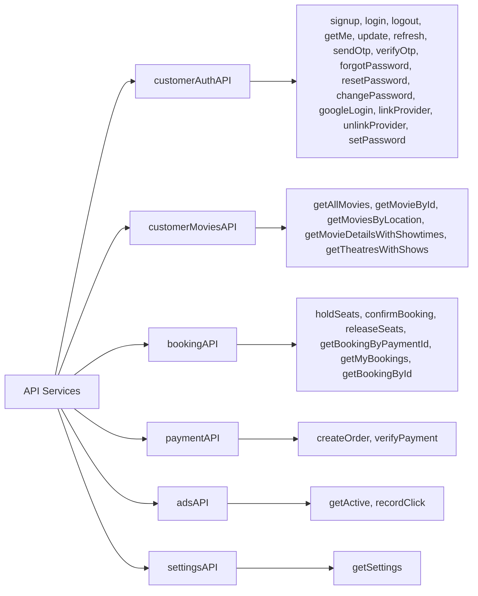
```mermaid
graph LR
    A[API Services] --> B[customerAuthAPI]
    A --> C[customerMoviesAPI]
    A --> D[bookingAPI]
    A --> E[paymentAPI]
    A --> F2[adsAPI]
    A --> G2[settingsAPI]

    B --> F[signup, login, logout, getMe, update, refresh, sendOtp, verifyOtp, forgotPassword, resetPassword, changePassword, googleLogin, linkProvider, unlinkProvider, setPassword]
    C --> G[getAllMovies, getMovieById, getMoviesByLocation, getMovieDetailsWithShowtimes, getTheatresWithShows]
    D --> H[holdSeats, confirmBooking, releaseSeats, getBookingByPaymentId, getMyBookings, getBookingById]
    E --> I[createOrder, verifyPayment]
    F2 --> J[getActive, recordClick]
    G2 --> K[getSettings]
```

### customerAuthAPI

**Endpoints:**

```javascript
{
  (signup(data), // Register new customer
    login(email, password), // Login customer
    logout(), // Clear session
    update(data), // Update profile
    getMe(), // Get current customer
    refresh(), // Refresh access token
    sendOtp(email), // Send OTP to email
    verifyOtp(email, otp)); // Verify OTP
}
```

### customerMoviesAPI

**Endpoints:**

```javascript
{
  getAllMovies(params),                           // Get all movies with filters
  getMovieById(movieId),                          // Get single movie
  getMoviesByLocation(district, state),           // Movies in location
  getMoviesByState(state),                        // Movies in state
  getMovieDetailsWithShowtimes(movieId, ...),     // Movie + cinema halls + showtimes
  getDistrictsInState(state),                     // Available districts
  getCinemaHallsByLocation(district, state),      // Cinema halls in area (basic, no shows)
  getTheatresWithShows(district, state, date)     // Cinema halls with movies + shows for a date
}
```

### adsAPI

**Endpoints:**

```javascript
{
  getActive(placement),  // GET /api/ads/active?placement={placement} — public
  recordClick(adId),     // POST /api/ads/click/{adId} — optional customer auth
}
```

Used by `AdBanner.jsx` (placement `'banner'`) and `MovieInfoPage.jsx` (placement `'side'`). `recordClick` is fire-and-forget — errors are silently caught.

### settingsAPI

**Endpoints:**

```javascript
{
  getSettings(),  // GET /api/settings — public, no auth required
}
```

Returns `{ convenience_fee_per_ticket: number, gst_percentage: number }`. Called by `OrderSummaryPage` on mount to dynamically calculate the booking fee breakdown.

### API Request Flow

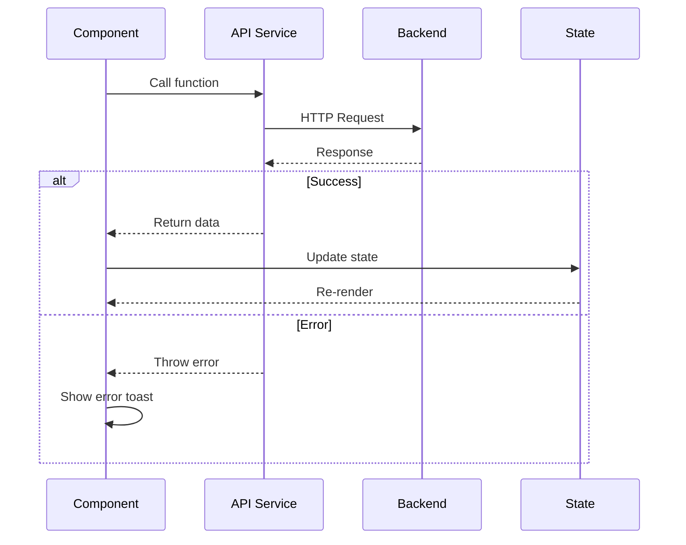
```mermaid
sequenceDiagram
    participant Component
    participant API Service
    participant Backend
    participant State

    Component->>API Service: Call function
    API Service->>Backend: HTTP Request
    Backend-->>API Service: Response

    alt Success
        API Service-->>Component: Return data
        Component->>State: Update state
        State-->>Component: Re-render
    else Error
        API Service-->>Component: Throw error
        Component->>Component: Show error toast
    end
```

---

## UI Components

### shadcn/ui Components Used

| Component    | Usage               |
| ------------ | ------------------- |
| Button       | Actions, navigation |
| Card         | Content containers  |
| Dialog       | Login modal         |
| Input        | Form fields         |
| Avatar       | User profile        |
| DropdownMenu | User menu           |
| Skeleton     | Loading states      |
| Sonner       | Toast notifications |
| Badge        | Status indicators   |

### Custom Components

**TopBar** - Main navigation

- Search functionality
- Location display
- User authentication
- Theme toggle

**TopNavbar** - Secondary navigation

- Category links (Movies, Theatres — always visible)
- "My Bookings" link — visible only when logged in
- Offers, Gift Cards — always visible

**AdBanner** - Advertisement banner

- Promotional content
- Responsive design

**MoviesList** - Movie grid display

- Horizontal scrolling with left/right arrow navigation (desktop)
- Lazy loading with blur effect
- Cinematic hover overlay (genre badges, language, Book Now CTA)
- Rating badge always visible on poster (top-left)
- `showBookNow` auto-derived from `filters.status` — hidden for `upcoming` lists

**CinemaLayout** - Page wrapper

- Consistent layout
- Header + content area
- Smooth scroll-to-top on every route navigation (scrolls the `<main>` container, not `window`)

**LoginModal** - Authentication modal

- Login/signup forms
- OTP verification
- Form validation

**SeatCountModal** - Seat count selector (`src/components/SeatCountModal.jsx`)

- Centered Dialog asking "How many seats?" with pill-shaped 1–10 number grid (`#f84464` active state)
- Animated SVG `VehicleIllustration` — changes dynamically per count: 1=bicycle, 2=vespa scooter, 3=auto-rickshaw, 4=beetle car, 5=SUV, 6-7=minivan, 8-10=double-decker bus. Wheels spin, body bobs, exhaust puffs smoke, bus headlights glow.
- Live seat category stats panel: Premium/Gold/Silver price + AVAILABLE / FILLING FAST (≥70% booked) / SOLD OUT badges with icons (Check/Flame/AlertCircle)
- Non-dismissible on initial load to force user selection, but fully dismissible (via backdrop click, Escape key, or close button) once a seat count has already been set.
- Receives `showData` and `getSeatPrice` props from `SeatSelectionPage`
- Uses shadcn `Dialog` component with close button hidden only on the first non-dismissible visit, and premium backdrop-blur glass styling

### Utility Files

| File | Purpose |
|---|---|
| `src/utils/seatSelection.js` | `findBestAdjacentSeats(clickedSeat, seatCount, seats)` — sliding-window algorithm that finds the optimal contiguous seat block nearest to the clicked seat. Scoring: (1) contains clicked seat, (2) right-bias, (3) minimum distance. |

---

## State Management

### Context Providers

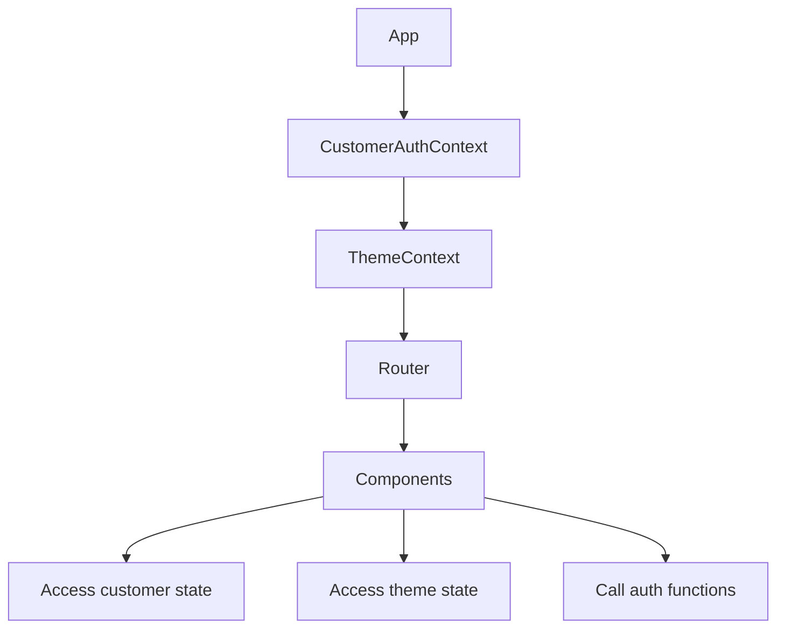
```mermaid
graph TD
    A[App] --> B[CustomerAuthContext]
    B --> C[ThemeContext]
    C --> D[Router]
    D --> E[Components]

    E --> F[Access customer state]
    E --> G[Access theme state]
    E --> H[Call auth functions]
```

**CustomerAuthContext API:**

```javascript
const {
  customer, // Current customer object
  isLoggedIn, // Boolean auth status
  loading, // Loading state
  login, // Login function
  logout, // Logout function
  updateProfile, // Update customer
  checkAuth, // Verify auth on mount
  refreshToken, // Refresh access token
} = useCustomerAuth();
```

**ThemeContext API:**

```javascript
const {
  theme, // "light" | "dark"
  setTheme, // Change theme
  toggleTheme, // Toggle between themes
} = useTheme();
```

---

## User Workflows

### Complete Signup & Login Flow

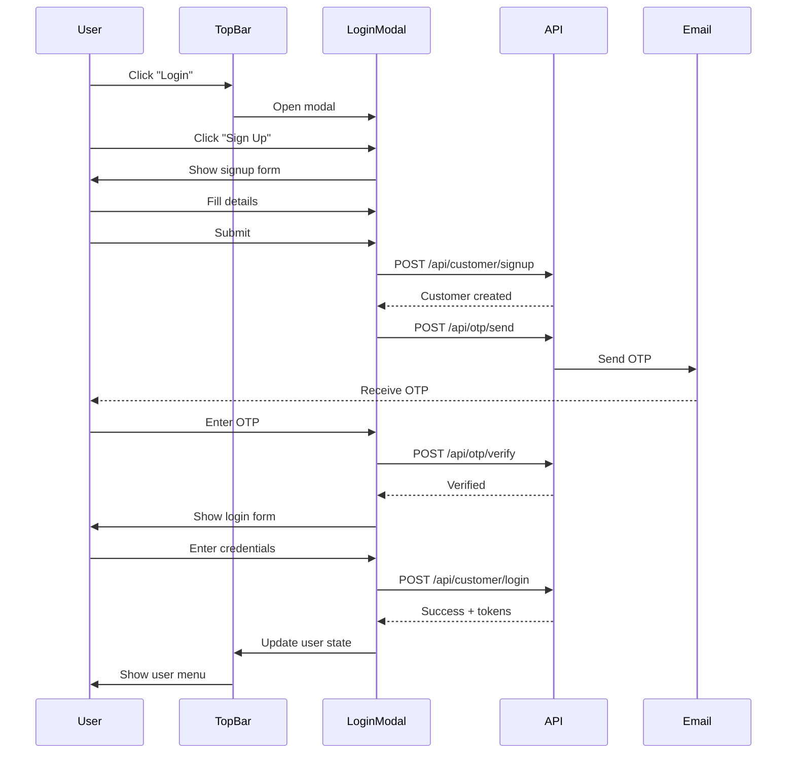
```mermaid
sequenceDiagram
    participant User
    participant TopBar
    participant LoginModal
    participant API
    participant Email

    User->>TopBar: Click "Login"
    TopBar->>LoginModal: Open modal

    User->>LoginModal: Click "Sign Up"
    LoginModal->>User: Show signup form

    User->>LoginModal: Fill details
    User->>LoginModal: Submit
    LoginModal->>API: POST /api/customer/signup
    API-->>LoginModal: Customer created

    LoginModal->>API: POST /api/otp/send
    API->>Email: Send OTP
    Email-->>User: Receive OTP

    User->>LoginModal: Enter OTP
    LoginModal->>API: POST /api/otp/verify
    API-->>LoginModal: Verified

    LoginModal->>User: Show login form
    User->>LoginModal: Enter credentials
    LoginModal->>API: POST /api/customer/login
    API-->>LoginModal: Success + tokens

    LoginModal->>TopBar: Update user state
    TopBar->>User: Show user menu
```

### Movie Discovery Flow

```mermaid
sequenceDiagram
    participant User
    participant MoviesPage
    participant MoviesList
    participant API

    User->>MoviesPage: Navigate to /movies
    MoviesPage->>MoviesPage: Check customer location

    alt Has Location
        MoviesPage->>MoviesList: Pass district & state
        MoviesList->>API: GET /api/user/movies/location/movies
    else No Location
        MoviesPage->>MoviesList: No location filter
        MoviesList->>API: GET /api/user/movies
    end

    API-->>MoviesList: Return movies
    MoviesList->>MoviesList: Render movie cards
    MoviesList->>User: Display movies

    User->>MoviesList: Scroll horizontally
    User->>MoviesList: Click movie card
    MoviesList->>User: Navigate to movie details
```

---

### 2. Movie Info Page

**Route**: `/movie/:movieId`
**Component**: `MovieInfoPage.jsx`

Dedicated movie detail page — BookMyShow style — showing movie metadata, a prominent "Book Tickets" CTA, full description, and a YouTube trailer embed. This is the landing page when a movie card is clicked.

**Sections:**

**Hero Banner:**
- Full-width blurred `poster_url` background (`blur-md opacity-40`) with dark gradient overlay
- Back button (top-left, frosted glass) → `/movies`
- Large poster left (`w-40 sm:w-52 md:w-60`, `aspect-[2/3]`, `rounded-2xl`) with **Trailer overlay button** at the bottom (shown only when `trailer_url` exists) — clicking scrolls to the Trailer section
- Movie metadata right: title (`text-3xl sm:text-5xl font-bold`), duration + genres + release date in a meta row, star rating + vote count (hidden when `vote_average` is `0`), format (`2D`) + language badges, **Book Tickets** primary button → `/movie/shows/:movieId`

**About the movie:**
- Full description text, separated by `border-b`

**Cast section** (only rendered when `cast` array is non-empty):
- Circular profile photos (`w-16 h-16 rounded-full`) fetched from `https://image.tmdb.org/t/p/w185{profile_path}`
- Falls back to the actor's initial letter on image error or when `profile_path` is absent
- Actor **name** and **character** shown below each avatar
- Separated by `border-b`, sits between "About the movie" and "Trailer"

**Trailer section** (only rendered when `trailer_url` is set):
- Responsive `aspect-video` iframe (`rounded-xl overflow-hidden shadow-2xl`, `max-w-3xl`)
- YouTube URL is normalized via `getYouTubeEmbedUrl()` helper — supports `watch?v=`, `youtu.be/`, and already-embedded URLs
- `ref={trailerRef}` — scrolled to via `scrollIntoView({ behavior: 'smooth' })` when the poster overlay button is clicked

**Side Ad Sidebar** (md+ screens only):
- Fetches `placement=side` active ads from `GET /api/ads/active?placement=side` on mount
- If ads exist, the About + Trailer area becomes a two-column layout: `flex-1` main content + `w-44 lg:w-48` sticky sidebar (`top-24`)
- Each ad is a rounded image card; clicking records the click and opens `click_url` in a new tab
- Sidebar hidden on mobile (`hidden md:flex`) and completely absent if no side ads are active

**Data flow:**

```mermaid
sequenceDiagram
    participant User
    participant MovieInfoPage
    participant API

    User->>MovieInfoPage: Navigate to /movie/:movieId (click movie card)
    MovieInfoPage->>API: GET /api/user/movies/:movieId
    MovieInfoPage->>API: GET /api/ads/active?placement=side
    API-->>MovieInfoPage: movie data + side ads

    MovieInfoPage->>User: Render hero + [About + Trailer | side ad column]

    User->>MovieInfoPage: Click side ad
    MovieInfoPage->>API: POST /api/ads/click/:id (fire-and-forget)
    MovieInfoPage->>User: Open click_url in new tab

    User->>MovieInfoPage: Click "Book Tickets"
    MovieInfoPage->>User: navigate('/movie/shows/:movieId')
```

**State:**

| State | Type | Description |
|-------|------|-------------|
| `movie` | object \| null | Movie data from `GET /api/user/movies/:movieId` |
| `loading` | boolean | Full-page skeleton on initial load |
| `error` | string \| null | Error message if fetch fails |
| `sideAds` | array | Active `side` placement ads (empty array if none) |

**Helper functions:**
- `formatDuration(mins)` — converts `144` → `"2h 24m"`
- `formatReleaseDate(dateStr)` — formats to `"27 Feb 2026"` (en-IN locale)
- `getYouTubeEmbedUrl(url)` — converts any YouTube URL format to `https://www.youtube.com/embed/VIDEO_ID`

---

### 3. Movie Shows Page

**Route**: `/movie/shows/:movieId`
**Component**: `MovieDetailsPage.jsx`

Displays a date selector and the list of cinema halls + showtimes for the selected date. Reached by clicking "Book Tickets" on the Movie Info Page. Uses a **BookMyShow-style UI**.

**No-location guard:**
- When `district` and `state` are both empty the `useEffect` immediately sets `loading = false` and opens `LocationModal`
- If `movie` is still null after the effect runs and there is no location, a dedicated prompt is rendered (instead of "Movie not found") — location pin icon, "Select your city to see showtimes" copy, and a **Select City** button that re-opens `LocationModal`
- After the user picks a city `district`/`state` update in context, the `useEffect` (which depends on `[movieId, selectedDate, district, state]`) re-fires and calls `fetchMovieShowtimes()` automatically

**Features:**

**Cinematic Banner Header:**
- Full-width blurred `poster_url` as background (`blur-md opacity-40 pointer-events-none`) with dark gradient overlay
- Back button (top-left, frosted glass) → `/movie/:movieId` (explicitly navigates, does not use browser history)
- Poster thumbnail (left, `hidden sm:block`, `w-36 md:w-44`, `aspect-[2/3]`) + movie info (right)
- Movie info: title (`text-3xl md:text-4xl`), tag pills (runtime, genres, languages as rounded pills), expandable description with "Read more / Show less" toggle

**Date Selector shelf** (`bg-card border-b border-border`):
- **3-part vertical date buttons** (DOW / day number / month) — 7 days, `w-14` fixed width, hidden scrollbar
- Selected: `bg-primary text-primary-foreground`; others: `border border-border hover:border-primary`
- Language chip on the right showing `{language[0]} • 2D`

**Availability legend:** `● AVAILABLE` (green) + `● FAST FILLING` (amber) aligned right

**Cinema Hall Cards** (`rounded-xl p-5`):
- Building icon + hall name + location + heart icon (visual-only)
- Shows as a **flat sorted list** (all shows for the hall sorted by `start_time`)
- **Green-bordered outlined buttons** — time (bold) on line 1, `screen_name · language_version` on line 2; hover changes to primary color
- "Non-cancellable" label below buttons
- **Only shows with `status = 'booking_started'` are returned** — `scheduled`, `in_progress`, `show_ended`, and `cancelled` shows are excluded from the API response

**Data flow:**

```mermaid
sequenceDiagram
    participant User
    participant MovieDetailsPage
    participant API

    User->>MovieDetailsPage: Navigate to /movie/shows/:movieId
    MovieDetailsPage->>MovieDetailsPage: selectedDate = today, loading = true
    MovieDetailsPage->>API: GET /api/user/movies/:movieId/showtimes?district=X&state=Y&date=YYYY-MM-DD
    API-->>MovieDetailsPage: { movie, cinema_halls }
    MovieDetailsPage->>User: Render full page (cinematic banner + date shelf + halls)

    User->>MovieDetailsPage: Select different date
    MovieDetailsPage->>MovieDetailsPage: refetching = true (banner + date shelf stay visible)
    MovieDetailsPage->>API: Refetch with new date
    API-->>MovieDetailsPage: { movie, cinema_halls }
    MovieDetailsPage->>User: Update cinema halls section only (skeleton during fetch)
```

**State:**

| State | Type | Description |
|-------|------|-------------|
| `movie` | object | Movie details from API |
| `cinemaHalls` | array | Cinema halls with shows for the selected date |
| `loading` | boolean | `true` on initial load — shows full-page skeleton |
| `refetching` | boolean | `true` when date changes — shows section skeleton only |
| `selectedDate` | Date | Currently selected date (defaults to today) |
| `descExpanded` | boolean | Controls description expand/collapse |
| `locationModalOpen` | boolean | Controls `LocationModal` open state |

**Helper functions:**
- `formatDuration(mins)` — converts `144` → `"2h 24m"`
- `formatDateParts(date)` — returns `{ dow, day, month }` for 3-part date buttons

---

## Styling & Theming

### Tailwind Configuration

**Custom Utilities:**

- `.scrollbar-hide` - Hide scrollbars
- `.glass-effect` - Glassmorphism effect
- `.hover-lift` - Lift on hover
- `.hover-glow` - Glow effect

### Responsive Design

**Breakpoints:**

- `sm`: 640px
- `md`: 768px
- `lg`: 1024px
- `xl`: 1280px

**Mobile-First Approach:**

- Base styles for mobile
- Progressive enhancement for larger screens

### Dark Mode

**Implementation:**

```javascript
// ThemeContext manages theme state
const [theme, setTheme] = useState(localStorage.getItem("theme") || "light");

// Apply to document
document.documentElement.classList.toggle("dark", theme === "dark");
```

---

## Performance Optimizations

### Lazy Loading Images

```jsx
import { LazyLoadImage } from "react-lazy-load-image-component";

<LazyLoadImage
  src={movie.poster_url}
  alt={movie.title}
  effect="blur"
  className="w-full h-auto aspect-[2/3] object-cover"
/>;
```

**Benefits:**

- Reduced initial load time
- Better Core Web Vitals
- Smooth blur-in effect

### Horizontal Scrolling

**Optimized Scrolling:**

```css
.scrollbar-hide::-webkit-scrollbar {
  display: none;
}
.scrollbar-hide {
  -ms-overflow-style: none;
  scrollbar-width: none;
}
```

### Memoization

**useMemo for Filters:**

```javascript
const filtersKey = useMemo(() => JSON.stringify(filters), [filters]);
```

---

## Error Handling

### API Error Handling

```javascript
try {
  const response = await customerMoviesAPI.getAllMovies(params);
  setMovies(response.movies);
} catch (err) {
  console.error("Error fetching movies:", err);
  setError(err.message);
  toast.error("Failed to load movies");
}
```

### Loading States

**Skeleton Loaders:**

```jsx
{
  loading ? <MovieCardSkeleton /> : <MovieCard movie={movie} />;
}
```

### Empty States

**No Movies Found:**

```jsx
{
  movies.length === 0 && (
    <div className="text-center p-8">
      <p>No movies available at the moment.</p>
    </div>
  );
}
```

---

## Environment Variables

```env
# API Configuration
VITE_API_BASE_URL=http://localhost:5000

# Feature Flags (if any)
VITE_ENABLE_BOOKINGS=true
```

---

## Build & Deployment

### Development

```bash
npm run dev
# Runs on http://localhost:5174
```

### Production Build

```bash
npm run build
# Outputs to /dist
```

### Deployment

- Vercel deployment
- Automatic builds
- Environment variables via dashboard

---

## Accessibility

### Implemented Features

✅ **Keyboard Navigation:**

- Tab through interactive elements
- Enter to submit forms
- Escape to close modals

✅ **ARIA Labels:**

- Buttons have descriptive labels
- Form inputs have labels
- Icons have aria-labels

✅ **Semantic HTML:**

- Proper heading hierarchy
- Semantic elements (nav, main, section)
- Form structure

✅ **Color Contrast:**

- WCAG AA compliant
- Dark mode support

---

## Best Practices Implemented

✅ **Code Organization:**

- Feature-based structure
- Reusable components
- Centralized API services
- Context for global state

✅ **User Experience:**

- Loading states
- Error handling
- Toast notifications
- Responsive design
- Smooth animations

✅ **Performance:**

- Lazy loading
- Image optimization
- Efficient re-renders
- Memoization

✅ **Security:**

- HttpOnly cookies
- OTP verification
- Input validation
- XSS prevention

---

## Future Enhancements

✅ **Recently Implemented:**

- **MoviesPage & MoviesList — Premium Cinema Discovery Redesign** (June 14 + 21, 2026):
  - **HeroCarousel**: Full-width auto-rotating carousel showcasing top 5 highest-rated now-showing movies. 5-second interval, pauses on hover/focus, dot indicator navigation, fade crossfade transitions (`duration-400 opacity + scale`). Poster displayed via `object-contain` with theme-adaptive gradient overlays (`hero-gradient-t`, `hero-gradient-r`) for text readability. "Now Trending" badge with `featured-glow`. Metadata row (rating via `fill-rating text-rating`, duration via Clock icon, language). Dual CTAs: "Book Now" (`/movie/shows/:id`) and "View Details" (`/movie/:id`) with chevron animation. Added `hero-vignette` radial gradient overlay for cinematic depth. Book Now button uses `custom-hover` class (`hover:scale-[1.02] active:scale-[0.98]`). Autoplay progress bar (commented out) with `animate-hero-progress` keyframes.
  - **Category Tabs**: Pill-style `glass-effect p-1 rounded-xl shadow-sm` toggle between "Now Showing" and "Coming Soon". Active tab uses `bg-primary text-primary-foreground shadow-sm shadow-primary/20`. Inactive hover uses `bg-background/50`. Single `MoviesList` instance keyed by `activeTab` (unmounts/remounts on switch). Location context inline on desktop (`hidden sm:flex`).
  - **MovieCard Premium Rewrite**: `rounded-2xl` poster container with `card-hover` (400ms cubic-bezier: `translateY(-4px) scale(1.02)` + `shadow-xl`) and `card-glow-border` (border transitions to `primary/25` with 20px glow on hover). Always-visible rating badge (`bg-black/65 backdrop-blur-md shadow-lg`, `fill-rating text-rating` via `--rating` token, `tabular-nums`). Genre tags always visible on poster bottom-left (`bg-black/55 backdrop-blur-sm`). Bottom gradient (`from-black/65 via-black/20 to-transparent h-28`) for readability. Hover overlay (`bg-gradient-to-t from-black/40 via-black/10 to-transparent`) reveals Book Now CTA button with `custom-hover` class (`hover:scale-105 active:scale-95`, `py-2.5 px-5`). Title below poster with `group-hover:text-primary` and `md:text-[15px]`. Metadata row: genres (`font-medium max-w-[55%]`) + duration (`Clock` icon) separated by `|` (`text-border/60`). Language as secondary text (`text-muted-foreground/60`). `role="button"`, `tabIndex={0}`, keyboard Enter/Space handlers. `focus-ring` visible outline.
  - **Section Headers**: Redesigned with movie count badge (`hidden sm:inline`), larger typography (`text-xl md:text-2xl`), taller accent bar (`h-7`). "View All" button now has `group` class with `ArrowRight` icon animating `hover:translate-x-0.5`.
  - **Scroll Navigation**: Scroll-snap container (`scroll-snap-x` + `scroll-snap-start`). Keyboard arrow key support on the scroll region (`ArrowLeft`/`ArrowRight`). Chevron buttons upgraded to `arrow-glass` class: `backdrop-filter: blur(8px)`, `background: card/85`, `border: border/40`. Hover: `blur(12px)`, `background: card/95`, `border: primary/30`, primary glow shadow. Scroll row wrapped in `relative` div with `scroll-fade-left`/`scroll-fade-right` fade edge overlays (48px, gradient to transparent, appear at `opacity: 0.85` when scrollable).
  - **State Improvements**: Loading uses `shimmer` animated gradient (1.5s sweep) + `Skeleton` placeholders. Error state: `Film` icon + `border-destructive/20 bg-destructive/5`. Empty state: `Film` icon + `bg-muted/50`.
  - **AdBanner AD Badge**: Yellow "AD" label (`bg-rating/80 text-rating-foreground`) added to top-left of each banner ad image. Section x-axis padding removed (banner spans edge-to-edge).
  - **Design Tokens Added**: `--rating` / `--rating-foreground` (golden star, `oklch(0.78 0.18 75)` light / `oklch(0.7 0.18 75)` dark). Regenerated Tailwind utilities: `text-rating`, `fill-rating`, `bg-rating`, etc.
  - **New Utility Classes** (in `index.css`): `hero-gradient-t`, `hero-gradient-r`, `card-hover`, `shimmer`, `featured-glow`, `focus-ring`, `scroll-snap-x`, `scroll-snap-start`, `hero-vignette`, `card-glow-border`, `scroll-fade-left`, `scroll-fade-right`, `glow-soft`, `arrow-glass`, `animate-hero-progress`.
  - **Files changed**: `src/pages/MoviesPage.jsx`, `src/components/MoviesList.jsx`, `src/components/AdBanner.jsx`, `src/index.css`.

- **SeatSelectionPage + SeatCountModal — Premium Redesign & Visual Overhaul** (June 14, 2026):
  - **Animated Vector Vehicle SVGs**: Dynamic inline `VehicleIllustration` inside `SeatCountModal` rendering Cycles, Vespa Scooters, Autos, Beetle Cars, SUVs, Minivans, and Double-decker Buses with keyframe animations (exhaust smoke, spinning wheels, headlight ray gradients, body bouncing) mapped to selected seat counts.
  - **Seat Grid & Physical Chair Styling**: Seating grid buttons updated to look like physical cinema chairs with rounded tops, bottom border-b-2 cushion base, and hover scale micro-animations. Categories separated by clean centered text pills anchored by fading gradient lines.
  - **Curved Theater Screen & Projector Glow**: Projection screen designed as a curved 3D cinema screen with an ambient radial light cone casting light downwards.
  - **Floating Checkout Dock**: Replaced bottom block bar with an elevated glassmorphic checkout dock containing live details and brand-red uppercase action buttons.
  - **Frosted Top Header**: Added a frosted backdrop blur effect to the sticky top navbar.
  - **Button Hover States Separation**: Partitioned global outline/ghost button hover rules in `index.css` into separate light/dark mode implementations, resolving contrast collisions (white text on transparent white background in light mode).
  - **Custom Hover Exclusions**: Applied the `.custom-hover` class to brand-red CTA buttons (checkout button in `SeatSelectionPage.jsx` and standard HTML `<button>` in `SeatCountModal.jsx`) to bypass global hover styling overrides.
  - **Dynamic Seat Count Re-Editing**: Enabled closing/dismissing the seat count modal once a seat count has already been set, and configured the legend toolbar pill to act as an edit button to re-trigger the modal.
- **SeatSelectionPage — Hand tool, Minimap, Zoom** (March 29, 2026):
  - **Hand / Pan tool**: Select ↔ Pan mode toggle button added to the legend toolbar. In Pan mode, clicking and dragging anywhere on the seat grid pans it horizontally instead of selecting seats. Cursor changes to `grab` / `grabbing`. Document-level mouse listeners are attached while pan mode is active and removed on exit.
  - **Layout Minimap**: Fixed `300×200px` canvas panel ("Layout Overview") pinned to the top-right of the viewport below the sticky header. Draws all seats as colored rectangles (amber = premium, yellow = gold, gray = silver, zinc = sold/held, emerald = selected). A blue semi-transparent rectangle tracks the current scroll viewport. Clicking or dragging on the minimap scrolls the main view to that position. Updates live on scroll, seat selection, and zoom changes. Hidden on mobile and when the layout doesn't overflow.
  - **Zoom controls**: `+` / `−` floating circular buttons on the bottom-right of the seat grid with a `%` readout. CSS `zoom` property applied to the content div — range 50%–150%, step 10%. Zoom correctly expands/shrinks the scrollable area (unlike `transform: scale`). Minimap viewport rectangle auto-updates when zoomed.
  - **`seatPositionMap` (useMemo)**: Builds a `Map<seatId, {x,y}>` mathematically from layout data at render time — avoids DOM queries during minimap drawing.
  - **`formatTime` helper**: Added to format `HH:MM:SS` → `H:MM AM/PM` for the sticky header time badge.

- **SeatSelectionPage + OrderSummaryPage — BMS-style redesign** (March 16, 2026):
  - `SeatSelectionPage` fully redesigned: dark seat grid (`bg-gray-50 dark:bg-zinc-950`), small square buttons with zero-padded 2-digit column numbers (`01`, `02`…), theme-adaptive colors for available/sold/selected states, row labels on both sides, "Proceed to Payment" holds seats then navigates to `/order-summary` via `location.state`
  - Mobile-responsive seat grid: `overflow-x-auto` container + `w-max mx-auto` inner div prevents squishing on small screens; compact header on mobile
  - `screenPosition` from `screen.layout` still controls "All Eyes This Way" bar placement (`top` | `bottom`)
  - **New `OrderSummaryPage`** at `/order-summary` — receives booking state, shows Razorpay payment panel (left) + order summary card (right), includes countdown timer, price breakdown with dynamic convenience fee + GST, Pay button triggers Razorpay, Cancel releases seats and navigates back
- **OrderSummaryPage — poster thumbnails** (March 17, 2026): `SeatSelectionPage` now passes `posterUrl` (movie poster URL) in `location.state`. `OrderSummaryPage` uses it to display a small poster image in the sticky header (between back button and title) and in the right-side order summary card, replacing the `Film` icon.
- **Dynamic Convenience Fee + GST** (March 16, 2026): `OrderSummaryPage` now fetches fee settings from `GET /api/settings` — convenience fee and GST percentage are configurable by Super Admin. GST is applied only on the convenience fee. Price breakdown shows three line items: Ticket(s) price, Convenience fees (₹X/ticket), GST (Y% on conv. fee). The Razorpay order amount is now calculated entirely server-side in `createOrder` — the frontend no longer sends an amount, preventing price tampering.
- Interactive seat selection with 5-minute hold mechanism
- Razorpay payment integration
- Booking confirmation page (fetches from API, survives page refresh)
- Clickable booking cards navigating to booking detail page
- Download ticket as JPEG from booking success page
- **QR code on BookingSuccessPage** — embedded in ticket stub section, included in downloaded JPEG (90×90, level M)
- **BookingSuccessPage UI redesign** — premium cinema ticket design: red gradient banner header, perforated tear-edge divider with half-circle notches, monospace Booking ID, live-dot status badge, zinc pill seat tags, 3× pixel-ratio JPEG download
- **QR code on My Bookings page** — "Show QR" button per booking opens a dialog with the QR code
- Auth-gated navigation: "My Bookings" hidden when logged out; `/bookings`, `/profile`, `/settings` protected — redirect to `/movies` with auto-opened login modal
- **TheatresPage**: fully implemented — date-filtered cinema hall list with movies and show time buttons (`GET /api/user/movies/location/theatres`)
- **MovieDetailsPage bug fix**: cinema hall name now correctly displays (fixed field name mismatch `hall_name` → `cinema_hall_name`, `location` → `cinema_hall_location`)
- **MovieDetailsPage date filtering**: date selector connected end-to-end — changing date refetches shows filtered to that date (`GET /api/user/movies/:movieId/showtimes?date=YYYY-MM-DD`)
- **MovieDetailsPage section loading**: date change triggers skeleton only on the Cinema Halls section; movie info and date selector stay visible (`refetching` state separate from initial `loading`)
- **MovieDetailsPage UI redesign** (BookMyShow style): cinematic blurred-poster banner header, 3-part vertical date buttons (DOW/day/month), language chip, availability legend, green-bordered outlined show time buttons with screen name, expandable description, heart icon on hall cards
- **TheatresPage UI redesign** (BookMyShow style): same 3-part date buttons and availability legend, rounded-xl hall cards with heart icon, clickable movie poster + title, green-bordered show time buttons with language version, `formatDuration` helper, shows sorted by time per screen
- **MoviesList UI redesign** (March 29, 2026): `MoviesList.jsx` and `MovieCard` fully redesigned for a cinematic look. Poster now uses `rounded-xl` with a `scale-110` hover zoom. Rating badge (⭐ yellow) moved to always-visible top-left corner. Hover overlay (dark gradient) reveals genre pill badges, language, and a "Book Now" CTA. Section header gains a red vertical accent bar and left/right scroll arrow buttons (desktop only) that enable/disable reactively via `ResizeObserver`. "Book Now" button is automatically hidden when `filters.status === 'upcoming'` — no extra prop required in `MoviesPage`.
- **MovieInfoPage — Cast + Ratings** (March 29, 2026): `MovieInfoPage.jsx` now displays a **Cast section** between "About the movie" and "Trailer" — circular TMDB profile photos, actor name, and character; falls back to the actor's initial. The hero meta row now shows a **star rating** (`vote_average / 10`) and formatted vote count (e.g. `330K Votes`) in yellow; the entire rating line is hidden when `vote_average` is `0.00`.
- **MovieInfoPage** (new page, BookMyShow style): `/movie/:movieId` now shows a dedicated movie info page — large poster, title, duration/genres/release date, 2D + language badges, "Book Tickets" CTA → `/movie/shows/:movieId`, "About the movie" section, inline YouTube trailer embed with smooth-scroll from poster overlay button. Route `/movie/shows/:movieId` now serves the existing cinema-halls/showtimes page. Back button on shows page explicitly returns to `/movie/:movieId`.
- **Dynamic Ads** (March 14, 2026): `AdBanner.jsx` now fetches live banner ads from `GET /api/ads/active?placement=banner`; renders nothing if no active ads. Clicking an ad records the click-through and opens the destination URL. `MovieInfoPage.jsx` fetches `placement=side` ads and shows a sticky right-side column on `md+` screens when ads are available. `adsAPI` added to `cinema-hall-users/src/services/api.js`.
- **TopBar + TopNavbar UI/UX redesign** (March 16, 2026):
  - **TopBar — mobile search**: tapping the search icon now expands a full-width inline search input with an `X` cancel button; submitting navigates to `/search?q=<term>`. No more `alert()`.
  - **TopBar — location pill**: desktop pill no longer has `max-w-[180px]` or `truncate`; full district + state is always shown. Mobile shows a `MapPin` icon with a primary dot indicator when location is set.
  - **TopBar — notifications**: pulsing dot replaced with a numeric unread-count badge (e.g. `2`). Dropdown redesigned with per-item read/unread dot indicators.
  - **TopBar — user dropdown**: header now shows avatar + name/email side-by-side. Added "My Bookings" link. Sign In button is always visible in the bar (not hidden in hamburger menu).
  - **TopBar — hamburger menu**: simplified to theme toggle + location + "My Bookings" (if logged in). Sign In removed since it's always in the bar.
  - **TopNavbar**: active tab indicator changed from `pb-3 border-b-2` to clean `-mb-px border-b-2` (border bleeds into container edge). Hover shows `border-border` preview. Right nav items now visible at `sm+` (was `lg+`). Height `h-11`, padding matches TopBar.
  - **MoviesPage — location strip**: "Showing results near" label hidden on mobile (`hidden sm:inline`); district + state merged into one inline `<span>` to prevent awkward flex-wrap.

💡 **Potential Features:**

- Booking confirmation emails
- Push notifications
- Social sharing
- Reviews and ratings
- Watchlist/favorites
- Movie recommendations
- Advanced search filters
- Multi-language support
- Booking cancellation with refund

---

**Last Updated**: June 21, 2026 — MoviesPage & MoviesList premium visual refinement: `hero-vignette` overlay, `card-glow-border` hover effect, `arrow-glass` scroll buttons, `scroll-fade` edge overlays, `glass-effect` category tabs, `custom-hover` on CTAs, `ArrowRight` section header icon. See index.md for full changelog. Google OAuth login/signup in LoginModal (both Login and Signup tabs) via `@react-oauth/google` implicit flow; ProfilePage now shows Connected Login Methods (Google connect/disconnect) and conditional Set Password form for OAuth-only accounts; CustomerAuthContext extended with `googleLogin`, `refreshCustomer`; API service layer extended with `googleLogin`, `linkProvider`, `unlinkProvider`, `setPassword`; `GoogleOAuthProvider` wraps app in main.jsx.

*March 20, 2026 — OffersPage now shows redeemed offers as disabled cards: `getActiveOffers` backend no longer filters out redeemed offers — returns them with `is_redeemed: true`, sorted available-first. Frontend renders redeemed cards at `opacity-60` with gray top band, green "Applied" badge, muted discount text, strikethrough code, and "Already used" label (copy button hidden).*

*March 29, 2026 — Show status lifecycle: `MovieDetailsPage` and all user-facing showtime queries now filter `status = 'booking_started'` only. Shows in `scheduled`, `in_progress`, `show_ended`, or `cancelled` state are not returned to users.*
